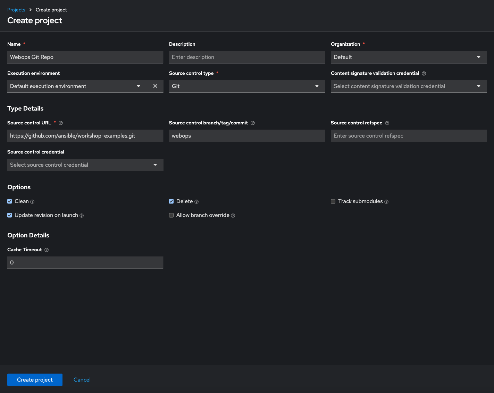
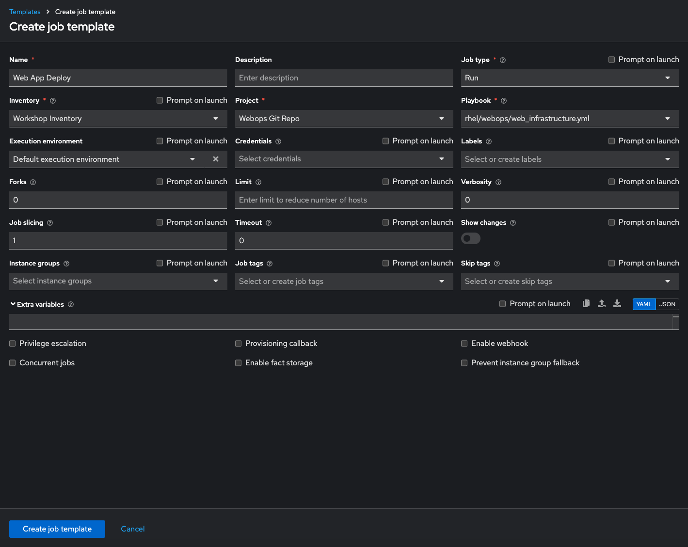
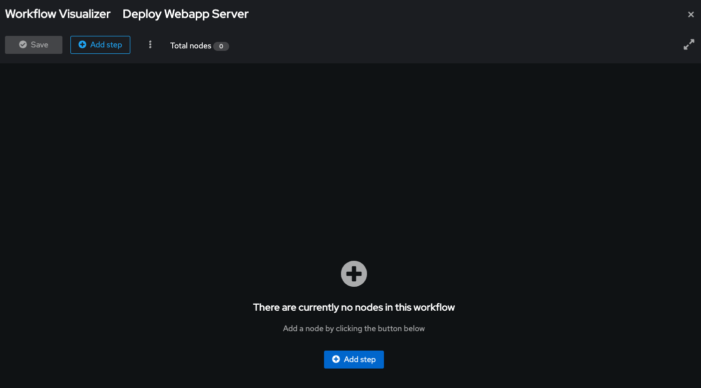
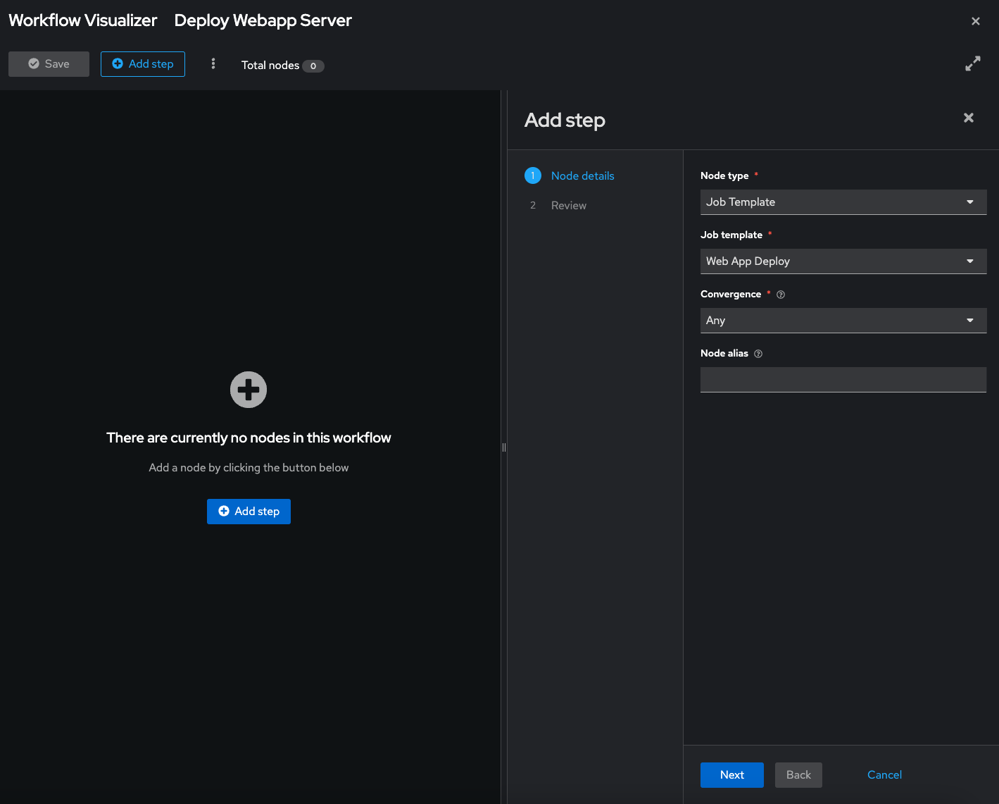
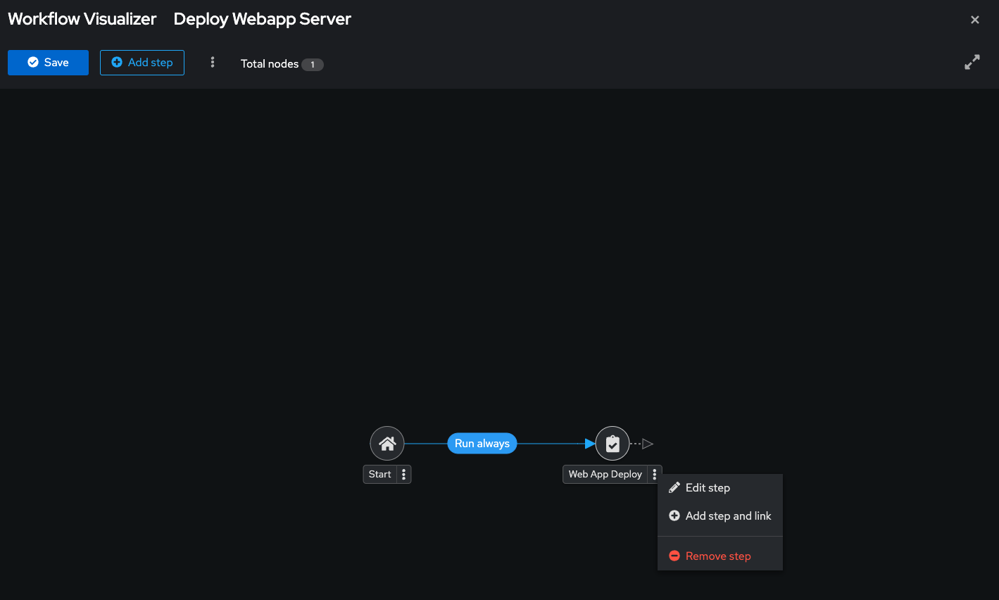
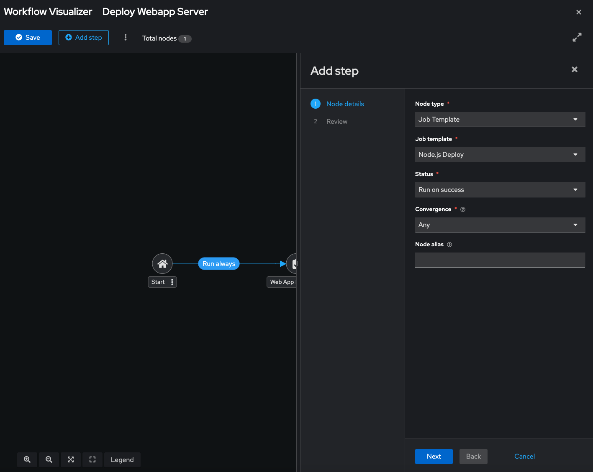
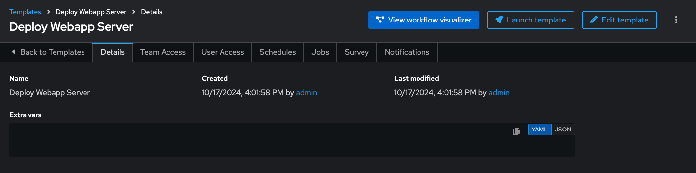

# Workshop Exercise - Workflows

**Read this in other languages**:  
 [English](README.md), [日本語](README.ja.md),  [Portugues do Brasil](README.pt-br.md),  [Française](README.fr.md),  [Español](README.es.md).

## Table of Contents

* [Objective](#objective)
* [Guide](#guide)
  * [Lab scenario](#lab-scenario)
  * [Set up projects](#set-up-projects)
  * [Set up job templates](#set-up-job-templates)
  * [Set up the workflow](#set-up-the-workflow)
  * [Launch workflow](#launch-workflow)

## Objective

The purpose of a workflow is to link multiple job templates together. These templates may or may not share inventory, playbooks, or permissions. The links can be conditional:

* If Job Template A succeeds, Job Template B is executed next.
* If it fails, Job Template C runs instead.

Workflows can include not only job templates but also project or inventory updates.

This flexibility allows different teams to collaborate efficiently. For example, a networking team can manage its own repositories and inventories, while an operations team handles other aspects. In this lab, you’ll learn how to set up a workflow.

## Guide

### Lab scenario

You have two departments in your organization:

* **Web operations team:** developing playbooks in their Git branch `webops`.
* **Web developers team:** working in their branch `webdev`.

When a new Node.js server is needed, the following tasks must be performed:

#### Web operations team tasks

* Install `httpd`, `firewalld`, and `node.js`.
* Configure `SELinux` settings, open the firewall, and start `httpd` and `node.js`.

#### Web developers team tasks

* Deploy the latest version of the web application and restart `node.js`.

The web operations team sets up the server, and the developers deploy the application.

> **Note:**  
> For this example, both teams use branches of the same Git repository. In a real scenario, your source control structure may vary.

---

### Set up projects

First, set up the Git repositories as projects.

> **Warning:**  
> If logged in as **wweb**, log out and log in as **admin**.

Within **Automation Execution** -> **Projects**, click **Create Project** to set up the web operations team’s project:

<table>
  <tr>
    <th>Parameter</th>
    <th>Value</th>
  </tr>
  <tr>
    <td>Name</td>
    <td>Webops Git Repo</td>
  </tr>
  <tr>
    <td>Organization</td>
    <td>Default</td>
  </tr>
    <tr>
    <td>Execution Environment</td>
    <td>Default execution environment</td>
  </tr>
  <tr>
    <td>Source control type</td>
    <td>Git</td>
  </tr>
  <tr>
    <td>Source control URL</td>
    <td><code>https://github.com/ansible/workshop-examples.git</code></td>
  </tr>
  <tr>
    <td>Source control branch/tag/commit</td>
    <td><code>webops</code></td>
  </tr>
  <tr>
    <td>Options</td>
    <td><ul><li>✓ Clean</li><li>✓ Delete</li><li>✓ Update Revision on Launch</li></ul></td>
  </tr>
</table>

Click **Create project**. 



Repeat the process to set up the **Webdev Git Repo**, using the branch `webdev`.
<table>
  <tr>
    <th>Parameter</th>
    <th>Value</th>
  </tr>
  <tr>
    <td>Name</td>
    <td>Webdev Git Repo</td>
  </tr>
  <tr>
    <td>Organization</td>
    <td>Default</td>
  </tr>
    <tr>
    <td>Execution Environment</td>
    <td>Default execution environment</td>
  </tr>
  <tr>
    <td>Source control type</td>
    <td>Git</td>
  </tr>
  <tr>
    <td>Source control URL</td>
    <td><code>https://github.com/ansible/workshop-examples.git</code></td>
  </tr>
  <tr>
    <td>Source control branch/tag/commit</td>
    <td><code>webdev</code></td>
  </tr>
  <tr>
    <td>Options</td>
    <td><ul><li>✓ Clean</li><li>✓ Delete</li><li>✓ Update Revision on Launch</li></ul></td>
  </tr>
</table>

---

### Set up job templates

Within **Automation Execution** -> **Templates** -> **Create template** -> **Create job template**, fill out the form with the following values:

<table>
  <tr>
    <th>Parameter</th>
    <th>Value</th>
  </tr>
  <tr>
    <td>Name</td>
    <td>Web App Deploy</td>
  </tr>
  <tr>
    <td>Inventory</td>
    <td>Workshop Inventory</td>
  </tr>
  <tr>
    <td>Project</td>
    <td>Webops Git Repo</td>
  </tr>
  <tr>
    <td>Playbook</td>
    <td><code>rhel/webops/web_infrastructure.yml</code></td>
  </tr>
  <tr>
    <td>Execution Environment</td>
    <td>Default execution environment</td>
  </tr>
</table>



Click **Create job template**, and then repeat the process for the **Node.js Deploy** template, changing the project to **Webdev Git Repo** and the playbook to `rhel/webdev/install_node_app.yml`.

---

### Set up the workflow

Within **Automation Execution** -> **Templates** -> **Create template** -> **Create workflow job template**, fill in the details:

<table>
  <tr>
    <th>Parameter</th>
    <th>Value</th>
  </tr>
  <tr>
    <td>Name</td>
    <td>Deploy Webapp Server</td>
  </tr>
</table>

Click **Create workflow job template** to open the **Workflow Visualizer**. 



Click the **Add Step** button and assign the **Web App Deploy** job template to the first node. Add a second node by clicking the 3 dot sign, selecting the "Add step and link"  and assign the **Node.js Deploy** template with the **Run on success** status type. Select **Next** and **Finish** to complete the workflow.







Click **Save** to finalize the workflow.


---

### Launch workflow

Within the **Deploy Webapp Server** template, click **Launch template**. 



Once the workflow completes, verify the results by checking the job details. Run the following command on the control host to confirm the deployment:

```bash
curl http://nodeX/nodejs
Hello World
```

NOTE: `X` should be replaced with the appropriate number of the node you are checking.


---
**Navigation**
<br>
[Previous Exercise](../2.5-rbac) - [Next Exercise](../2.7-wrap)

[Click here to return to the Ansible for Red Hat Enterprise Linux Workshop](../README.md#section-2---ansible-tower-exercises)
