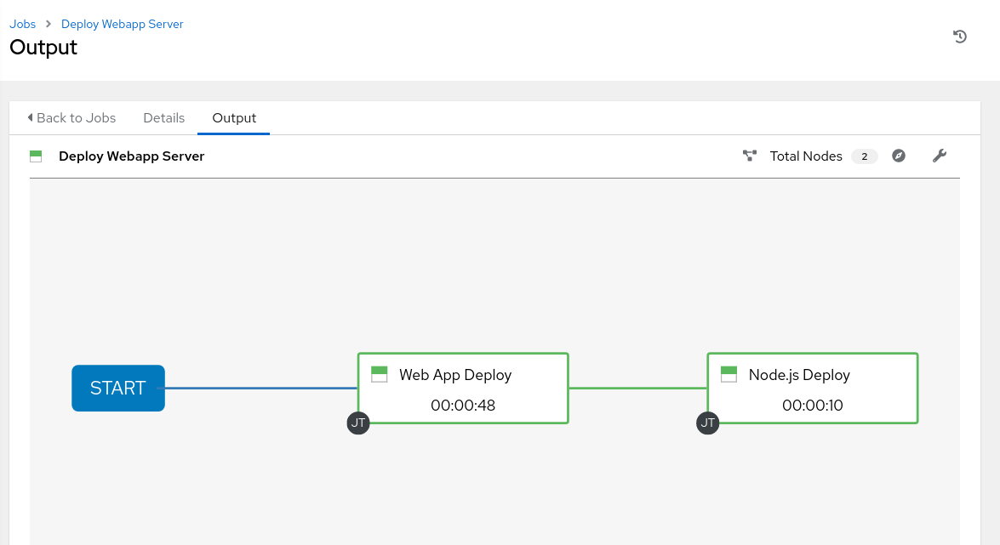

# Exercício - Workflows

**Leia em outras linguagens**:
<br> [English](README.md),  [日本語](README.ja.md),  [Portugues do Brasil](README.pt-br.md),  [Française](README.fr.md),  [Español](README.es.md).

* [Ansible Tower Workflows](#ansible-tower-workflows)
  * [Cenário de laboratório](#cenário-de-laboratório)
  * [Configurando o projeto](#configurando-o-projeto)
  * [Configurando Job Templates](#configurando-job-templates)
  * [Configurando Workflow](#configurando-workflow)
  * [E ação!](#e-ação)

# Ansible Tower Workflows

Os workflows foram introduzidos como um novo recurso importante no Ansible Tower 3.1. A ideia básica de um workflow é vincular vários job templates. Eles podem ou não compartilhar inventário, Playbooks ou mesmo permissões. Os links podem ser condicionais:

  - se o job template A for bem-sucedido, o job template B será automaticamente executado posteriormente

  - mas em caso de falha, o job template C será executado.

E os workflows não se limitam aos job templates, mas também podem incluir atualizações de projeto ou inventário.

Isso permite novas aplicações para o Tower: diferentes job templates podem ser criados entre si. Por exemplo, a equipe de rede cria playbooks com seu próprio conteúdo, em seu próprio repositório Git e até direciona seu próprio inventário, enquanto a equipe de operações também possui seus próprios repositórios, playbooks e inventário.

Neste laboratório, você aprenderá como configurar um workflow.

## Cenário de laboratório

Você tem dois departamentos em sua organização:

  - A equipe de operações que está desenvolvendo Playbooks em seu próprio repositório Git.

  - A equipe de aplicações, que desenvolve aplicativos web em JSP para o Tomcat em seu repositório Git.

Quando há um novo servidor Tomcat para implantar, duas coisas precisam acontecer:

  - O Tomcat precisa estar instalado, o firewall precisa ser aberto e o start no Tomcat.

  - A versão mais recente do aplicação web precisa ser implantada.

Para tornar as coisas um pouco mais fáceis para você, tudo o que é necessário já existe nos repositórios do Git: Playbooks, arquivos JSP etc. Você só precisa colá-los.

> **Nota**
>
> Neste exemplo, assumimos dois repositórios Git diferentes, mas na realidade, acessaremos duas branches diferentes do mesmo repositório.

## Configurando o projeto

Primeiro, você precisa configurar o repositório Git como Projetos. Você já fez isso antes, tente fazer isso sozinho. Instruções detalhadas podem ser encontradas abaixo.

> **ATENÇÃO**
>
> Se você ainda estiver logado como usuário **wweb**, efetue logout e faça login como usuário **admin** novamente.

- Crie o projeto para operações:

  - Deve ser nomeado **Webops Git Repo**

  - O URL para acessar o repositório é **https://github.com/ansible/workshop-examples.git**

  - O **SCM BRANCH/TAG/COMMIT** é **webops**

- Crie o projeto para os desenvolvedores:

  - Deve ser nomeado como **Webdev Git Repo**

  - O URL para acessar o repositório é **https://github.com/ansible/workshop-examples.git**

  - O **SCM BRANCH/TAG/COMMIT** é **webdev**

> **ATENÇÃO**
>
> **Solução abaixo**

- Crie o projeto para operações. Na visualização **Projects**, clique no botão verde e preencha:

    - **NAME:** Webops Git Repo

    - **ORGANIZATION:** Default

    - **SCM TYPE:** Git

    - **SCM URL:** https://github.com/ansible/workshop-examples.git

    - **SCM BRANCH/TAG/COMMIT:** webops

    - **SCM UPDATE OPTIONS:** Tick all three boxes.

- Click em **SAVE**

- Crie o projeto para os desenvolvedores. Na visualização **Projects**, clique no botão verde mais e preencha:

    - **NAME:** Webdev Git Repo

    - **ORGANIZATION:** Default

    - **SCM TYPE:** Git

    - **SCM URL:** https://github.com/ansible/workshop-examples.git

    - **SCM BRANCH/TAG/COMMIT:** webdev

    - **SCM UPDATE OPTIONS:** Marque as três caixas.

- Click em **SAVE**

## Configurando Job Templates

Agora você deve criar job template como faria para jobs "normais".

  - Vá para a visualização **Template**, clique no botão verde e escolha **Job template**:

      - **NAME:** Tomcat Deploy

      - **JOB TYPE:** Run

      - **INVENTORY:** Inventario Workshop

      - **PROJECT:** Webops Git Repo

      - **PLAYBOOK:** `rhel/webops/tomcat.yml`

      - **CREDENTIAL:** Credenciais Workshop

      - **OPTIONS:** Enable privilege escalation

  - Click em **SAVE**

  - Vá para a visualização **Template**, clique no botão verde e escolha **Job template**:

      - **NAME:** Web App Deploy

      - **JOB TYPE:** Run

      - **INVENTORY:** Inventario Workshop

      - **PROJECT:** Webdev Git Repo

      - **PLAYBOOK:** `rhel/webdev/create_jsp.yml`

      - **CREDENTIALS:** Credenciais Workshop

      - **OPTIONS:** Enable privilege escalation

  - Click em **SAVE**

> **Dica**
>
> Se você quiser saber como são os Playbooks, confira o URL do Github e mude para as branchs apropriadas.

## Configurando Workflow

Agora você finalmente irá configurar o workflow. Os workflows são configurados na visualização **Templates**; você deve ter notado que pode escolher entre **Job template** e **workflow template** ao adicionar um template, para que isso finalmente faça sentido.

  - Vá para a visualização **Templates** e clique no botão verde. Desta vez, escolha **Workflow Template**

      - **NAME:** Deploy Webapp Server

      - **ORGANIZATION:** Default

  - Click em **SAVE**

  - Agora o botão **WORKFLOW VISUALIZER** fica ativo, clique nele para iniciar o editor gráfico.

  - Clique no botão **START**, e um novo nó é aberto. À direita, você pode atribuir uma ação ao nó, pode escolher entre **JOBS**, **PROJECT SYNC** e **INVENTORY SYNC**.

  - Neste laboratório, vincularemos os jobs, portanto selecione o job **Tomcat Deploy** e clique em **SELECT**.

  - O nó é anotado com o nome do job. Passe o cursor do mouse sobre o nó, você verá um sinal vermelho **x** e um verde **+**.

> **Dica**
>
> Usando o vermelho "x" permite remover o nó, o sinal de mais verde permite adicionar o próximo nó.

  - Clique no sinal verde **+**

  - Escolha **Web App Deploy** como o próximo job (pode ser necessário mudar para a próxima página)

  - Deixe **Type** definido como **On Success**

> **Dica**
>
> O tipo permite wokflows mais complexos. Você pode definir diferentes caminhos de execução para executar com êxito e para falhas no Playbook.

  - Click em **SELECT**

  - Click em **SAVE** na visualização **WORKFLOW VISUALIZER**

  - Click em **SAVE** na visualização **Workflow Template**

## E ação!

Seu workflow está pronto para ser iniciado.

  - Clique no botão azul **LAUNCH** diretamente ou acesse a visualização **Templates** e inicie o workflow **Deploy Webapp Server** clicando no ícone do foguete.



Observe como a execução do workflow é mostrada na exibição da tarefa. Ao contrário da execução normal de um job template, desta vez, não há saída do Playbook à direita, mas uma representação visual das diferentes etapas do workflow. Se você quiser ver os Playbooks reais por trás disso, clique em **DETAILS** em cada etapa. Se você deseja voltar de uma visualização de detalhes para o workflow correspondente, clique no botão  na linha **JOB TEMPLATE** na parte **DETAILS** à esquerda, lado da visão geral do job.

Após a conclusão do job, verifique se tudo funcionou bem: efetue login em `node1`, `node2` ou `node3` no host de controle e execute:

```bash
$ curl http://localhost:8080/coolapp/
```

> **Dica**
>
> Pode ser necessário aguardar alguns minutos até o Tomcat responder às solicitações.

----

[Clique aqui para retornar ao Workshop Ansible for Red Hat Enterprise Linux](../README.pt-br.md#seção-2---exercícios-do-ansible-tower)
