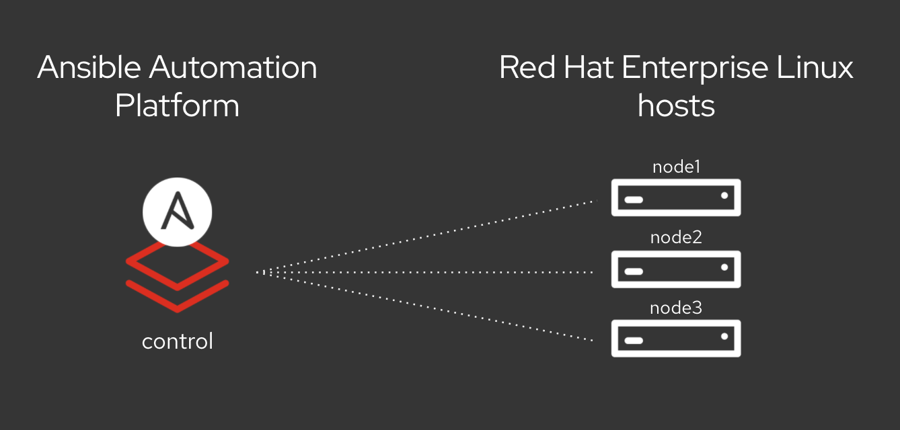

# Ansible Workshop - Ansible for Red Hat Enterprise Linux

**Read this in other languages**:
  [English](README.md),  [日本語](README.ja.md),  [Portugues do Brasil](README.pt-br.md),  [Français](README.fr.md),  [Español](README.es.md).
 

**This is documentation for Ansible Automation Platform 2**

If you’re new to Ansible Automation, this workshop consists of two parts: 1) starting with the basics of understanding foundational command line activities and 2) applying what you’ve learned to implement Ansible automation controller to your enterprise use cases. You’ll start off by writing your first Ansible playbook, work on Jinja templates, and implement higher-level Ansible roles. Next you’ll get started on automation controller, understand inventory and credential management, projects, job templates, surveys, workflows and more.

After finishing this lab you are ready to start using Ansible for your automation requirements.

## Table of Contents

- [Ansible Workshop - Ansible for Red Hat Enterprise Linux](#ansible-workshop---ansible-for-red-hat-enterprise-linux)
  - [Table of Contents](#table-of-contents)
  - [Presentations](#presentations)
  - [Time planning](#time-planning)
  - [Lab Diagram](#lab-diagram)
  - [Section 1 - Command-line Ansible Exercises](#section-1---command-line-ansible-exercises)
  - [Section 2 - Ansible Automation Platform Exercises](#section-2---ansible-automation-platform-exercises)
  - [Supplemental Exercises](#supplemental-exercises)

## Presentations

The exercises are self explanatory and guide the participants through the entire lab. All concepts are explained when they are introduced.

There is an optional presentation available to support the workshops and explain Automation, the basics of Ansible and the topics of the exercises in more detail:
[Ansible RHEL Automation](../../decks/ansible_rhel.pdf)

Also have a look at our Ansible Best Practices Deck:
[Ansible Best Practices](../../decks/ansible_best_practices.pdf)

## Time planning

The time required to do the workshops strongly depends on multiple factors: the number of participants, how familiar those are with Linux in general and how much discussions are done in between.

Having said that, the exercises themselves should take roughly 4-5 hours. The first section is slightly longer than the second one. The accompanying presentation itself adds another hour.

## Lab Diagram

## Section 1 - Command-line Ansible Exercises

* [Exercise 1.1 - Check the Prerequisites](1.1-setup)
* [Exercise 1.2 - The Ansible Basics](1.2-thebasics)
* [Exercise 1.3 - Writing Your First Playbook](1.3-playbook)
* [Exercise 1.4 - Using Variables](1.4-variables)
* [Exercise 1.5 - Conditionals, Handlers and Loops](1.5-handlers)
* [Exercise 1.6 - Templates](1.6-templates)
* [Exercise 1.7 - Roles](1.7-role)

## Section 2 - Ansible Automation Platform Exercises

* [Exercise 2.1 - Introduction to automation controller](2.1-intro)
* [Exercise 2.2 - Inventories, credentials and ad hoc commands](2.2-cred)
* [Exercise 2.3 - Projects & job templates](2.3-projects)
* [Exercise 2.4 - Surveys](2.4-surveys)
* [Exercise 2.5 - Role based access control](2.5-rbac)
* [Exercise 2.6 - Workflows](2.6-workflows)
* [Exercise 2.7 - Wrap up](2.7-wrap)

## Supplemental Exercises

There is also a series of exercises that go above and beyond our normal workshop content.  Please check out our supplemental exercises if you want more content to learn from.

* [Supplemental Exercises](supplemental)

---

