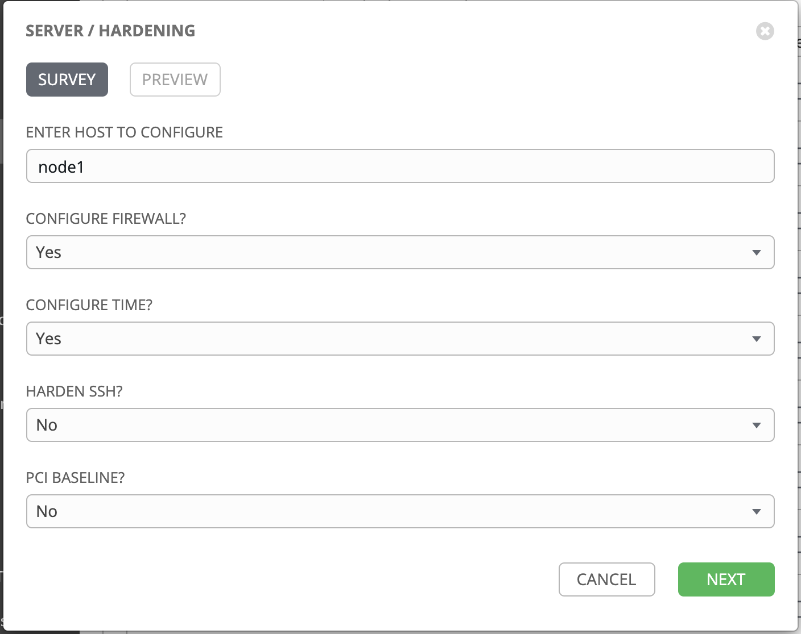

# 演習 - Linux システムロール

**他の言語でもお読みいただけます**:  [English](README.md)、 [日本語](README.ja.md)

## 目次

* [目的](#objective)
* [ガイド](#guide)
 * [ステップ 1 - Ansible プロジェクトの検証](#step-1---examine-ansible-project)
  * [ステップ 2 - Ansible Playbook の検証](#step-2---examine-the-ansible-playbook)
  * [ステップ 3 - Linux システムロールの検証](#step-3---examine-the-linux-system-roles)
  * [ステップ 4 - Ansible ジョブの起動](#step-4---launch-the-ansible-job)
  * [ステップ 5 - 設定の確認](step-5---verify-the-configuration)
* [完了](#complete)

# 目的

この演習の目的は、Automation Hub および Ansible Galaxy
のロールとコレクションの形で既存のコンテンツを理解し、使用することです。

- [Linux システムロール](https://linux-system-roles.github.io/) および [RHEL
  システムロールコレクション](https://console.redhat.com/ansible/automation-hub/repo/published/redhat/rhel_system_roles)
  を理解して使用します
  - [ファイヤーウォールロール](https://galaxy.ansible.com/linux-system-roles/firewall)
    を使用してファイアウォールを設定します
  - [timesync
    ロール](https://console.redhat.com/ansible/automation-hub/repo/published/redhat/rhel_system_roles/content/role/timesync)
    を使用して、RHEL システムロールコレクションから NTP を設定します。
- 事前に入力された Ansible Survey を使用して RHEL Web ホストを設定します

# ガイド

Linux
システムロールは、特定の実装から抽象化された特定のサブシステムに設定を提供するために一貫性のあるユーザーインターフェースを作成します。たとえば、IP
アドレスをネットワークインターフェースに割り当てることは、init
ネットワークスクリプト、NetworkManager、systemd-networkd などの特定の実装とは別の一般的な概念である必要があります。

この演習では、2 つの Linux システムロール（`timesync` ロールおよび `firewall` ロール）を使用します。

## ステップ 1 - Ansible プロジェクトの検証

Ansible 自動コントローラー UI で Projects に移動し、続いて **Ansible official demo project**
をクリックします。


Ansible 自動コントローラー環境に事前に読み込まれていた Github リポジトリーを書き留めておきます。

[https://github.com/ansible/product-demos](https://github.com/ansible/product-demos)

## ステップ 2 - Ansible Playbook の検証

Web ブラウザーで上記のリンクされたリポジトリーを開きます。**playbooks/security/hardening.yml** に移動します。

次の 2 つのタスクに注意してください。

```
- name: Configure Firewall
  when: harden_firewall | bool
  include_role:
    name: linux-system-roles.firewall

- name: Configure Timesync
  when: harden_time | bool
  include_role:
    name: redhat.rhel_system_roles.timesync
```

それぞれロールおよびコレクションからのロールが含まれる 2 つのタスクがあります。Ansible Galaxy
から直接提供されるロールと、Ansible コレクションにあるロールを区別できない場合は、この命名法が役立ちます。

<table>
<tr>
  <td>Ansible コレクション</td>
  <td><code>namespace.collection.role</code></td>
</tr>
  <tr>
    <td>Ansible ロール</td>
    <td><code>namespace.role</code>
</td>
  </tr>
</table>

## ステップ 3 - Linux システムロールの検証

Ansible Playbook はシンプルです。Ansible Galaxy および Automation Hub が提供する事前にビルドされた
Ansible Playbook を使用するだけです。これらは、この Ansible ワークショップ用に事前にインストールされています。

- [firewall
システムロール](https://galaxy.ansible.com/linux-system-roles/firewall):
デフォルトでは、firewalld、python3-firewall がインストールされます。開くサービスなど、オプションのパラメーターを送信できます。

```
vars:
  firewall:
    service: 'tftp'
    state: 'disabled'
```

- RHEL システムロールコレクションからの [timesync
システムロール](https://console.redhat.com/ansible/automation-hub/repo/published/redhat/rhel_system_roles/content/role/timesync):
OS バージョンに応じて NTP または chrony をインストールおよび設定し、Linux
ホストのシステムクロックが同期されるようにします。オプションのパラメーターを設定して特定のパラメーターを指定できます。

```
vars:
  timesync_ntp_servers:
    - hostname: foo.example.com
      iburst: yes
    - hostname: bar.example.com
      iburst: yes
    - hostname: baz.example.com
      iburst: yes
```

## ステップ 4 - Ansible ジョブの起動

Ansible 自動コントローラー UI で、**Templates** に移動します。    

**ロケット** をクリックして、**SERVER / Hardening** ジョブテンプレートを起動します。


これにより、ジョブを開始する前にサーベイが起動します。サーベイに記入します。



- **CONFIGURE FIREWALL?** の質問は、`firewall` システムロールを有効にします。  - **CONFIGURE
TIME?** は `timesync` システムロールを有効にします。  - この演習では、残りを **No** に設定します。

**NEXT** ボタンをクリックします。


**EXTRA VARIABLES** を確認して、サーベイの内容を理解します。**LAUNCH** ボタンをクリックします。


ジョブが開始されたのを確認します!

## ステップ 5 - 設定の確認

Ansible コントロールノードから、設定したノードに ssh 接続します。

```
$ ssh node1
```

Red Hat Enterprise Linux 8 では、**timesync** システムロールは chronyd
を使用しました。`systemctl status` コマンドを使用して、これがインストール、有効化、および実行されていることを確認します。

```
$ sudo systemctl status chronyd.service
```

完全な出力は以下のとおりです。
```
[student@ansible ~]$ sudo systemctl status chronyd.service
● chronyd.service - NTP client/server
   Loaded: loaded (/usr/lib/systemd/system/chronyd.service; enabled; vendor preset: enabled)
   Active: active (running) since Tue 2020-04-21 14:37:14 UTC; 13h ago
     Docs: man:chronyd(8)
           man:chrony.conf(5)
 Main PID: 934 (chronyd)
    Tasks: 1 (limit: 23902)
   Memory: 1.8M
   CGroup: /system.slice/chronyd.service
           └─934 /usr/sbin/chronyd

Apr 21 14:37:14 localhost.localdomain systemd[1]: Starting NTP client/server...
Apr 21 14:37:14 localhost.localdomain chronyd[934]: chronyd version 3.5 starting (+CMDMON +NTP +REFCLOCK +RTC +PRIVDROP +SCFILTER +SIGND +ASYNCDNS +SECHASH +IPV6 +DEBUG)
Apr 21 14:37:14 localhost.localdomain chronyd[934]: Using right/UTC timezone to obtain leap second data
Apr 21 14:37:14 localhost.localdomain systemd[1]: Started NTP client/server.
Apr 21 14:38:12 ip-172-16-47-87.us-east-2.compute.internal chronyd[934]: Selected source 129.250.35.250
Apr 21 14:38:12 ip-172-16-47-87.us-east-2.compute.internal chronyd[934]: System clock TAI offset set to 37 seconds
```

以下は、時刻が正常に動作していることを確認するのに使用できるその他のコマンドです。

```
# chronyc tracking  
# chronyc sources
# chronyc sourcestats
# systemctl status chronyd
# chronyc activity
# timedatectl
```

例:

```
$ timedatectl
               Local time: Wed 2020-04-22 03:52:15 UTC
           Universal time: Wed 2020-04-22 03:52:15 UTC
                 RTC time: Wed 2020-04-22 03:52:15
                Time zone: UTC (UTC, +0000)
System clock synchronized: yes
              NTP service: active
```

# 完了

ラボ演習を完了しました

----
**Navigation**
<br>
[Previous Exercise](../5-surveys) - [Next Exercise](../7-insights)
<br><br>
[Click here to return to the Ansible for Red Hat Enterprise Linux Workshop](../README.md)
