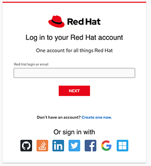
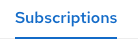
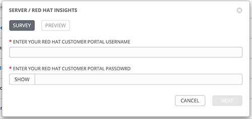

# 演習 - Red Hat Insights

**他の言語でもお読みいただけます**:  [English](README.md)

## 目次

* [演習 - Red Hat Insights](#exercise---red-hat-insights)
   * [目次](#table-contents)
* [目的](#objective)
* [ガイド](#guide)
   * [ステップ 1 - Red Hat Insights について](#step-1---understand-red-hat-insights)
   * [ステップ 2 - cloud.redhat.com
     アカウントの作成](#step-2---create-a-cloudredhatcom-account)
   * [ステップ 3 - ライセンスの検証](#step-3---examine-your-license)
   * [ステップ 4 - Ansible ジョブの起動](#step-4---launch-the-ansible-job)
   * [ステップ 5 - cloud.redhat.com へのログイン](#step-5---login-to-cloudredhatcom)
* [完了](#complete)

# 目的

この演習の目的は、Red Hat Insights を理解し、Ansible を使用してすべての Web ノードにインストールおよび設定することです。

# ガイド

## ステップ 1 - Red Hat Insights について

[Red Hat
Insights](https://www.redhat.com/en/technologies/management/insights)
を使用すると、Red Hat® Enterprise Linux®
環境におけるセキュリティー、コンプライアンス、設定のリスクを事前に特定し、修正することができます。Red Hat Insights は Red Hat
Enterprise Linux サブスクリプションに含まれています。

  - 1 つのツールで Red Hat 環境全体の可視性を強化
  - 手動分析の要らない総合的なリスクの特定
  - すぐに利用できるガイダンス
  - Red Hat Ansible Automation Platform による大規模システムに対応した解決策

Effectively Red Hat Insights will identify security, compliance and
configuration risks, and use Ansible Automation Platform to automate and
implment the fixes.  There is no need to create your own Ansible Playbooks,
Red Hat Insights will provide those to Automation controller.

## ステップ 2 - cloud.redhat.com アカウントの作成

ワークショップインベントリーで Red Hat Insights を利用するには、以下の 2 つが必要です。
  - cloud.redhat.com アカウント
  - そのアカウントに割り当てられた有効な Red Hat Enterprise Linux ライセンス

この 2 つの点は、共に 1 つのスポットで実行できます。

-
[https://www.redhat.com/en/technologies/linux-platforms/enterprise-linux](https://www.redhat.com/en/technologies/linux-platforms/enterprise-linux)
に移動します - **Try it free** ボタンをクリックします

  

- **DOWNLOAD** ボタンをクリックします

  

- アカウントがない場合は、今すぐ作成できます。

  

- **Create one now**
をクリックするか、別のログイン方法のいずれか（例：Github）をクリックしてアカウントを作成します。情報を入力してください

- メールアドレスを必ず確認してください。

  

- 確認後は、Web サイトにログインして x86_64
ファイルをダウンロードできます。ただし、このワークショップ演習の目的では、このファイルは必要ありません。Red Hat Enterprise Linux
のライセンスへのアクセスも追加されています。

## ステップ 3 - ライセンスの検証

- Red Hat カスタマーポータル [https://access.redhat.com](https://access.redhat.com)
に移動します  - **My Subscriptions** までスクロールダウンして以下のリンクをクリックします

  

- **Subscriptions** のリンクをクリックします。

  

- アクティブなサブスクリプションが表示されます。

  

## ステップ 4 - Ansible ジョブの起動

You now have a Red Hat account, and an active subscription to use Red Hat
Insights! Open up the Automation controller UI again.

- テンプレートに移動します - ロケットをクリックして **SERVER / Red Hat Insights** ジョブを起動します - Red
Hat アカウントでサーベイに記入します

  

- 3 つすべての Web ノードでジョブが正常に完了するのを確認します。

## ステップ 5 - cloud.redhat.com へのログイン

- Web ブラウザーで [https://cloud.redhat.com](https://cloud.redhat.com) に移動します  -
ログインして Red Hat Insights Dashboard を選択します - 左側のメニューで **Inventory**
をクリックし、すべてのワークショップノードをすべて表示します

  

- いずれかのノードをクリックして、それらの Red Hat Enterprise Linux ノードに関する追加情報を表示します。

# 完了

ラボ演習を完了しました

----
**Navigation**
 
[Previous Exercise](../6-system-roles)
  
[Click here to return to the Ansible for Red Hat Enterprise Linux Workshop](../README.md)
