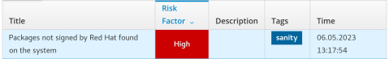
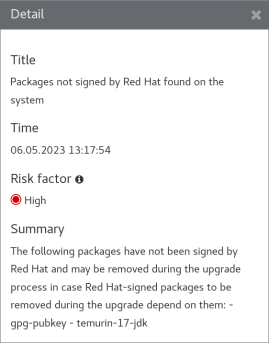

# Workshop Exercise - Deploy a Pet App

## Table of Contents

- [Workshop Exercise - Deploy a Pet App](#workshop-exercise---deploy-a-pet-app)
  - [Table of Contents](#table-of-contents)
  - [Optional Exercise](#optional-exercise)
  - [Objectives](#objectives)
  - [Guide](#guide)
    - [Step 1 - The Traditional Application Lifecycle](#step-1---the-traditional-application-lifecycle)
    - [Step 2 - Installing Our Beloved Pet Application](#step-2---installing-our-beloved-pet-application)
    - [Step 3 - Test the Pet Application](#step-3---test-the-pet-application)
    - [Step 4 - Configure the Application to Start on Reboot](#step-4---configure-the-application-to-start-on-reboot)
    - [Step 5 - Run Another Pre-upgrade Report](#step-5---run-another-pre-upgrade-report)
  - [Conclusion](#conclusion)

## Optional Exercise

This is an optional exercise. It is not required to successfully complete the workshop, but we recommended trying it if time allows. Review the objectives listed in the next section to decide if you want to do this exercise or if you would rather skip ahead to the next exercise:

* [Exercise 2.1 - Run OS Upgrade Jobs](../2.1-upgrade/README.md)

## Objectives

* Discuss how applications are deployed and maintained in traditional server environments
* Install our example pet application or bring your own
* Consider how to test if your application is functioning as expected

## Guide

### Step 1 - The Traditional Application Lifecycle

Let's take a step back and think about why we want to do an in-place upgrade. Wouldn't it be best practice to deploy a new server or VM instance with the new RHEL version and then do a fresh install of our application from there?

- Yes, but...

  - What if the app team doesn't have automation to deploy their apps and they instead manually install and configure everything?

  - What if since they installed their app however many years ago, they have been making changes to their app environment to solve issues or cope with changing business requirements?

  - What if they have lost track of all that accumulated drift and technical debt such that it would be very difficult for them to start fresh?

- Unfortunately, this is the position may app teams find themselves in. Their traditional app server has been tenderly cared for like a beloved pet for years. The idea of throwing it out and redoing everything from scratch is unthinkable.

- If they can just move to the new RHEL version without having to touch their application, that is a very compelling alternative. That is why they want to do an in-place upgrade, so they can disappear off the corporate platform lifecycle compliance report without having to suffer with the headache of manually installing and reconfiguring everything all over again.

- In this optional exercise, we want to install an application so that we can assess if the RHEL in-place upgrade causes any impact. We want to see if the app still functions as expected under the new RHEL version after the upgrade.

### Step 2 - Installing Our Beloved Pet Application

In this step, we are going to install an example application. We are going to install the old fashioned way: manually by following a traditional written procedure of confusing and potentially error prone command line steps. After all, if our app deployment was automated end-to-end, we wouldn't need to upgrade in-place.

You may want to install a different application, for example, an actual application from your enterprise environment that you would like to test for potential impacts. Feel free to skip the procedure below and make your own adventure. Just take care to test your app both before and after the upgrade.

- Our example application will be the [Spring Pet Clinic Sample Application](https://github.com/spring-projects/spring-petclinic) written in Java. It is a Spring Boot application that gets built using Maven. It will connect to a MySQL database which gets populated at startup with sample data.

  > **Note**
  >
  > The procedure below steps though the commands required to _manually_ install and start the example application. This is done very much to mock how older traditional apps are deployed in the enterprise. If you want to take a shortcut as an alternative to manually running a bunch of commands, you can launch the "PETS / App Install" job template to deploy the example app.
  >
  > If the app install job is successful, you can skip ahead to [Step 3 - Test the Pet Application](#step-3---test-the-pet-application).
  >

- The first step in our app install procedure is to install a Java JDK. We'll use a 3rd-party one just for fun!

  > **Warning**
  >
  > All commands should be run as the ec2-user, not as root. Commands that require root will use `sudo`.

  Login to your pet app server and run these commands:

  ```
  distver=$(sed -r 's/([^:]*:){4}//;s/(.).*/\1/' /etc/system-release-cpe)
  sudo yum-config-manager --add-repo=https://packages.adoptium.net/artifactory/rpm/rhel/$distver/x86_64
  sudo yum-config-manager --save --setopt=\*adoptium\*.gpgkey=https://packages.adoptium.net/artifactory/api/gpg/key/public
  sudo yum install mariadb mariadb-server temurin-17-jdk
  ```

  Answer `y` to any prompts from the last command.

- Verify that the temurin-17-jdk package was installed:

  ```
  rpm -q temurin-17-jdk
  ```

  If not, go back and figure out what went wrong.

- Next, we will install the Spring Pet Clinic Sample Application under the home directory of the ec2-user. Run these commands:

  ```
  cd ~
  git clone https://github.com/spring-projects/spring-petclinic.git
  ```

  You should now see that the application files are installed in the `spring-petclinic` directory.

<!-- The EC2 instances for the workshop don't have firewalld, but in case you are using this procedure somewhere that does, use these command to open the firewall:

```
sudo firewall-cmd --add-port=8080/tcp
sudo firewall-cmd --add-port=8080/tcp --permanent
```
-->
- We need to start the database server and create the database for our application. Use this command to enable and start the database:

  ```
  sudo systemctl enable --now mariadb
  ```

  Now use the `mysql` command line client to connect to the database server. For example:

  ```
  mysql --user root
  ```

  This should bring you to a `MariaDB [(none)]>` prompt. Enter the following SQL commands at this prompt:

  ```
  CREATE DATABASE IF NOT EXISTS petclinic;
  ALTER DATABASE petclinic DEFAULT CHARACTER SET utf8 DEFAULT COLLATE utf8_general_ci;
  GRANT ALL PRIVILEGES ON petclinic.* TO 'petclinic'@'localhost' IDENTIFIED BY 'petclinic';
  FLUSH PRIVILEGES;
  quit
  ```

- Now we are ready to start the application web service. Use this command to run it in the background:

  ```
  echo 'cd $HOME/spring-petclinic && ./mvnw spring-boot:run -Dspring-boot.run.profiles=mysql >> $HOME/app.log 2>&1' | at now
  ```

- The application will take a couple minute to come up the first time. Check the `app.log` file to follow the progress and verify the web service has started successfully:

  ```
  tailf ~/app.log
  ```

  When you see events listed at the bottom of the log output like this example, that means the application is started successfully and ready for testing:

  ```
  o.s.b.a.e.web.EndpointLinksResolver      : Exposing 13 endpoint(s) beneath base path '/actuator'
  o.s.b.w.embedded.tomcat.TomcatWebServer  : Tomcat started on port(s): 8080 (http) with context path ''
  o.s.s.petclinic.PetClinicApplication     : Started PetClinicApplication in 6.945 seconds (process running for 7.496)
  ```

  Type Ctrl-C to quit the `tailf` command.

### Step 3 - Test the Pet Application

Now that we have installed our application and verified it is running, it's time to test how it works.

- Use this command to determine the application's external URL:

  ```
  echo "http://$(curl -s ifconfig.me):8080"
  ```

- Open a new web browser tab. Cut and paste the URL that was output by the command above. This should open the application web user interface. If the application is working correctly, you should see something like this:

  

- Try the different function tabs at the top of the web user interface. For example, navigate to "FIND OWNERS" and search for Davis. Click on one of the owner records to see their details.

  Use the "Edit Owner" and "Add New Pet" buttons to make changes and add new records.

  The "ERROR" tab in the top-right corner is a error handling test function. If you click it, the expected result is a "Something happened..." message will be displayed and a runtime exception and stack trace will be logged in the `app.log` file.

- Play with the application until you feel comfortable you understand its expected behavior. After the upgrade, we will test it again to verify it has not been impacted.

### Step 4 - Configure the Application to Start on Reboot

Right now, our application was started manually. We need to configure the app so it will start up automatically when our server is rebooted.

- Use this command to configure a reboot cron entry so the application will be started automatically after every reboot:

  ```
  echo '@reboot cd $HOME/spring-petclinic && ./mvnw spring-boot:run -Dspring-boot.run.profiles=mysql >> $HOME/app.log 2>&1' | crontab -
  ```

  > **NOTE**
  >
  > If you deployed the example app using the "PETS / App Install" playbook job, you can skip the command above because the reboot cron entry was automatically created.
  >

- Now reboot the server to verify this works:

  ```
  sudo reboot
  ```

- Try refreshing the web browser tab where you have the Pet Clinic web app open. While the server is rebooting, you may see a timeout or connection refused error. After the reboot is finished, the web app should be working again.

  > **Note**
  >
  > Because the external IP addresses of the EC2 instances provisioned for the workshop are dynamically assigned (i.e., using DHCP), it is possible that the web user interface URL might change after a reboot. If you are unable to access the app after the reboot, run this command again to determine the new URL for the application web user interface:
  >
  > ```
  > echo "http://$(curl -s ifconfig.me):8080"
  > ```
  >

  FIXME: Shame on us for not using DNS!

### Step 5 - Run Another Pre-upgrade Report

Whenever changes are made to a server, its a good idea to rerun the Leapp pre-upgrade report to make sure those changes have not introduced any new risk findings.

- Launch the "AUTO / 01 Analysis" job template to generate a fresh pre-upgrade report. After the job finishes, review the report to see if there are any new findings. Refer to the steps in the previous exercises if you don't have them memorized by heart already.

- Did you notice that this high risk finding has popped up now?

  

- If we open the finding, we are presented with the following details:

  

- "Packages not signed by Red Hat" is just a fancy way of referring to 3rd-party packages and/or package that are built in-house by your app teams. In the case of this finding, the package that has been identified is `temurin-17-jdk`, the 3rd-party JDK runtime package we installed. The finding is warning that there is a risk of this package being removed during the upgrade if there are unresolvable dependencies.

  There is only one surefire way to know if the package will be removed or not. Let's run the upgrade and see what happens!

## Conclusion

In this exercise, we discussed the sorry state of traditional application maintenance, untracked drift and technical debt. We installed a 3rd-party Java runtime and then installed the Pet Clinic application on top of that. We made certain that our app is functioning as expected, but we also discovered a new "high risk" finding on our pre-upgrade report.

Congratulations on completing all the exercises in the first section of the workshop. It's time now to upgrade RHEL and see if there will be any application impact.

---

**Navigation**

[Previous Exercise](../1.5-custom-modules/README.md) - [Next Exercise](../2.1-upgrade/README.md)

[Home](../README.md)
