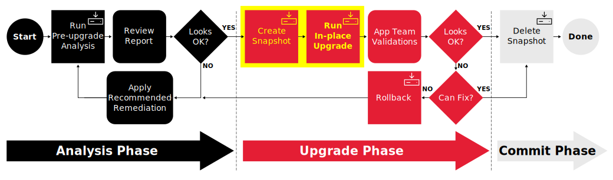
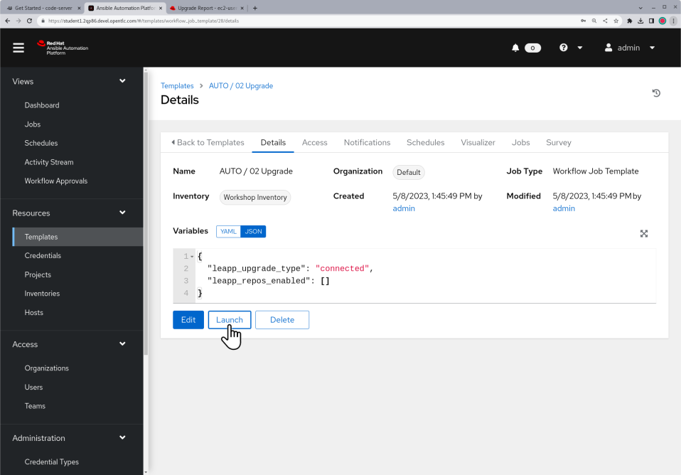
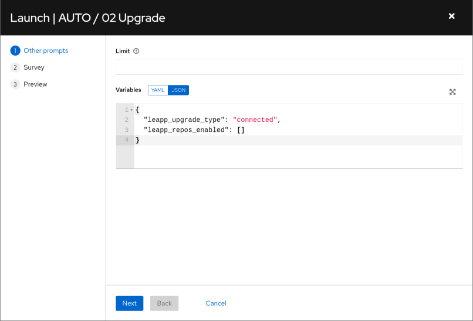
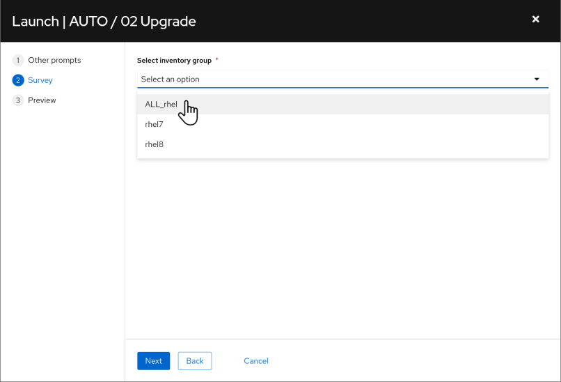
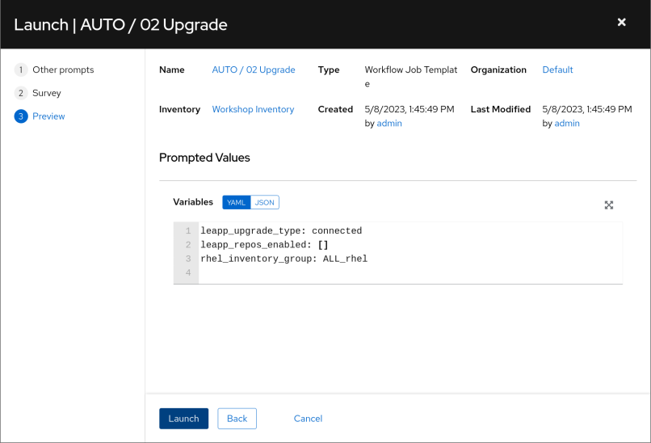
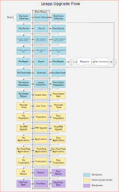

# Workshop Exercise - Run OS Upgrade Jobs

## Table of Contents

- [Workshop Exercise - Run OS Upgrade Jobs](#workshop-exercise---run-os-upgrade-jobs)
  - [Table of Contents](#table-of-contents)
  - [Objectives](#objectives)
  - [Guide](#guide)
    - [Step 1 - Launch the Upgrade Workflow Job Template](#step-1---launch-the-upgrade-workflow-job-template)
    - [Step 2 - Learn More About Leapp](#step-2---learn-more-about-leapp)
  - [Conclusion](#conclusion)

## Objectives

* Use a workflow job template to create snapshots and start the upgrades
* Learn about how the Leapp framework goes about upgrading the RHEL OS

## Guide

We are ready to start the upgrade phase of our RHEL in-place automation journey:

It is during this phase that the upgrade playbooks are executed using a workflow job template. The first playbook creates a snapshot that can be used for rolling back if anything goes wrong with the upgrade. After the snapshot is created, the second playbook uses the Leapp utility to perform the upgrade where the host is advanced to the new RHEL major version.

### Step 1 - Launch the Upgrade Workflow Job Template

We are about to start the RHEL in-place upgrade of our pet application servers. The hosts will not be available for login or application access during the upgrade. When the upgrade is finished, the hosts will reboot under the newly upgraded RHEL major version.

Upgrades typically take less than an hour, although they can run for longer if there are applications that shutdown slowly or with bare metal hosts that have a long reboot cycle. The cloud instances provisioned for our workshop lab environment will upgrade fairly quickly as they are very lightweight compared to traditional enterprise app servers.

- Return to the AAP Web UI tab in your web browser. Navigate to Resources > Templates and then open the "AUTO / 02 Upgrade" job template. Here is what it looks like:

  

- Click the "Launch" button which will bring up a the prompts for submitting the job starting with the variables prompt:

  

- We don't need to change the variables settings, so just click the "Next" button to move on.

  

- Next we see the job template survey prompt asking us to select an inventory group. We are going to upgrade all our pet app hosts using a single job, so choose the "ALL_rhel" option and click the "Next" button. This will bring you to a preview of the selected job options and variable settings.

  

- If you are satisfied with the job preview, use the "Launch" button to start the job.

### Step 2 - Learn More About Leapp

After launching the upgrade job, the AAP Web UI will navigate automatically to the workflow job output page of the job we just started. This job will take up to 20 minutes to finish, so let's take this time to learn a little more about how the Leapp framework upgrades your OS to next RHEL major version.

- Keep in mind that the Leapp framework is responsible only for upgrading the RHEL OS packages. Additional tasks required for upgrading your standard agents, tools, middleware, etc., need to be included in the upgrade playbooks you develop to deal with the specific requirements of your organization's environment.

- The Leapp framework performs the RHEL in-place upgrade by following a sequence of phases. These phases are represented in the following diagram:

  

- The steps of the RHEL in-place upgrade are implemented in modules known as Leapp actors. The Leapp framework is message-driven. The execution of actors is dependent on the data produced by other actors running before them. Actors running in the early phases scan the system to produce messages that add findings to the pre-upgrade report as well as messages that later actors use to make decisions or apply changes during the upgrade.

- Each phase includes three defined stages: before, main, and after. Before and after stages are used to further refine when an actor will be run in relation to any other actors in the phase. Actors are tagged to define the phase and stage during which they are to run.

- There are three groups of phases: Old System, Interim System, and New System. Phases under the Old System group run under the existing RHEL installed version. The Interim System phases starts after the InitRamStart phase reboots the host to an upgrade initramfs environment under which the network and other services are not started. It is at this time that all RHEL packages can be upgraded. Once all the packages are upgraded, another reboot brings the host up under the new RHEL major version and the FirstBoot phase starts. This final phase runs a few post-upgrade actors that require network access and then the upgrade is done.

- Being aware of these phases helps if you need to troubleshoot an issue during the Leapp upgrade and is especially important if you are planning to develop any Leapp custom actors. You can learn more about the Leapp framework architecture and internal design by reading the upstream [Leapp Developer Documentation](https://leapp.readthedocs.io/en/latest/index.html).

## Conclusion

In this exercise, we launched a workflow job template to create snapshots and start the upgrades of our pet app servers. We learned more about the Leapp framework to better understand what is happening as the RHEL OS is being upgraded.

In the next exercise, we'll learn more about how snapshots work.

---

**Navigation**

[Previous Exercise](../1.6-my-pet-app/README.md) - [Next Exercise](../2.2-snapshots/README.md)

[Home](../README.md)
