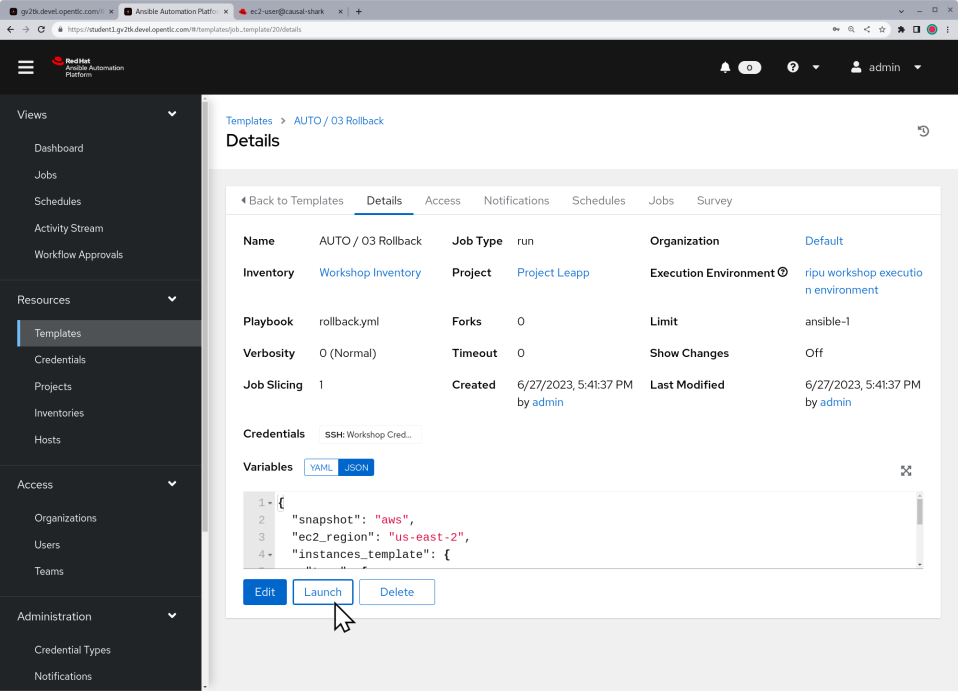

# Workshop Exercise - Run Rollback Job

## Table of Contents

- [Workshop Exercise - Run Rollback Job](#workshop-exercise---run-rollback-job)
  - [Table of Contents](#table-of-contents)
  - [Objectives](#objectives)
  - [Guide](#guide)
    - [Step 1 - Launch the Rollback Workflow Job Template](#step-1---launch-the-rollback-workflow-job-template)
    - [Step 2 - Observe the Rollback Job Output](#step-2---observe-the-rollback-job-output)
    - [Step 3 - Check the RHEL Version](#step-3---check-the-rhel-version)
  - [Conclusion](#conclusion)

## Objectives

* Demonstrate using an Ansible playbook for rolling back a RHEL upgrade
* Verify the RHEL major version is reverted back

## Guide

In this exercise, we will demonstrate rolling back one of our pet app servers, just as we would if the RHEL upgrade had failed or if we had found the upgrade caused unexpected impact to the application.

We are now here in our exploration of the RHEL in-place automation workflow:

After rolling back, the pet app server will be restored to as it was just before entering the upgrade phase of the workflow.

### Step 1 - Launch the Rollback Workflow Job Template

In this step, we will be rolling back the RHEL in-place upgrade on one of our pet application servers.

- Return to the AAP Web UI tab in your web browser. Navigate to Resources > Templates and then open the "AUTO / 03 Rollback" job template. Here is what it looks like:

  

- Click the "Launch" button which will bring up a the survey prompt. We only want to do a rollback of one server. To do this, choose the "ALL_rhel" option under "Select inventory group" and then enter the hostname of your chosen pet app server under the "Enter server name" prompt. For example:

  

  Click the "Next" button to proceed.

- Next you will see the job preview prompt, for example:

  

  If everything looks good, use the "Launch" button to start the playbook job.

### Step 2 - Observe the Rollback Job Output

After launching the rollback playbook job, the AAP Web UI will navigate automatically to the job output page.

- The automated rollback takes only a few minutes to run. You can monitor the log output as the playbook run progresses.

- When the job has finished running, scroll to the bottom of the job output. If it finished successfully, you should see "failed=0" status in the job summary like this example:

  

  Notice in the example above, rolling back was done in just under 2 minutes.

### Step 3 - Check the RHEL Version

Repeat the steps you followed with [Exercise 2.3: Step 2](../2.3-check-upg/README.md#step-2---verify-the-hosts-are-upgraded-to-next-rhel-version), this time to verify that the RHEL version is reverted back.

- For example, if the pet app host you rolled back had been upgraded from RHEL7 to RHEL8, you should now see it is back to RHEL7:

  

## Conclusion

In this exercise, we used automation to quickly reverse the RHEL in-place upgrade and restore the app server back to its original state.

In the next exercise, we'll dig deeper to validate that all changes and impacts caused by the upgrade are now undone.

---

**Navigation**

[Previous Exercise](../3.1-rm-rf/README.md) - [Next Exercise](../3.3-check-undo/README.md)

[Home](../README.md)
