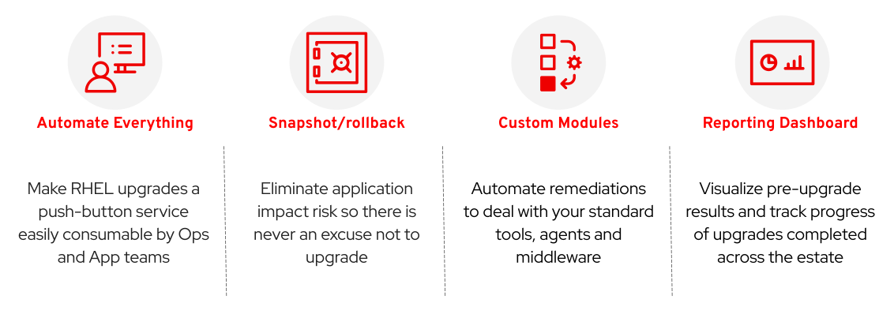
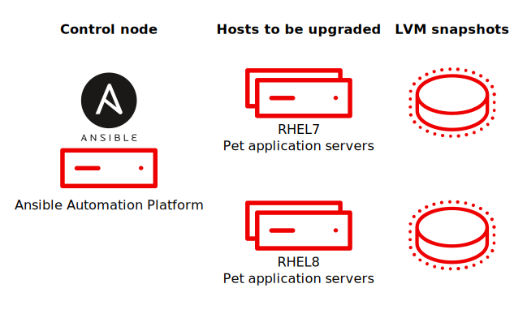

# RHEL In-place Upgrade Automation Workshop

This workshop will introduce a comprehensive approach to automate in-place upgrades for Red Hat Enterprise Linux (RHEL). The solution uses Ansible Automation Platform (AAP) to execute upgrades at enterprise scale across a large estate of RHEL hosts. The workshop demonstrates how to use an example of this approach to perform upgrades from RHEL7 to RHEL8 and from RHEL8 to RHEL9. You will also learn about how this solution can be customized to meet the special requirements of your enterprise environment.

There are four key features that the solution approach recommends to deliver success at scale:

As you progress through this workshop, you will learn more about the importance of these features and the different options for how you might implement them in your enterprise. For this workshop, we assume you have at least some experience using Ansible Automation Platform and working with Ansible playbooks and roles. If you're new to Ansible, consider first completing the workshop [Ansible for Red Hat Enterprise Linux](https://aap2.demoredhat.com/exercises/ansible_rhel).

## Table of Contents

- [RHEL In-place Upgrade Automation Workshop](#rhel-in-place-upgrade-automation-workshop)
  - [Table of Contents](#table-of-contents)
  - [Presentations](#presentations)
  - [Time Planning](#time-planning)
  - [Lab Diagram](#lab-diagram)
  - [Workshop Exercises](#workshop-exercises)
    - [Section 1 - Pre-upgrade Analysis](#section-1---pre-upgrade-analysis)
    - [Section 2 - RHEL OS Upgrade](#section-2---rhel-os-upgrade)
    - [Section 3 - Rolling Back](#section-3---rolling-back)
    - [Supplemental Exercises](#supplemental-exercises)
  - [Workshop Navigation](#workshop-navigation)

## Presentations

The exercises are self explanatory and guide the participants through all the phases of an automated RHEL in-place upgrade. All concepts are explained as they are introduced.

There is an optional presentation deck available with additional information on the benefits of the approach demonstrated in this workshop:
[RHEL In-place Upgrade Automation](../../decks/ansible_ripu.pdf)

## Time Planning

The time required to complete the workshop depends on the number of participants and how familiar they are with Linux and Ansible. The exercises themselves should take a minimum of 4 hours. The introduction in the optional presentation adds another hour. There are also some optional exercises which can be skipped, but are recommended if time allows. There are also supplemental exercises at the end of the workshop to allow for open-ended experimentation and exploring customizations that may apply to your specific environment and requirements. The lab environment provisioned could even be used for a multi-day deep dive workshop, but that is beyond the scope of this guide.

## Lab Diagram

The lab environment provisioned for the workshop includes a number of RHEL cloud instances. One instance is dedicated to hosting AAP and is used to run playbook and workflow jobs. The jobs are executed against the remaining hosts which will be upgraded in-place to the next RHEL major version. The automation uses Amazon EBS to manage the snapshot/rollback capability.

## Workshop Exercises

The workshop is composed of three sections each of which includes a number of exercises. Each exercise builds upon the steps performed and concepts learned in the previous exercises, so it is important to do them in the prescribed order.

### Section 1 - Pre-upgrade Analysis

* [Exercise 1.1 - Workshop Lab Environment](1.1-setup/README.md)
* [Exercise 1.2 - Run Pre-upgrade Jobs](1.2-preupg/README.md)
* [Exercise 1.3 - Review Pre-upgrade Reports](1.3-report/README.md)
* [Exercise 1.4 - Perform Recommended Remediation](1.4-remediate/README.md)
* [Exercise 1.5 - (Optional) Custom Pre-upgrade Checks](1.5-custom-modules/README.md)
* [Exercise 1.6 - (Optional) Deploy a Pet App](1.6-my-pet-app/README.md)

### Section 2 - RHEL OS Upgrade

* [Exercise 2.1 - Run OS Upgrade Jobs](2.1-upgrade/README.md)
* [Exercise 2.2 - Let's Talk About Snapshots](2.2-snapshots/README.md)
* [Exercise 2.3 - Check if the Upgrade Worked](2.3-check-upg/README.md)
* [Exercise 2.4 - (Optional) How is the Pet App Doing?](2.4-check-pet-app/README.md)

### Section 3 - Rolling Back

* [Exercise 3.1 - (Optional) Trash the Instance](3.1-rm-rf/README.md)
* [Exercise 3.2 - Run Rollback Job](3.2-rollback/README.md)
* [Exercise 3.3 - Check if Upgrade Undone](3.3-check-undo/README.md)
* [Exercise 3.4 - Rinse and Repeat](3.4-conclusion/README.md)

## Workshop Navigation

Your will find links to the previous and next exercises at the bottom of each exercise page. Click the link below to get started.

---

**Navigation**

[Next Exercise](1.1-setup/README.md)
