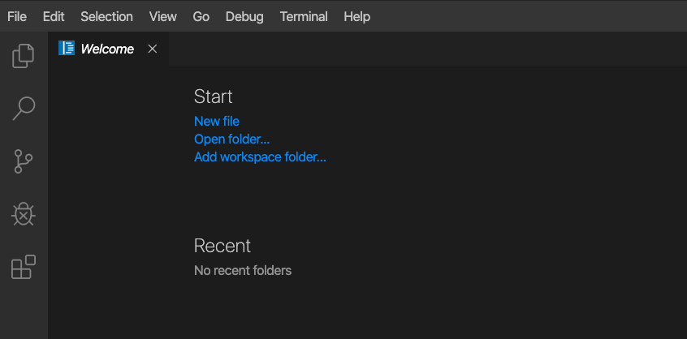

# Exercise 1.1 - Explorer l'environement de l'atelier

**Lisez ceci dans d'autres langues**: <br>
[ English](README.md),  [ 日本語](README.ja.md), [ Français](README.fr.md).<br>

## Step 1.1 - Objectif

L'objectif de ce laboratoire est de vous fournir une compréhension plus approfondie et une expérience pratique de l'automatisation des outils utilisés par les opérateurs de sécurité. Pour cela, nous aborderons trois cas d'utilisation de la sécurité assez typiques des défis quotidiens des opérateurs de sécurité. Alors que tous interagiront avec à peu près le même ensemble d'outils, chaque cas d'utilisation montre une perspective différente (analyste de sécurité, opérateur de pare-feu, spécialiste IDS) et donc un point de vue différent sur les outils disponibles.

Nous avons mis en place un ensemble commun d'outils liés à la sécurité:

- Le pare-feu, [Check Point](https://www.checkpoint.com/products/next-generation-firewall/)
- Le SIEM, [QRadar](https://www.ibm.com/security/security-intelligence/qradar)
- Et IDS, [Snort](https://www.snort.org)

Les exercices de la première section de ce laboratoire vous guident à travers chaque solution individuelle mentionnée ci-dessus. Vous apprendrez comment y accéder, à quoi ils servent et comment interagir avec eux à l'aide d'Ansible.

Les exercices de la deuxième section de ce laboratoire sont axés sur les cas d'utilisation réels des opérations de sécurité: situations dans lesquelles un certain défi doit être relevé, généralement en interagissant non seulement avec l'une des solutions mentionnées ci-dessus, mais avec un mélange de celles-ci. Après avoir défini le défi et expliqué les tâches à effectuer manuellement pour résoudre la situation, le laboratoire passe en revue les étapes d'automatisation des tâches avec Ansible.

## Step 1.2 - Architecture du laboratoire, nœuds et services

Dans ce laboratoire, vous travaillez dans un environnement de laboratoire préconfiguré. Vous aurez accès aux hôtes et services suivants:

| Rôle                          | Inventaire     |
| ------------------------------| ---------------|
| Ansible Control Host          | ansible        |
| IBM QRadar                    | qradar         |
| Attacker                      | attacker       |
| Snort                         | snort          |
| Check Point Management Server | checkpoint     |
| Check Point Gateway           | -              |
| Windows Workstation           | windows-ws     |

Le laboratoire est configuré individuellement pour vous. Vous avez votre propre environnement, vos propres services, vos propres machines virtuelles.


## Step 1.3 - Accéder à l'environnement Ansible

Toute l'automatisation est effectuée à partir d'un serveur de contrôle sous Red Hat Enterprise Linux. Pour faciliter l'accès à l'hôte de contrôle et la gestion des fichiers, il existe une version en ligne de VS Code Editor installée directement sur l'hôte de contrôle. De cette façon, il est accessible via un smple navigateur Web. Les commandes peuvent être exécutées directement à partir du terminal dans l'éditeur VS Code.

Accédons au code Visual Studio. Cliquez sur le lien pour accéder au VS Code depuis la page de l'atelier:


À ce stade, vous verrez la page **Bienvenue**:



Depuis cet environnement, vous pouvez créer et modifier des fichiers ou ouvrir un terminal et exécuter des commandes.

## Étape 1.4 - Ouvrez et utilisez le terminal dans VS Code

Ouvrons donc un nouveau terminal dans VS Code. Dans la barre de menu, cliquez sur **Terminal** > **Nouveau terminal**.


Un nouveau terminal sera ouvert dans la partie inférieure de votre éditeur et vous aurez accès à l'invite de commande. Notez que la plupart des tâches prérequises ont déjà été effectuées pour vous:

   - Un logiciel Ansible est installé

   - La connexion SSH et les clés sont configurées

   - `sudo` a été configuré sur les hôtes gérés pour exécuter des commandes qui nécessitent des privilèges root.

Notez que chaque étudiant se voit attribuer un numéro d'étudiant, c'est-à-dire X et vous devez travailler en tant qu'utilisateur student<X> sur le nœud de contrôle s'il n'est pas explicitement indiqué différemment.

Ensuite, vérifiez que Ansible a été installé correctement.

```bash
    [student<X>@ansible ~]$ ansible --version
```

Le résultat devrait ressembler à ce qui suit:


> **Remarque**
>
> Ansible simplifie la gestion de la configuration. Ansible ne nécessite aucune base de données ni aucun démon en cours d'exécution et peut s'exécuter facilement sur un ordinateur portable. Sur les hôtes gérés, il n'a besoin d'aucun agent en cours d'exécution.

## Étape 1.5 - Votre inventaire

Ouvrons un fichier dans VS Code. Dans la barre de menu, cliquez sur **Fichier**, **Ouvrir un fichier**. Au milieu de l'écran, un menu déroulant s'ouvre avec le contenu de fichier disponible du répertoire personnel de votre utilisateur:


Choisissez **lab_inventory**, cela mettra immédiatement à jour la liste des fichiers. Dans la nouvelle liste de fichiers, choisissez **hôtes**. Cela ouvrira l'inventaire de votre environnement.

Comme vous le voyez, l'inventaire de votre environnement est fourni dans un fichier statique de type ini. Il ressemble à la liste suivante. Veuillez noter que les adresses IP fournies ici ne sont qu'un exemple et seront différentes dans votre environnement de laboratoire:

```ini
[all:vars]
ansible_user=student1
ansible_ssh_pass=ansible
ansible_port=22

[attack]
attacker ansible_host=99.88.77.66 ansible_user=ec2-user private_ip=172.16.99.66 private_ip2=172.17.44.66

[control]
ansible ansible_host=22.33.44.55 ansible_user=ec2-user private_ip=192.168.2.3

[siem]
qradar ansible_host=22.44.55.77 ansible_user=admin private_ip=172.16.3.44 ansible_httpapi_pass="Ansible1!" ansible_connection=httpapi ansible_httpapi_use_ssl=yes ansible_httpapi_validate_certs=False ansible_network_os=ibm.qradar.qradar

[ids]
snort ansible_host=33.44.55.66 ansible_user=ec2-user private_ip=192.168.3.4 private_ip2=172.17.33.77

[firewall]
checkpoint ansible_host=44.55.66.77 ansible_user=admin private_ip=192.168.4.5 ansible_network_os=checkpoint ansible_connection=httpapi ansible_httpapi_use_ssl=yes ansible_httpapi_validate_certs=no

[windows]
windows-ws ansible_host=55.66.77.88 ansible_user=Administrator ansible_pass=RedHat19! ansible_port=5986 ansible_connection=winrm ansible_winrm_server_cert_validation=ignore private_ip=192.168.5.6
```

Toutes les adresses IP sont spécifiques à votre environnement. Chaque fois que les exercices vous demandent d'accéder à une certaine machine, vous pouvez toujours rechercher l'IP dans l'inventaire sur l'hôte de contrôle.

Ansible est déjà configuré pour utiliser l'inventaire spécifique à votre environnement. Comme le montre l'exemple ci-dessus, l'inventaire contient plus que les noms d'hôte et les adresses IP. Surtout dans le cas de la station de travail Windows, plusieurs autres paramètres sont définis.

> **Remarque**
>
> Tous les hôtes de votre laboratoire ne sont pas accessibles via SSH ou WinRM. Certains sont accessibles via l'API REST, RDP ou un navigateur Web. Au cours des exercices, chaque type de nœud sera expliqué en détail et les moyens d'accéder aux ressources seront présentés étape par étape.

## Étape 1.6 - Conseil pour l'atellier

Vous avez peut-être deviné maintenant que ce laboratoire est plutôt centré sur la ligne de commande… Nous vous recommandons donc de ne pas tout taper manuellement, utilisez le copier-coller à partir du navigateur le cas échéant.

----

[Cliquez ici pour revenir à l'atelier Ansible pour la sécurité](../README.fr.md)
