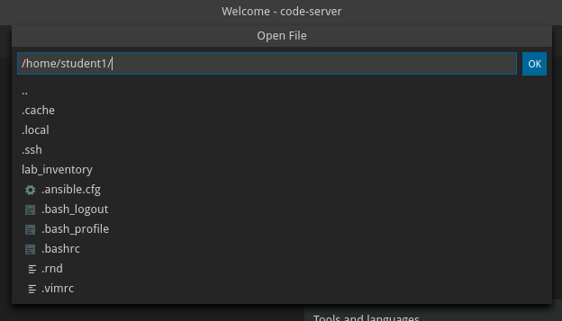

# 演習 1.1 - ラボ環境を確認してみよう

**Read this in other languages**: <br>
[ English](README.md),  [ 日本語](README.ja.md), [ Français](README.fr.md).<br>

## Step 1.1 - 目的

このラボの目的は、セキュリティオペレーターが使用するセキュリティツールを自動化する方法をより深く理解し、実際に体験してもらうことです。そのために、セキュリティ担当者の日々の課題に典型的な3つのセキュリティユースケースに取り組みます。これらのユースケースはすべてほぼ同じツールセットを使用しますが、それぞれのユースケースは異なる視点（セキュリティアナリスト、ファイアウォールオペレーター、IDS スペシャリスト）を示しており、利用可能なツールについての異なる視点を示しています。

セキュリティ関連の一般的なツールをセットアップします:

- ファイアウォール、今回は [Check Point Next Generation Firewall](https://www.checkpoint.com/products/next-generation-firewall/)を使用します。
- セキュリティ情報とイベント管理（SIEM）、今回は [QRadar](https://www.ibm.com/security/security-intelligence/qradar)を使用します。
- 侵入検知・防止システム、今回は [Snort](https://www.snort.org)を使用します。

このラボの最初のセクションの演習では、上記の個々のソリューションについて説明します。これらのソリューションにアクセスする方法、それらが何のために使用されているのか、そして Ansibleを使用してそれらとどのように対話するのかを学びます。

このラボの 2 番目のセクションの演習では、実際のセキュリティ運用のユースケースに焦点を当てています。課題を設定し、状況を解決するためにどのようなタスクを手動で行う必要があるかを説明した後、ラボでは Ansible を使用してタスクを自動化するための手順を説明します。

## Step 1.2 - ラボのアーキテクチャ、NodesとServices

このラボでは、事前に設定されたラボ環境で作業を行います。以下のホストとサービスにアクセスすることができます:

| Role                          | Inventory name |
| ------------------------------| ---------------|
| Ansible Control Host          | ansible        |
| IBM QRadar                    | qradar         |
| Attacker                      | attacker       |
| Snort                         | snort          |
| Check Point Management Server | checkpoint     |
| Check Point Gateway           | -              |
| Windows Workstation           | windows-ws     |

ラボはあなたのために個別に設定されます。あなたは自分用の環境、自分用のサービス、自分用の仮想マシンを持ちます。


セクション2の演習では、セキュリティインシデントを発生させる必要があります。これらのインシデントは、**ターゲット**のマシン（Snortサーバ）で発生しなければなりません。基本的には、SnortがインストールされたRHELのインストール作業で、攻撃を実行するための簡易ウェブサーバを実行しています。

## Step 1.3 - Ansible環境へのアクセス

すべての自動化は、Red Hat Enterprise Linux マシンである Ansible コントロールノードから行われます。コントロールホストへのアクセスやファイルの管理を容易にするために、コントロールノードに直接インストールされた VSCodeエディタのオンライン版があります。この方法では、通常のWebブラウザからアクセスすることができます。コマンドは、VSCodeエディタ内のターミナルから直接実行することができます。

Visual Studio Codeにアクセスしてみましょう。ワークショップページからVS Codeにアクセスするためのリンクをクリックします:


この時点で、**Welcome** ページが表示されます:


この環境の中から、ファイルの作成や変更、ターミナルを開いてコマンドを実行することができます。

## Step 1.4 - VSCodeでターミナルを開いて使用する

VS Codeで新しいターミナルを開いてみましょう。メニューバーの「**Terminal** > **New Terminal**」をクリックします。


エディタの下部に新しいターミナルが開き、コマンドプロンプトが表示されます。ほとんどの前提条件のタスクはすでに完了していることに注意してください。

  - Ansibleはインストールされています

  - SSH接続と鍵の設定

  - root権限を必要とするコマンドを実行するために `sudo` が管理ホスト上で設定されています。

各生徒には生徒番号、つまりXが割り当てられていることに注意してください。明示的に異なることを指示されていない場合は、コントロールノード上で「student<X>」ユーザとして動作する必要があります。

次に、Ansibleがただしくインストールされているか確認します。

```bash
    [student<X>@ansible ~]$ ansible --version
```

結果は以下のようになるはずです:


> **Note**
> 
> Ansibleは構成管理をシンプルにしています。Ansibleはデータベースや実行デーモンを必要とせず、ラップトップ上で簡単に実行できます。管理されているホストでは、実行エージェントは必要ありません。

## Step 1.5 - あなたのインベントリ

VSCodeでファイルを開いてみましょう。メニューバーで「**File** > **Open File**」をクリックします。 画面中央のドロップダウンメニューが開き、ユーザーのホームディレクトリの利用可能なファイルの内容が表示されます:



「**lab_inventory**」を選ぶと、すぐにファイルリストが更新されます。新しいファイルリストで「**hosts**」をピックしてください。これであなたの環境のインベントリが開きます。

ご覧のように、あなたの環境のインベントリは以下のリストのような静的なini型ファイルで提供されています。ここで提供されているIPアドレスは単なる例であり、あなたのラボ環境では異なることに注意してください:

```ini
[all:vars]
ansible_user=student1
ansible_ssh_pass=ansible
ansible_port=22

[attack]
attacker ansible_host=99.88.77.66 ansible_user=ec2-user private_ip=172.16.99.66 private_ip2=172.17.44.66

[control]
ansible ansible_host=22.33.44.55 ansible_user=ec2-user private_ip=192.168.2.3

[siem]
qradar ansible_host=22.44.55.77 ansible_user=admin private_ip=172.16.3.44 ansible_httpapi_pass="Ansible1!" ansible_connection=httpapi ansible_httpapi_use_ssl=yes ansible_httpapi_validate_certs=False ansible_network_os=ibm.qradar.qradar

[ids]
snort ansible_host=33.44.55.66 ansible_user=ec2-user private_ip=192.168.3.4 private_ip2=172.17.33.77

[firewall]
checkpoint ansible_host=44.55.66.77 ansible_user=admin private_ip=192.168.4.5 ansible_network_os=checkpoint ansible_connection=httpapi ansible_httpapi_use_ssl=yes ansible_httpapi_validate_certs=no

[windows]
windows-ws ansible_host=55.66.77.88 ansible_user=Administrator ansible_pass=RedHat19! ansible_port=5986 ansible_connection=winrm ansible_winrm_server_cert_validation=ignore private_ip=192.168.5.6
```

すべてのIPアドレスはあなたの環境に固有のものです。演習で特定のマシンへのアクセスを要求されたときはいつでも、コントロールノードのインベントリでIPを調べることができます。

Ansible は、あなたの環境に固有のインベントリを使用するようにすでに設定されています。上の例のように、インベントリにはホスト名と IP アドレスだけではありません。特にWindowsワークステーションの場合は、さらにいくつかのパラメータが設定されています。

> **Note**
> 
> ラボ内のすべてのホストに SSH や WinRM 経由でアクセスできるわけではありません。いくつかのホストはREST API、RDPまたはWebブラウザを介してアクセスします。演習では、各ノードの種類について詳細に説明し、リソースにアクセスする方法をステップバイステップで示します。

## Step 1.6 - ラボを利用する

このラボはコマンドライン中心のラボなので、すべてを手入力せず、ブラウザからコピー＆ペーストすることをお勧めします。しかし、実行前によく考えて理解することをおすすめします。

----

[ここをクリックしてAnsible Security Automation Workshopに戻る](../README.ja.md)
