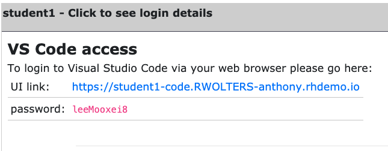

# Exercise 1.1 - Exploring the lab environment

## Step 1.1 - Objective

The objective of this lab is to provide you a deeper understanding and hands on experience how to automate security tools used by security operators. For that we will tackle three security use cases rather typical for the day-to-day challenges of security operatos. While all of them will interact with roughly the same toolset, each use case shows a different perspective (security analyst, firewall operator, IDS specialist) and thus a different point of view on the available tools.

We have set up a common set of security related tools:

- a Firewall, in this case [Check Point Next Generation Firewall](https://www.checkpoint.com/products/next-generation-firewall/)
- a Security Information and Event Management (SIEM), here [QRadar](https://www.ibm.com/security/security-intelligence/qradar)
- a Intrusion Detection & Prevention System, here [Snort](https://www.snort.org)

The exercises of the first section of this lab guide you through each individual solution mentioned above. You will learn how to access them, what they are used for and how to interact with them using Ansible.

The exercises of the second section of this lab are focused on the actual security operations use cases: situations in which a certain challenge has to be met, usually by interacting not only with one of the mentioned solutions above, but with a mix of them. After setting forth the challenge and explaining what tasks need to be done manually to solve the situation, the lab walks through the steps to automate the tasks with Ansible.

## Step 1.2 - Architecture of the lab, Nodes and Services

In this lab you work in a pre-configured lab environment. You will have access to the following hosts and services:

| Role                          | Inventory name |
| ------------------------------| ---------------|
| Ansible Control Host          | ansible        |
| IBM QRadar                    | qradar         |
| Attacker                      | attacker       |
| Snort                         | snort          |
| Check Point Management Server | checkpoint     |
| Check Point Gateway           | -              |
| Windows Workstation           | windows-ws     |

The lab is set up individually for you. You have your own environment, own services, own virtual machines.


For the exercises of section 2 we need to have security incidents. Those should happen on a **target** machine - that is Snort server. It is basically a RHEL installation with Snort installed and running a simplified web server to run attacks against.

## Step 1.3 - Access the Ansible Environment

All automation is done from the Ansible control host, a Red Hat Enterprise Linux machine. To make access to the control host and managing files on it easier there is a online version of VS Code editor installed directly on the control host. This way it can be accessed via a normal web browser. Commands can be executed right from the terminal within the VS Code editor.

Let's access the Visual Studio Code. Click on the link for VS Code access from the workshop page:



At this point, you will see a **Welcome** page:


From within this environment, you can create and modify files or open a terminal and execute commands.

## Step 1.4 - Open and use the Terminal in VS Code

So let's open a new terminal in VS Code. In the menu bar, click on **Terminal** > **New Terminal**. 


A new terminal will be opened in the lower part of your editor and you will be at the command prompt. Note that most prerequisite tasks have already been done for you:

  - Ansible software is installed

  - SSH connection and keys are configured

  - `sudo` has been configured on the managed hosts to run commands that require root privileges.

Note that each student is assigned a student number, i.e. X and you should work as the student <X> user on the control node if not explicitly told differently.

Next, proceed to check that Ansible has been installed correctly.

```bash
    [student<X>@ansible ~]$ ansible --version
```

The result should resemble the following:


> **Note**
> 
> Ansible is keeping configuration management simple. Ansible requires no database or running daemons and can run easily on a laptop. On the managed hosts it needs no running agent.

## Step 1.5 - Your inventory

Let's open a file in VS Code. In the menu bar, click on **File**, **Open File**. In the middle of the screen, a drop down menu opens with the available file content of the home directory of your user:


Pick **lab_inventory**, this will immediately update the file list. In the new file list, pick **hosts**. This will open the inventory of you environment.

As you see, the inventory of your environment is provided in a static, ini-type file. It looks like the following listing. Please note that the IP addresses provided here are just an example and will be different in your lab environment:

```ini
[all:vars]
ansible_user=student1
ansible_ssh_pass=ansible
ansible_port=22

[attack]
attacker ansible_host=99.88.77.66 ansible_user=ec2-user private_ip=172.16.99.66 private_ip2=172.17.44.66

[control]
ansible ansible_host=22.33.44.55 ansible_user=ec2-user private_ip=192.168.2.3

[siem]
qradar ansible_host=22.44.55.77 ansible_user=admin private_ip=172.16.3.44 ansible_httpapi_pass="Ansible1!" ansible_connection=httpapi ansible_httpapi_use_ssl=yes ansible_httpapi_validate_certs=False ansible_network_os=ibm.qradar.qradar

[ids]
snort ansible_host=33.44.55.66 ansible_user=ec2-user private_ip=192.168.3.4 private_ip2=172.17.33.77

[firewall]
checkpoint ansible_host=44.55.66.77 ansible_user=admin private_ip=192.168.4.5 ansible_network_os=checkpoint ansible_connection=httpapi ansible_httpapi_use_ssl=yes ansible_httpapi_validate_certs=no

[windows]
windows-ws ansible_host=55.66.77.88 ansible_user=Administrator ansible_pass=RedHat19! ansible_port=5986 ansible_connection=winrm ansible_winrm_server_cert_validation=ignore private_ip=192.168.5.6
```

All the IP addresses are specific to your environment. Whenever the exercises ask you to access a certain machine, you can always look up the IP in the inventory on the control host.

Ansible is already configured to use the inventory specific to your environment. As shown in the example above, the inventory carries more than just the host names and IP addresses. Especially in the case of the Windows workstation, several more parameters are set.

> **Note**
> 
> Not all hosts in your lab can be reached via SSH or WinRM. Some are accessed via REST API, RDP or web browser. During the exercises, each node type will be explained in detail and the means how to access the resources will be shown step by step.

## Step 1.6 - Working the Labs

You might have guessed by now this lab is pretty commandline-centric…​ So we recommend that you don’t type everything manually, use copy & paste from the browser when appropriate. But stop to think and understand.

----

[Click Here to return to the Ansible Security Automation Workshop](../README.md#section-1---introduction-to-ansible-security-automation-basics)
