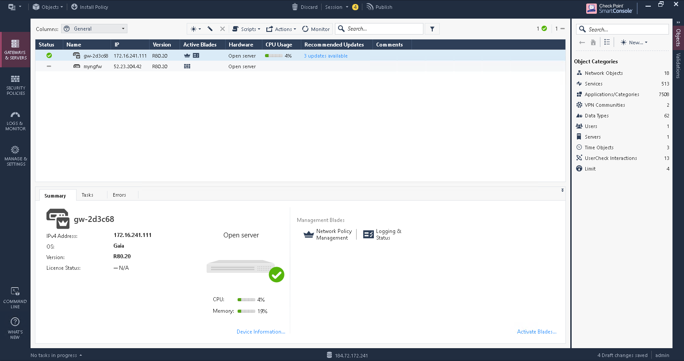
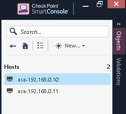
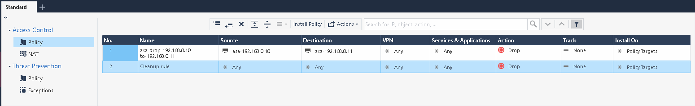

# Exercise 1.2 - Executing the first Check Point playbook

## Step 2.1 - Check Point Next Generation Firewall

To showcase how to automate the firewall in a security environment, this lab contains a Check Point Next Generaion Firewall (NGFW).

The NGFW is usually not managed directly, but via a central security management server (MGMT). The MGMT is a central tool to manage multiple NGFWs or other security tools in one spot.

There are multiple ways to interact with the MGMT. In our lab, two ways are important:

- API: Ansible mostly works with the API
- Windows client: the user interaction takes place in a Windows client.

In this lab the playbooks we write will be interacting with the API in the background. All actions will be verified in the Windows client UI.

## Step 2.2 - Accessing the Check Point MGMT server via a Windows workstation

Since access to the MGMT server requires a Windows client and we cannot be sure that each and every lab student has access to a Windows environment, we have provisioned a Windows workstation as part of this lab.

The Windows workstation can be reached via Remote Desktop Protocol (RDP). We recommend to use a native RDP client if available. If not, the Workstation is equipped with an HTML RDP client which enables lab participants to access the workstation via browser.

Test the access to the MGMT server now by pointing your RDP client to the `windows-ws` IP in your inventory.

If you do not have a RDP client available or want to test the HTML RDP client, please open the following URL in your browser: `http://<windows-wsIP>/myrtille`. Be sure to replace `<windows-wsIP>` with the IP for the Windows workstation from your inventory. In the login field, only provide the user name and the password: The user name is **Administrator**, the password is **Ansible+Red*Hat19!20** if not provided otherwise. Leave the other fields empty, and click on **Connect**.

You now are accessing a default windows workstation with a Google Chrome browser installed.

> **Note**
>
> Directly after the login you might see a wide blue bar on the right side of the screen, about network configurations. You can safely ignore this, the question hides away if you click anywhere on the screen.

## Step 2.3 - Access the SmartConsole UI

Launch the Check Point SmartConsole via the desktop icon. In the following window, as username use `admin` and as password `admin123` if not instructed otherwise. The IP address to enter is the one from the **checkpoint** entry of your inventory.


Press the **Login** button. Afterwards you need to verify the server fingerprint by clicking the **PROCEED** button.

> **Note**
>
> In a production environment, you would first figure out the fingerprint of the server and would only proceed after you confirmed that the fiungerprint shown is identical with the one from the server. In our demo setup with the short lived instances we can assume that the fingerprints are good.

You are now viewing the Check Point SmartConsole management interface. There might be a Internet Explorer Warning visible upon start. This can safely be closed and is due to limitations in the way IE works.



Next, on the left side, click on **SECURITY POLICIES** and note that there is currently only one rule installed: to drop all traffic. Now you have a first idea of how Check Point looks like in term of the management interface. We will interact more with it - but first we go back to the command line to learn how to write Ansible playbooks interacting with Check Point.

## Step 2.4 - First example playbook

In Ansible, automation is described in playbooks. Playbooks are files which describe the desired configurations or steps to implement on managed hosts. Playbooks can change lengthy, complex administrative tasks into easily repeatable routines with predictable and successful outcomes.

A playbook is a repeatable set of *plays* and *tasks*.

A playbook can have multiple plays and a play can have one or multiple tasks. A task is comprised of one or more *modules*,  modules are the components that do the actual work.

The goal of a *play* is to map a group of hosts.  The goal of a *task* is to implement modules against those hosts.

If you are not very familiar with Ansible, see the following example of a playbook:

```yaml
---
- name: install and start apache
  hosts: web
  become: yes
  vars:
    http_port: 80

  tasks:
    - name: httpd package is present
      yum:
        name: httpd
        state: latest

    - name: latest index.html file is present
      template:
        src: files/index.html
        dest: /var/www/html/

    - name: httpd is started
      service:
        name: httpd
        state: started
```

> **Tip**
>
> Here is a nice analogy: When Ansible modules are the tools in your workshop, the inventory is the materials and the playbooks are the instructions.

We will now write a playbook to change the configuration of the Check Point setup. We will start with a simple example where we will add a whiltelist entry in the firewall configuration to allow traffic from a certain machine to another. In our example we will allow the machine called **attacker** to send traffic to our machine **snort**.

The playbook will be written and run on the Ansible control host. The languae the playbook is written in is [YAML](https://en.wikipedia.org/wiki/YAML). In your browser, access the VS Code online editor. In the menu bar, click on **File** -> **New File**. A new, empty file opens. Before we continue, let's save it. Again in the menu bar, click on **File** -> **Save As...**. The drop down menu opens suggesting the filename **Untitled-1** in the directory **lab_inventory**. Change this to `whitelist_attacker.yml` and remove the directory **lab_inventory** so that the full filename is: `/home/student<X>/whitelist_attacker.yml` where `<X>` is the student id assigned to you.

> **Note**
> 
> Make sure that the file, and all future operations, are always done in the home directory, **/home/student\<X>**. This is crucial for the proper execution of the exercises.

once we have saved the file in the proper place, we can add our playbook code. First, a playbook needs a name and the hosts it should be executed on. So let's add those:

```yaml
---
- name: Whitelist Attacker
  hosts: checkpoint
```

In case you wonder: the three dashes at the top, `---`, indicate the start of a YAML file.

> **Note**
>
> It is a good practice to make playbooks more reusable by pointing them at `hosts: all` and limit the execution later on the command line or via Tower. But for now we simplify the process by naming hosts in the playbook directly.

As mentioned, in this a simple example we will add a whitelist entry. A simple whitelist entry consists of a source IP address, a destination IP address and the rule to allow access between those.

For this, we add the source and destination IPs as variables to the playbook. Since Ansible knows all the machines from the inventory and since the IPs are listed in the inventory, we can just reference those information as [variables](https://docs.ansible.com/ansible/latest/user_guide/playbooks_variables.html) of the corresponding hosts:

<!--  -->
```yaml
---
- name: Whitelist Attacker
  hosts: checkpoint

  vars:
    source_ip: "{{ hostvars['attacker']['private_ip2'] }}"
    destination_ip: "{{ hostvars['snort']['private_ip2'] }}"
```
<!--  -->

As you see, variables are marked by curly brackets. Note that we use the second private IP - those belong to a network which is specifically routed via the FW for application traffic. The first private IP belongs to the management network. The variables are used to define yet another (shorter) variable each, which will be used throughout the playbook. This is a common way to decouple the data from the execution.

> **Note**
>
> Make sure that the white spaces and indentation is exactly as shown: YAML is very picky about this, and many errors in running playbooks are due to wrong indentation.

Next, we need to add the tasks. The tasks section is where the actual changes on the target machines are made. In this case, this happens in three steps: 

- first we create a source object
- then a destination object
- finally the access rule between those two objects

Let's start with a task to define the source object:

<!--  -->
```yaml
---
- name: Whitelist attacker
  hosts: checkpoint

  vars:
    source_ip: "{{ hostvars['attacker']['private_ip2'] }}"
    destination_ip: "{{ hostvars['snort']['private_ip2'] }}"

  tasks:
    - name: Create source IP host object
      checkpoint_host:
        name: "asa-{{ source_ip }}"
        ip_address: "{{ source_ip }}"
```
<!--  -->

As you can see, the task itself has a name - just like the play itself - and references a module, here `checkpoint_hosts`. The module is the part of Ansible which "makes it so" - the module in this case creates of modifies host object entries in Check Point. The module has parameters, here `name` and `ip_address`. Each module has individual parameters, often some of them are required while others are optional. To get more information about a module, you can open a terminal in your VS Code online editor and call the help. For example, in the menu bar, click on **Terminal** > **New Terminal** and execute the following command. It will show the help for the module `checkpoint_host`:

```bash
[student<X>@ansible ~]$ ansible-doc checkpoint_host
```

> **Tip**
>
> In `ansible-doc` you can use `up`/`down` arrows to scroll through the content and `q` to exit.

In the same way we defined the source IP host object, we will now add the destination IP host object:

<!--  -->
```yaml
---
- name: Whitelist attacker
  hosts: checkpoint

  vars:
    source_ip: "{{ hostvars['attacker']['private_ip2'] }}"
    destination_ip: "{{ hostvars['snort']['private_ip2'] }}"

  tasks:
    - name: Create source IP host object
      checkpoint_host:
        name: "asa-{{ source_ip }}"
        ip_address: "{{ source_ip }}"

    - name: Create destination IP host object
      checkpoint_host:
        name: "asa-{{ destination_ip }}"
        ip_address: "{{ destination_ip }}"
```
<!--  -->

Last, we are defining the actual access rule between those two host objects. The rules still need to be applied, and this can be done in two ways: either on a per-task base, shown via the module parameter `auto_install_policy: yes`, or as a final, dedicated task with the module `cp_mgmt_install_policy`. Both are shown in this playbook to highlight the flexibility we have with the modular approach. In case however the module already started an apply process, the last install policy module might fail, so we add a special flag to ignore possible errors, `failed_when: false`:

<!--  -->
```yaml
---
- name: Whitelist attacker
  hosts: checkpoint

  vars:
    source_ip: "{{ hostvars['attacker']['private_ip2'] }}"
    destination_ip: "{{ hostvars['snort']['private_ip2'] }}"

  tasks:
    - name: Create source IP host object
      checkpoint_host:
        name: "asa-{{ source_ip }}"
        ip_address: "{{ source_ip }}"

    - name: Create destination IP host object
      checkpoint_host:
        name: "asa-{{ destination_ip }}"
        ip_address: "{{ destination_ip }}"

    - name: Create access rule to allow access from source to destination
      checkpoint_access_rule:
        auto_install_policy: yes
        auto_publish_session: yes
        layer: Network
        position: top
        name: "asa-accept-{{ source_ip }}-to-{{ destination_ip }}"
        source: "asa-{{ source_ip }}"
        destination: "asa-{{ destination_ip }}"
        action: accept

    - name: Install policy
      cp_mgmt_install_policy:
        policy_package: standard
        install_on_all_cluster_members_or_fail: yes
      failed_when: false
```
<!--  -->

## Step 2.5 - Run the playbook

Playbooks are executed using the `ansible-playbook` command on the control node. Before you run a new playbook it’s a good idea to check for syntax errors. In your VS Code online editor, in the menu bar click on **Terminal** -> **New Terminal**. In the terminal, execute the following command:

```bash
[student<X>@ansible ansible-files]$ ansible-playbook --syntax-check whitelist_attacker.yml
```

The syntax check should report no errors. If it does report an error, check the output and try to fix the problem in the playbook code.

Now you should be ready to run your playbook:

```bash
[student<X>@ansible ansible-files]$ ansible-playbook whitelist_attacker.yml

PLAY [Whitelist attacker] *********************************************************

TASK [Gathering Facts] ************************************************************
ok: [checkpoint]

TASK [Create source IP host object] ***********************************************************************************
changed: [checkpoint]

TASK [Create destination IP host object] ***********************************************************************************
changed: [checkpoint]

TASK [Create access rule to allow access from source to destination] ***********************************************************************************
changed: [checkpoint]

PLAY RECAP ************************************************************************
checkpoint  : ok=4 changed=3 unreachable=0 failed=0 skipped=0 rescued=0 ignored=0
```

## Step 2.6 - Verify changes in UI

Now it's time to check if the changes really did take place and Check Point MGMT server's configuration was altered.

Access the Windows workstation and open the SmartConsole interface. On the right side, underneath **Object Categories**, click on **Network Objects**, then pick **Hosts**. It should list both new host entries.



Next, on the left side, click on **SECURITY POLICIES**. Notice the additional access control policy entry in the middle of the field, compare this with when we looked at this earlier. Since the traffic is allowed now, the entry in the **Action** column is changed and has a different color.



Also note in the bottom left corner that there is a green bar indicating that changes were applied to the entire system.

## Step 2.7 - Turn on Logging for the new policy

To see how changes are normally performed in a typical manual interaction with Check Point, let's do a small change which will come in handy later on. By default, Check Point does not turn on logging for new rules. Let's activate the logging for our new policy. On the left side of the main window, click on **SECURITY POLICIES**. There are both rules listed. In the column **Track**, hover with your mouse over the **None** entry of our newly created rule. Right click on it, and in the box appearing pick **Log**.


Afterwards, click on the **Install Policy** button at the top of the list of policies, confirm the dialog which opens with **Publish & Install** and in the last dialog, click **Install** again.

As a result, in the left corner, a small window pops up informing you of the progress of the deployment of the change.

As you can see, even making a small change in the configuration requires multiple clicks from the user - the more of these steps can be automated, the better.

----

[Click Here to return to the Ansible Security Automation Workshop](../README.md#section-1---introduction-to-ansible-security-automation-basics)
