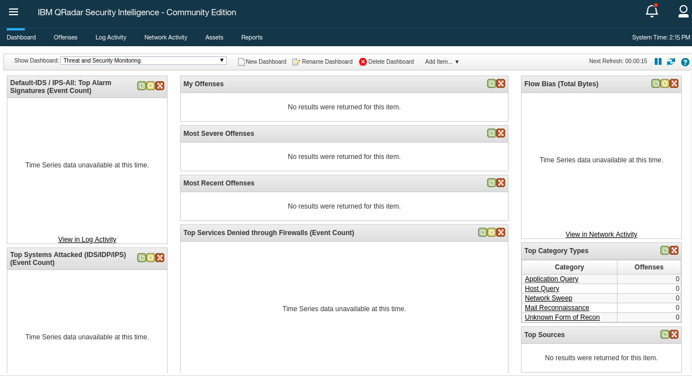

# Exercise 1.4 - Executing the first IBM QRadar

## Step 4.1 - IBM QRadar

To showcase how to automate a SIEM in a security environment, this lab contains a [IBM QRadar SIEM, community edition](https://developer.ibm.com/qradar/ce/).

The SIEM can be accessed via web UI and via REST API. In this lab the playbooks we write will be interacting with the API in the background. All actions will be verified in the web UI.

## Step 4.2 - Access the web UI

Have a first look at the SIEM, and verify that it is actualy working. Point your web broswer towards `https://<qradar-IP>`, where `<qradar-IP>` is the IP address for the `qradar` entry in your `siem` section of your inventory. Next you will be faced with a warning that the vertificate is unsecure since it is self-signed. Please accept this and proceed.

> **Note**
>
> In a productive environment, accepting a insecure certificate would not be an option. Since the lab setup is only short lived and solely serves a demo purppose we accept the risk in this case.

In the login field, provide the username **admin** and the password **Ansible1!** if not provided otherwise. Press the **Login** button.

You are now viewing the IBM QRadar main web interface.



To get an idea of QRadar and the basic concepts, let's have a short look at the interface: in the upper part there is a navigation bar with multiple entry points into the main parts of QRadar.

- **Dashboard**, providing a central overview
- **Offenses**, messages or events generated by a monitored condition
- **Log Activity**, showing collected events from log sources
- **Network Activity**, network traffic communication between certain hosts
- **Assets**, automatically created profiles of network devices and hosts in your environment
- **Reports**, customized or standard reports to, well, report what happens in your environment

For the purpose of the demo, we will have a closer look at the **Offenses**: click on the menu item. In the new window, you will see a navigation bar on the left side to filter the offenses.


> **Note**
>
> Since this is a demo environment, it is likely that the list of offenses is currently empty.

Offenses are messages or events generated based upon findings in log messages or network traffic, like a malicious log line. QRadar triggers offenses based on rules: the rules describe conditions, and when a condition is met, the offense is the result.

To say it with the words of the official documentation:

> *Rules, sometimes called correlation rules are applied to events, flows, or offenses to search for or detect anomalies. If all the conditions of a test are met, the rule generates response. ([QRadar documentation](https://www.ibm.com/support/knowledgecenter/en/SS42VS_7.3.2/com.ibm.qradar.doc/c_qradar_rul_mgt.html))*

In a productive environment it is common to create more and more custom rules over time. But for now, let's have a look at the rules which are already installed on the system: in the **Offenses** window, on the left side in the navigation bar, click on **Rules**. A long list of rules is displayed. In the search bar on top of this list, enter the following search term: `DDoS` Hit enter afterwards to filter the list.

The list is filtered, and only shows few rules which are related to DDOS.


Click on the one called **"Potential DDoS Against Single Host (TCP)"**, note that it is enabled. This will be relevant later in this exercise.

Now that you had a very first glance at QRadar, it is time to look how it can be automated by Ansible.

## Step 4.3 - QRadar modules and Ansible collections

On the most basic level, Ansible automation performs tasks. Those tasks execute modules, which usually work on the corresponding targets, like an API endpoint of a special device or program.

Ansible comes along with a lot of modules included. But as time of writing Ansible does not ship QRadar modules out of the box. Instead, those modules are provided as [Ansible collections](https://docs.ansible.com/ansible/devel/dev_guide/collections_tech_preview.html):

> *Collections are a distribution format for Ansible content. They can be used to package and distribute playbooks, roles, modules, and plugins. You can publish and use collections through Ansible Galaxy.*

Collections follow a simple directory structure to provide Ansible content. If you feel reminded of Ansible roles here, this has a reason: Collections are built upon the idea of roles, but extend the concept to general Ansible content management. The collection for IBM QRadar can be found in the [ansible-security project](https://github.com/ansible-security/ibm_qradar).

As roles, collections also need to be installed first before they can be used. They are installed on the machine executing Ansible,  in the case of the lab this is the control host.

Let's install the collection for QRadar modules on your control host. In your VS Code online editor open a new terminal. Execute the command `ansible-galaxy collection --help` to verify that the collections function is working properly:

```bash
[student<X>@ansible ~]$ ansible-galaxy collection --help
usage: ansible-galaxy collection [-h] COLLECTION_ACTION ...

positional arguments:
  COLLECTION_ACTION
    init             Initialize new collection with the base structure of a
                     collection.
    build            Build an Ansible collection artifact that can be publish
                     to Ansible Galaxy.
    publish          Publish a collection artifact to Ansible Galaxy.
    install          Install collection(s) from file(s), URL(s) or Ansible
                     Galaxy

optional arguments:
  -h, --help         show this help message and exit
```

With that in mind, we can now install the collection `ibm.qradar`:

```bash
[student<X>@ansible ~]$ ansible-galaxy collection install ibm.qradar
Process install dependency map
Starting collection install process
Installing 'ibm.qradar:0.0.1' to '/home/student<X>/.ansible/collections/ansible_collections/ibm/qradar'
```

Verify that the collection was installed properly:

```bash
[student<X>@ansible ~]$ ls -1 ~/.ansible/collections/ansible_collections/ibm/qradar
docs
LICENSE
plugins
README.md
tests
```

All required files are there - especially the directory `plugins/modules` which contains the actual modules.

With the collection in place, we can now start to write our playbook.

> **Note**
>
> If you want to try this at home: please note that this collection command requires at least Ansible version 2.9!

## Step 4.4 - First example playbook

In our first example to interface with QRadar we are going to enable/disable a rule. It is a rather small but common change and shows how Ansible and QRadar interact. We will do this in two steps: first we find the rule we want to change, afterwards we apply the change.

In your VS Code online editor, create a new file, `find_qradar_rule.yml` in the home directory of your user. Add the name and target hosts, here `qradar`.

```yaml
---
- name: Find QRadar rule state
  hosts: qradar
```

We also want to use the collections we just added. Collections can be referenced at multiple spots, for example at task level as well as play level. We will reference them at play level to be able to write multiple tasks based on them later on.

```yaml
---
- name: Find QRadar rule state
  hosts: qradar
  collections:
    - ibm.qradar
```

Next we bring in the actual tasks. The REST API of QRadar is desgined in a way that we first have to search for a proper rule to find out its ID, and then deactive the rule by referencing the given ID. For the sake of this lab, let's say the rule which creates messages based on a suspected DDoS attack. In the last section we already had a look at the QRadar rules via **Offenses** > **Rules**, and filitered them for the term **DDoS**. In the filtered list, note the first rule shown there, **"Potential DDoS Against Single Host (TCP)"**. We will use this string to search for the role using the module `qradar_rule_info`:

```yaml
---
- name: Find QRadar rule state
  hosts: qradar
  collections:
    - ibm.qradar

  tasks:
    - name: get info about qradar rule
      qradar_rule_info:
        name: "DDoS Attack Detected"
```

This module returns a lot of information, among those the ID we need to actually disable the role. Let's register the returned information into a variable with the help of the `register` keyword. It is directly used with the module itself. This enables us to use the content of the variable in the next task.

```yaml
---
- name: Find QRadar rule state
  hosts: qradar
  collections:
    - ibm.qradar

  tasks:
    - name: get info about qradar rule
      qradar_rule_info:
        name: "DDoS Attack Detected"
      register: rule_info
```

So how do the information returned by the module actually look like? How about we just output the variable `rule_info`? For that, add a `debug` task which can be used to output variables during a playbook run:

```yaml
---
- name: Find QRadar rule state
  hosts: qradar
  collections:
    - ibm.qradar

  tasks:
    - name: get info about qradar rule
      qradar_rule_info:
        name: "Potential DDoS Against Single Host (TCP)"
      register: rule_info

    - name: output returned rule_info
      debug:
        var: rule_info
```

> **Note**
>
> The parameter "var" of the debug module does expect a variable name already - for that reason curly brackets and quotation marks are not needed like usually when you reference a variable.

Both tasks only collect and output data, they do not change anything. Let's quickly run the playbook to look at the returned data:

```bash
[student<X>@ansible ansible-files]$ ansible-playbook find_qradar_rule.yml

PLAY [Find QRadar rule state] ***************************************************

TASK [Gathering Facts] ************************************************************
ok: [qradar]

TASK [get info about qradar rule] *************************************************
ok: [qradar]

TASK [output returned rule_info] **************************************************
ok: [qradar] => {
    "rule_info": {
        "changed": false,
        "failed": false,
        "rules": [
            {
                "average_capacity": 0,
                "base_capacity": 0,
                "base_host_id": 0,
                "capacity_timestamp": 0,
                "creation_date": 1278524200032,
                "enabled": true,
                "id": 100065,
                "identifier": "SYSTEM-1520",
                "linked_rule_identifier": null,
                "modification_date": 1566928030130,
                "name": "Potential DDoS Against Single Host (TCP)",
                "origin": "SYSTEM",
                "owner": "admin",
                "type": "FLOW"
            }
        ]
    }
}

PLAY RECAP ************************************************************************
qradar  : ok=3  changed=0  unreachable=0  failed=0  skipped=0  rescued=0  ignored=0
```

As you see, the debug task `output returned rule_info` shows the content of the variable, and thus the content which was returned by the module `qradar_rule_info`. Note among those return data the key `id`, in this example with the value `100065`. This is the key we need.

> **Note**
>
> The key id might be different in your case.

How do we get the key when it is in this structure? First, it is in the segment `rules` of the variable, which we can access via `rule_info.rules`. Inside of `rules` there is actually a list (note the curly brackets), but with only one entry - so we access it with `rule_info.rules[0]`. And from within the list entry we can access each key individually via its name: `rule_info.rules[0]['id']`.

So, let's write a new playbook where we provide this as a value to the module which can disable the rule, `qradar_rule`.

In your VS Code online editor, create a new file, `change_qradar_rule.yml` in the home directory `/home/student<X>/`. Add the name and target hosts, here `qradar`.

<!--  -->
```yaml
---
- name: Change QRadar rule state
  hosts: qradar
  collections:
    - ibm.qradar

  tasks:
    - name: get info about qradar rule
      qradar_rule_info:
        name: "Potential DDoS Against Single Host (TCP)"
      register: rule_info

    - name: disable rule by id
      qradar_rule:
        state: disabled
        id: "{{ rule_info.rules[0]['id'] }}"
```
<!--  -->

The playbook is now complete: it queries QRadar for the list of rules, and deactives the one we are looking for.

## Step 4.5 - Run the playbook

After we completed the playbook, let's execute it:

```bash
[student<X>@ansible ansible-files]$ ansible-playbook change_qradar_rule.yml

PLAY [Change QRadar rule state] ***************************************************

TASK [Gathering Facts] ************************************************************
ok: [qradar]

TASK [get info about qradar rule] *************************************************
ok: [qradar]

TASK [disable rule by id] *********************************************************
changed: [qradar]

PLAY RECAP ************************************************************************
qradar  : ok=3  changed=1  unreachable=0  failed=0  skipped=0  rescued=0  ignored=0
```

As you can see, the playbook denotes a change: the rule was changed. Run the playbook again - it does not report a change anymore, since the rule is now already disabled.

## Step 4.6 - Verfiy changes in UI

To verify that Ansible indeed changed something, we go back to the UI of QRadar. Open the QRadar IP in your web browser. Click on the **Offenses** tab, and from there on the left side click on **Rules**. The long list of rules is displayed. In the search bar on top of this list, enter the following search term: `DDoS`
Hit enter afterwards to filter the list, so that it only shows few rules which are related to DDOS. At the end, note the rule regarding potential DDOS attacks, and check the state in the **Enabled** column: it is set to **False**!


You are done with the first steps of automating QRadar with Ansible. Head back to the exercise overview and continue with the next exercise.

----

[Click Here to return to the Ansible Security Automation Workshop](../README.md#section-1---introduction-to-ansible-security-automation-basics)
