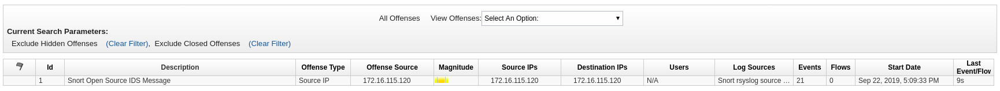

# Exercice 2.1 - Enquête approfondie

**Lisez ceci dans d'autres langues**: <br>
[ English](README.md),  [ 日本語](README.ja.md), [ Français](README.fr.md).<br>

## Étape 1.1 - Le contexte

Dans la dernière section, l'accent a été mis sur les outils individuels et sur la façon dont ils peuvent être automatisés avec Ansible. Dans le quotidien des administraeur de la sécurité, le besoin est bien plus élevé: lorsqu'un événement suspect se produit et nécessite une plus grande attention, les opérations de sécurité doivent déployer de nombreux outils pour sécuriser d'entreprise. Dans de nombreux environnements d'entreprise, les solutions de sécurité ne sont pas intégrées les unes aux autres et, dans les grandes organisations, différentes équipes sont en charge de différents aspects de la sécurité informatique, sans processus en commun. Cela conduit souvent à un travail manuel et à une interaction entre des personnes d'équipes différentes qui est sujette aux erreurs et qui est surtout lente.

Nous utiliserons Ansible pour créer des interactions entre les composants appris dans la dernière section afin de les combiner en des workflows automatisés.

## Étape 1.2 - Préparatifs

Pour que cet exercice fonctionne correctement, le playbook `whitelist_attacker.yml` doit avoir été exécuté au moins une fois. La journalisation de la stratégie de liste d'autorisation de l'attaquant doit également avoir été activée. Les deux ont été effectués lors de l'exercice Check Point. Si vous avez manqué les étapes, retournez-y, exécutez le playbook, suivez les étapes pour activer la journalisation et revenez ici.

Nous avons également besoin de la collection QRadar. Qui a déjà été installé dans le précédent exercice QRadar. Si vous avez manqué cette partie, installez-les via: `ansible-galaxy collection install ibm.qradar`

De plus, nous utiliserons le rôle écrit pour modifier les règles IDS de l'exercice Snort précédent. Si vous l'avez manqué, installez-les via: `ansible-galaxy install ansible_security.ids_rule`

Ensuite, comme il s'agit d'un atelier de sécurité, nous avons besoin d'un trafic suspect - une attaque. Nous avons un playbook qui simule un accès simple toutes les cinq secondes auquel les autres composants de cet exercice réagiront plus tard. Dans votre éditeur en ligne VS Code, créez le playbook `web_attack_simulation.yml` dans le répertoire personnel de l'utilisateur avec le contenu suivant:

<!--  -->
```yml
---
- name: start attack
  hosts: attacker
  become: yes
  gather_facts: no

  tasks:
    - name: simulate attack every 5 seconds
      shell: "/sbin/daemonize /usr/bin/watch -n 5 curl -m 2 -s http://{{ hostvars['snort']['private_ip2'] }}/web_attack_simulation"
```
<!--  -->

Exécutez le playbook:

```bash
[student<X>@ansible ansible-files]$ ansible-playbook web_attack_simulation.yml
```

> **Remarque**
>
> Dans ce playbook, nous lancons un petit daemon qui exécutera une commande toutes les 5 secondes. C'est une methode peu efficace de démarrer une tâche répétitive, mais acceptable dans le cadre d'un atelier.

Les prérequis sont maintenant établis. Lisez la suite pour savoir de quoi parle ce cas d'utilisation.

## Étape 1.3 - L'anomalie

Imaginez que vous êtes analyste de sécurité dans une entreprise. Vous venez d'être informé d'une anomalie dans une application. Depuis un terminal de votre éditeur en ligne VS Code, connectez vous via ssh à la machine snort. N'oubliez pas que vous pouvez rechercher l'IP du serveur Snort à partir du fichier d'inventaire dans `/home/student<X>/lab_inventory/hosts`.

Ouvrez un nouveau terminal dans votre éditeur en ligne VS Code pour vous connecter au serveur Snort via SSH. Remarque: Pour l'utilisateur de connexion, vous devez utiliser `ec2-user`! Après la connexion, executez la la commande `grep` ci-dessous:

```bash
[student<X>@ansible ~]$ ssh ec2-user@11.22.33.44
Last login: Sun Sep 22 15:38:36 2019 from 35.175.178.231
[ec2-user@ip-172-16-115-120 ~]$ sudo grep web_attack /var/log/httpd/access_log
172.17.78.163 - - [22/Sep/2019:15:56:49 +0000] "GET /web_attack_simulation HTTP/1.1" 200 22 "-" "curl/7.29.0"
...
```

Vous pouvez vous déconnecter du serveur Snort en exécutant la commande «exit» ou en appuyant sur «CTRL» et «D».

> **Remarque**
>
> Vous l'avez peut-être déjà deviné: cette entrée de journal est déclenchée toutes les cinq secondes par le démon que nous avons démarré au début de cet exercice.

En tant qu'analyste de la sécurité, vous savez que les anomalies peuvent être le signe d'une violation ou d'autres causes graves. Vous décidez d'enquêter. À l'heure actuelle, vous ne disposez pas de suffisamment d'informations sur l'anomalie pour la rejeter comme un faux positif. Vous devez donc collecter plus d'informations comme celles du pare-feu et de l'IDS. Parcourir les journaux du pare-feu et de l'IDS manuellement prend beaucoup de temps. Dans les grandes organisations, l'analyste de sécurité peut même ne pas avoir les droits d'accès nécessaires et doit contacter les équipes qui sont chacune responsables du pare-feu d'entreprise et de l'IDS, leur demandant de parcourir manuellement les journaux respectifs, de vérifier directement les anomalies et ensuite vous répondre avec des résultats. Cette opération peut prendre des heures voire des jours.

## Étape 1.4 - Écrire un playbook pour centralisé de nouveaux journaux

Si vous utilisez un SIEM, c'est plus facile: vous pouvez collecter et analyser les journaux de manière centralisée. Dans notre cas, le SIEM est QRadar. QRadar a la capacité de collecter des journaux d'autres systèmes et de rechercher des activités suspectes. Alors, comment analysons-nous les journaux dans QRadar? Avant de pouvoir consulter ces journaux, nous devons les envoyer à QRadar. Cela se produit en deux étapes: nous devons d'abord configurer les sources - ici Check Point et Snort - pour transmettre leurs journaux à QRadar. Et deuxièmement, nous devons ajouter ces systèmes en tant que sources de journal à QRadar.

Faire cela manuellement nécessite beaucoup de travail sur plusieurs machines, ce qui prend encore du temps et peut nécessiter des privilèges qu'un analyste de sécurité ne possède pas. Mais Ansible permet aux organisations de sécurité de créer des workflows d'automatisation pré-approuvés sous la forme de playbooks. Ceux-ci peuvent même être gérés de manière centralisée et partagés entre différentes équipes pour activer les flux de travail de sécurité en appuyant sur un bouton. Avec ces Playbooks, en tant qu'analyste de la sécurité, nous pouvons configurer automatiquement le pare-feu d'entreprise et l'IDS pour envoyer leurs événements/journaux à l'instance QRadar, afin que nous puissions corréler les données et décider comment procéder avec le flux suspet.

> **Remarque**
>
> Pourquoi n'ajoutons-nous pas ces journaux à QRadar de façon permanente? La raison en est que de nombreux systèmes de journaux sont licenciés/payés en fonction de la quantité de journaux qu'ils consomment. De plus, s'il y a trop de journaux, il devient plus difficile d'analyser les données correctement et en temps opportun.

Écrivons donc un playbook qui configure d'abord les sources de journaux - Snort et Check Point - pour envoyer les journaux à QRadar, puis ajoute ces sources de journal à QRadar afin qu'il en soit conscient.

Comme d'habitude, le playbook a besoin d'un nom et des hôtes sur lesquels il doit être exécuté. Étant donné que nous travaillons sur différentes machines dans ce flux de travail, nous allons séparer le playbook en différents [plays](https://docs.ansible.com/ansible/latest/user_guide/playbooks_intro.html#playbook-language-example):

> *Le but d'un jeu est de mapper un groupe d'hôtes à des rôles bien définis, représentés par des choses appelées tâches. À un niveau de base, une tâche n'est rien de plus qu'un appel à un module ansible.*

Cela signifie que la section "host" apparaîtra plusieurs fois dans un playbook, et chaque section a une liste de tâches dédiée.

Commençons par la configuration de Snort. Nous avons besoin d'envoyer les journaux de Snort au serveur QRadar. Cela peut être configuré avec un rôle déjà existant,

[ids_config](https://github.com/ansible-security/ids_config), donc tout ce que nous avons à faire est d'importer le rôle et de l'utiliser avec les bons paramètres.

Dans un terminal de votre éditeur en ligne VS Code, utilisez l'outil `ansible-galaxy` pour télécharger et installer le rôle mentionné ci-dessus avec une seule commande:

```bash
[student<X>@ansible ~]$ ansible-galaxy install ansible_security.ids_config
- downloading role 'ids_config', owned by ansible_security
- downloading role from https://github.com/ansible-security/ids_config/archive/master.tar.gz
- extracting ansible_security.ids_config to /home/student<X>/.ansible/roles/ansible_security.ids_config
- ansible_security.ids_config (master) was installed successfully
```

Créons donc notre playbook où nous utilisons le rôle. Dans votre éditeur en ligne VS Code, créez le fichier `enrich_log_sources.yml` avec le contenu suivant:

<!--  -->
```yaml
---
- name: Configure snort for external logging
  hosts: snort
  become: true
  vars:
    ids_provider: "snort"
    ids_config_provider: "snort"
    ids_config_remote_log: true
    ids_config_remote_log_destination: "{{ hostvars['qradar']['private_ip'] }}"
    ids_config_remote_log_procotol: udp
    ids_install_normalize_logs: false

  tasks:
    - name: import ids_config role
      include_role:
        name: "ansible_security.ids_config"
```
<!--  -->

Comme vous le voyez, tout comme avec la dernière fois que nous avons configuré les règles Snort, nous réutilisons un rôle déjà existant. Nous modifions le comportement du rôle via les paramètres: nous fournissons l'IP QRadar via une variable, définissons le fournisseur IDS sur `snort` et définissons le protocole dans lequel les packages sont envoyés en tant que `UDP`

Maintenant, nous devons dire à QRadar qu'il existe cette nouvelle source de journal Snort. Ajoutez le jeu suivant au playbook `enrich_log_sources.yml`:

<!--  -->
```yaml
- name: Add Snort log source to QRadar
  hosts: qradar
  collections:
    - ibm.qradar

  tasks:
    - name: Add snort remote logging to QRadar
      qradar_log_source_management:
        name: "Snort rsyslog source - {{ hostvars['snort']['private_ip'] }}"
        type_name: "Snort Open Source IDS"
        state: present
        description: "Snort rsyslog source"
        identifier: "{{ hostvars['snort']['private_ip']|regex_replace('\\.','-')|regex_replace('^(.*)$', 'ip-\\1') }}"
```
<!--  -->

Comme vous pouvez le voir, une collection est utilisée ici, et la seule tâche que nous exécutons utilise un module pour gérer les sources de journal dans QRadar. Vous pourriez vous demander ce que fait l'expression régulière là-dedans: elle modifie l'adresse IP pour correspondre à l'entrée d'en-tête Syslog réelle produite par Snort. Sinon, les journaux ne seraient pas correctement identifiés comme QRadar.

Maintenant, nous devons faire de même pour Check Point: nous devons configurer Check Point pour qu'il transmette ses journaux à QRadar. Cela peut être configuré avec un rôle déjà existant,
[log_manager](https://github.com/ansible-security/log_manager), donc tout ce que nous avons à faire est d'importer le rôle et de l'utiliser avec les bons paramètres. D'abord, importons le rôle:

```bash
[student<X>@ansible ~]$ ansible-galaxy install ansible_security.log_manager
- downloading role 'log_manager', owned by ansible_security
- downloading role from https://github.com/ansible-security/log_manager/archive/master.tar.gz
- extracting ansible_security.log_manager to /home/student<X>/.ansible/roles/ansible_security.log_manager
- ansible_security.log_manager (master) was installed successfully
```

Modifiez à nouveau le playbook `enrich_log_sources.yml` où nous avons déjà réuni Snort et QRadar, et ajoutez une autre section pour Check Point:

<!--  -->
```yaml
- name: Configure Check Point to send logs to QRadar
  hosts: checkpoint

  tasks:
    - include_role:
        name: ansible_security.log_manager
        tasks_from: forward_logs_to_syslog
      vars:
        syslog_server: "{{ hostvars['qradar']['private_ip'] }}"
        checkpoint_server_name: "YOURSERVERNAME"
        firewall_provider: checkpoint
```
<!--  -->

Notez que dans cet extrait, vous devez remplacer `YOURSERVERNAME` par le nom de serveur réel de votre instance de gestion Check Point, par exemple `gw-77f3f6`. Vous pouvez trouver le nom de votre instance Check Point en vous connectant à votre SmartConsole. Il est affiché dans l'onglet **GATEWAYS & SERVERS** dans la partie inférieure de l'écran en dessous **Summary**:


Remplacez la chaîne `YOURSERVERNAME` dans le playbook par votre nom .

> **Remarque**
>
> Cela pourrait également se faire automatiquement avec deux appels API, mais cela compliquerait la liste des playbooks ici.

Nous devons maintenant dire à QRadar qu'il existe une autre source de journal, cette fois Check Point. Ajoutez le play suivant au playbook `enrich_log_sources.yml`:


<!--  -->
```yaml
- name: Add Check Point log source to QRadar
  hosts: qradar
  collections:
    - ibm.qradar

  tasks:
    - name: Add Check Point remote logging to QRadar
      qradar_log_source_management:
        name: "Check Point source - {{ hostvars['checkpoint']['private_ip'] }}"
        type_name: "Check Point FireWall-1"
        state: present
        description: "Check Point log source"
        identifier: "{{ hostvars['checkpoint']['private_ip'] }}"

    - name: deploy the new log source
      qradar_deploy:
        type: INCREMENTAL
      failed_when: false
```
<!--  -->

Notez que par rapport au dernier play de QRadar, cette fois une tâche supplémentaire est ajoutée: `deploy the new log source`. Cela est dû au fait que les modifications QRadar sont mises en file d'attente et appliquées uniquement sur demande supplémentaire. Nous ignorons les erreurs car elles peuvent se produire en raison de délais d'attente dans l'API REST qui n'infligent pas la fonction réelle de l'appel d'API.

Si vous réunissez toutes ces pièces, le playbook complet `enrich_log_sources.yml` ressemble à ça:
<!--  -->
```yaml
---
- name: Configure snort for external logging
  hosts: snort
  become: true
  vars:
    ids_provider: "snort"
    ids_config_provider: "snort"
    ids_config_remote_log: true
    ids_config_remote_log_destination: "{{ hostvars['qradar']['private_ip'] }}"
    ids_config_remote_log_procotol: udp
    ids_install_normalize_logs: false

  tasks:
    - name: import ids_config role
      include_role:
        name: "ansible_security.ids_config"

- name: Add Snort log source to QRadar
  hosts: qradar
  collections:
    - ibm.qradar

  tasks:
    - name: Add snort remote logging to QRadar
      qradar_log_source_management:
        name: "Snort rsyslog source - {{ hostvars['snort']['private_ip'] }}"
        type_name: "Snort Open Source IDS"
        state: present
        description: "Snort rsyslog source"
        identifier: "{{ hostvars['snort']['private_ip']|regex_replace('\\.','-')|regex_replace('^(.*)$', 'ip-\\1') }}"

- name: Configure Check Point to send logs to QRadar
  hosts: checkpoint

  tasks:
    - include_role:
        name: ansible_security.log_manager
        tasks_from: forward_logs_to_syslog
      vars:
        syslog_server: "{{ hostvars['qradar']['private_ip'] }}"
        checkpoint_server_name: "YOURSERVERNAME"
        firewall_provider: checkpoint

- name: Add Check Point log source to QRadar
  hosts: qradar
  collections:
    - ibm.qradar

  tasks:
    - name: Add Check Point remote logging to QRadar
      qradar_log_source_management:
        name: "Check Point source - {{ hostvars['checkpoint']['private_ip'] }}"
        type_name: "Check Point FireWall-1"
        state: present
        description: "Check Point log source"
        identifier: "{{ hostvars['checkpoint']['private_ip'] }}"

    - name: deploy the new log sources
      qradar_deploy:
        type: INCREMENTAL
      failed_when: false
```
<!--  -->

> **Remarque**
>
> N'oubliez pas de remplacer la valeur `YOURSERVERNAME` par le nom réel de votre serveur, comme mentionné ci-dessus.

## Étape 1.5 - Exécutez les playbooks pour activer le transfert de journaux

Exécutez le playbook complet pour ajouter les deux sources de journal à QRadar:

`` bash
[étudiant <X> @ansible ~] $ ansible-playbook enrich_log_sources.yml
`` ''

Dans Check Point SmartConsole, vous pouvez même voir une petite fenêtre s'ouvrir dans le coin inférieur gauche pour vous informer de la progression. Si cela reste bloqué à 10%, vous pouvez généralement l'ignorer en toute sécurité, l'exportateur de journaux fonctionne quand même.

## Étape 1.6 - Vérifiez la configuration des journaux

Avant l'invocation du playbook Ansible, QRadar ne recevait aucune donnée de Snort ou Check Point. Immédiatement après, sans autre intervention de notre part en tant qu'analyste de la sécurité, les journaux Check Point commencent à apparaître dans l'aperçu des journaux QRadar.

Connectez-vous à l'interface Web QRadar. Cliquez sur **Log Activity**. Comme vous le verrez, de nombreux journaux arrivent tout le temps:


Beaucoup de ces journaux sont en fait des journaux internes QRadar. Pour obtenir une meilleure vue d'ensemble, cliquez sur le menu déroulant à côté de **Display** au milieu au-dessus de la liste des journaux. Remplacez l'entrée par **Raw Events**. Ensuite, dans la barre de menu au-dessus, cliquez sur le bouton avec le symbole d'entonnoir vert et le texte **Add Filter**. Comme **Parameter**, choisissez **Log Source [Indexed]**, comme **Operator**, choisissez **Equals any of**. Ensuite, dans la liste des sources de journal, choisissez **Check Point source** et cliquez sur le petit bouton plus à droite. Faites de même pour **Snort rsyslog source**, et appuyez sur le bouton **Add Filter**:


Maintenant, la liste des journaux est plus simple à analyser. Vérifiez que les événements arrivent à QRadar à partir de Check Point. Parfois, QRadar a besoin de quelques secondes pour appliquer pleinement les nouvelles sources de journal. Jusqu'à ce que les nouvelles sources de journaux soient entièrement configurées, les journaux entrants auront une source de journaux "par défaut" pour les journaux inconnus, appelée **SIM GENERIC LOG DSM-7**. Si vous voyez des journaux de cette source de journal par défaut, attendez une minute ou deux. Après ce temps d'attente, la nouvelle configuration de source de journal est correctement appliquée et QRadar attribuera les journaux à la bonne source de journal, ici Check Point.

De plus, si vous modifiez la **View** de **real Time** à par exemple **Last 5 Minutes**, vous pouvez aussi cliquer sur des événements pour voir plus de détails sur les données que le pare-feu vous envoie.

Vérifions que QRadar affiche également correctement les journaux. Dans l'interface utilisateur de QRadar, cliquez sur le bouton avec les trois barres horizontales dans le coin supérieur gauche, puis cliquez sur **Admin** en bas. Cliquez maintenant sur **Log Sources**. Une nouvelle fenêtre s'ouvre et affiche les nouvelles sources de journal.


Dans Check Point, le moyen le plus simple de vérifier que les journaux sont correctement configurés est via la ligne de commande. Depuis le terminal de votre éditeur en ligne VS Code, utilisez SSH pour vous connecter à l'IP du serveur de gestion Check Point avec l'administrateur et émettez la commande `ls` suivante:

```bash
[student<X>@ansible ~]$ ssh admin@11.33.44.55
[Expert@gw-77f3f6:0]# ls -l /opt/CPrt-R80/log_exporter/targets
total 0
drwxr-xr-x 6 admin root 168 Sep 16 11:23 syslog-22.33.44.55
```

Comme vous pouvez le voir, Check Point a bien la nouvelle configuration en place. Quittez le serveur Check Point et revenez à votre hôte de contrôle.

Vérifions également que la configuration Snort a réussi. Depuis le terminal de votre éditeur en ligne VS Code, connectez-vous à votre instance Snort via SSH en tant qu'utilisateur «ec2-user». Devenez root et vérifiez la configuration de rsyslog:

```bash
[student<X>@ansible ~]$ ssh ec2-user@22.33.44.55
Last login: Wed Sep 11 15:45:00 2019 from 11.22.33.44
[ec2-user@ip-172-16-11-222 ~]$ sudo -i
[root@ip-172-16-11-222 ~]# cat /etc/rsyslog.d/ids_confg_snort_rsyslog.conf
$ModLoad imfile
$InputFileName /var/log/snort/merged.log
$InputFileTag ids-config-snort-alert
$InputFileStateFile stat-ids-config-snort-alert
$InputFileSeverity alert
$InputFileFacility local3
$InputRunFileMonitor
local3.* @44.55.66.77:514
```

Quittez le serveur Snort et revenez à votre hôte de contrôle.

Notez qu'à ce jour, aucun journal n'est envoyé de Snort à QRadar: Snort ne sait pas encore que ce trafic est important!

Mais en tant qu'analyste de la sécurité, avec plus de données à notre disposition, nous avons enfin une meilleure idée de ce qui pourrait être la cause de l'anomalie dans le comportement de l'application. Nous voyons les journaux du pare-feu, voyons qui envoie du trafic à qui, mais toujours pas assez de données pour rejeter l'événement comme un faux positif.

## Étape 1.7 - Ajouter une signature Snort

Pour décider si cette anomalie est un faux positif, en tant qu'analyste de la sécurité, vous devez exclure toute attaque potentielle. Compte tenu des données à votre disposition, vous décidez d'implémenter une nouvelle signature sur l'IDS pour obtenir des journaux d'alerte si un tel trafic est à nouveau détecté.

Dans une situation typique, la mise en œuvre d'une nouvelle règle nécessiterait une nouvelle interaction avec les opérateurs de sécurité en charge de Snort. Mais heureusement, nous pouvons à nouveau utiliser un Playbook Ansible pour atteindre le même objectif en quelques secondes plutôt qu'en heures ou en jours.

Dans l'exercice Snort précédent, nous avons déjà ajouté une règle Snort avec une signature pour obtenir plus d'informations, afin que nous puissions réutiliser le playbook et modifier uniquement les données de la règle. Dans votre éditeur en ligne VS Code, créez un fichier appelé `enrich_snort_rule.yml` dans le répertoire personnel de vos utilisateurs avec le contenu suivant:

<!--  -->
```yaml
---
- name: Add Snort rule
  hosts: snort
  become: yes

  vars:
    ids_provider: snort
    protocol: tcp
    source_port: any
    source_ip: any
    dest_port: any
    dest_ip: any

  tasks:
    - name: Add snort web attack rule
      include_role:
        name: "ansible_security.ids_rule"
      vars:
        ids_rule: 'alert {{protocol}} {{source_ip}} {{source_port}} -> {{dest_ip}} {{dest_port}}  (msg:"Attempted Web Attack"; uricontent:"/web_attack_simulation"; classtype:web-application-attack; sid:99000020; priority:1; rev:1;)'
        ids_rules_file: '/etc/snort/rules/local.rules'
        ids_rule_state: present
```
<!--  -->

Dans ce play, nous fournissons quelques variables à Snort indiquant que nous voulons contrôler tout le trafic sur TCP. Ensuite, avec l'aide du rôle `ids_rule`, nous avons défini une nouvelle règle contenant la chaîne `web_attack_simulation` comme contenu, permettant d'identifier les futures occurrences de ce comportement.

Exécutez maintenant le playbook:

```bash
[student<X>@ansible ~]$ ansible-playbook enrich_snort_rule.yml
```

Vérifions rapidement que la nouvelle règle a bien été ajoutée. Depuis le terminal de votre éditeur en ligne VS Code, ssh vers le serveur Snort en tant qu'utilisateur ec2 et jetez un œil au répertoire des règles personnalisées:

```bash
[student<X>@ansible ~]$ ssh ec2-user@11.22.33.44
Last login: Fri Sep 20 15:09:40 2019 from 54.85.79.232
[ec2-user@snort ~]$ sudo grep web_attack /etc/snort/rules/local.rules
alert tcp any any -> any any  (msg:"Attempted Web Attack"; uricontent:"/web_attack_simulation"; classtype:web-application-attack; sid:99000020; priority:1; rev:1;)
```

## Étape 1.8 - Identifier et clôturer l'infraction

Quelques instants après l'exécution du playbook, nous pouvons vérifier dans QRadar si nous voyons des infractions. Et en effet, c'est le cas. Connectez-vous à votre interface utilisateur QRadar, cliquez sur **Offenses**, et à gauche sur **All Offenses**:



Avec ces informations à notre disposition, nous pouvons enfin vérifier toutes les infractions de ce type et vérifier qu'elles ne proviennent que d'un seul hôte, l'attaquant.

La prochaine étape serait de prendre contact avec l'équipe responsable de cette machine et de discuter du comportement. Aux fins de la démo, nous supposons que l'équipe de cette machine fournit des informations indiquant que ce comportement est en effet souhaité et que l'alerte de sécurité est un faux positif. Ainsi, nous pouvons rejeter l'infraction QRadar.

Dans la vue `Offense`, cliquez sur `Offense`, puis dans le menu en haut sur **Actions**, Dans le menu déroulant-cliquez sur **close**. Une fenêtre apparaîtra où vous pouvez entrer des informations supplémentaires et enfin fermer l'infraction comme un faux positif.

## Étape 1.9 - Restauration

Dans la dernière étape, nous annulerons toutes les modifications de configuration à leur état initial, réduisant la consommation de ressources et la charge de travail d'analyse pour nous et nos collègues analystes de sécurité. Nous allons également arrêter la simulation d'attaque.

Nous créons un nouveau playbook, `rollback.yml`, basé sur `enrich_log_sources.yml`. Les principales différences sont que pour QRadar, nous définissons l'état des sources de journal sur «absent», pour Snort, nous définissons «ids_config_remote_log» sur «false», et pour Check Point, nous initialisons les tâches pour «imprward_logs_to_syslog».

Le playbook `rollback.yml` devrait avoir ce contenu:

<!--  -->
```yaml
---
- name: Disable external logging in Snort
  hosts: snort
  become: true
  vars:
    ids_provider: "snort"
    ids_config_provider: "snort"
    ids_config_remote_log: false
    ids_config_remote_log_destination: "{{ hostvars['qradar']['private_ip'] }}"
    ids_config_remote_log_procotol: udp
    ids_install_normalize_logs: false

  tasks:
    - name: import ids_config role
      include_role:
        name: "ansible_security.ids_config"

- name: Remove Snort log source from QRadar
  hosts: qradar
  collections:
    - ibm.qradar

  tasks:
    - name: Remove snort remote logging from QRadar
      qradar_log_source_management:
        name: "Snort rsyslog source - {{ hostvars['snort']['private_ip'] }}"
        type_name: "Snort Open Source IDS"
        state: absent
        description: "Snort rsyslog source"
        identifier: "{{ hostvars['snort']['private_ip']|regex_replace('\\.','-')|regex_replace('^(.*)$', 'ip-\\1') }}"

- name: Configure Check Point to not send logs to QRadar
  hosts: checkpoint

  tasks:
    - include_role:
        name: ansible_security.log_manager
        tasks_from: unforward_logs_to_syslog
      vars:
        syslog_server: "{{ hostvars['qradar']['private_ip'] }}"
        checkpoint_server_name: "YOURSERVERNAME"
        firewall_provider: checkpoint

- name: Remove Check Point log source from QRadar
  hosts: qradar
  collections:
    - ibm.qradar

  tasks:
    - name: Remove Check Point remote logging from QRadar
      qradar_log_source_management:
        name: "Check Point source - {{ hostvars['checkpoint']['private_ip'] }}"
        type_name: "Check Point NGFW"
        state: absent
        description: "Check Point log source"
        identifier: "{{ hostvars['checkpoint']['private_ip'] }}"

    - name: deploy the log source changes
      qradar_deploy:
        type: INCREMENTAL
      failed_when: false
```
<!--  -->

> **Remarque**
>
> Encore une fois, n'oubliez pas de remplacer la valeur de `YOURSERVERNAME` par le nom de serveur réel de votre instance Check Point.

Bien que ce playbook soit peut-être le plus long que vous voyez dans l'ensemble de ces exercices, la structure et le contenu devraient déjà vous être familiers. Prenez une seconde pour parcourir chaque tâche afin de comprendre ce qui se passe.

Exécutez le playbook pour supprimer les sources de journal:


```bash
[student<X>@ansible ~]$ ansible-playbook rollback.yml
```

De plus, nous devons quitter le processus qui simule l'attaque. Pour cela, nous utiliserons une commande Ad-hoc d'Ansible: une seule tâche exécutée via Ansible, sans avoir besoin d'écrire un playbook entier. Nous utiliserons le module shell car il prend en charge les `pipes` et peut donc chaîner plusieurs commandes ensemble. Dans un terminal de votre éditeur en ligne VS Code, exécutez la commande suivante:

<!--  -->
```bash
[student1@ansible ~]$ ansible attacker -b -m shell -a "sleep 2;ps -ef | grep -v grep | grep -w /usr/bin/watch | awk '{print $2}'|xargs kill &>/dev/null; sleep 2"
attacker | CHANGED | rc=0 >>
```
<!--  -->

Ansible se connecte à la machine **attaquante** avec des privilèges élevés (`-b`) et y exécute le module shell (`-m shell`). Le paramètre du module shell est une commande shell qui affiche tous les processus en cours d'exécution, supprime les lignes où grep fait partie de la commande elle-même, en supposant que ceux-ci ne sont pas utiles pour nous. Elle filtre ensuite toutes les commandes exécutant watch, utilise awk pour obtenir l'ID de processus et donne l'ID de processus à `kill`.

Si vous obtenez une erreur disant `Share connection to ... closed.`, ne vous inquiétez pas: exécutez à nouveau la commande.

Vous avez terminé l'exercice. Revenez à la liste des exercices pour continuer avec le suivant.

----

[Cliquez ici pour revenir à l'atelier Ansible pour la sécurité](../README.fr.md)
