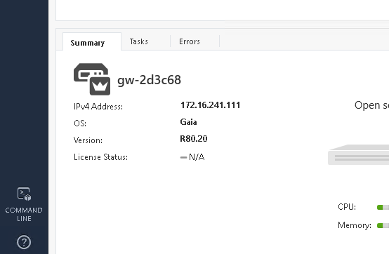

# Exercise 2.1 - Investigation Enrichment

## Step 1.1 - 背景

最後のセクションでは、単一のツールとそれを Ansible でどのように自動化できるかに焦点を当てます。セキュリティ実務者の日常業務では、必要性は一段階高くなります。何か不審なことが起こり、さらに注意を払う必要がある場合、セキュリティ業務では、企業の IT をセキュリティで保護するために多くのツールを展開する必要があります。多くの企業環境では、セキュリティソリューションは互いに統合されておらず、大規模な組織では、異なるチームがITセキュリティの異なる側面を担当しており、共通のプロセスがありません。そのため、多くの場合、手作業や異なるチームの人々の相互作用が発生し、エラーが発生しやすく、何よりも時間がかかります。

Ansible では、最後のセクションで学んだインタラクションを高めるために Ansible を使用して、セキュリティツールを自動化されたワークフローに組み合わせています。

## Step 1.2 - 準備

この演習を正しく動作させるには、playbook `whitelist_attacker.yml` を少なくとも一度は実行しておく必要があります。また、攻撃者のホワイトリストポリシーのロギングも有効にしておく必要があります。両方とも Check Point の演習で行いました。手順を未実施の場合には、Check Point の演習に戻ってplaybookを実行し、手順に従ってロギングを有効にしてからここに戻ってください。

QRadar コレクションも必要です。これは前回の QRadar の演習ですでにインストールされています。その部分を未実施の場合には、コマンドを実行しインストールしてください: `ansible-galaxy collection install ibm.qradar`

追加で、前回の Snort の演習から IDS ルールを修正するためにロールを使用します。未実施の場合には、コマンドを実行しインストールしてください: `ansible-galaxy install ansible_security.ids_rule`

次に、これはセキュリティのラボなので、疑わしいトラフィック、つまり攻撃が必要です。5 秒ごとの簡単なアクセスをシミュレートするplaybookを用意して、この演習の他のコンポーネントが後で反応するようにします。VS Code Online エディタで、ユーザのホームディレクトリに以下の内容のplaybook `web_attack_simulation.yml` を作成してください:

<!--  -->
```yml
---
- name: start attack
  hosts: attacker
  become: yes
  gather_facts: no

  tasks:
    - name: simulate attack every 5 seconds
      shell: "/sbin/daemonize /usr/bin/watch -n 5 curl -m 2 -s http://{{ hostvars['snort']['private_ip2'] }}/web_attack_simulation"
```
<!--  -->

playbookを実行しましょう:

```bash
[student<X>@ansible ansible-files]$ ansible-playbook web_attack_simulation.yml
```

> **Note**
>
> 基本的にこのplaybookでは、5秒ごとにコマンドを実行する時計を実行している小さなデーモンを登録します。これは繰り返しタスクを開始するにはかなり厳しい方法ですが、デモの目的を果たしています。

これで舞台は整いました。このユースケースがどのようなものなのか、お読みください。

## Step 1.3 - 異常を見る

あなたが企業のセキュリティ・アナリストであることを想像してみてください。あなたはアプリケーションに異常があることを知らされました。VS Code Online エディタのターミナルから Snort マシンに SSH してください。Snort サーバの IP アドレスは、`/home/student<X>/lab_inventory/hosts` にあるインベントリファイルから調べることができることを覚えておいてください。

VS Code Online エディタで新しいターミナルを開き、SSH 経由で Snort サーバに接続します。注意: Snort サーバのログインユーザとして、`ec2-user` を使用する必要があります！ ログイン後、異常ログのエントリを grep してください:

```bash
[student<X>@ansible ~]$ ssh ec2-user@11.22.33.44
Last login: Sun Sep 22 15:38:36 2019 from 35.175.178.231
[ec2-user@ip-172-16-115-120 ~]$ sudo grep web_attack /var/log/httpd/access_log
172.17.78.163 - - [22/Sep/2019:15:56:49 +0000] "GET /web_attack_simulation HTTP/1.1" 200 22 "-" "curl/7.29.0"
...
```

`exit` コマンドを実行するか、`CTRL` + `D` を押すことで Snort サーバからログオフすることができます。

> **Note**
>
> このログエントリは、この演習の最初に開始したデーモンによって5秒ごとに起動されます。

セキュリティアナリストであるあなたは、異常が違反やその他の深刻な原因の兆候であることを知っています。あなたは調査することにしました。今のところ、異常を偽陽性と判断するのに十分な情報を持っていません。そこで、ファイアウォールや IDS など、より多くのデータポイントを収集する必要があります。ファイアウォールや IDS のログを手動で調べるのは、非常に時間がかかります。大規模な組織では、セキュリティアナリストが必要なアクセス権を持っていない場合があり、企業のファイアウォールと IDS の両方を担当するチームに連絡して、それぞれのログを手動で調べて、自分たちで直接異常をチェックして、その結果を返信してもらう必要があります。この作業には数時間から数日かかることもあります。

## Step 1.4 - playbook を作成して新しいログソースを作る

SIEM を使えば、ログを集中的に収集して分析することができます。私たちの場合、SIEM は QRadar です。QRadar には、他のシステムからログを収集し、その中から不審な活動を探す機能があります。では、QRadar ではどのようにしてログを分析するのでしょうか？ログを見る前に、QRadar にログを流す必要があります。まず、ソース(ここではCheck Point と Snort) のログを QRadar に転送するように設定します。次に、これらのシステムをログソースとして QRadar に追加します。

これを手動で行うと、複数のマシンで多くの作業を行う必要があり、これも時間がかかり、セキュリティアナリストが持っていない権限が必要になる場合があります。しかし、Ansible を使用すると、セキュリティ組織は事前に承認された自動化ワークフローを playbook の形で作成することができます。これらのワークフローを一元的に管理し、異なるチーム間で共有することで、ボタンを押すだけでセキュリティワークフローを実現することもできます。これらの playbook を使用すると、セキュリティアナリストである私たちは、エンタープライズファイアウォールと IDS の両方を自動的に設定して、イベントやログを QRadar インスタンスに送信することができ、データを関連付けて疑わしいアプリケーションの処理方法を決定することができます。

> **Note**
>
> それらのログを QRadar に永続的に追加してはどうだろうか。その理由は、多くのログシステムは、消費するログの量によってライセンス/料金が決められており、不要なログをそこに押し込むことで拡張性を持たせているからです。また、あまりにも多くのログが入っていると、データを適切かつタイムリーに分析することが難しくなります。

そこで、まずログソースである Snort と Check Point を設定して QRadar にログを送信し、その後 QRadar にログソースを追加して QRadar が認識できるようにする、そんな playbook を書いてみましょう。

いつものように、playbook には名前と実行するホストが必要です。このワークフローでは異なるマシンで作業しているので、playbook を別の "[plays](https://docs.ansible.com/ansible/latest/user_guide/playbooks_intro.html#playbook-language-example)" に分割します:

> *プレイの目的は、ホストのグループを、ansible がタスクと呼ぶもので表される、明確に定義された役割にマッピングすることです。基本的なレベルでは、タスクは ansible モジュールへの呼び出しにすぎません*

つまり、1つのplaybookの中に "host" セクションが複数回登場し、各セクションには専用のタスクリストが用意されています。

Snort の設定から始めましょう。QRadar サーバにログを送信するために Snort のログサーバが必要です。これは既存のロール [ids_config](https://github.com/ansible-security/ids_config) で設定できるので、ロールをインポートして正しいパラメータで使用するだけです。

VS Code Online エディタのターミナルで、`ansible-galaxy` ツールを使用して、単一のコマンドで上記のロールをダウンロードしてインストールします:

```bash
[student<X>@ansible ~]$ ansible-galaxy install ansible_security.ids_config
- downloading role 'ids_config', owned by ansible_security
- downloading role from https://github.com/ansible-security/ids_config/archive/master.tar.gz
- extracting ansible_security.ids_config to /home/student<X>/.ansible/roles/ansible_security.ids_config
- ansible_security.ids_config (master) was installed successfully
```

それでは、ロールを使用する playbook を作成してみましょう。VS Code Online エディタで、以下の内容のファイル `enrich_log_sources.yml` を作成します:

<!--  -->
```yaml
---
- name: Configure snort for external logging
  hosts: snort
  become: true
  vars:
    ids_provider: "snort"
    ids_config_provider: "snort"
    ids_config_remote_log: true
    ids_config_remote_log_destination: "{{ hostvars['qradar']['private_ip'] }}"
    ids_config_remote_log_procotol: udp
    ids_install_normalize_logs: false

  tasks:
    - name: import ids_config role
      include_role:
        name: "ansible_security.ids_config"
```
<!--  -->

ご覧のように、前回Snortルールを設定したときと同じように、ロールを再利用して仕事をさせています。QRadar IPを変数で指定し、IDSプロバイダを `snort` に設定し、パッケージを送信するプロトコルを `UDP` に定義します。 

新しいSnortログソースがあることをQRadarに伝えなければなりません。playbook `enrich_log_sources.yml` に以下のプレイを追加してください:

<!--  -->
```yaml
- name: Add Snort log source to QRadar
  hosts: qradar
  collections:
    - ibm.qradar

  tasks:
    - name: Add snort remote logging to QRadar
      qradar_log_source_management:
        name: "Snort rsyslog source - {{ hostvars['snort']['private_ip'] }}"
        type_name: "Snort Open Source IDS"
        state: present
        description: "Snort rsyslog source"
        identifier: "{{ hostvars['snort']['private_ip']|regex_replace('\\.','-')|regex_replace('^(.*)$', 'ip-\\1') }}"
```
<!--  -->

ご覧のように、ここではコレクションが使用されており、実行する唯一のタスクは QRadar のログソースを管理するモジュールを使用しています。正規表現は何をしているのかと聞かれるかもしれませんが、これは Snort が生成した実際の syslog ヘッダーエントリと一致するように IP アドレスを変更しています。そうでなければ、ログは QRadar として正しく識別されません。

次に、チェックポイントについても同じことをしなければなりません。これは、既に存在する [log_manager](https://github.com/ansible-security/log_manager) というロールで設定できるので、ロールをインポートして、適切なパラメータで使用するだけです。まず、ロールをインポートしましょう:

```bash
[student<X>@ansible ~]$ ansible-galaxy install ansible_security.log_manager
- downloading role 'log_manager', owned by ansible_security
- downloading role from https://github.com/ansible-security/log_manager/archive/master.tar.gz
- extracting ansible_security.log_manager to /home/student<X>/.ansible/roles/ansible_security.log_manager
- ansible_security.log_manager (master) was installed successfully
```

既存の playbook `enrich_log_sources.yml` を再度追加して、Snort と QRadar を統合し、Check Point のセクションを追加します:

<!--  -->
```yaml
- name: Configure Check Point to send logs to QRadar
  hosts: checkpoint

  tasks:
    - include_role:
        name: ansible_security.log_manager
        tasks_from: forward_logs_to_syslog
      vars:
        syslog_server: "{{ hostvars['qradar']['private_ip'] }}"
        checkpoint_server_name: "YOURSERVERNAME"
        firewall_provider: checkpoint
```
<!--  -->

このスニペットでは、`YOURSERVERNAME` を Check Point 管理インスタンスの実際のサーバ名（`gw-77f3f6` など）に置き換える必要があることに注意してください。個々の Check Point インスタンスの名前は、SmartConsole にログインすることで確認できます。画面下部の **Summary** の下にある **GATEWAYS & SERVERS** タブに表示されます:



playbook の文字列 `YOURSERVERNAME` をあなたの個人名に置き換えてください。

> **Note**
>
> これは2つの API コールで自動的に行うこともできますが、ここでは playbook のリストを複雑にしてしまいます。

ここで、もう一つのログソースがあることを QRadar に伝えなければなりません。playbook `enrich_log_sources.yml` に以下のプレイを追加します:

<!--  -->
```yaml
- name: Add Check Point log source to QRadar
  hosts: qradar
  collections:
    - ibm.qradar

  tasks:
    - name: Add Check Point remote logging to QRadar
      qradar_log_source_management:
        name: "Check Point source - {{ hostvars['checkpoint']['private_ip'] }}"
        type_name: "Check Point FireWall-1"
        state: present
        description: "Check Point log source"
        identifier: "{{ hostvars['checkpoint']['private_ip'] }}"

    - name: deploy the new log source
      qradar_deploy:
        type: INCREMENTAL
      failed_when: false
```
<!--  -->

前回の QRadar プレイと比較して、今回は追加タスクが追加されていることに注意してください: `新しいログソースの展開`。これは、QRadar の変更がスプールされ、追加のリクエストがあった場合にのみ適用されるという事実に起因します。エラーは REST API のタイムアウトによって発生する可能性がありますが、API コールの実際の機能には影響しませんので、無視しています。

これらをすべてまとめれば、完全な playbook `enrich_log_sources.yml` は以下のようになります:

<!--  -->
```yaml
---
- name: Configure snort for external logging
  hosts: snort
  become: true
  vars:
    ids_provider: "snort"
    ids_config_provider: "snort"
    ids_config_remote_log: true
    ids_config_remote_log_destination: "{{ hostvars['qradar']['private_ip'] }}"
    ids_config_remote_log_procotol: udp
    ids_install_normalize_logs: false

  tasks:
    - name: import ids_config role
      include_role:
        name: "ansible_security.ids_config"

- name: Add Snort log source to QRadar
  hosts: qradar
  collections:
    - ibm.qradar

  tasks:
    - name: Add snort remote logging to QRadar
      qradar_log_source_management:
        name: "Snort rsyslog source - {{ hostvars['snort']['private_ip'] }}"
        type_name: "Snort Open Source IDS"
        state: present
        description: "Snort rsyslog source"
        identifier: "{{ hostvars['snort']['private_ip']|regex_replace('\\.','-')|regex_replace('^(.*)$', 'ip-\\1') }}"

- name: Configure Check Point to send logs to QRadar
  hosts: checkpoint

  tasks:
    - include_role:
        name: ansible_security.log_manager
        tasks_from: forward_logs_to_syslog
      vars:
        syslog_server: "{{ hostvars['qradar']['private_ip'] }}"
        checkpoint_server_name: "YOURSERVERNAME"
        firewall_provider: checkpoint

- name: Add Check Point log source to QRadar
  hosts: qradar
  collections:
    - ibm.qradar

  tasks:
    - name: Add Check Point remote logging to QRadar
      qradar_log_source_management:
        name: "Check Point source - {{ hostvars['checkpoint']['private_ip'] }}"
        type_name: "Check Point FireWall-1"
        state: present
        description: "Check Point log source"
        identifier: "{{ hostvars['checkpoint']['private_ip'] }}"

    - name: deploy the new log sources
      qradar_deploy:
        type: INCREMENTAL
      failed_when: false
```
<!--  -->

> **Note**
>
> 値 `YOURSERVERNAME` は、上で述べたように実際のサーバ名に置き換えることを忘れないでください。

## Step 1.5 - playbook を実行してログ転送を有効にします

playbook を実行して、両方のログソースを QRadar に追加します:

```bash
[student<X>@ansible ~]$ ansible-playbook enrich_log_sources.yml
```

Check Point Smart Console では、左下隅に進捗状況を知らせる小さなウィンドウがポップアップ表示されることがあります。これが10%で止まっている場合は、通常は無視しても問題ありませんが、ログ・エクスポータが動作します。

## Step 1.6 - ログソースの構成を確認する

Ansible playbook が起動される前は、QRadar は Snort や Check Point からデータを受信していませんでした。直後、セキュリティアナリストである私たちが何も介入することなく、Check Point のログが QRadar のログ概要に表示され始めました。

QRadar の Web UI にログインします。**Log Activity** をクリックしてください。ご覧のように、常にたくさんのログが入ってきます:


これらのログの多くは、実際には QRadar 内部のログです。概要を確認するには、ログリストの上の中央にある **Display** の隣にあるドロップダウンメニューをクリックします。エントリを **Raw Events** に変更します。次に、その上のメニューバーで、緑色の漏斗のシンボルと **Add Filter** というテキストのあるボタンをクリックします。パラメータ**として、**Log Source [Indexed]**を選択し、**Operator**として、**Equals any of**を選択します。次に、ログソースのリストから **チェックポイントソース** を選択し、右側の小さなプラスボタンをクリックします。Snort rsyslogソース**についても同様にして、**Add Filter**ボタンを押します:


これでログの一覧が分析しやすくなりました。イベントがチェックポイントから QRadar に送信されていることを確認します。QRadarが新しいログソースを完全に適用するのに数秒かかることがあります。新しいログソースが完全に設定されるまでは、受信ログには **SIM GENERIC LOG DSM-7** という未知のログ用の「デフォルト」ログソースがあります。このデフォルトのログソースからのログが表示された場合は、1～2分待ちます。その待ち時間の後、新しいログソースの設定が適切に適用され、QRadarはログを正しいログソースに属性化します、ここでチェックポイント。

また、**表示**を**実時間**から**直近5分**などに変更すると、個々のイベントをクリックして、ファイアウォールが送信するデータの詳細を確認することもできます。

QRadarでもログソースが正しく表示されることを確認してみましょう。QRadarのUIで、左上隅の「ハンバーガーボタン」（横棒3本）をクリックし、下の方にある「**Admin**」をクリックします。その中で、**ログソース**をクリックします。新しいウィンドウが開き、新しいログソースが表示されます。


Check Point では、ログ・ソースが実際に設定されているかどうかを確認する最も簡単な方法は、コマンド・ラインを使用して確認することです。VS Code オンライン・エディタのターミナルから、SSH を使用して Check Point 管理サーバの IP アドレスにユーザ admin でログインし、以下の `ls` コマンドを発行します:

```bash
[student<X>@ansible ~]$ ssh admin@11.33.44.55
[Expert@gw-77f3f6:0]# ls -l /opt/CPrt-R80/log_exporter/targets
total 0
drwxr-xr-x 6 admin root 168 Sep 16 11:23 syslog-22.33.44.55
```

セントラル・ログ・サーバは、チェック・ポイントの内部ログ・エキスポータ・ツールを使用して構成されていることがわかります。チェック・ポイント・サーバを終了し、コントロール・ホストに戻ります。

また、バックグラウンドでの Snort の設定が成功したことを確認してみましょう。VS Code オンラインエディタのターミナルから、ユーザ `ec2-user` として SSH 経由で Snort インスタンスにログインします。root になって rsyslog 転送設定を確認します:

```bash
[student<X>@ansible ~]$ ssh ec2-user@22.33.44.55
Last login: Wed Sep 11 15:45:00 2019 from 11.22.33.44
[ec2-user@ip-172-16-11-222 ~]$ sudo -i
[root@ip-172-16-11-222 ~]# cat /etc/rsyslog.d/ids_confg_snort_rsyslog.conf
$ModLoad imfile
$InputFileName /var/log/snort/merged.log
$InputFileTag ids-config-snort-alert
$InputFileStateFile stat-ids-config-snort-alert
$InputFileSeverity alert
$InputFileFacility local3
$InputRunFileMonitor
local3.* @44.55.66.77:514
```

Snortサーバーを再び離れ、コントロールホストに戻ってきてください。

今のところSnortからQRadarにログが送られていないことに注意してください。Snortはこのトラフィックが注目すべきものであることをまだ知りません。

しかし、セキュリティアナリストとして、より多くのデータを自由に使えるようになったことで、アプリケーションの動作の異常の原因が何であるのか、最終的にはより良い考えが見えてきました。ファイアウォールからのログを見て、誰が誰にトラフィックを送っているのかを確認しますが、イベントを偽陽性として却下するにはまだ十分なデータがありません。

## Step 1.7 - Add Snort signature

この異常が偽陽性かどうかを判断するには、セキュリティ・アナリストとして潜在的な攻撃を除外する必要があります。このようなトラフィックが再び検出された場合に警告ログを取得するために、IDS に新しいシグネチャを実装することを決定します。

典型的な状況では、新しいルールを実装するには、Snortを担当するセキュリティオペレータとの別のやりとりが必要になります。しかし、幸いなことに、私たちは再びAnsibleのplaybookを使用して、数時間や数日ではなく、数秒で同じ目標を達成することができるようになりました。

前回の Snort の演習では、すでに署名付きの Snort ルールを追加して、より多くの情報を取得したので、playbookを再利用して、ルールデータを変更するだけです。VS Code のオンラインエディタで、ユーザのホームディレクトリに `enrich_snort_rule.yml` というファイルを作成し、以下の内容を記述します:

<!--  -->
```yaml
---
- name: Add Snort rule
  hosts: snort
  become: yes

  vars:
    ids_provider: snort
    protocol: tcp
    source_port: any
    source_ip: any
    dest_port: any
    dest_ip: any

  tasks:
    - name: Add snort web attack rule
      include_role:
        name: "ansible_security.ids_rule"
      vars:
        ids_rule: 'alert {{protocol}} {{source_ip}} {{source_port}} -> {{dest_ip}} {{dest_port}}  (msg:"Attempted Web Attack"; uricontent:"/web_attack_simulation"; classtype:web-application-attack; sid:99000020; priority:1; rev:1;)'
        ids_rules_file: '/etc/snort/rules/local.rules'
        ids_rule_state: present
```
<!--  -->

このプレイでは、TCP のトラフィックを制御したいということを示す変数を Snort に提供します。その後、`ids_rule` ロールの助けを借りて、`web_attack_simulation` 文字列を含む新しいルールを設定します。

playbookを実行してみましょう:

```bash
[student<X>@ansible ~]$ ansible-playbook enrich_snort_rule.yml
```

新しいルールが実際に追加されたことを素早く確認してみましょう。VS Code Online エディタのターミナルから `ec2-user` として Snort サーバに SSH して、カスタムルールのディレクトリを見てみましょう:

```bash
[student<X>@ansible ~]$ ssh ec2-user@11.22.33.44
Last login: Fri Sep 20 15:09:40 2019 from 54.85.79.232
[ec2-user@snort ~]$ sudo grep web_attack /etc/snort/rules/local.rules
alert tcp any any -> any any  (msg:"Attempted Web Attack"; uricontent:"/web_attack_simulation"; classtype:web-application-attack; sid:99000020; priority:1; rev:1;)
```

## Step 1.8 - Offense を特定してクローズする

playbook が実行された後、Offense が表示されれば QRadar で確認できます。そして、確かにその通りです。QRadar の UI にログインして、**Offenses** をクリックして、左側の **All Offenses** にある:


これらの情報が手元にあれば、最終的にこの種の攻撃をすべてチェックすることができ、それらがすべて攻撃者である単一のホストからのみ発生していることを確認することができます。

次のステップは、そのマシンを担当するチームと連絡を取り、その動作について議論することである。デモの目的のために、そのマシンのチームがこの行動が本当に望まれていて、セキュリティ警告は誤検知であるというフィードバックを提供していると仮定する。このようにして、QRadar の違反を却下することができる。

オフェンスビューで、オフェンスをクリックし、上部のメニューで **Action** をクリックし、ドロップダウンメニューで **Close** をクリックします。ウィンドウが表示されますので、追加情報を入力して、最終的に偽陽性としてその違反を閉じることができます。

## Step 1.9 - ロールバック

最後のステップでは、すべての設定変更を調査前の状態にロールバックして、私たちや他のセキュリティアナリストのリソース消費と解析作業の負荷を軽減します。また、攻撃シミュレーションを停止する必要があります。

この `enrich_log_sources.yml` を元に `rollback.yml` という playbook を作成します。主な違いは、QRadar ではログソースの状態を `absent` に設定し、Snort では `ids_config_remote_log` を `false` に設定し、チェックポイントでは `unforward_logs_to_syslog` のタスクを開始することです。

playbook `rollback.yml` には次のような内容が含まれているはずです:

<!--  -->
```yaml
---
- name: Disable external logging in Snort
  hosts: snort
  become: true
  vars:
    ids_provider: "snort"
    ids_config_provider: "snort"
    ids_config_remote_log: false
    ids_config_remote_log_destination: "{{ hostvars['qradar']['private_ip'] }}"
    ids_config_remote_log_procotol: udp
    ids_install_normalize_logs: false

  tasks:
    - name: import ids_config role
      include_role:
        name: "ansible_security.ids_config"

- name: Remove Snort log source from QRadar
  hosts: qradar
  collections:
    - ibm.qradar

  tasks:
    - name: Remove snort remote logging from QRadar
      qradar_log_source_management:
        name: "Snort rsyslog source - {{ hostvars['snort']['private_ip'] }}"
        type_name: "Snort Open Source IDS"
        state: absent
        description: "Snort rsyslog source"
        identifier: "{{ hostvars['snort']['private_ip']|regex_replace('\\.','-')|regex_replace('^(.*)$', 'ip-\\1') }}"

- name: Configure Check Point to not send logs to QRadar
  hosts: checkpoint

  tasks:
    - include_role:
        name: ansible_security.log_manager
        tasks_from: unforward_logs_to_syslog
      vars:
        syslog_server: "{{ hostvars['qradar']['private_ip'] }}"
        checkpoint_server_name: "YOURSERVERNAME"
        firewall_provider: checkpoint

- name: Remove Check Point log source from QRadar
  hosts: qradar
  collections:
    - ibm.qradar

  tasks:
    - name: Remove Check Point remote logging from QRadar
      qradar_log_source_management:
        name: "Check Point source - {{ hostvars['checkpoint']['private_ip'] }}"
        type_name: "Check Point NGFW"
        state: absent
        description: "Check Point log source"
        identifier: "{{ hostvars['checkpoint']['private_ip'] }}"

    - name: deploy the log source changes
      qradar_deploy:
        type: INCREMENTAL
      failed_when: false
```
<!--  -->

> **Note**
>
> ここでも、`YOURSERVERNAME` の値を Check Point インスタンスの実際のサーバ名に置き換えてください。

この playbookは、この演習の中で最も長いものかもしれませんが、構造と内容はすでにお馴染みのものになっているはずです。各タスクには、何が起こっているのかを理解するために、少し時間をかけてみてください。

playbook を実行してログソースを削除します:

```bash
[student<X>@ansible ~]$ ansible-playbook rollback.yml
```

また、攻撃をシミュレートするプロセスを kill する必要があります。このためには、いわゆる Ansible アドホックコマンドを使用します。我々は、それがパイピングをサポートしているので、シェルモジュールを使用しますので、複数のコマンドを一緒にチェーンすることができます。VS Code オンラインエディタのターミナルで、以下のコマンドを実行します:

<!--  -->
```bash
[student1@ansible ~]$ ansible attacker -b -m shell -a "sleep 2;ps -ef | grep -v grep | grep -w /usr/bin/watch | awk '{print $2}'|xargs kill &>/dev/null; sleep 2"
attacker | CHANGED | rc=0 >>
```
<!--  -->

攻撃者**のマシンにエスカレートされた権限で接続し(`-b`)、そこでシェルモジュールを実行します(`-m shell`)。シェルモジュールのパラメータは、シェルコマンドのチェーンです。実行中のすべてのプロセスを出力し、grep がコマンド自体の一部である行を削除します。次に、watchを実行しているすべてのコマンドをフィルタリングし、awkを使ってプロセスIDを取得し、プロセスIDを `kill` に渡す。

もし、`Share connection to ... closed.`というエラーが出たら、心配しないでください: もう一度コマンドを実行してください。

これでエクササイズは終了です。次のエクササイズを続けるために、エクササイズのリストに戻ってください。

----

[こちらをクリックし、Ansible Security Automation Workshop に戻ります](../README.md#section-2---ansible-security-automation-use-cases)
