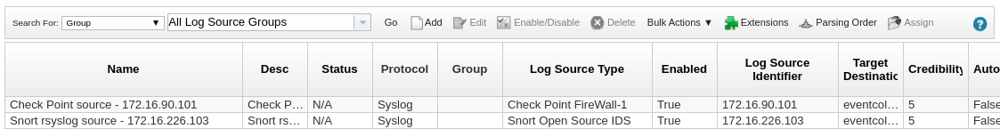

# 演習 2.1 - Investigation Enrichment

**Read this in other languages**: <br>
[ English](README.md),  [ 日本語](README.ja.md), [ Français](README.fr.md).<br>

## Step 1.1 - 背景

前のセクションでは、単一のツールとそれらを Ansible でどのように自動化できるかに焦点を当てました。セキュリティ担当者の日常業務では、必要性は一段階高くなります。何か不審なことが起こり、さらに注意を払う必要がある場合、セキュリティ業務では、企業の IT をセキュリティで保護するために多くのツールを展開する必要があります。多くのエンタープライズ環境では、セキュリティソリューションは互いに統合されておらず、大規模な組織では、異なるチームが共通のプロセスを持たない IT セキュリティの異なる側面を担当しています。そのため、多くの場合、手作業や異なるチームの人々の相互作用が発生し、エラーが発生しやすく、何よりも時間がかかります。

そこに Ansible が登場します。Ansible を使用して、前のセクションで学習した相互作用を高め、セキュリティツールを自動化ワークフローに統合します。

## Step 1.2 - 準備

この演習が適切に機能するには、Playbook `whitelist_attacker.yml` を少なくとも一度は実行しておく必要があります。また、攻撃者のホワイトリストポリシーのロギングも有効にしておく必要があります。両方とも Check Point の演習で行いました。手順を未実施の場合には、Check Point の演習に戻って Playbook を実行し、手順に従ってロギングを有効にしてからここに戻ってください。

また、QRadar コレクションも必要です。これは前の QRadar の演習で既にインストールしています。その部分が未実施の場合には、次のコマンドを実行しインストールしてください: `ansible-galaxy collection install ibm.qradar`

さらに、この Role を使用して、前回の Snort の演習の IDS ルールを変更します。未実施の場合には、次のコマンドを実行しインストールしてください: `ansible-galaxy install ansible_security.ids_rule`

次に、これはセキュリティラボなので、疑わしいトラフィック、つまり攻撃が必要です。この演習の他のコンポーネントが後で反応する5秒ごとの単純なアクセスをシミュレートします。

Tower のインストールには、ユーザー、インベントリ、認証情報などがすでに入力されています。ただし、この演習では、コマンドラインに焦点を当て、物事がどのように機能しているかをよりよく示すことに注意してください。次の演習では、Tower が大きな役割を果たします。したがって、ここでは攻撃を開始するためのインターフェースのみを案内します。次の演習では、Tower の特徴と機能をより深く説明し、なぜそれが Security Automation で重要な役割を果たすのかを説明します。

VS Code オンラインエディターで、以下のコンテンツを含むホームディレクトリの `web_attack_simulation.yml` を開きます。

<!--  -->
```yml
---
- name: start attack
  hosts: attacker
  become: yes
  gather_facts: no

  tasks:
    - name: simulate attack every 5 seconds
      shell: "/sbin/daemonize /usr/bin/watch -n 5 curl -m 2 -s http://{{ hostvars['snort']['private_ip2'] }}/web_attack_simulation"
```
<!--  -->

プレイブックを実行します:

```bash
[student<X>@ansible ansible-files]$ ansible-playbook web_attack_simulation.yml
```

> **Note**
>
> 基本的にこのプレイブックでは、watch を実行する小さなデーモンを登録し、5秒ごとにコマンドを実行します。これは繰り返しのタスクを開始するにはかなり厳しい方法ですが、このラボの目的には合っています。

これでステージは整いました。このユースケースが何であるかを学ぶために読んでください。

## Step 1.3 - 異常を確認する

あなたが企業のセキュリティアナリストであることを想像してみてください。あなたはアプリケーションに異常があることが通知されました。VS Code オンラインエディタのターミナルから Snort サーバに SSH で接続してください。Snort サーバの IP アドレスは、`/home/student<X>/lab_inventory/hosts` にあるインベントリファイルから調べることができます。

VS Code オンラインエディタで新しいターミナルを開き、SSH 経由で Snort サーバに接続します。注: Snort サーバのログインユーザとして、`ec2-user` を使用する必要があります！ログイン後、異常ログのエントリを grep で抽出してください:

```bash
[student<X>@ansible ~]$ ssh ec2-user@11.22.33.44
Last login: Sun Sep 22 15:38:36 2019 from 35.175.178.231
[ec2-user@ip-172-16-115-120 ~]$ sudo grep web_attack /var/log/httpd/access_log
172.17.78.163 - - [22/Sep/2019:15:56:49 +0000] "GET /web_attack_simulation HTTP/1.1" 200 22 "-" "curl/7.29.0"
...
```

`exit` コマンドを実行するか、`CTRL-D` を押すことで Snort サーバからログアウトすることができます。

> **Note**
>
> このログエントリは、この演習の最初に開始したデーモンによって5秒ごとに起動されます。

セキュリティアナリストであるあなたは、異常や違反がその他の深刻な原因の兆候であることを知っています。あなたは調査することにしました。現在のところ、異常を誤検知と判断するのに十分な情報を持っていません。したがって、ファイアウォールや IDS などから、より多くのデータポイントを収集する必要があります。ファイアウォールや IDS のログを手動で調べるには非常に時間がかかります。大規模な組織では、セキュリティアナリストが必要なアクセス権さえ持っていない場合があり、エンタープライズファイアウォールと IDS の両方を担当するチームに連絡して、それぞれのログを手動で調べ、異常を直接確認するよう依頼し、その結果を返信してもらう必要があります。この作業には数時間から数日かかることもあります。

## Step 1.4 - Playbook を作成して新しいログソースを作る

SIEM を使えば、ログを集中的に収集して分析することができます。私たちの場合、SIEM は QRadar です。QRadar には、他のシステムからログを収集し、疑わしいアクティビティーがないかそれらを検索する機能を備えています。では、QRadar ではどのようにしてログを分析するのでしょうか？これらのログを確認する前に、QRadar にログを転送する必要があります。これは2つのステップで行われます。まず、ログを QRadar に転送するようにソース(ここではCheck Point と Snort) を設定する必要があります。次に、これらのシステムをログソースとして QRadar に追加します。

これを手動で行うには、複数のマシンで多くの作業を行う必要があります。これにも時間がかかり、セキュリティアナリストには無い権限が必要になる場合があります。しかし、Ansible を使用すると、セキュリティ組織は事前に承認された自動化ワークフローを Playbook の形で提供することができます。これらのワークフローを一元的に管理し、異なるチーム間で共有することで、ボタンを押すだけでセキュリティワークフローを実現することもできます。これらの Playbook を使用すると、セキュリティアナリストである私たちは、企業のファイアウォールと IDS の両方を自動的に設定して、イベントやログを QRadar インスタンスに送信することができるため、データを関連付け、疑わしいアプリケーションの処理方法を決定できます。

> **Note**
>
> これらのログを QRadar に永続的に追加しないのはなぜですか？その理由は、多くのログシステムは、消費するログの量に応じてライセンス/料金が決められており、不要なログを退避することで拡張性を持たせているからです。また、ログが多すぎると、データを適切かつタイムリーに分析することが難しくなります。

そこで、まずログソース(Snort と Check Point)を設定して QRadar にログを送信し、その後 QRadar にログソースを追加して QRadar が認識できるようにするような Playbook を作成します。

いつものように、Playbook には名前とそれを実行するホストが必要です。このワークフローではさまざまなマシンで作業しているため、Playbook をさまざまな "[plays](https://docs.ansible.com/ansible/latest/user_guide/playbooks_intro.html#playbook-language-example)" に分割します:

> *play の目的は、ホストのグループを明確に定義された役割にマッピングすることです。基本的なレベルでは、task は Ansible モジュールの呼び出しにすぎません。*

つまり、1つの Playbook の中に "host" セクションが複数回登場し、各セクションには専用のタスクリストがあります。

Snort の設定から始めます。QRadar サーバにログを送信するために Snort のログサーバが必要です。これは既存の Role [ids_config](https://github.com/ansible-security/ids_config) で設定できるため、Role をインポートして適切なパラメータで使用するのみです。

VS Code オンラインエディタのターミナルで、`ansible-galaxy` ツールを使用して、上記の Role を1つのコマンドでダウンロードおよびインストールします:

```bash
[student<X>@ansible ~]$ ansible-galaxy install ansible_security.ids_config
- downloading role 'ids_config', owned by ansible_security
- downloading role from https://github.com/ansible-security/ids_config/archive/master.tar.gz
- extracting ansible_security.ids_config to /home/student<X>/.ansible/roles/ansible_security.ids_config
- ansible_security.ids_config (master) was installed successfully
```

それでは、Role を使用する Playbook を作成します。VS Code オンラインエディタで、以下の内容のファイル `enrich_log_sources.yml` を作成します:

<!--  -->
```yaml
---
- name: Configure snort for external logging
  hosts: snort
  become: true
  vars:
    ids_provider: "snort"
    ids_config_provider: "snort"
    ids_config_remote_log: true
    ids_config_remote_log_destination: "{{ hostvars['qradar']['private_ip'] }}"
    ids_config_remote_log_procotol: udp
    ids_install_normalize_logs: false

  tasks:
    - name: import ids_config role
      include_role:
        name: "ansible_security.ids_config"
```
<!--  -->

ご覧のように、前回 Snort ルールを設定したときと同じように、Role を再利用して機能させています。変数を介して Role の動作のみを変更します。変数を介して QRadar IP を提供し、IDSプロバイダを `snort` に設定し、Snort が送信するプロトコルを `UDP` に定義します。

次に新しい Snort ログソースがあることを QRadar に通知する必要があります。Playbook `enrich_log_sources.yml` に以下の play を追加してください:

<!--  -->
```yaml
- name: Add Snort log source to QRadar
  hosts: qradar
  collections:
    - ibm.qradar

  tasks:
    - name: Add snort remote logging to QRadar
      qradar_log_source_management:
        name: "Snort rsyslog source - {{ hostvars['snort']['private_ip'] }}"
        type_name: "Snort Open Source IDS"
        state: present
        description: "Snort rsyslog source"
        identifier: "{{ hostvars['snort']['private_ip']|regex_replace('\\.','-')|regex_replace('^(.*)$', 'ip-\\1') }}"
```
<!--  -->

ご覧のように、ここでは Collection が使用されており、実行する唯一のタスクは QRadar でログソースを管理するモジュールを使用しています。ここで正規表現は何をしているのかと聞かれるかもしれませんが、これは Snort が生成した実際の syslog ヘッダーエントリと一致するように IP アドレスを変更しています。そうしなければ、ログが QRadar によって正しく識別されません。

次に、Check Point についても同じことをしなければなりません。ログを QRadar に転送するように Check Point を設定する必要があります。これは、既存の Role [log_manager](https://github.com/ansible-security/log_manager) で設定できるため、Role をインポートして、適切なパラメータで使用するだけです。まず、Role をインポートします:

```bash
[student<X>@ansible ~]$ ansible-galaxy install ansible_security.log_manager
- downloading role 'log_manager', owned by ansible_security
- downloading role from https://github.com/ansible-security/log_manager/archive/master.tar.gz
- extracting ansible_security.log_manager to /home/student<X>/.ansible/roles/ansible_security.log_manager
- ansible_security.log_manager (master) was installed successfully
```

ここで、Snort と QRadar をまとめた既存の Playbook `enrich_log_sources.yml` を再度編集して、Check Point 用のセクションを追加します:

<!--  -->
```yaml
- name: Configure Check Point to send logs to QRadar
  hosts: checkpoint

  tasks:
    - include_role:
        name: ansible_security.log_manager
        tasks_from: forward_logs_to_syslog
      vars:
        syslog_server: "{{ hostvars['qradar']['private_ip'] }}"
        checkpoint_server_name: "YOURSERVERNAME"
        firewall_provider: checkpoint
```
<!--  -->

このスニペットでは、`YOURSERVERNAME` を Check Point 管理インスタンスの実際のサーバ名（`gw-77f3f6` など）に置き換える必要があることに注意してください。Smart Console にログインすることで、個々の Check Point インスタンスの名前を確認できます。これは画面下部の **Summary** の下にある **GATEWAYS & SERVERS** タブに表示されます:


Playbook の文字列 `YOURSERVERNAME` をあなたの個人名に置き換えてください。

> **Note**
>
> これは2つの API 呼び出しで自動的に行うこともできますが、ここでは Playbook のリストが複雑になります。

次に、別のログソース、今回では Check Point があることを QRadar に通知しなければなりません。Playbook `enrich_log_sources.yml` に以下の play を追加します:

<!--  -->
```yaml
- name: Add Check Point log source to QRadar
  hosts: qradar
  collections:
    - ibm.qradar

  tasks:
    - name: Add Check Point remote logging to QRadar
      qradar_log_source_management:
        name: "Check Point source - {{ hostvars['checkpoint']['private_ip'] }}"
        type_name: "Check Point FireWall-1"
        state: present
        description: "Check Point log source"
        identifier: "{{ hostvars['checkpoint']['private_ip'] }}"

    - name: deploy the new log source
      qradar_deploy:
        type: INCREMENTAL
      failed_when: false
```
<!--  -->

前回の QRadar play と比較して、今回は追加の task が追加されていることに注意してください: `deploy the new log source`。これは、QRadar の変更がスプールされ、追加の要求時にのみ適用されるためです。エラーは REST API のタイムアウトによって発生する可能性がありますが、API 呼び出しの実際の機能には影響しないため無視しています。

これらをすべてまとめれば、完全な Playbook `enrich_log_sources.yml` は以下のようになります:

<!--  -->
```yaml
---
- name: Configure snort for external logging
  hosts: snort
  become: true
  vars:
    ids_provider: "snort"
    ids_config_provider: "snort"
    ids_config_remote_log: true
    ids_config_remote_log_destination: "{{ hostvars['qradar']['private_ip'] }}"
    ids_config_remote_log_procotol: udp
    ids_install_normalize_logs: false

  tasks:
    - name: import ids_config role
      include_role:
        name: "ansible_security.ids_config"

- name: Add Snort log source to QRadar
  hosts: qradar
  collections:
    - ibm.qradar

  tasks:
    - name: Add snort remote logging to QRadar
      qradar_log_source_management:
        name: "Snort rsyslog source - {{ hostvars['snort']['private_ip'] }}"
        type_name: "Snort Open Source IDS"
        state: present
        description: "Snort rsyslog source"
        identifier: "{{ hostvars['snort']['private_ip']|regex_replace('\\.','-')|regex_replace('^(.*)$', 'ip-\\1') }}"

- name: Configure Check Point to send logs to QRadar
  hosts: checkpoint

  tasks:
    - include_role:
        name: ansible_security.log_manager
        tasks_from: forward_logs_to_syslog
      vars:
        syslog_server: "{{ hostvars['qradar']['private_ip'] }}"
        checkpoint_server_name: "YOURSERVERNAME"
        firewall_provider: checkpoint

- name: Add Check Point log source to QRadar
  hosts: qradar
  collections:
    - ibm.qradar

  tasks:
    - name: Add Check Point remote logging to QRadar
      qradar_log_source_management:
        name: "Check Point source - {{ hostvars['checkpoint']['private_ip'] }}"
        type_name: "Check Point FireWall-1"
        state: present
        description: "Check Point log source"
        identifier: "{{ hostvars['checkpoint']['private_ip'] }}"

    - name: deploy the new log sources
      qradar_deploy:
        type: INCREMENTAL
      failed_when: false
```
<!--  -->

> **Note**
>
> 上記のように `YOURSERVERNAME` を実際のサーバ名に置き換えることを忘れないでください。

## Step 1.5 - Playbook を実行してログ転送を有効にする

Playbook を実行して、両方のログソースを QRadar に追加します:

```bash
[student<X>@ansible ~]$ ansible-playbook enrich_log_sources.yml
```

Check Point Smart Console では、左下隅に進捗状況を知らせる小さなウィンドウがポップアップ表示されることがあります。これが10%で止まっている場合は、通常は無視しても問題ありませんが、ログ・エクスポータは動作しています。

## Step 1.6 - ログソースの設定を確認する

Ansible Playbook を実行する前は、QRadar は Snort や Check Point からデータを受信していませんでした。実行後、セキュリティアナリストである私たちが何も介入することなく、Check Point のログが QRadar のログ概要に表示され始めました。

QRadar の Web UI にログインします。**Log Activity** をクリックしてください。ご覧のように、常に大量のログが送信されています。


これらのログの多くは、実際には QRadar の内部のログです。概要をさらに確認するには、ログリストの上の中央にある **Display** の隣にあるドロップダウンメニューをクリックします。エントリを **Raw Events** に変更します。次に、その上のメニューバーで、緑色の漏斗のアイコンの **Add Filter** というボタンをクリックします。**Parameter** は、**Log Source [Indexed]** を選択し、**Operator** には、**Equals any of** を選択します。次に、ログソースのリストから **Check Point source** を選択し、右側の小さなプラスボタンをクリックします。**Snort rsyslog source** についても同様にして、**Add Filter** ボタンを押します:


これでログの一覧が分析しやすくなりました。イベントが Check Point から QRadar に送信されていることを確認します。QRadar が新しいログソースを完全に適用するのに数秒かかることがあります。新しいログソースが完全に設定されるまで、受信ログには **SIM GENERIC LOG DSM-7** という不明なログ用の「デフォルト」ログソースがあります。このデフォルトのログソースからのログが表示された場合は、1～2分待ちます。その待ち時間の後、新しいログソースの設定が適切に適用され、QRadar はログを正しいログソース(ここでは Check Point)に帰属させます。

また、**View** を **Real Time** から **Last 5 Minuts** などに変更し、個々のイベントをクリックして、ファイアウォールから送信されたデータの詳細を確認することもできます。

QRadar でもログソースが正しく表示されることを確認します。QRadar の UI で、左上隅の「ハンバーガーボタン」（横棒3本）をクリックし、下部にある **Admin** をクリックします。その中で、**Log Source** をクリックします。新しいウィンドウが開き、新しいログソースが表示されます。



Check Point では、ログ・ソースが実際に設定されているかどうかを確認する最も簡単な方法は、コマンドラインを使用して確認することです。VS Code オンラインエディタのターミナルから、SSH を使用して Check Point 管理サーバの IP アドレスにユーザ admin でログインし、以下の `ls` コマンドを実行します:

```bash
[student<X>@ansible ~]$ ssh admin@11.33.44.55
[Expert@gw-77f3f6:0]# ls -l /opt/CPrt-R80/log_exporter/targets
total 0
drwxr-xr-x 6 admin root 168 Sep 16 11:23 syslog-22.33.44.55
```

中央ログサーバは、Check Point の内部ログエクスポーターツールを使用して設定されていることが分かります。Check Point サーバからログアウトし、制御ホストに戻ります。

また、バックグラウンドでの Snort の設定が成功したことを確認してみましょう。VS Code オンラインエディタのターミナルから、ユーザ `ec2-user` として SSH 経由で Snort インスタンスにログインします。root になって rsyslog 転送設定を確認します:

```bash
[student<X>@ansible ~]$ ssh ec2-user@22.33.44.55
Last login: Wed Sep 11 15:45:00 2019 from 11.22.33.44
[ec2-user@ip-172-16-11-222 ~]$ sudo -i
[root@ip-172-16-11-222 ~]# cat /etc/rsyslog.d/ids_confg_snort_rsyslog.conf
$ModLoad imfile
$InputFileName /var/log/snort/merged.log
$InputFileTag ids-config-snort-alert
$InputFileStateFile stat-ids-config-snort-alert
$InputFileSeverity alert
$InputFileFacility local3
$InputRunFileMonitor
local3.* @44.55.66.77:514
```

Snort サーバーを再び離れ、制御ホストに戻ってきてください。

これまでのところ Snort から QRadar へログは送信されていません。Snort はこのトラフィックが注目すべきものであることをまだ知りません。

しかし、セキュリティアナリストとして、より多くのデータを自由に使えるようになったことで、アプリケーションの動作の異常の原因が何であるのか、最終的にはより良い考えが見えてきました。ファイアウォールからのログを確認し、誰が誰にトラフィックを送っているのかを確認しますが、イベントを誤検知として取り除くにはまだ十分なデータがありません。

## Step 1.7 - Snort シグネチャを追加する

この異常が誤検知であるかどうかを判断するには、セキュリティアナリストとして潜在的な攻撃を除外する必要があります。自由に扱えるデータを考慮し、IDS に新しいシグネチャを実装して、そのようなトラフィックが再び検出された場合にアラートログを取得することを決定します。

典型的な状況では、新しいルールを実装するには、Snort を担当するセキュリティオペレータとさらにやりとりが必要になります。しかし、幸いなことに、私たちは再び Ansible Playbook を使用して、数時間や数日ではなく、数秒で同じ目標を達成することができるようになりました。

前回の Snort の演習では、Snort ルールにシグネチャを追加して詳細情報を取得しているため、Playbook を再利用してルールデータを変更するだけです。VS Code オンラインエディタで、ユーザのホームディレクトリに `enrich_snort_rule.yml` という以下の内容のファイルを作成します:

<!--  -->
```yaml
---
- name: Add Snort rule
  hosts: snort
  become: yes

  vars:
    ids_provider: snort
    protocol: tcp
    source_port: any
    source_ip: any
    dest_port: any
    dest_ip: any

  tasks:
    - name: Add snort web attack rule
      include_role:
        name: "ansible_security.ids_rule"
      vars:
        ids_rule: 'alert {{protocol}} {{source_ip}} {{source_port}} -> {{dest_ip}} {{dest_port}}  (msg:"Attempted Web Attack"; uricontent:"/web_attack_simulation"; classtype:web-application-attack; sid:99000020; priority:1; rev:1;)'
        ids_rules_file: '/etc/snort/rules/local.rules'
        ids_rule_state: present
```
<!--  -->

この play では、TCP のトラフィックを制御したいということを示す変数を Snort に提供します。その後、`ids_rule` Role を使用して、`web_attack_simulation` 文字列をコンテンツとして含む新しいルールを設定し、この動作の今後の発生を識別できるようにします。

Playbook を実行します:

```bash
[student<X>@ansible ~]$ ansible-playbook enrich_snort_rule.yml
```

新しいルールが実際に追加されたことを簡単に確認します。VS Code オンラインエディタのターミナルから `ec2-user` ユーザとして Snort サーバに SSH 接続して、カスタムルールのディレクトリを確認します:

```bash
[student<X>@ansible ~]$ ssh ec2-user@11.22.33.44
Last login: Fri Sep 20 15:09:40 2019 from 54.85.79.232
[ec2-user@snort ~]$ sudo grep web_attack /etc/snort/rules/local.rules
alert tcp any any -> any any  (msg:"Attempted Web Attack"; uricontent:"/web_attack_simulation"; classtype:web-application-attack; sid:99000020; priority:1; rev:1;)
```

## Step 1.8 - Offense を特定してクローズする

Playbook が実行された後、違反を識別したら QRadar で確認できます。そして、確かにその通りです。QRadar の UI にログインして、**Offenses** をクリックして、左側の **All Offenses** にあります:


これらの情報が手元にあれば、最終的にこのタイプの攻撃をすべてチェックすることができ、それらすべてが単一のホスト(攻撃者)からのみ発生していることを確認することができます。

次のステップは、そのマシンを担当するチームと連絡を取り、その動作について話し合うことです。デモとしては、そのマシンのチームがこの動作が本当に必要であるというフィードバックを行い、セキュリティアラートは誤検知であると仮定します。したがって、QRadar の違反を却下することができます。

Offence View で、Offence をクリックし、上部のメニューで **Action** をクリックし、ドロップダウンメニューで **Close** をクリックします。ウィンドウがポップアウトし、そこに追加情報を入力して、最終的に誤検知としてその違反を閉じることができます。

## Step 1.9 - ロールバック

最後のステップでは、すべての設定変更を調査前の状態にロールバックして、私たちや他のセキュリティアナリストのリソース消費と分析ワークロードを軽減します。また、攻撃シミュレーションを停止する必要があります。

この `enrich_log_sources.yml` を基に `rollback.yml` という Playbook を作成します。主な違いは、QRadar ではログソースの状態を `absent` に設定し、Snort では `ids_config_remote_log` を `false` に設定し、Check Point では `unforward_logs_to_syslog` のタスクを開始することです。

Playbook `rollback.yml` には次のような内容が含まれている必要があります:

<!--  -->
```yaml
---
- name: Disable external logging in Snort
  hosts: snort
  become: true
  vars:
    ids_provider: "snort"
    ids_config_provider: "snort"
    ids_config_remote_log: false
    ids_config_remote_log_destination: "{{ hostvars['qradar']['private_ip'] }}"
    ids_config_remote_log_procotol: udp
    ids_install_normalize_logs: false

  tasks:
    - name: import ids_config role
      include_role:
        name: "ansible_security.ids_config"

- name: Remove Snort log source from QRadar
  hosts: qradar
  collections:
    - ibm.qradar

  tasks:
    - name: Remove snort remote logging from QRadar
      qradar_log_source_management:
        name: "Snort rsyslog source - {{ hostvars['snort']['private_ip'] }}"
        type_name: "Snort Open Source IDS"
        state: absent
        description: "Snort rsyslog source"
        identifier: "{{ hostvars['snort']['private_ip']|regex_replace('\\.','-')|regex_replace('^(.*)$', 'ip-\\1') }}"

- name: Configure Check Point to not send logs to QRadar
  hosts: checkpoint

  tasks:
    - include_role:
        name: ansible_security.log_manager
        tasks_from: unforward_logs_to_syslog
      vars:
        syslog_server: "{{ hostvars['qradar']['private_ip'] }}"
        checkpoint_server_name: "YOURSERVERNAME"
        firewall_provider: checkpoint

- name: Remove Check Point log source from QRadar
  hosts: qradar
  collections:
    - ibm.qradar

  tasks:
    - name: Remove Check Point remote logging from QRadar
      qradar_log_source_management:
        name: "Check Point source - {{ hostvars['checkpoint']['private_ip'] }}"
        type_name: "Check Point NGFW"
        state: absent
        description: "Check Point log source"
        identifier: "{{ hostvars['checkpoint']['private_ip'] }}"

    - name: deploy the log source changes
      qradar_deploy:
        type: INCREMENTAL
      failed_when: false
```
<!--  -->

> **Note**
>
> ここでも、`YOURSERVERNAME` を実際のサーバ名に置き換えることを忘れないでください。

この Playbook は、この演習の中で最も長いものかもしれませんが、構造と内容はすでにお馴染みのものになっているはずです。少し時間をかけて、各 task が何をしているのかを理解してください。

Playbook を実行しログソースを削除します:

```bash
[student<X>@ansible ~]$ ansible-playbook rollback.yml
```

最後に、攻撃シミュレーションを停止する必要があります。student ユーザーとして Tower にログインします。**Templates** セクションで、**Stop web attack simulation** というジョブテンプレートを見つけて実行します。

これで演習は終了です。次の演習を続けるために、演習のリストに戻ってください。

----

[Ansible Security Automation Workshopの表紙に戻る](../README.ja.md)
