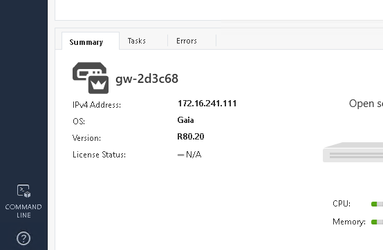
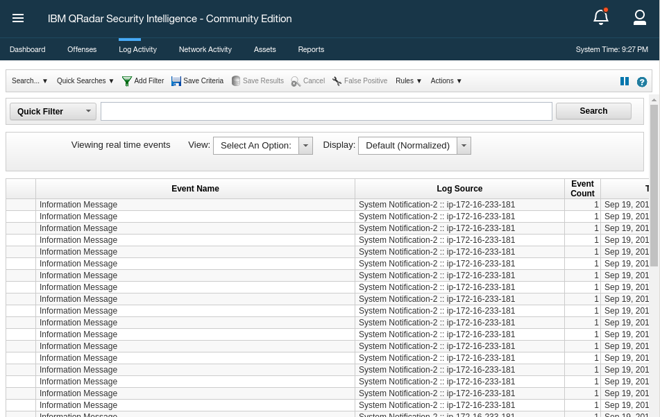
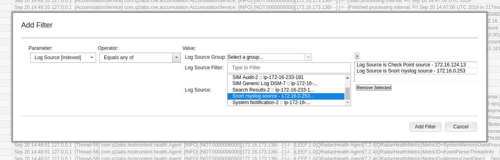
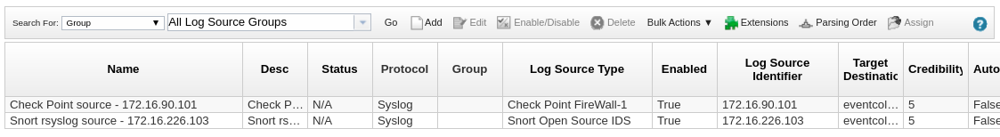
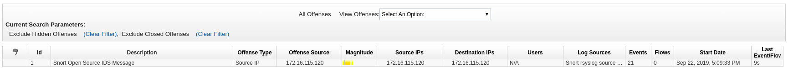

# Exercise 2.1 - Investigation Enrichment

## Step 1.1 - The Background

In the last section the focus was on single tools and how they can be automated with Ansible. In the daily operation of security practitioners the need is one step higher: when something suspicious happens and needs further attention, security operations need to deploy many tools to secure an enterprise IT. In many enterprise environments, security solutions are not integrated with each other and, in large organizations, different teams are in charge of different aspects of IT security, with no processes in common. That often leads to manual work and interaction between people of different teams which is error prone and above all, slow.

In comes Ansible: we use Ansible to elevate the interactions learned in the last section to combine the security tools into automated workflows.

## Step 1.2 - Preparations

For this exercise to work properly, the playbook `whitelist_attacker.yml` must have been run at least once. Also the logging for the attacker whitelist policy must have been activated. Both was done in the Check Point exercise. If you missed the steps, go back there, execute the playbook, follow the steps to activate the logging and come back here.

Also we need the QRadar collection. This was installed already in the previous QRadar exercise. If you missed that part, install them via: `ansible-galaxy collection install ibm.qradar`

Addtionally we will use the role to modify IDS rules from the previous Snort exercise. If you missed that, install them via: `ansible-galaxy install ansible_security.ids_rule`

Next, since this is a security lab, we do need suspicious traffic - an attack. We have a playbook which simulates a simple access every five seconds on which the other components in this exercise will later on react to. In your VS Code online editor, create the playbook `web_attack_simulation.yml` in the user home directory with the following content:

<!--  -->
```yml
---
- name: start attack
  hosts: attacker
  become: yes
  gather_facts: no

  tasks:
    - name: simulate attack every 5 seconds
      shell: "/sbin/daemonize /usr/bin/watch -n 5 curl -m 2 -s http://{{ hostvars['snort']['private_ip2'] }}/web_attack_simulation"
```
<!--  -->

Execute the playbook:

```bash
[student<X>@ansible ansible-files]$ ansible-playbook web_attack_simulation.yml
```

> **Note**
>
> Basically in this playbook we register a small daemon running watch, which will execute a command every 5 seconds. This is a rather harsh way to start a repeating task, but serves the purpose of the demo.

The stage is set now. Read on to learn what this use case is about.

## Step 1.3 - See the anomaly

Imagine you are a security analyst in an enterprise. You were just informed of an anomaly in an application. From within a terminal in your VS Code online editor, ssh to the snort machine. Remember that you can look up the IP of the Snort server from the inventory file at `/home/student<X>/lab_inventory/hosts`.

Open a new terminal in your VS Code online editor to connect to the Snort server via SSH. Note: As the login user for the Snort server, you need to use `ec2-user`! After login, grep for the anomaly log entry:

```bash
[student<X>@ansible ~]$ ssh ec2-user@11.22.33.44
Last login: Sun Sep 22 15:38:36 2019 from 35.175.178.231
[ec2-user@ip-172-16-115-120 ~]$ sudo grep web_attack /var/log/httpd/access_log
172.17.78.163 - - [22/Sep/2019:15:56:49 +0000] "GET /web_attack_simulation HTTP/1.1" 200 22 "-" "curl/7.29.0"
...
```

You can log off from the Snort server by executing the command `exit` or pressing `CTRL` and `D`.

> **Note**
>
> You might have guessed already: this log entry is triggered every five seconds by the daemon we started at the beginning of this exercise.

As a security analyst you know that anomalies can be the sign of a breach or other serious causes. You decide to investigate. Right now, you do not have enough information about the anomaly to dismiss it as a false positive. So you need to collect more data points - like from the firewall and the IDS. Going through the logs of the firewall and IDS manually takes a lot of time. In large organizations, the security analyst might not even have the necessary access rights and needs to contact the teams that each are responsible for both the enterprise firewall and the IDS, asking them to manually go through the respective logs and directly check for anomalies on their own and then reply with the results. This operation could take hours or even days.

## Step 1.4 - Write playbook to create new log sources

If you use a SIEM, things are better: you can collect and analyze logs centrally. In our case the SIEM is QRadar. QRadar has the ability to collect logs from other systems and look in them for suspicious activities. So how do we analyze logs in QRadar? Before we can look at those logs we need to stream those into QRadar. This happens in two steps: first we need to configure the sources - here Check Point and Snort - to forward their logs to QRadar. And second we have to add those systems as log sources to QRadar.

Doing this manually requires a lot of work on multiple machines, which again takes time and might require privileges a security analyst does not have. But Ansible allows security organizations to create pre-approved automation workflows in the form of playbooks. Those can even be maintained centrally and shared across different teams to enable security workflows at the press of a button. With these Playbooks, we as the security analyst can automatically configure both the enterprise firewall and the IDS to send their events/logs to the QRadar instance, so that we can correlate the data and decide how to proceed with the suspect application.

> **Note**
>
> Why don't we add those logs to QRadar permanently? The reason is that many log systems are licensed/paid by the amount of logs they consume, making it expansive pushing non-necessary logs in there. Also, if too many logs are in there it becomes harder to analyse the data properly and in a timely manner.

So let's write such a playbook which first configures the log sources - Snort and Check Point - to send the logs to QRadar, and afterwards add those log sources to QRadar so that it is aware of them.

As usual, the playbook needs a name and the hosts it should be executed on. Since we are working on different machines in this workflow, we will separate the playbook into different "[plays](https://docs.ansible.com/ansible/latest/user_guide/playbooks_intro.html#playbook-language-example)":

> *The goal of a play is to map a group of hosts to some well defined roles, represented by things ansible calls tasks. At a basic level, a task is nothing more than a call to an ansible module.*

This means that the "host" section will appear multiple times in one playbook, and each section has a dedicated task list.

Let's start with the Snort configuration. We need Snort's log server to send the logs to the QRadar server. This can be configured with an already existing role, [ids_config](https://github.com/ansible-security/ids_config), so all we have to do is to import the role and use it with the right parameters.

In a terminal of your VS Code online editor, use the `ansible-galaxy` tool to download and install the above mentioned role with a single command:

```bash
[student<X>@ansible ~]$ ansible-galaxy install ansible_security.ids_config
- downloading role 'ids_config', owned by ansible_security
- downloading role from https://github.com/ansible-security/ids_config/archive/master.tar.gz
- extracting ansible_security.ids_config to /home/student<X>/.ansible/roles/ansible_security.ids_config
- ansible_security.ids_config (master) was installed successfully
```

So let's create our playbook where we use the role. In your VS Code online editor, create the file `enrich_log_sources.yml` with the following content:

<!--  -->
```yaml
---
- name: Configure snort for external logging
  hosts: snort
  become: true
  vars:
    ids_provider: "snort"
    ids_config_provider: "snort"
    ids_config_remote_log: true
    ids_config_remote_log_destination: "{{ hostvars['qradar']['private_ip'] }}"
    ids_config_remote_log_procotol: udp
    ids_install_normalize_logs: false

  tasks:
    - name: import ids_config role
      include_role:
        name: "ansible_security.ids_config"
```
<!--  -->

As you see, just like with the last time we configured Snort rules, we are re-using the role and let it do the work. We only change the behaviour of the role via the parameters: we provide the QRadar IP via variable, set the IDS provider to `snort` and define the protocol in which packages are sent as `UDP` 

Now we have to tell QRadar that there is this new Snort log source. Add the following play to the playbook `enrich_log_sources.yml`:

<!--  -->
```yaml
- name: Add Snort log source to QRadar
  hosts: qradar
  collections:
    - ibm.qradar

  tasks:
    - name: Add snort remote logging to QRadar
      qradar_log_source_management:
        name: "Snort rsyslog source - {{ hostvars['snort']['private_ip'] }}"
        type_name: "Snort Open Source IDS"
        state: present
        description: "Snort rsyslog source"
        identifier: "{{ hostvars['snort']['private_ip']|regex_replace('\\.','-')|regex_replace('^(.*)$', 'ip-\\1') }}"
```
<!--  -->

As you can see the collections are used here, and the only task we execute uses a module to manage log sources in QRadar. You might ask what the regex is doing in there: it changes the IP address to match the actual syslog header entry produced by Snort. Otherwise, the logs would not be properly identified as QRadar.

Now we have to do the same for Check Point: we need to configure Check Point that it should forward its logs to QRadar. This can be configured with an already existing role, [log_manager](https://github.com/ansible-security/log_manager), so all we have to do is to import the role and use it with the right parameters. First, let's import the role:

```bash
[student<X>@ansible ~]$ ansible-galaxy install ansible_security.log_manager
- downloading role 'log_manager', owned by ansible_security
- downloading role from https://github.com/ansible-security/log_manager/archive/master.tar.gz
- extracting ansible_security.log_manager to /home/student<X>/.ansible/roles/ansible_security.log_manager
- ansible_security.log_manager (master) was installed successfully
```

Now add again the existing playbook `enrich_log_sources.yml` where we already broought together Snort and QRadar, and add another section for Check Point:

<!--  -->
```yaml
- name: Configure Check Point to send logs to QRadar
  hosts: checkpoint

  tasks:
    - include_role:
        name: ansible_security.log_manager
        tasks_from: forward_logs_to_syslog
      vars:
        syslog_server: "{{ hostvars['qradar']['private_ip'] }}"
        checkpoint_server_name: "YOURSERVERNAME"
        firewall_provider: checkpoint
```
<!--  -->

Note that in this snippet you have to replace `YOURSERVERNAME` with the actual server name from your Check Point management instance, like `gw-77f3f6`. You can find the name of your individual Check Point instance by logging into your SmartConsole. It is shown in the **GATEWAYS & SERVERS** tab in the lower part of the screen underneath **Summary**:



Replace the string `YOURSERVERNAME` in the playbook with your indididual name.

> **Note**
>
> This could also be done automatically with two API calls, but it would complicate the playbook listing here.

Now we have to tell QRadar that there is another log source, this time Check Point. Add the following play to the playbook `enrich_log_sources.yml`:

<!--  -->
```yaml
- name: Add Check Point log source to QRadar
  hosts: qradar
  collections:
    - ibm.qradar

  tasks:
    - name: Add Check Point remote logging to QRadar
      qradar_log_source_management:
        name: "Check Point source - {{ hostvars['checkpoint']['private_ip'] }}"
        type_name: "Check Point FireWall-1"
        state: present
        description: "Check Point log source"
        identifier: "{{ hostvars['checkpoint']['private_ip'] }}"

    - name: deploy the new log source
      qradar_deploy:
        type: INCREMENTAL
      failed_when: false
```
<!--  -->

Note that compared to the last QRadar play, this time an additional task is added: `deploy the new log source`. This is due to the fact that QRadar changes are spooled, and only applied upon an extra request. We ignore errors because they might happen due to timeouts in the REST API which do not inflict the actual function of the API call.

If you bring all these pieces together, the full playbook `enrich_log_sources.yml` is:

<!--  -->
```yaml
---
- name: Configure snort for external logging
  hosts: snort
  become: true
  vars:
    ids_provider: "snort"
    ids_config_provider: "snort"
    ids_config_remote_log: true
    ids_config_remote_log_destination: "{{ hostvars['qradar']['private_ip'] }}"
    ids_config_remote_log_procotol: udp
    ids_install_normalize_logs: false

  tasks:
    - name: import ids_config role
      include_role:
        name: "ansible_security.ids_config"

- name: Add Snort log source to QRadar
  hosts: qradar
  collections:
    - ibm.qradar

  tasks:
    - name: Add snort remote logging to QRadar
      qradar_log_source_management:
        name: "Snort rsyslog source - {{ hostvars['snort']['private_ip'] }}"
        type_name: "Snort Open Source IDS"
        state: present
        description: "Snort rsyslog source"
        identifier: "{{ hostvars['snort']['private_ip']|regex_replace('\\.','-')|regex_replace('^(.*)$', 'ip-\\1') }}"

- name: Configure Check Point to send logs to QRadar
  hosts: checkpoint

  tasks:
    - include_role:
        name: ansible_security.log_manager
        tasks_from: forward_logs_to_syslog
      vars:
        syslog_server: "{{ hostvars['qradar']['private_ip'] }}"
        checkpoint_server_name: "YOURSERVERNAME"
        firewall_provider: checkpoint

- name: Add Check Point log source to QRadar
  hosts: qradar
  collections:
    - ibm.qradar

  tasks:
    - name: Add Check Point remote logging to QRadar
      qradar_log_source_management:
        name: "Check Point source - {{ hostvars['checkpoint']['private_ip'] }}"
        type_name: "Check Point FireWall-1"
        state: present
        description: "Check Point log source"
        identifier: "{{ hostvars['checkpoint']['private_ip'] }}"

    - name: deploy the new log sources
      qradar_deploy:
        type: INCREMENTAL
      failed_when: false
```
<!--  -->

> **Note**
>
> Remeber to replace the value `YOURSERVERNAME` with your actual server name as mentioned further above.

## Step 1.5 - Run playbooks to enable log forwarding

Run the full playbook to add both log sources to QRadar:

```bash
[student<X>@ansible ~]$ ansible-playbook enrich_log_sources.yml
```

In Check Point SmartConsole you might even see a little window pop up in the bottom left corner informing you about the progress. If that gets stuck at 10% you can usually safely ignore it, the log exporter works anyway.

## Step 1.6 - Verify the log source configuration

Before that Ansible playbook was invoked, QRadar wasn’t receiving any data from Snort or Check Point. Immediately after, without any further intervention by us as security analyst, Check Point logs start to appear in the QRadar log overview.

Log onto the QRadar web UI. Click on **Log Activity**. As you will see, there are a lot of logs coming in all the time:



Many of those logs are in fact internal QRadar logs. To get a better overview, click on the drop down menu next to **Display** in the middle above the log list. Change the entry to **Raw Events**. Next, in the menu bar above that, click onto the button with the green funnel symbol and the text **Add Filter**. As **Parameter**, pick **Log Source [Indexed]**, as **Operator**, pick **Equals any of**. Then, from the list of log sources, pick **Check Point source** and click onto the small plus button on the right. Do the same for **Snort rsyslog source**, and press the button **Add Filter**:



Now the list of logs is better to analyze. Verify that events are making it to QRadar from Check Point. Sometimes QRadar needs a few seconds to fully apply the new log sources. Until the new log sources are fully configured, incoming logs will have a "default" log source for unknown logs, called **SIM GENERIC LOG DSM-7**. If you see logs from this default log source, wait a minute or two. After that waiting time, the new log source configuration is properly applied and QRadar will attribute the logs to the right log source, here Check Point.

Also, if you change the **View** from **Real Time** to for example **Last 5 Minutes** you can even click on individual events to see more details of the data the firewall sends you.

Let's verify that QRadar also properly shows the log source. In the QRadar UI, click on the "hamburger button" (three horizontal bars) in the left upper corner, and click on **Admin** down at the bottom. In there, click on **Log Sources**. A new window opens and shows the new log sources.



In Check Point the easiest way to verify that the log source is set is indeed via command line. From the terminal of your VS Code online editor, use SSH to log into the Check Point management server IP with the user admin and issue the following `ls` comand:

```bash
[student<X>@ansible ~]$ ssh admin@11.33.44.55
[Expert@gw-77f3f6:0]# ls -l /opt/CPrt-R80/log_exporter/targets
total 0
drwxr-xr-x 6 admin root 168 Sep 16 11:23 syslog-22.33.44.55
```

As you can see the central log server was configured via Check Point's internal log exporter tool. Leave the Check Point server and go back to your control host.

Let's also verify that the Snort configuration in the background was successful. From the terminal of your VS Code online editor, log onto your Snort instance via SSH as the user `ec2-user`. Become root and verify the rsyslog forwarding configuration:

```bash
[student<X>@ansible ~]$ ssh ec2-user@22.33.44.55
Last login: Wed Sep 11 15:45:00 2019 from 11.22.33.44
[ec2-user@ip-172-16-11-222 ~]$ sudo -i
[root@ip-172-16-11-222 ~]# cat /etc/rsyslog.d/ids_confg_snort_rsyslog.conf
$ModLoad imfile
$InputFileName /var/log/snort/merged.log
$InputFileTag ids-config-snort-alert
$InputFileStateFile stat-ids-config-snort-alert
$InputFileSeverity alert
$InputFileFacility local3
$InputRunFileMonitor
local3.* @44.55.66.77:514
```

Leave the Snort server again and come back to your control host.

Note that so far no logs are sent from Snort to QRadar: Snort does not know yet that this traffic is noteworthy!

But as a security analyst, with more data at our disposal, we finally have a better idea of what could be the cause of the anomaly in the application behaviour. We see the logs from the firewall, see who is send traffic to whom, but still not enough data to dismiss the event as a false positive.

## Step 1.7 - Add Snort signature

To decide if this anomaly is a false positive, as a security analyst you need to exclude any potential attack. Given the data at your disposal you decide to implement a new signature on the IDS to get alert logs if such traffic is deteced again.

In a typical situation, implementing a new rule would require another interaction with the security operators in charge of Snort. But luckily we can again use an Ansible Playbook to achieve the same goal in seconds rather than hours or days.

In the previous Snort exercise we already added a Snort rule with a signature to get more information, so we can reuse the playbook and only change the rule data. In your VS Code online editor, create a file called `enrich_snort_rule.yml` in your users' home directory with the following content:

<!--  -->
```yaml
---
- name: Add Snort rule
  hosts: snort
  become: yes

  vars:
    ids_provider: snort
    protocol: tcp
    source_port: any
    source_ip: any
    dest_port: any
    dest_ip: any

  tasks:
    - name: Add snort web attack rule
      include_role:
        name: "ansible_security.ids_rule"
      vars:
        ids_rule: 'alert {{protocol}} {{source_ip}} {{source_port}} -> {{dest_ip}} {{dest_port}}  (msg:"Attempted Web Attack"; uricontent:"/web_attack_simulation"; classtype:web-application-attack; sid:99000020; priority:1; rev:1;)'
        ids_rules_file: '/etc/snort/rules/local.rules'
        ids_rule_state: present
```
<!--  -->

In this play we provide some variables for Snort stating that we want to control any traffic on tcp. Afterwards, with the help of the `ids_rule` role we set a new rule containing the `web_attack_simulation` string as content, making it possible to identify future occurences of this behaviour.

Now execute the playbook:

```bash
[student<X>@ansible ~]$ ansible-playbook enrich_snort_rule.yml
```

Let's quickly verify that the new rule was indeed added. From the terminal of your VS Code online editor, ssh to the Snort server as `ec2-user` and have a look into the directory of custom rules:

```bash
[student<X>@ansible ~]$ ssh ec2-user@11.22.33.44
Last login: Fri Sep 20 15:09:40 2019 from 54.85.79.232
[ec2-user@snort ~]$ sudo grep web_attack /etc/snort/rules/local.rules
alert tcp any any -> any any  (msg:"Attempted Web Attack"; uricontent:"/web_attack_simulation"; classtype:web-application-attack; sid:99000020; priority:1; rev:1;)
```

## Step 1.8 - Identify and close the Offense

Moments after the playbook has been executed, we can check in QRadar if we see Offenses. And indeed, that is the case. Log into your QRadar UI, click on **Offenses**, and there on the left side on **All Offenses**:



With these information at our hand, we can now finally check all offenses of this type, and verify that they are all coming only from one single host, the attacker.

The next step would be to get in touch with the team responsible for that machine, and discuss the behaviour. For the purpose of the demo we assume that the team of that machine provides feedback that this behaviour is indeed wanted, and that the security alert is a false positive. Thus we can dismiss the QRadar offense.

In the Offense view, click on the Offense, then in the menu on top on **Actions**, In the drop-down menu-click on **close**. A window will pop up where you can enter additional information and finally close the offense as a false positive.

## Step 1.9 - Rollback

In the final step, we will rollback all the configuraiton changes to their pre-investigation state, reducing resource consumption and the analysis workload for us and our fellow security analysts. Also we need to stop the attack simulation.

We create a new playbook, `rollback.yml`, based on the `enrich_log_sources.yml`. The major differences are that for QRadar we set the state of the log sources to `absent`, for Snort we set `ids_config_remote_log` to `false`, and for Check Point we initiate the tasks for `unforward_logs_to_syslog`.

The playbook `rollback.yml` should have this content:

<!--  -->
```yaml
---
- name: Disable external logging in Snort
  hosts: snort
  become: true
  vars:
    ids_provider: "snort"
    ids_config_provider: "snort"
    ids_config_remote_log: false
    ids_config_remote_log_destination: "{{ hostvars['qradar']['private_ip'] }}"
    ids_config_remote_log_procotol: udp
    ids_install_normalize_logs: false

  tasks:
    - name: import ids_config role
      include_role:
        name: "ansible_security.ids_config"

- name: Remove Snort log source from QRadar
  hosts: qradar
  collections:
    - ibm.qradar

  tasks:
    - name: Remove snort remote logging from QRadar
      qradar_log_source_management:
        name: "Snort rsyslog source - {{ hostvars['snort']['private_ip'] }}"
        type_name: "Snort Open Source IDS"
        state: absent
        description: "Snort rsyslog source"
        identifier: "{{ hostvars['snort']['private_ip']|regex_replace('\\.','-')|regex_replace('^(.*)$', 'ip-\\1') }}"

- name: Configure Check Point to not send logs to QRadar
  hosts: checkpoint

  tasks:
    - include_role:
        name: ansible_security.log_manager
        tasks_from: unforward_logs_to_syslog
      vars:
        syslog_server: "{{ hostvars['qradar']['private_ip'] }}"
        checkpoint_server_name: "YOURSERVERNAME"
        firewall_provider: checkpoint

- name: Remove Check Point log source from QRadar
  hosts: qradar
  collections:
    - ibm.qradar

  tasks:
    - name: Remove Check Point remote logging from QRadar
      qradar_log_source_management:
        name: "Check Point source - {{ hostvars['checkpoint']['private_ip'] }}"
        type_name: "Check Point NGFW"
        state: absent
        description: "Check Point log source"
        identifier: "{{ hostvars['checkpoint']['private_ip'] }}"

    - name: deploy the log source changes
      qradar_deploy:
        type: INCREMENTAL
      failed_when: false
```
<!--  -->

> **Note**
>
> Again, remember to replace the value of `YOURSERVERNAME` with the actual server name of your Check Point instance.

While this playbook is maybe the longest you see in these entire exercises, the structure and content should already be familiar to you. Take a second to go through each task to understand what is happening.

Run the playbook to remove the log sources:

```bash
[student<X>@ansible ~]$ ansible-playbook rollback.yml
```

Also, we need to kill the process which simulates the attack. For this we will use a so called Ansible ad-hoc command: a single task executed via Ansible, without the need to write an entire playbook. We will use the shell module because it supports piping, and can thus chain multiple commands together. In a terminal of your VS Code online editor, run the following command:

<!--  -->
```bash
[student1@ansible ~]$ ansible attacker -b -m shell -a "sleep 2;ps -ef | grep -v grep | grep -w /usr/bin/watch | awk '{print $2}'|xargs kill &>/dev/null; sleep 2"
attacker | CHANGED | rc=0 >>
```
<!--  -->

The connects to the **attacker** machine with escalated privileges (`-b`) and runs the shell module there (`-m shell`). The parameter of the shell module is a chain of shell commans. We output all running processes, remove lines where grep is part of the command itself, assuming that those are not of value to us. We then filter for all commands executing watch, use awk to get the process ID and hand the process ID over to `kill`.

If you get an error saying `Share connection to ... closed.`, don't worry: just execute the command again.

You are done with the exercise. Turn back to the list of exercises to continue with the next one.

----

[Click Here to return to the Ansible Security Automation Workshop](../README.md#section-2---ansible-security-automation-use-cases)
