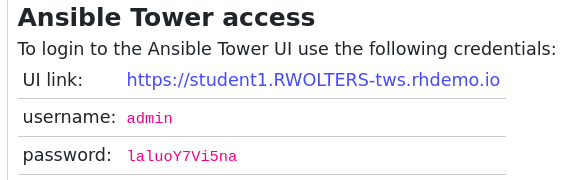

# Exercise 2.2 - Chasse aux menaces

**Lisez ceci dans d'autres langues**: <br>
[ English](README.md),  [ 日本語](README.ja.md), [ Français](README.fr.md).<br>

## Étape 2.1 - Le contexte

Les capacités de détection et de réponse aux menaces nécessitent généralement d'un opérateur de sécurité qu'il déploie de nombreux outils pour sécuriser l'informatique de l'entreprise. En raison de processus manquants et de nombreux travaux manuels, cela représente un réel défi pour les opérations de sécurité informatique!

Dans cet exercice, nous imaginons que nous sommes un opérateur de sécurité en charge d'un pare-feu d'entreprise dans une grande organisation. Le produit pare-feu utilisé ici est le pare-feu Check Point Next Generation. Nous mettrons un accent particulier sur l'interaction entre les différentes équipes dans cet exercice - et comment ces interactions peuvent être rationalisées avec[Ansible Tower](https://www.ansible.com/products/tower).

## Étape 2.2 - Préparatifs

Pour que cet exercice fonctionne correctement, le playbook `whitelist_attacker.yml` doit avoir été exécuté au moins une fois. Toujours dans l'interface de gestion de Check Point SmartConsole, la journalisation de la stratégie de liste d'autorisation de l'attaquant doit avoir été activée. Les deux ont été effectués dans l'exercice Check Point de la section 1. Si vous avez manqué les étapes, retournez-y, exécutez le playbook, suivez les étapes pour activer la journalisation et revenez ici.

## Étape 2.3 - Explorez la configuration d'Ansibe tower

Il y a deux autres étapes nécessaires pour la préparation - mais contrairement à l'exercice précédent, nous allons utiliser Tower pour les faire. Votre installation Tower est déjà remplie d'utilisateurs, d'inventaire, d'informations d'identification, etc., et peut être utilisée directement. Jetons-y un œil: Tower est accessible via un navigateur. Vous avez besoin de l'URL de votre instance Tower personnelle. Elle est similaire à l'URL de votre éditeur en ligne VS Code, mais sans le `-code`. Vous pouvez également le retrouver sur votre page atelier:



> **Remarque**
>
> Cette URL et ces informations de connexion ne sont qu'un exemple. L'URL de votre instance d'Ansible tower et vos informations de connexion seront différentes.

Ouvrez votre navigateur et entrez le lien vers votre instance Tower. Connectez-vous avec votre nom d'utilisateur et le mot de passe qui vous a été fourni. Vous êtes accueilli avec un tableau de bord et une barre de navigation sur le côté gauche.


Sur le côté gauche, cliquez sur **Templates**. Une liste de tous les modèles de tâche déjà configurés s'affiche. Un modèle de tâche est une définition et un ensemble de paramètres permettant d'exécuter une tâche Ansible. Il définit l'inventaire, les informations d'identification, le playbook, les limites, les droits d'eélévation de prévilège, etc. qui sont nécessaires pour exécuter l'automatisation. Dans cette liste, recherchez l'entrée appelée **Blacklist attacker**, et cliquez sur le symbole de la fusée à droite:


Ce clic vous amènera à l'aperçu du travail, montrant l'avancement en direct de l'exécution de la tâche d'automatisation et un résumé de tous les paramètres qui sont pertinents. Avec cette exécution d'automatisation, nous avons modifié la stratégie existante dans le pare-feu pour supprimer les paquets transitant entre les deux machines.

Maintenant, tout ce dont nous avons besoin est l'attaque. Contrairement au dernier exercice, nous n'écrirons pas et n'exécuterons pas de playbook, mais utiliserons à nouveau Tower pour lancer l'attaque. Dans la barre de navigation sur le côté gauche, cliquez sur **Modèles**. Dans la liste des modèles, recherchez et exécutez celui appelé **Start DDOS attack simulation** en cliquant sur l'icône de fusée à droite. Cela garantira que toutes les quelques secondes, une attaque est simulée.

L'environnement est maintenant prête. Lisez la suite pour savoir de quoi parle ce cas d'utilisation.

## Étape 2.4 - L'attaque

Vous êtes un opérateur de sécurité en charge d'un pare-feu d'entreprise dans une grande compagnie. Vous venez de découvrir qu'une politique appliquée par un pare-feu de nouvelle génération Check Point (NGFW), protégeant votre gamme d'applications métier, a été violée à plusieurs reprises. Pour le montrer, ouvrez la SmartConsole sur votre poste de travail Windows, accédez au serveur de gestion Check Point et sur le côté gauche, cliquez sur l'onglet **LOGS & MONITOR**. Une nouvelle fenêtre s'ouvre, vous offrant deux choix: **Audit Logs** et **Logs**. Cliquez sur **Logs** pour accéder à la vue réelle des journaux:


Vous pouvez voir, une série de messages avec la description **http Traffic Dropped** là, se répétant encore et encore au fil du temps.

> **Remarque**
>
> Si vous ne voyez aucun journal, l'actualisation automatique peut ne pas être activée. Si tel est le cas, cliquez sur le bouton correspondant, un `A` à côté d'un cercle:


En voyant ces violations, nous devrions ouvrir une enquête pour évaluer si elles sont le résultat d'une attaque. La meilleure façon d'enquêter est de corréler les journaux de pare-feu avec les journaux générés par d'autres solutions de sécurité déployées dans notre réseau - comme Snort - vio un outil de gestion des journaux comme QRadar.

## Étape 2.5 - Transférer les journaux vers QRadar

Cependant, comme mentionné dans de nombreux environnements d'entreprise, les solutions de sécurité ne sont pas intégrées les unes aux autres et, dans les grandes organisations, différentes équipes sont en charge de différents aspects de la sécurité informatique, sans processus en commun. Dans notre scénario, la manière habituelle pour un opérateur de sécurité d'intensifier le problème et de démarrer notre enquête serait de contacter l'équipe d'analyse de sécurité, en lui envoyant manuellement les journaux de pare-feu que nous avons utilisés pour identifier la violation de la règle, puis d'attendre la réponse. Un processus lent et manuel.

Mais, comme indiqué dans le dernier exercice, nous pouvons automatiser ce processus avec Ansible! Il peut y avoir des workflows d'automatisation pré-approuvés sous forme de playbooks, fournis via un outil d'automatisation central comme Ansible Tower. Avec un tel ensemble de playbooks Ansible, chaque fois que nous sommes dans une situation de chasse aux menaces, nous pouvons configurer automatiquement le pare-feu d'entreprise pour envoyer ses événements/journaux à l'instance QRadar que les analystes de sécurité utilisent pour corréler les données et décider comment procéder avec le menace potentielle.

Essayons cela. Déconnectez-vous de votre instance Tower et reconnectez-vous en tant qu'utilisateur du pare-feu: `opsfirewall`. Pour la simplicité de la démo, le mot de passe est le même que pour votre utilisateur étudiant. Une fois que vous êtes connecté et que vous pouvez voir le tableau de bord, accédez à **Templates**. Comme vous le voyez, en tant qu'administrateur de pare-feu, nous ne pouvons voir et exécuter que quelques modèles de travail:

- **Blacklist attacker**
- **Send firewall logs to QRadar**
- **Whitelist attacker**

Étant donné que nous sommes les propriétaires de domaine du pare-feu, nous pouvons modifier, supprimer et exécuter ces modèles de travail. Exécutons le modèle **Send firewall logs to QRadar** en cliquant sur le petit icône de fusée à droite. L'exécution de la tâche prend quelques secondes. Du point de vue de l'opérateur du pare-feu, nous avons maintenant reconfiguré le pare-feu pour envoyer des journaux au SIEM central.

Cependant, le SIEM doit toujours accepter les journaux et les trier en flux appropriés, appelés sources de journal dans QRadar. Passons notre point de vue à celui de l'analyste de sécurité. Nous recevons un appel disant qu'il y a quelque chose de bizarre dans le pare-feu et que les journaux sont déjà envoyés dans notre direction. Déconnectez-vous de Tower et reconnectez-vous en tant qu'utilisateur `analyst`. Encore une fois, consultez les **Templates**: encore une fois, nous avons une liste différente de modèles d'automatisation à portée de main. nous ne pouvons voir et utiliser que ceux qui sont pertinents pour notre travail. Acceptons les journaux de pare-feu dans notre SIEM: Exécutez le modèle de tâche **Accept firewall logs in QRadar**.

Au bout de quelques secondes, le playbook est exécuté et la nouvelle configuration de sécurité est terminée. Contrairement à l'exercice précédent, aucune de ces étapes n'a obligé l'opérateur ou l'analyste à accéder à la ligne de commande, à écrire des playbooks ou même à installer des rôles ou des collections. Les playbooks ont été pré-approuvés et ils sont accessibles à partir d'un dépôt Git. Tower s'est occupé de l'exécution et des téléchargements de tout rôle ou collection. Cela simplifie considérablement les opérations d'automatisation.

Si vous cliquez sur **Tâches** sur le côté left, vous verrez également que vous pouvez toujours accéder aux travaux exécutés précédemment. Cela permet aux équipes de mieux suivre ce qui a été exécuté quand et où les résultats. Cela permet une transparence et une compréhension claire de l'automatisation qui a été exécutée.

## Étape 2.6 - Vérifier la nouvelle configuration

Vérifions rapidement que les journaux QRadar s'affichent maintenant. Connectez-vous à l'interface Web QRadar. Cliquez sur **Log Activity** et vérifiez que les événements arrivent à QRadar depuis Check Point:


> **Remarque**
>
> Si vous ne voyez aucun journal arriver, cliquez sur le menu déroulant à côté de **iew** et sélectionnez **Real Time (streaming)**.

Si les journaux se noient dans les milliers de journaux de QRadar, créez un filtre. Ou cliquez sur les lignes de journal indésirables dans la colonne **Log Source**, et choisissez **Filter on Log Source is not ...** pour créer des filtres à la volée pour filtrer le trafic indésirable.

Vérifions que QRadar affiche également correctement la source du journal. Dans l'interface utilisateur de QRadar, cliquez sur le bouton avec les trois lignes horizontals dans le coin supérieur gauche, puis cliquez sur **Admin**. Maintenant, cliquez sur **Log Souces**. Une nouvelle fenêtre s'ouvre et affiche la nouvelle source de journal.


## Étape 2.7 - Infractions

Ensuite, nous voulons gérer les infractions affichées dans QRadar. Actuellement, aucune n'est générée - mais sont-elles déjà préconfigurées pour ce cas d'utilisation? Dans l'interface Web QRadar, ouvrez l'onglet **Offenses**. Dans le menu de gauche, cliquez sur **Rules**. Au-dessus, à côté de **Group**, cliquez sur le menu déroulant et sélectionnez **Ansible**. Toutes les règles d'infraction préconfigurées pour cet atelier sont affichées:


Double-cliquez sur la règle appelée **Ansible Workshop DDOS Rule**. La fenêtre de l'assistant de règles s'ouvre, nous permettant de modifier la règle d'infraction si nécessaire:


Depuis l'assistant, vous pouvez voir que nous n'utilisons uniquement `very checks` (deuxième case dans la fenêtre). Les règles peuvent être beaucoup plus complexes, peuvent même dépendre d'autres règles et, par conséquent, ne doivent pas créer d'infractions, mais peuvent par exemple créer des entrées de journal supplémentaires. Nous n'effectuerons aucune modification ici, alors laissez l'assistant en cliquant sur **Cancel** dans le coin inférieur droit et confirmez l'avertissement de fermeture de votre navigateur.

Pour décider si cette violation est un faux positif, nous devons nous assurer que d'autres sources n'effectuent pas une attaque que nous ne verrons peut-être pas dans le pare-feu. Pour ce faire, nous devons accéder aux journaux générés par l'IDS et aller rechercher un modèle d'attaque spécifique qui pourrait être compatible avec la violation sur le pare-feu.

## Étape 2.8 - Ajouter une règle Snort

Ajoutons une nouvelle règle dans notre  IDS. Encore une fois, nous le ferons via un playbook pré-approuvé déjà dans Tower. Déconnectez-vous de Tower et reconnectez-vous en tant qu'utilisateur «opsids» - IDPS en charge de l'IDPS. Accédez à **Modèles**. Un playbook pré-créé est disponible pour ajouter une règle à Snort. Exécutez-le en cliquant sur la petite fusée. Mais comme vous le voyez, au lieu de vous amener à la sortie des emplois, vous serez confronté à une enquête:


Le playbook ne peut pas fonctionner sans autre contenu - nous devons fournir la règle réelle qui doit être déployée! Bien sûr, avec Snort, la règle à ajouter dépend du cas d'utilisation réel et peut donc être différente à chaque fois. Ainsi, ce modèle de tâche dispose d'un **questionnaire**, c'est une méthode dans Ansible Tower pour interroger les entrées avant l'exécution.

Dans ce cas, nous recherchons une signature appropriée via une règle Snort pour cette attaque spécifique. Entrez la chaîne suivante dans le champ:

```
alert tcp any any -> any any (msg:"Attempted DDoS Attack"; uricontent:"/ddos_simulation"; classtype:successful-dos; sid:99000010; priority:1; rev:1;)
```

Comme vous pouvez le voir, nous ajoutons une nouvelle règle de snort correspondant aux paramètres de l'attaque. Dans notre exemple, nous vérifions à nouveau le contenu de l'URI. Après avoir ajouté la chaîne, cliquez sur **Suivant** puis sur **Lancer**.

Le playbook fonctionne, s'occupe de l'installation de la nouvelle règle, du redémarrage du service, etc.

Vérifiez rapidement la nouvelle règle sur l'instance Snort. Depuis un terminal de votre éditeur en ligne VS Code, connectez-vous à Snort via SSH avec l'utilisateur `ec2user`:

```bash
[student<X>@ansible ~]$ ssh ec2-user@11.22.33.44
Last login: Fri Sep 20 15:09:40 2019 from 54.85.79.232
[ec2-user@snort ~]$ sudo grep ddos_simulation /etc/snort/rules/local.rules
alert tcp any any -> any any  (msg:"Attempted DDoS Attack"; uricontent:"/ddos_simulation"; classtype:successful-dos; sid:99000010; priority:1; rev:1;)
```

> **Remarque**
>
> Vérifiez également que le service snort fonctionne via `systemctl status snort`. S'il y a une erreur fatale, il est probable que la règle que vous avez entrée ait une erreur. Supprimez la ligne de règles du fichier `/etc/ snort/rules/local.rules` et réexécutez le playbook.

Après avoir vérifié la règle, quittez le serveur Snort via la commande `exit`.

Ensuite, nous voulons également que l'IDPS envoie des journaux à QRadar au cas où la règle aurait un succès. Nous pourrions simplement exécuter un modèle de tâche correspondant en tant qu'utilisateur `opsids`. Mais cette fois, nous voulons prendre un chemin différent: au lieu que l'opérateur IDPS exécute le playbook préparé, nous voulons montrer comment Ansible Tower peut déléguer de tels droits d'exécution à d'autres sans les laisser prendre le contrôle du domaine.

Imaginez que l'équipe d'analystes et l'équipe d'opérateurs IDPS se soient mises d'accord sur un playbook prédéfini pour transmettre les journaux de l'IDPS à QRadar. Étant donné que l'équipe IDPS a été impliquée dans la création de ce playbook et l'a accepté, elle le fournit à l'équipe d'analystes pour l'exécuter à tout moment, sans aucune implication supplémentaire.

Déconnectez-vous de Tower et reconnectez-vous en tant qu'utilisateur `analyst`. Dans la section **Modèles**, il existe plusieurs playbooks:

- **Accept firewall logs in QRadar**
- **Accept IDPS logs in QRadar**
- **Roll back all changes**
- **Send IDPS logs to QRadar**

Seuls les deux modèles **Accept...** appartiennent à l'analyste et peuvent être modifiés ou par exemple supprimés comme indiqué par l'icône de la petite poubelle. Le modèle de tâche **Send IDPS logs to QRadar** est fourni par l'équipe IDPS uniquement pour les droits d'exécution, et ne peut donc pas être modifié ou supprimé - uniquement exécuté. De cette façon, le droit d'exécuter l'automatisation est accordé au-delà des limites de l'équipe - tandis que le droit de le modifier ou de le changer appartient à l'équipe qui a la connaissance du domaine, ici l'équipe IDPS. Notez également les informations d'identification: l'accès à l'IDPS nécessite des clés SSH. Ils sont référencés dans le modèle de tâche, mais l'utilisateur `analyst` ne peut pas rechercher leur contenu dans la section **Credentials** de Tower. De cette façon, une séparation du droit d'exécuter l'automatisation du droit d'accéder à la machine cible est assurée.

Exécutez maintenant les deux modèles de travail **Accept IDPS logs in QRadar** et **Send IDPS logs to QRadar** en appuyant sur la petite icône de fusée à côté des modèles.

## Étape 2.9 - Liste d'autorisation d'IP

Jetons un coup d'œil à notre SIEM QRadar: accédez à l'onglet d'activité du journal. Validez que dans QRadar **auncun** événement de l'IDS ne soit généré. De cette façon, vous savez avec certitude que l'anomalie que vous voyez n'est causée que par la seule adresse IP que vous avez dans le pare-feu. Aucun autre trafic n'est à l'origine de l'anomalie, vous pouvez supposer en toute sécurité que l'anomalie que vous voyez est un faux positif.

> **Remarque**
>
> En réalité, vous pouvez effectuer des étapes supplémentaires en analysant le comportement des machines pour exclure la possibilité qu'elles aient été compromises.

Nous avons déterminé que l'hôte n'effectue pas d'attaque et avons finalement confirmé que la violation de la politique de pare-feu est un faux positif, probablement dû à une mauvaise configuration du groupe de liste d'autorisation pour cette application. Nous pouvons donc ajouter à la liste d'autorisation l'IP dans le pare-feu pour laisser passer les événements.

Déconnectez-vous de Tower et reconnectez-vous en tant qu'utilisateur `opsfirewall`. Accédez à la vue d'ensemble **Modèles** et lancez le modèle de tâche **Whitelist attacker**. Quelques instants plus tard, le trafic est autorisé.

## Étape 2.10 - Restauration

Les analystes ont mis fin à leur chasse aux menaces. Pour réduire la consommation de ressources et la charge de travail d'analyse, il est préférable de restaurer maintenant les configurations des journaux Check Point et Snort à leur état de pré-investigation. Pour ce faire, un modèle pré-approuvé est disponible pour les analystes:

**Roll back all changes**

Connectez-vous à Ansible Tower en tant qu'utilisateur `analyst`, et exécutez-le en cliquant sur la petite icône de fusée à côté. Toute la configuration de journalisation est revenue à la normale.

Enfin, nous devons arrêter la simulation d'attaque. Déconnectez-vous de Tower et reconnectez-vous en tant qu'utilisateur student. Dans la section **Modèles**, recherchez et exécutez le modèle de travail appelé **Stop DDOS attack simulation**.

Vous avez terminé l'exercice. Revenez à la liste des exercices pour continuer avec le suivant.

----

[Cliquez ici pour revenir à l'atelier Ansible pour la sécurité](../README.fr.md)
