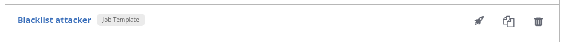

# 演習 2.2 - Threat hunting

**Read this in other languages**: <br>
[ English](README.md),  [ 日本語](README.ja.md), [ Français](README.fr.md).<br>

## Step 2.1 - 背景

脅威の検出と対応能力は、通常、セキュリティオペレータが企業の IT を保護するために多くのツールを展開する必要があります。不足しているプロセスと多くの手動作業により、これは適切な IT セキュリティ運用にとって深刻な課題です！

この演習では、大規模な組織でエンタープライズファイアウォールを担当するセキュリティオペレータを想定しています。ここで使用するファイアウォール製品は、Check Point Next Generation Firewall です。この演習では、さまざまなチーム間の相互作用に特に焦点を当て、これらの相互作用を [Ansible Tower](https://www.ansible.com/products/tower) を使用し、効率化する方法について説明します。

## Step 2.2 - 準備

この演習が適切に機能するには、Playbook `whitelist_attacker.yml` を少なくとも 1 回実行しておく必要があります。また、Check Point Smart Console 管理インターフェイスで、攻撃者のホワイトリストポリシーのロギングが有効になっている必要があります。これらの操作は、演習 1 Check Point の演習で行いました。手順が未実施の場合には、Playbook を実行し、手順に従ってロギングを有効にしてから、ここに戻ってください。

## Step 2.3 - Tower の設定を確認する

準備にはさらに2つの手順が必要です。繰り返しになりますが、Tower を使用してそれらを実行します。左側にある **Templates** をクリックします。設定済みのすべてのジョブテンプレートのリストが表示されます。ジョブテンプレートは、Ansible ジョブを実行するための定義とパラメーターのセットです。これは、自動化を実行するために必要なインベントリ、資格情報、Playbook、制限、権利などを定義します。このリストで、**Blacklist attacker** というエントリを見つけ、その右側にあるロケットの記号をクリックします。



これをクリックすると、ジョブの概要が表示され、自動化ジョブの実行からのライブデータと、ジョブに関連するすべてのパラメータの概要が表示されます。この自動化の実行により、ファイアウォールの既存のポリシーを変更して、2台のマシン間でパッケージをドロップするようにしました。

今必要なのは攻撃だけです。左側のナビゲーションバーで、**Templates** をクリックします。テンプレートのリストで、**Start DDOS attack simulation** と呼ばれるテンプレートを見つけ、右にあるロケットのアイコンをクリックして実行します。これにより、数秒ごとに攻撃がシミュレートされます。

これでステージは整いました。このユースケースが何であるかを学ぶためにお読みください。

## Step 2.4 - 攻撃を確認する

あなたは、大規模なエンタープライズファイアウォールを担当するセキュリティオペレータです。基幹業務システムを保護する Check Point Next Generation Firewall（NGFW）に適用しているポリシーに繰り返し違反を識別していることが分かりました。これを確認するには、Windows ワークステーションの Smart Console を開き、Check Point の管理サーバにアクセスして、左側の **LOGS & MONITOR** タブをクリックします。新しいウィンドウが開き、**Audit Logs** と **Logs** の2つの選択肢が表示されます。**Logs** をクリックし、実際のログを表示します:


**http Traffic Dropped** と説明が付いた一連のメッセージが表示され、時間の経過とともに何度も繰り返し表示されます。

> **Note**
>
> ログが表示されない場合は、自動更新が有効になっていない可能性があります。その場合は、対応するボタン(円の横に A があるアイコン)をクリックしてください:


これらの違反を見て、それが攻撃の結果であるかどうかを評価するために調査を開始する必要があります。調査する最善の方法は、ファイアウォールのログと、ネットワークに展開されている他のセキュリティソリューション（Snort など）が生成したログを、QRadar のようなログ管理ツールで関連付けることです。

## Step 2.5 - ログを QRadar に転送する

しかし、多くの企業環境では、前述したように、セキュリティソリューションは互いに統合されておらず、大規模な組織では、異なるチームが共通のプロセスを持たず、IT セキュリティのさまざまな側面を担当しています。このシナリオの、セキュリティオペレータが問題をエスカレーションし調査を開始するための一般的な方法は、セキュリティ分析チームに連絡し、ルール違反を特定するために使用したファイアウォールログを手動で送信してから返信を待つというものです。これでは、時間のかかる手動のプロセスになってしまいます。

しかし、前の演習で示したように、Ansible を使ってこのプロセスを自動化することができます！ Ansible Tower のような中央自動化ツールを介して提供される、事前承認された自動化ワークフローを Playbook の形で提供できます。このような Ansible Playbook のセットを使えば、脅威の調査の状況に陥るたびに、エンタープライズファイアウォールのイベント/ログを QRadar インスタンスに送信するように自動的に設定し、セキュリティアナリストがデータを関連付け、潜在的な脅威に対してどのように対処するかを決定するために使用することができます。

これらを試してみます。Tower インスタンスからログアウトし、ファイアウォールのユーザー `opsfirewall` としてログインします。デモを簡単にするために、パスワードは Student と同じにしています。ログインしてダッシュボードが表示されたら、**Templates** に移動します。ご覧のように、ファイアウォール管理者としては、いくつかのジョブテンプレートしか見ることができず、実行することができません:

- **Blacklist attacker**
- **Send firewall logs to QRadar**
- **Whitelist attacker**

私たちはファイアウォールのドメイン所有者なので、これらのジョブテンプレートを変更、削除、実行することができます。テンプレートの横にある小さなロケットアイコンをクリックして、**Send firewall logs to QRadar** を実行します。ジョブの実行には数秒かかります。ファイアウォールオペレータの観点から、中央の SIEM にログを送信するようにファイアウォールを再設定しました。

ただし、SIEM はログを受け入れ、それらを QRadar ではログソースと呼ばれる適切なストリームに振り分ける必要があります。セキュリティアナリストの観点に切り替えます。ファイアウォールに何か奇妙なものがあり、ログがすでに我々の方向に送信されているという連絡を受けました。Tower からログアウトして、ユーザ `analyst` としてログインします。再度、**Templates** を確認します。手元にある自動化テンプレートの別のリストがあります。私たちは、自分の仕事に関連するものだけを表示して使用できます。ファイアウォールログを SIEM に受け入れます: **Accept firewall logs in QRadar** ジョブテンプレートを実行してください。

数秒後に Playbook が実行され、新しいセキュリティ設定が完了します。前の演習とは異なり、これらのステップでは、オペレータやアナリストがコマンドラインにアクセスしたり、Playbook を作成したり、Role や Collection をインストールしたりする必要はありませんでした。Playbook は事前に承認されており、実際には Git リポジトリ内からアクセスできます。Tower は、Role や Collection の実行とダウンロードを担当しました。これにより、自動化作業が大幅にシンプルになりました。

右側の **Jobs** をクリックすると、以前に実行したジョブにいつでもアクセスすることができます。これにより、チームはいつ何が実行され、どのような結果が得られたかをより適切に追跡することができます。これにより、実行された自動化の透明性と明確な理解が可能になります。

## Step 2.6 - 新しい設定を確認する

QRadar のログが表示されるようになったことを早速確認します。QRadar の Web UI にログインします。**Log Activity** をクリックして、Check Point から QRadar にイベントが送信されていることを確認します:


> **Note**
>
> ログが表示されない場合は、**View** の隣にあるドロップダウンメニューをクリックして、**Real Time (streaming)** を選択します。

ログが QRadar 自身のログにかき消されてしまう場合は、フィルタを作成します。または、**Log Source** の欄で不要なログ行をクリックして、**Filter on Log Source is not ...** を選択すると、その場でフィルタを作成して、不要なトラフィックをフィルタリングします。

QRadar でもログソースが正しく表示されることを確認します。QRadar UI で、左上隅のハンバーガーボタンをクリックし、**Admin** をクリックします。その中から、**Log Souces** をクリックします。新しいウィンドウが開き、新しいログソースが表示されます。


## Step 2.7 - 違反

次に、QRadar に表示される違反を管理します。現在は生成されていませんが、このユースケースのためにいくつかはすでに設定されていますか？QRadar の Web UI で、**Offenses** タブを開きます。左側のメニューで、**Rules** をクリックします。上の **Group** の隣にあるドロップダウンメニューをクリックして **Ansible** を選択します。このワークショップのすべての事前設定された違反ルールが表示されます:


**Ansible Workshop DDOS Rule** というルールをダブルクリックします。ルールウィザードウィンドウが開き、必要に応じて攻撃ルールを変更することができます:


ウィザードから、チェック（ウィンドウ内の2番目のボックス）をほとんど使用していないことが分かります。ルールは、さらに複雑になる可能性があり、他のルールに依存する可能性もあるため、攻撃を作成する必要はありませんが、例えば、追加のログエントリを作成することができます。ここでは何も変更を行いため、右下の **Cancel** をクリックしてウィザードを閉じ、ブラウザのクローズ警告を確認します。

この違反が誤検知であるかを判断するには、他のソースがファイアウォールでは見られない攻撃を実行していないことを確認する必要があります。そのためには、IDS が生成したログにアクセスし、ファイアウォール上の違反と互換性のある特定の攻撃パターンをチェックする必要があります。

## Step 2.8 - Snort ルールを追加する

新しい IDS ルールを追加します。ここでも、Tower に既にある事前承認済みの Playbook を使って行います。Tower からログアウトし、ユーザー `opsids` (IDPS を担当する IDPS オペレータ)としてログインします。**Templates** に移動します。Snort にルールを追加するための Playbook が用意されています。小さなロケットのアイコンをクリックして実行します。しかし、ご覧のとおり、ジョブの出力に移動するのではなく、調査に直面します。


Playbook はそれ以上のコンテンツなしに実行できません。展開する必要がある実際のルールを提供する必要があります！もちろん、Snort では、追加する必要のあるルールは実際のユースケースに依存するため、毎回異なる可能性があります。したがって、このジョブテンプレートでは ***survey*** を有効にしています。これは Ansible Tower で実行前に入力を問い合わせるためのメソッドです。

この場合、適切なシグネチャ、つまりこの特定の攻撃に適した Snort ルールを照会します。フィールドに次の文字列を入力します:

```
alert tcp any any -> any any (msg:"Attempted DDoS Attack"; uricontent:"/ddos_simulation"; classtype:successful-dos; sid:99000010; priority:1; rev:1;)
```

ご覧のように、攻撃のパラメータにマッチする新しい Snort ルールを追加します。この例では、再び URI の内容をチェックします。文字列を追加後、**Next** をクリックし、**Launch** をクリックします。

Playbook が実行され、新しいルールのインストール、サービスの再起動などが処理されます。

Snort インスタンス上の新しいルールを素早く検証します。VS Code オンラインエディタのターミナルから、ユーザ `ec2user` で SSH で Snort サーバにログインします:

```bash
[student<X>@ansible ~]$ ssh ec2-user@11.22.33.44
Last login: Fri Sep 20 15:09:40 2019 from 54.85.79.232
[ec2-user@snort ~]$ sudo grep ddos_simulation /etc/snort/rules/local.rules
alert tcp any any -> any any  (msg:"Attempted DDoS Attack"; uricontent:"/ddos_simulation"; classtype:successful-dos; sid:99000010; priority:1; rev:1;)
```

> **Note**
>
> また、`systemctl status snort` で Snort サービスが実行されていることを確認します。致命的なエラーがある場合は、入力したルールにエラーがある可能性があります。ファイル `/etc/snort/rules/local.rules` からルールの行を削除し、Playbook を再度実行します。

ルールを確認したら、`exit` コマンドで Snort サーバからログアウトします。

次に、ルールがヒットした場合に IDPS が QRadar にログを送信するようにします。ユーザ `opsids` として対応するジョブテンプレートを実行することができます。ただし、今回は別の方法を使用します。IDPS オペレータが用意された Playbook を実行するのではなく、Ansible Tower がどのようにして他の人に実行権限を委譲し、ドメインの制御を取らせることなく実行できるかを示したいと思います。

アナリストチームと IDPS オペレータチームが、IDPS から QRadar にログを転送するために事前定義された Playbook に合意したと想定してください。IDPS チームはこの Playbook の作成に関与し、同意したので、アナリストチームに提供し、必要なときにいつでも実行できるようにします。

Tower からログアウトして、ユーザー `analyst` として再ログインしてください。**Templates** セクションには、複数の Playbook があります:

- **Accept firewall logs in QRadar**
- **Accept IDPS logs in QRadar**
- **Roll back all changes**
- **Send IDPS logs to QRadar**

2つの **Accept...** ジョブテンプレートのみがアナリストのものであり、小さなゴミ箱のアイコンが示すように、変更や削除が可能です。ジョブテンプレート **Send IDPS logs to QRadar** は、IDPS チームが実行権限のためだけに提供しているため、変更や削除はできません。このようにして、自動化を実行する権利はチームの境界を越えて提供され、変更や変更の権利はドメイン知識を持つチーム（ここでは IDPS チーム）にあります。IDPS へのアクセスには SSH キーが必要です。これらはジョブテンプレートで参照されていますが、ユーザーアナリストは Tower の **Credentials** セクションでその内容を調べることはできません。このようにして、自動化を実行する権利とターゲットマシンにアクセスする権利の分離が保証されます。

**Accept IDPS logs in QRadar** と **Send IDPS logs to QRadar** の両方のジョブテンプレートを実行するため、ジョブテンプレートの横にある小さなロケットのアイコンを押します。

## Step 2.9 - ホワイトリスト IP

SIEM QRadar を確認します: **Log Activity** タブにアクセスします。QRadar で IDS からの **no** イベントが生成されていないことを確認します。こうすることで、表示された違反がファイアウォールにある単一の IP によってのみ引き起こされていることを確実に分かります。他のトラフィックが違反の原因となっていないため、表示された違反は誤検知であると想定できます。

> **Note**
>
> 実際には、マシンの動作を分析する追加のステップを実行して、マシンが危険にさらされている可能性を除外することができます。

ホストが攻撃を行っていないと判断し、最終的にファイアウォールのポリシー違反が誤検知であることを確認しました。これは恐らくアプリケーションのホワイトリストグループの設定ミスによるものだと考えられます。そのため、ファイアウォール内の IP をホワイトリストに登録し、イベントを通過させることができます。

Tower からログアウトし、ユーザ `opsfirewall` として再ログインします。**Templates** の概要に移動し、ジョブテンプレート **Whitelist attacker** を実行します。しばらくするとトラフィックが許可されます。

## Step 2.10 - ロールバック

アナリストは脅威の探索を終了しました。リソースの消費と分析のワークロードを削減するため、Check Point と Snort ログの設定を調査前の状態に戻すことをお勧めします。そのためには、事前に承認されたジョブ テンプレートを使用します:

- **Roll back all changes**

Ansible Tower にユーザー `analyst` としてログインし、その横にある小さなロケットアイコンをクリックして実行します。すぐにすべてのロギング設定が通常の状態に戻ります。

最後に、攻撃シミュレーションを止める必要があります。Tower からログアウトし、Student ユーザーとしてログインします。**Templates** のセクションで、**Stop DDOS attack simulation** というジョブテンプレートを見つけて実行します。

これで演習は終了です。次の演習を続けるために、演習のリストに戻ってください。

----

[Ansible Security Automation Workshopの表紙に戻る](../README.ja.md)
