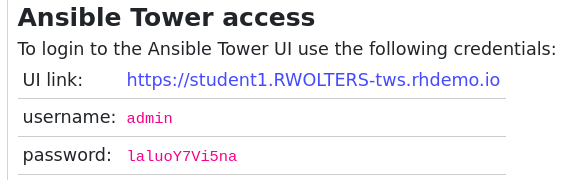
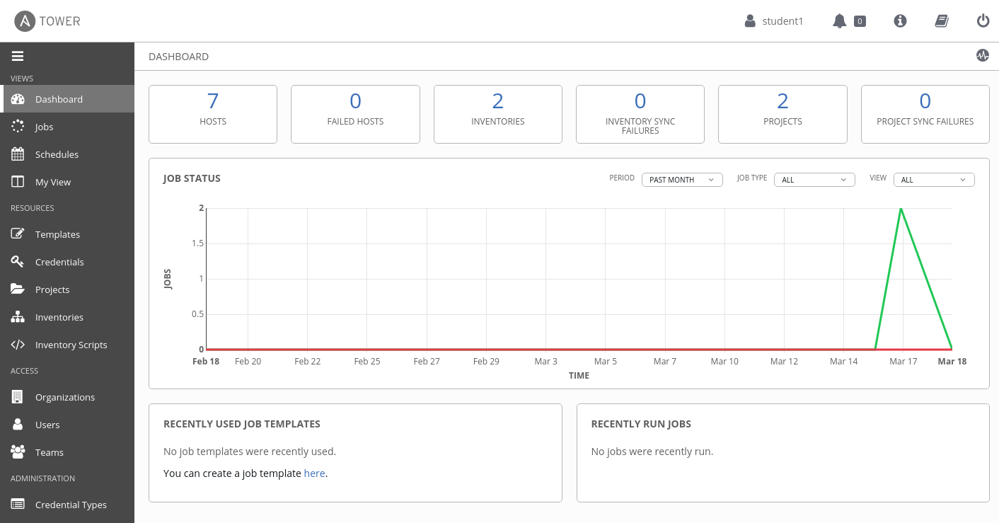
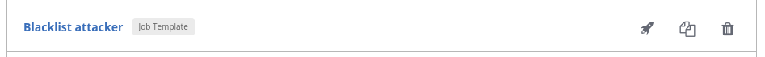
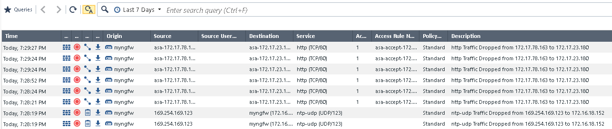
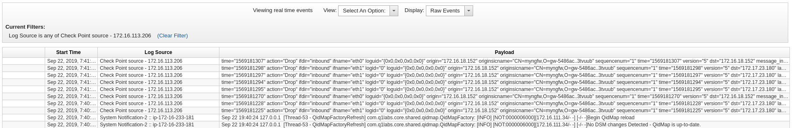
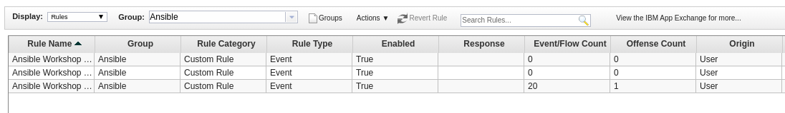
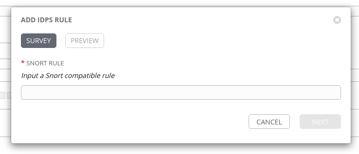

# Exercise 2.2 - Threat hunting

## Step 2.1 - The Background

Threat detection and response capabilities require from a security operator typically to deploy many tools to secure an enterprise IT. Due to missing processes and a lot of manual work this is a serious challenge to proper IT security operations!

In this exercise, we imagine that we are a security operator in charge of an enterprise firewall in a larger organization. The firewall product used here is Check Point Next Generation Firewall. We will put special focus on interaction between various teams in this exercise - and how those interaction can be streamlined with [Ansible Tower](https://www.ansible.com/products/tower).

## Step 2.2 - Preparations

For this exercise to work properly, the playbook `whitelist_attacker.yml` must have been run at least once. Also in the Check Point SmartConsole management interface the logging for the attacker whitelist policy must have been activated. Both was done in the Check Point exercise in section 1. If you missed the steps, go back there, execute the playbook, follow the steps to activate the logging and come back here.

## Step 2.3 - Explore the Tower setup

There are two more steps needed for preparation - but in contrast to the previous exercise, we will use Tower to do them. Your Tower installation is already populated with users, inventory, credentials and so on, and can be used directly. Let's have a look at it: Tower is accessed via browser. You need the URL to your personal Tower instance. It is be similar to the URL for your VS Code online editor, but without the `-code`. You can also find it on your workshop page:



> **Note**
>
> This URL and login information are just an example. Your Tower URL and login information will be different.

Open your browser and enter the link to your Tower instance. Log-in with your student ID and the password provided to you. You are greeted with a dashboard and a navigation bar on the left side.



On the left side, click on **Templates**. A list of all already configured job templates are shown. A job template is a definition and set of parameters for running an Ansible job. It defines the inventory, credentials, playbook, limits, become rights and so on which are needed to execute the automation. In this list, find the entry called **Blacklist attacker**, and click on the rocket symbol right to it:



This click will bring you to the job overview, showing live data from the automation job execution and a summary of all the parameters which are relevant to the job. With this automation execution we have changed the existing policy in the Firewall to drop packages between the two machines.

Now all we need is the attack. Unlike the last exercise we will not write and execute a playbook, but again use Tower to start the attack. In the navigation bar on the left side, click on **Templates**. In the list of templates, find and execute the one called **Start DDOS attack simulation** by clicking on the rocket icon right to it. This will ensure that every few seconds an attack is simulated.

The stage is set now. Read on to learn what this use case is about.

## Step 2.4 - See the attack

You are a security operator in charge of an enterprise firewall in a larger cooperaiton. You just found that a policy enforced by a Check Point Next Generation Firewall (NGFW), protecting your line of business applications, has been repeatedly violated. To showcase this, open the SmartConsole on your Windows workstation, access the Check Point management server and on the left side click on the **LOGS & MONITOR** tab. A new window opens, offering you two choices: **Audit Logs** and **Logs**. Click on **Logs** to get to the actual view of the logs:



You can see, a series of messages with the description **http Traffic Dropped** there, repeating again and again over time.

> **Note**
>
> If you do not see any logs, auto refresh might not be activated. If that is the case, click on the corresponding button, an A next to a circle:


Seeing these violations we should start an investigation to assess if they are the outcome of an attack. The best way to investigate is to correlate the firewall logs with logs generated by other security solutions deployed in our network - like Snort - in a log management tool like QRadar.

## Step 2.5 - Forward logs to QRadar

However, as mentioned in many enterprise environments security solutions are not integrated with each other and, in large organizations, different teams are in charge of different aspects of IT security, with no processes in common. In our scenario, the typical way for a security operator to escalate the issue and start our investigation would be to contact the security analysis team, manually sending them the firewall logs we used to identify the rule violation - and then wait for the reply. A slow, manual process.

But, as shown with the last exercise, we can automate this process with Ansible! There can be pre-approved automation workflows in form of playbooks, provided via a central automation tool like Ansible Tower. With such a set of Ansible playbooks, every time we are in a threat hunting situation, we can automatically configure the enterprise firewall to send its events/logs to the QRadar instance that security analysts use to correlate the data and decide how to proceed with the potential threat.

Let's try this out. Log out of your Tower instance, and log in as the firewall user: `opsfirewall`. For the simplicity of the demo, the password is the same as for your student user. Once you have logged in and can see the dashboard, navigate to **Templates**. As you see, as the firewall administrator we can only see and execute few job templates:

- **Blacklist attacker**
- **Send firewall logs to QRadar**
- **Whitelist attacker**

Since we are the domain owners of the firewall, we can modify, delete and execute those job templates. Let's execute the template **Send firewall logs to QRadar** by clicking on the little rocket icon next to it. The execution of the job takes a few seconds. From the perspective of the firewall operator we have now reconfigured the firewall to send logs to the central SIEM.

However, the SIEM still needs to accept logs and sort them into proper streams, called log sources in QRadar. Let's switch our perspective to the one of the security analyst. We get a call that there is something weird in the firewall and that logs are already sent into our direction. Log out of Tower and log back in as the user `analyst`. Again, check out the **Templates**: again we have a different list of automation templates at our hand. we can only see and use those which are relevant to our job. Let's accept the firewall logs into our SIEM: Execute the job template **Accept firewall logs in QRadar**.

After a few seconds the playbook run through, and the new security configuration is done. In contrast to the previous exercise, none of these steps required the operator or the analyst to access the command line, write playbooks or even install roles or collections. The playbooks were pre-approved and in fact accessed from within a Git repository. Tower took care of the execution and the downloads of any role or collections. This substantially simplifies automation operations.

If you click on **Jobs** on the right side you will also see that you can always access the previously run jobs. This enables the teams to better track what was executed when, and what where the results. This enables transparency and clear understanding of the automation that was run.

## Step 2.6 - Verify new configuration

Let's quickly verify that the QRadar logs are now showing up. Log into the QRadar web UI. Click on **Log Activity** and verify that events are making it to QRadar from Check Point:



> **Note**
>
> If you do not see any logs coming in, click on the drop down menu next to **View** and select **Real Time (streaming)**.

If the logs get drowned in QRadar's own logs, create a filter. Or click on unwanted log lines in the column **Log Source**, and pick **Filter on Log Source is not ...** to create filters on the fly to filter out unwanted traffic.

Let's verify that QRadar also properly shows the log source. In the QRadar UI, click on the hamburger button in the left upper corner, and click on **Admin**. In there, click on **Log Souces**. A new window opens and shows the new log source.


## Step 2.7 - Offenses

Next we want to manage offenses shown in QRadar. Currently non are generated - but are some already pre-configured for this use case? In the QRadar web UI, open the **Offenses** tab. On the left side menu, click on **Rules**. Above, next to **Group**, click on the drop down menu and select **Ansible**. All preconfigured offense rules for this workshop are shown:



Double-click on the rule called **Ansible Workshop DDOS Rule**. The rule wizard window opens, allowing us changes to the offense rule if needed:


From the wizard you can see that we only use very checks (second box in the window). Rules can be much more complex, can even depend on other rules and as a result do not have to create offenses, but for example can create additional log entries. We will not do any changes here, so leave the wizard with a click on **Cancel** in the bottom right corner and confirm the close-warning of your browser.

To decide if this violation is a false positive, we need to make sure that other sources are not performing an attack which we might not see in the firewall. To do that we need to access the logs generated by the IDS and decide to check for a specific attack pattern that could be compatible with the violation on the firewall.

## Step 2.8 - Add Snort rule

Let's add a new IDS rule. Again we will do this via a pre-approved playbook already in Tower. Log out of Tower, and log in as user `opsids` - the IDPS operator in charge of the IDPS. Navigate to **Templates**. There is a pre-created playbook available to add a rule to Snort. Execute it by clicking on the small rocket icon. But as you see, instead of bringing you to the jobs output, you will be faced with a survey:



The playbook cannot run without further content - we have to provide the actual rule which needs to be deployed! Of course, with Snort, the rule necessary to be added depends on the actual use case and thus might be different each time. Thus this job template has a ***survey*** enabled, a method in Ansible Tower to query input before execution.

In this case we query the proper signature, the right Snort rule for this specific attack. Enter the following string into the field:

```
alert tcp any any -> any any (msg:"Attempted DDoS Attack"; uricontent:"/ddos_simulation"; classtype:successful-dos; sid:99000010; priority:1; rev:1;)
```

As you can see we add a new snort rule matching on the parameters of the attack. In our example we again check for URI content. After you added the string, click on **Next** and then on **Launch**.

The playbook runs through, takes care of installing the new rule, restarting the service and so on.

Quickly verify the new rule on the Snort instance. From a terminal of your VS Code online editor, log in to Snort via SSH with the user `ec2user`:

```bash
[student<X>@ansible ~]$ ssh ec2-user@11.22.33.44
Last login: Fri Sep 20 15:09:40 2019 from 54.85.79.232
[ec2-user@snort ~]$ sudo grep ddos_simulation /etc/snort/rules/local.rules
alert tcp any any -> any any  (msg:"Attempted DDoS Attack"; uricontent:"/ddos_simulation"; classtype:successful-dos; sid:99000010; priority:1; rev:1;)
```

> **Note**
>
> Also, verify that the snort service is running via `systemctl status snort`. If there is a fatal error, chances are the rule you entered had an error. Remove the rules line from the file `/etc/snort/rules/local.rules` and run the playbook again.

After you have verified the rule, leave the Snort server via the command `exit`.

Next we also want the IDPS to send logs to QRadar in case the rule has a hit. We could just execute a corresponding job template as the user `opsids`. But this time we want to take a different path: instead of the IDPS operator executing the prepared playbook, we want to show how Ansible Tower can delegate such execution rights to others without letting them take control of the domain.

Imagine that the analysts team and the IDPS operator team have agreed upon a pre-defined playbook to forward logs from the IDPS to QRadar. Since the IDPS team was involved in creating this playbook and agreed to it, they provide it to the analyst team to execute it whenever they need it, without any further involvement.

Log out of Tower, and log back in as user `analyst`. In the **Templates** section there are multiple playbooks:

- **Accept firewall logs in QRadar**
- **Accept IDPS logs in QRadar**
- **Roll back all changes**
- **Send IDPS logs to QRadar**

Only the two **Accept...** job templates belong the the analyst, and can be modified or for example deleted as inidcated by the little garbage can icon. The job template **Send IDPS logs to QRadar** is provided by the IDPS team solely for execution rights, and thus cannot be modified or removed - only executed. That way the right to execute automation is provided across team boundaries - while the right to modify or change it stays with the team which has the domain knowledge, here the IDPS team. Also note the credentials: accessing the IDPS requires SSH keys. They are referenced in the job template, but the user analyst cannot look up their content in the **Credentials** section of Tower. This way a separation of right to execute the automation from the right to access the target machine is ensured.

Execute now both job templates **Accept IDPS logs in QRadar** and **Send IDPS logs to QRadar** by pressing the little rocket icon next to the job templates.

## Step 2.9 - Whitelist IP

Let's quickly have a look at our SIEM QRadar: access the log activity tab. Validate, that in QRadar **no** events from the IDS are generated. That way you know for sure that the anomaly you see is only caused by the single IP you have in the firewall. No other traffic is causing the anomaly, you can safely assume that the anomaly you see is a false positive.

> **Note**
>
> In reality you might perform additional steps analyzing the machines behavior to exclude the possibility that it has been compromised.

We have determined that the host is not performing an attack and finally confirmed that the firewall policy violation is a false positive, probably caused by a misconfiguration of the whitelist group for that application. So we can whitelist the IP in the firewall to let events come through.

Log out of Tower and log back in as user `opsfirewall`. Go to the **Templates** overview, and launch the job template **Whitelist attacker**. A few moments later the traffic is allowed.

## Step 2.10 - Rollback

The analysts have ended their threat hunting. To reduce resource consumption and the analysis workload it is preferable to now rollback the Check Point and Snort log configurations back to their pre-investigation state. To do so, there is pre-approved job template available to the analysts:

- **Roll back all changes**

Log into Ansible Tower as the user `analyst`, and execute it by clicking on the little rocket icon next to it. Soon all logging configuration is set back to normal.

Last but not least we have to stop the attack simulation. Log out of Tower, and log back in as your student user. In the section **Templates**, find and execute the job template called **Stop DDOS attack simulation**.

You are done with the exercise. Turn back to the list of exercises to continue with the next one.

----

[Click Here to return to the Ansible Security Automation Workshop](../README.md#section-2---ansible-security-automation-use-cases)
