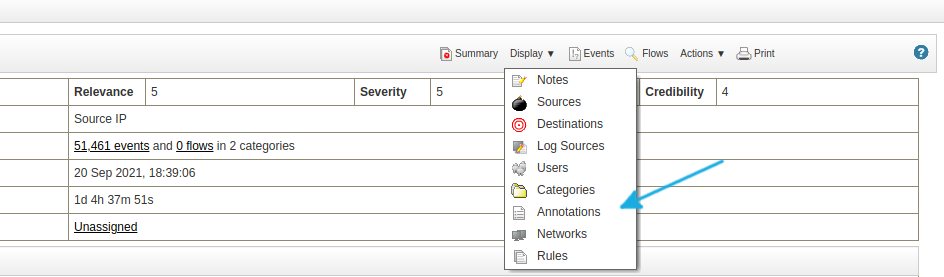
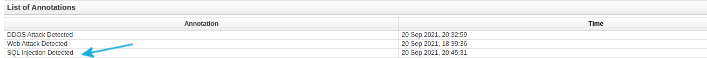

# 演習 2.3 - インシデントレスポンス

**他の言語でもお読みいただけます**: <br>
[ English](README.md),  [ 日本語](README.ja.md), [ Français](README.fr.md).<br>

<div id="section_title">
  <a data-toggle="collapse" href="#collapse2">
    <h3>Workshop access</h3>
  </a>
</div>
<div id="collapse2" class="panel-collapse collapse">
  <table>
    <thead>
      <tr>
        <th>Role</th>
        <th>Inventory name</th>
        <th>Hostname</th>
        <th>Username</th>
        <th>Password</th>
      </tr>
    </thead>
    <tbody>
      <tr>
        <td>Ansible Control Host</td>
        <td>ansible</td>
        <td>ansible-1</td>
        <td>-</td>
        <td>-</td>
      </tr>
      <tr>
        <td>IBM QRadar</td>
        <td>qradar</td>
        <td>qradar</td>
        <td>admin</td>
        <td>Ansible1!</td>
      </tr>
      <tr>
        <td>Attacker</td>
        <td>attacker</td>
        <td>attacker</td>
        <td>-</td>
        <td>-</td>
      </tr>
      <tr>
        <td>Snort</td>
        <td>snort</td>
        <td>snort</td>
        <td>-</td>
        <td>-</td>
      </tr>
      <tr>
        <td>Check Point Management Server</td>
        <td>checkpoint</td>
        <td>checkpoint_mgmt</td>
        <td>admin</td>
        <td>admin123</td>
      </tr>
      <tr>
        <td>Check Point Gateway</td>
        <td>-</td>
        <td>checkpoint_gw</td>
        <td>-</td>
        <td>-</td>
      </tr>
      <tr>
        <td>Windows Workstation</td>
        <td>windows-ws</td>
        <td>windows_ws</td>
        <td>administrator</td>
        <td><em>Provided by Instructor</em></td>
      </tr>
    </tbody>
  </table>
  <blockquote>
    <p><strong>Note</strong></p>
    <p>
    The workshop includes preconfigured SSH keys to log into Red Hat Enterprise Linux hosts and don't need a username and password to log in.</p>
  </blockquote>
</div>

## ステップ 3.1 - 背景

この演習では、脅威の検知と対応の機能に焦点を当てます。通常どおり、セキュリティーオペレーターがこのタスクを実行するには、エンタープライズ IT
にある一連のツールが必要です。

あなたは、企業の IDS を担当するセキュリティーオペレーターです。IDS に Snort を選択しました。

## ステップ 3.2 - 準備

この演習では、オペレーターが Snort のログを見るところから始めます。まずは、実際にログエントリーを生成するための Snort
ルールを設定する必要があります。VS Code オンラインエディターで、Playbook `incident_snort_rule.yml`
を作成します。

<!--  -->
```yaml
---
- name: Add ids signature for sql injection simulation
  hosts: ids
  become: yes

  vars:
    ids_provider: snort
    protocol: tcp
    source_port: any
    source_ip: any
    dest_port: any
    dest_ip: any

  tasks:
    - name: Add snort sql injection rule
      include_role:
        name: "ansible_security.ids_rule"
      vars:
        ids_rule: 'alert {{protocol}} {{source_ip}} {{source_port}} -> {{dest_ip}} {{dest_port}}  (msg:"Attempted SQL Injection"; uricontent:"/sql_injection_simulation"; classtype:attempted-admin; sid:99000030; priority:1; rev:1;)'
        ids_rules_file: '/etc/snort/rules/local.rules'
        ids_rule_state: present
```
<!--  -->

Playbook を実行できるようにするために、準備したロール `ids_rule` を使用して、`security_ee` 実行環境に含まれる IDS
ルールを変更します。これは、ロール `ids.config` についても同様です。

以下を入力し、Playbook を実行します。

```bash
[student<X>@ansible-1 ~]$ ansible-navigator run incident_snort_rule.yml --mode stdout
```

これらのルールがログを生成するためには、疑わしいトラフィック、つまり攻撃が必要です。ここでも、数秒ごとに単純なアクセスをシミュレートする
Playbook を用意し、この演習の他のコンポーネントが後に反応するようにします。VS Code オンラインエディターで、以下の内容の
Playbook `sql_injection_simulation.yml` を作成します。

<!--  -->
```yml
---
- name: start sql injection simulation
  hosts: attacker
  become: yes
  gather_facts: no

  tasks:
    - name: simulate sql injection attack every 5 seconds
      shell: "/sbin/daemonize /usr/bin/watch -n 5 curl -m 2 -s http://{{ hostvars['snort']['private_ip2'] }}/sql_injection_simulation"
```
<!--  -->

以下を入力し、実行します。

```bash
[student<X>@ansible-1 ~]$ ansible-navigator run sql_injection_simulation.yml --mode stdout
```

この演習が正しく動作するには、前の [Check Point 演習](../1.2-checkpoint/README.md)
で、いくつかの手順が完了していることを確認する必要があります。

1. `whitelist_attacker.yml` Playbook は、少なくとも 1 回実行されている必要があります。
2. また、攻撃者のホワイトリストポリシーのロギングが、Check Point SmartConsole でアクティベートされている必要があります。

いずれも [Check Point 演習](../1.2-checkpoint/README.md)
で行いました。これらの手順を飛ばしている場合は、手順に戻って Playbook
を実行し、手順に従ってロギングをアクティベートしてから、こちらに戻ってきてください。

## ステップ 3.3: インシデントの特定

企業の IDS を担当するセキュリティーオペレーターとして、あなたは日常的にログをチェックしています。VS Code
オンラインエディターのターミナルから、ユーザー `ec2-user` として snort ノードに SSH 接続し、ログを確認します。

```bash
[student<X>@ansible-1 ~]$ ssh ec2-user@snort
```
```bash
[ec2-user@snort ~]$ journalctl -u snort -f
-- Logs begin at Sun 2019-09-22 14:24:07 UTC. --
Sep 22 21:03:03 ip-172-16-115-120.ec2.internal snort[22192]: [1:99000030:1] Attempted SQL Injection [Classification: Attempted Administrator Privilege Gain] [Priority: 1] {TCP} 172.17.78.163:53376 -> 172.17.23.180:80
Sep 22 21:03:08 ip-172-16-115-120.ec2.internal snort[22192]: [1:99000030:1] Attempted SQL Injection [Classification: Attempted Administrator Privilege Gain] [Priority: 1] {TCP} 172.17.78.163:53378 -> 172.17.23.180:80
Sep 22 21:03:13 ip-172-16-115-120.ec2.internal snort[22192]: [1:99000030:1] Attempted SQL Injection [Classification: Attempted Administrator Privilege Gain] [Priority: 1] {TCP} 172.17.78.163:53380 -> 172.17.23.180:80
```

ご覧のとおり、このノードは、**Attempted Administrator Privilege Gain**
に複数のアラートを登録したところです。`CTRL-C` を押してログ表示を終了します。

snort ログの詳細を調べる場合は、Snort マシンの `/var/log/snort/merged.log` ファイルの内容を確認してください。

```bash
[ec2-user@snort ~]$ sudo tail -f /var/log/snort/merged.log
Accept: */*
[...]
GET /sql_injection_simulation HTTP/1.1
User-Agent: curl/7.29.0
Host: 172.17.30.140
Accept: */*
```
一部の変な文字の他に、実際のユーザーの不正な "attack" が文字列`sql_injection_simulation`
の形で表示されます。`exit` コマンドで Snort サーバーを終了します。

## ステップ 3.4: ログを QRadar に転送するために Playbook を作成して実行する

このインシデントをより詳細に分析するには、データを他のソースと相関させることが重要になります。このために、ログを SIEM である QRadar
にフィードする必要があります。

ご存知のように、さまざまなセキュリティーツールが相互に統合されていないため、IDS
を担当するセキュリティーオペレーターは、手動で別のチームに連絡するか、ログを電子メールで転送する必要があります。または、FTP
サーバーにアップロードするか、USB スティックに入れて持ち運ぶなどをする必要があります。幸いなことに、前の演習ですでに示したように、Ansible
を使用して Snort と Qradar を設定することができます。

VS Code オンラインエディターで、以下のように `incident_snort_log.yml` という名前の Playbook を作成します。

<!--  -->
```yaml
---
- name: Configure snort for external logging
  hosts: snort
  become: true
  vars:
    ids_provider: "snort"
    ids_config_provider: "snort"
    ids_config_remote_log: true
    ids_config_remote_log_destination: "{{ hostvars['qradar']['private_ip'] }}"
    ids_config_remote_log_procotol: udp
    ids_install_normalize_logs: false

  tasks:
    - name: import ids_config role
      include_role:
        name: "ansible_security.ids_config"

- name: Add Snort log source to QRadar
  hosts: qradar
  collections:
    - ibm.qradar

  tasks:
    - name: Add snort remote logging to QRadar
      qradar_log_source_management:
        name: "Snort rsyslog source - {{ hostvars['snort']['private_ip'] }}"
        type_name: "Snort Open Source IDS"
        state: present
        description: "Snort rsyslog source"
        identifier: "{{ hostvars['snort']['ansible_fqdn'] }}"

    - name: deploy the new log sources
      qradar_deploy:
        type: INCREMENTAL
      failed_when: false
```
<!--  -->

この Playbook は見覚えがあるはずです。ログを QRadar に送信するように Snort を設定し、それらを受け入れるように QRadar
を設定して、オフェンスを有効にします。実行してみてください。

```bash
[student<X>@ansible-1 ~]$ ansible-navigator run incident_snort_log.yml --mode stdout
```

## ステップ 3.5: QRadar で新しい設定を確認する

少し視点を変えて、セキュリティーアナリストの立場で考えてみましょう。私たちは主に SIEM を使用していますが、現在は Snort
からログが入ってきています。これを確認するには、QRadar の UI にアクセスして **Log Activity** タブを開き、Snort から
QRadar にイベントが入ってきていることを確認します。


>**注記**
>
> ログが表示されない場合は、少し待ってください。最初のエントリーを表示するのに 1 分以上かかる場合があります。また、最初のログは "default" のログソースで識別 (**Snort rsyslog source** ではなく **SIM Generic Log DSM-7** を表示) されるかもしれませんので、少し時間をおいてください。

起こりうるセキュリティー上の脅威を調査し、必要に応じてインシデントレスポンスを作成することは、アナリストの責任になります。今回のケースでは、SQL
インジェクション攻撃はまさにサイバー攻撃であり、早急にこれを軽減する必要があります。

ログをより見やすく表示するには、Log Activity の出力ウィンドウの上部にある表示を **Raw Events** に変更します。


>**注記**
>
>QRadar のログ表示にフィルターを追加することで、より簡潔な情報を得ることができることを覚えておいてください。   

**Raw Events** の出力をよく見ると、Snort ログには IP アドレスを含む ***Host***
エントリーが含まれていることがわかります。これは、サイバー攻撃を修正するために必要な重要な情報です。

>**注記**
>
>これらのログには、左側にオフェンスマーカーがすでに表示されることに注意してください。

トップメニューで **Offenses** タブを開きます。以下のようなオフェンスが、新しく作成されているのがわかります。


新しいオフェンスをダブルクリックして、右上隅の **Display** ドロップダウンメニューをクリックし、**Annotations**
を選択します。



 *Annotation セクションには、カスタムの **Ansible Workshop SQL Injection Rule** がトリガーされたことを示す **SQL Injection Detected** アノテーションが表示されます。



## ステップ 3.6 - ブラックリスト IP

これらのすべての情報をもとに、インシデントレスポンスを作成することができます。これらの攻撃は、以前 QRadar Log Activity ウィンドウの
Snort ログで確認した特定の IP から発信されていることがわかりました。それでは、攻撃を阻止しましょう。攻撃者の発信元 IP
をブラックリストに登録します。

一般的な環境では、この修復を実行するには、ファイアウォールを担当するセキュリティーオペレーターとまた別のやり取りをする必要があります。しかし、Ansible
Playbook を起動すれば、数時間、数日ではなく、数秒で同じ目的を達成することができます。

VS Code オンラインエディターで、`incident_blacklist.yml` という名前のファイルを作成します。Ansible
にはインベントリーの情報がすでにあるため、ここでは IP アドレスを入力せず、変数を再度入力します。

<!--  -->
```yaml
---
- name: Blacklist attacker
  hosts: checkpoint

  vars:
    source_ip: "{{ hostvars['attacker']['private_ip2'] }}"
    destination_ip: "{{ hostvars['snort']['private_ip2'] }}"

  tasks:
    - name: Create source IP host object
      checkpoint_host:
        name: "asa-{{ source_ip }}"
        ip_address: "{{ source_ip }}"

    - name: Create destination IP host object
      checkpoint_host:
        name: "asa-{{ destination_ip }}"
        ip_address: "{{ destination_ip }}"

    - name: Create access rule to deny access from source to destination
      checkpoint_access_rule:
        auto_install_policy: yes
        auto_publish_session: yes
        layer: Network
        position: top
        name: "asa-accept-{{ source_ip }}-to-{{ destination_ip }}"
        source: "asa-{{ source_ip }}"
        destination: "asa-{{ destination_ip }}"
        action: drop

    - name: Install policy
      cp_mgmt_install_policy:
        policy_package: standard
        install_on_all_cluster_members_or_fail: yes
      failed_when: false
```
<!--  -->

Playbook を実行し、IP を実質的にブラックリストに指定します。

```bash
[student<X>@ansible-1 ~]$ ansible-navigator run incident_blacklist.yml --mode stdout
```

QRadar UI で、Log Activity タブで Snort からアラートを受信しなくなったことを確認します。ファイアウォールを QRadar
に接続していた場合は、実際にはそこからログが入ってきていた点に注意してください。

また、新しいルールが Check Point に追加されたことをすばやく確認しましょう。Windows
ワークステーションにアクセスして、SmartConsole インターフェースを開きます。左側で **SECURITY POLICIES**
をクリックし、アクセス制御ポリシーエントリーが **Accept** から **Drop** に変更されていることに注意してください。


攻撃を特定し、攻撃の背後にあるトラフィックをブロックすることに成功しました。

## ステップ 3.7 - ロールバック

最後のステップとして、ロールバック Playbook を実行して Snort 設定を元に戻し、リソースの消費と分析のワークロードを減らすことができます。

>**注記**
>
> `rollback.yml` Playbook を実行する前に、現在のすべての ssh セッションを終了し、**control-node** プロンプトを開いていることを確認してください。


前回の演習で書いた Playbook `rollback.yml` を実行して、すべての変更を戻します。

```bash
[student<X>@ansible-1 ~]$ ansible-navigator run rollback.yml --mode stdout
```

今回、QRadar のログソースとして Check Point を設定していないにもかかわらず、Playbook
が問題なく実行されていることに注目してください。これは、Ansible タスクがほとんどの場合べき等であるため、可能です。Ansible
タスクは何度も実行でき、必要な状態を保証します。

また、攻撃をシミュレートするプロセスを強制終了する必要があります。ターミナルで、`stop_attack_simulation.yml`
Playbook を実行します。

<!--  -->
```bash
[student<X>@ansible-1 ~]$ ansible-navigator run stop_attack_simulation.yml --mode stdout
```
<!--  -->

これで最後の演習が終わりました。おめでとうございます。

## ステップ 3.8 - まとめ

CISO
とそのチームは、必要なツールがすべてそろっていても、ツールが相互に統合されていないため、仕事が難しい場合があります。セキュリティー違反が発生した場合、アナリストはトリアージを行い、インフラストラクチャー全体で関連するすべての情報を追跡し、何が起きているのかを把握して、最終的に何らかの修復を行うまでに何日もかけなければなりません。

Ansible Security Automation は、共通のオープンな自動化言語である Ansible
を通じて、さまざまなセキュリティーソリューションの統合を促進するための Red Hat の取り組みです。Ansible Security
Automation は、セキュリティーアナリストがセキュリティーインシデントの調査と修復を迅速に行えるように設計されています。

これにより、Ansible Security Automation は、3 つの異なるセキュリティー製品
(エンタープライズファイアウォール、IDS、および SIEM)
を統合し、調査の強化、脅威ハンティング、およびインシデントレスポンスに対して、セキュリティーアナリストおよびオペレーターをサポートします。

Ansible Security Automation により、セキュリティー組織は Playbook
と呼ばれる事前承認済みの自動化ワークフローを作成できます。このワークフローは、集中的に管理したり、異なるチーム間で共有したりすることができます。また、自動化コントローラーの助けを借りて、制御された、ユーザーフレンドリーで消費しやすい方法で、それらの自動化ワークフローを他のチームに提供することもできます。

----
**Navigation**
<br><br>
[Previous Exercise](..//2.2-threat/README.md)
<br><br>
[Click here to return to the Ansible for Red Hat Enterprise Linux Workshop](../README.md)
