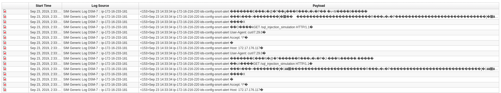
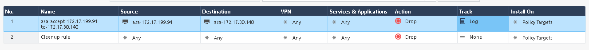

# Exercise 2.3 - Incident response

## Step 3.1 - Background

In this exercise we will focus on threat detection and response capabilities. As usual, security operators need a set of tools in enterprise IT to perform this task.

You are a security operator in charge of the corporate IDS. The IDS of our choice it Snort.

## Step 3.2 - Preparations

We will start this exercise with an operator looking at logs in Snort. So first we need to set up a snort rule to actually generate log entries. In your VS Code online editor, create and run the playbook `incident_snort_rule.yml`:

<!--  -->
```yml
---
- name: Add ids signature for sql injection simulation
  hosts: ids
  become: yes

  vars:
    ids_provider: snort
    protocol: tcp
    source_port: any
    source_ip: any
    dest_port: any
    dest_ip: any

  tasks:
    - name: Add snort sql injection rule
      include_role:
        name: "ansible_security.ids_rule"
      vars:
        ids_rule: 'alert {{protocol}} {{source_ip}} {{source_port}} -> {{dest_ip}} {{dest_port}}  (msg:"Attempted SQL Injection"; uricontent:"/sql_injection_simulation"; classtype:attempted-admin; sid:99000030; priority:1; rev:1;)'
        ids_rules_file: '/etc/snort/rules/local.rules'
        ids_rule_state: present
```
<!--  -->

To be able to execute the playbook we will use the prepared role `ids_rule` to modify IDS rules, like we did in the previous Snort exercise. If you missed that, install them via: `ansible-galaxy install ansible_security.ids_rule`

The same is true for the role `ids.config`: `ansible-galaxy install ansible_security.ids_config`

Run the playbook with:

```bash
[student<X>@ansible ~]$ ansible-playbook incident_snort_rule.yml
```

To have those rules generate logs, we need suspicious traffic - an attack. Again we have a playbook which simulates a simple access every few seconds on which the other components in this exercise will later on react to. In your VS Code online editor, create the playbook `sql_injection_simulation.yml` with the following content:

<!--  -->
```yml
---
- name: start sql injection simulation
  hosts: attacker
  become: yes
  gather_facts: no

  tasks:
    - name: simulate sql injection attack every 5 seconds
      shell: "/sbin/daemonize /usr/bin/watch -n 5 curl -m 2 -s http://{{ hostvars['snort']['private_ip2'] }}/sql_injection_simulation"
```
<!--  -->

Run it with:

```bash
[student<X>@ansible ~]$ ansible-playbook sql_injection_simulation.yml
```

Also we need the QRadar collection. This was installed already in the previous QRadar exercise. If you missed that part, install them via: `ansible-galaxy collection install ibm.qradar`

Also, to let the traffic between both machines pass, two things from the first Check Point exercise need to be completed: first the playbook `whitelist_attacker.yml` must have been run. And the logging for the attacker whitelist policy must have been activated. If you missed those steps, go back to the first Check Point exercise, create and execute the playbook, follow the steps to activate the logging and come back here.

The stage is set now. Read on to learn what this use case is about.

## Step 3.3 - Identify incident

As the security operator in charge of the corporate IDS, you routinely check the logs. From the terminal of your VS Code online editor, SSH to your snort node as the user `ec2-user` and view the logs:

```bash
[ec2-user@ip-172-16-11-22 ~]$ journalctl -u snort -f
-- Logs begin at Sun 2019-09-22 14:24:07 UTC. --
Sep 22 21:03:03 ip-172-16-115-120.ec2.internal snort[22192]: [1:99000030:1] Attempted SQL Injection [Classification: Attempted Administrator Privilege Gain] [Priority: 1] {TCP} 172.17.78.163:53376 -> 172.17.23.180:80
Sep 22 21:03:08 ip-172-16-115-120.ec2.internal snort[22192]: [1:99000030:1] Attempted SQL Injection [Classification: Attempted Administrator Privilege Gain] [Priority: 1] {TCP} 172.17.78.163:53378 -> 172.17.23.180:80
Sep 22 21:03:13 ip-172-16-115-120.ec2.internal snort[22192]: [1:99000030:1] Attempted SQL Injection [Classification: Attempted Administrator Privilege Gain] [Priority: 1] {TCP} 172.17.78.163:53380 -> 172.17.23.180:80
```

As you see this node has just registered multiple alerts to an **Attempted Administrator Privilege Gain**. Leave the log view by pressing `CTRL-C`.

If you want a closer look at the details in the snort log, check out the content of the file `/var/log/snort/merged.log` on the Snort machine:

```bash
[ec2-user@ip-172-16-180-99 ~]$ sudo tail -f /var/log/snort/merged.log
Accept: */*
[...]
GET /sql_injection_simulation HTTP/1.1
User-Agent: curl/7.29.0
Host: 172.17.30.140
Accept: */*
```
Besides some weird characters you will see the actual malformed "attack" of the user in the form of the string `sql_injection_simulation`. Leave the Snort server with the command `exit` .

## Step 3.4 - Create and run a playbook to forward logs to QRadar

To better analyze this incident it is crucial to correlate the data with other sources. For this we want to feed the logs into our SIEM, QRadar.

As you by now know, due to the missing integration of various security tool with each other, as a security operator in charge of the IDS we would now have to manually contanct another team or forward our logs via e-mail. Or upload them to a FTP server, carry them over on USB stick or worse. Luckily as shown in the last exercises already we can use Ansible to just configure Snort and Qradar.

In your VS Code online editor, create a playbook called `incident_snort_log.yml` like the following:

<!--  -->
```yaml
---
- name: Configure snort for external logging
  hosts: snort
  become: true
  vars:
    ids_provider: "snort"
    ids_config_provider: "snort"
    ids_config_remote_log: true
    ids_config_remote_log_destination: "{{ hostvars['qradar']['private_ip'] }}"
    ids_config_remote_log_procotol: udp
    ids_install_normalize_logs: false

  tasks:
    - name: import ids_config role
      include_role:
        name: "ansible_security.ids_config"

- name: Add Snort log source to QRadar
  hosts: qradar
  collections:
    - ibm.qradar

  tasks:
    - name: Add snort remote logging to QRadar
      qradar_log_source_management:
        name: "Snort rsyslog source - {{ hostvars['snort']['private_ip'] }}"
        type_name: "Snort Open Source IDS"
        state: present
        description: "Snort rsyslog source"
        identifier: "{{ hostvars['snort']['private_ip']|regex_replace('\\.','-')|regex_replace('^(.*)$', 'ip-\\1') }}"

    - name: deploy the new log sources
      qradar_deploy:
        type: INCREMENTAL
      failed_when: false
```
<!--  -->

This playbook should look familiar to you, it configures Snort to send logs to QRadar, configures QRadar to accept those and enables an offense. Run it:

```bash
[student<X>@ansible ~]$ ansible-playbook incident_snort_log.yml
```

## Step 3.5 - Verify new configuration in QRadar

Let's change our perspective briefly to the one of a security analyst: we mainly use the SIEM, and now logs are coming in from Snort. To verify that, access your QRadar UI, open the **Log Activity** tab and validate that events are now making to QRadar from Snort.



Remember that it helps to add filters to the QRadar log view to get a better overview, and that it might be necessary to change the display to **Raw Events**. Note that those logs already show the offense marker on the left side!

> **Note**
>
> If no logs are shown, wait a bit. It might take more than a minute to show the first entries. Also, the first logs might be identified with the "default" log source (showing **SIM Generic Log DSM-7** instead of **Snort rsyslog source**) so give it some time.

In the offenses tab filter the list of offenses for **Error Based SQL Injection**. Open the Offense summary to check the details of the attacker IP address previously seen in Snort logs.

## Step 3.6 - Blacklist IP

With all these information at hand, we positively identify this event as an attack. So let's stop it! We will blacklist the source IP of the attacker.

In a typical environment, performing this remediation would require yet another interaction with the security operators in charge of the firewalls. But we can launch an Ansible playbook to achieve the same goal in seconds rather than hours or days.

In your VS Code online editor, create a file called `incident_blacklist.yml`. Note that we do not enter the IP address here but again a variable, since Ansible already has the information from the inventory.

<!--  -->
```yaml
---
- name: Blacklist attacker
  hosts: checkpoint

  vars:
    source_ip: "{{ hostvars['attacker']['private_ip2'] }}"
    destination_ip: "{{ hostvars['snort']['private_ip2'] }}"

  tasks: 
    - name: Create source IP host object
      checkpoint_host:
        name: "asa-{{ source_ip }}"
        ip_address: "{{ source_ip }}"

    - name: Create destination IP host object
      checkpoint_host:
        name: "asa-{{ destination_ip }}"
        ip_address: "{{ destination_ip }}"

    - name: Create access rule to deny access from source to destination
      checkpoint_access_rule:
        auto_install_policy: yes
        auto_publish_session: yes
        layer: Network
        position: top
        name: "asa-accept-{{ source_ip }}-to-{{ destination_ip }}"
        source: "asa-{{ source_ip }}"
        destination: "asa-{{ destination_ip }}"
        action: drop

    - name: Install policy
      cp_mgmt_install_policy:
        policy_package: standard
        install_on_all_cluster_members_or_fail: yes
      failed_when: false
```
<!--  -->

Run the playbook, to effectively blacklist the IP:

```bash
[student<X>@ansible ~]$ ansible-playbook incident_blacklist.yml
```

In your QRadar UI, verify in the Log Activity tab that you do not receive any more alerts from Snort. Note that, if you would have connected the firewall to QRadar, theere would actually be logs coming in from there.

Also, let's quickly verify that the new rule was added to Check Point: Access the Windows workstation and open the SmartConsole interface. On the left side, click on **SECURITY POLICIES** and note that the access control policy entry changed from **Accept** to **Drop**.



You have successfully identified an attack and blocked the traffic behind the attack!

## Step 3.7 - Roll back

As the final step, we can run the rollback playbook to undo the Snort configuration, reducing resource consumption and the analysis workload.

Execute the playbook `rollback.yml` we wrote in the last exercise to roll all changes back.

```bash
[student<X>@ansible ~]$ ansible-playbook rollback.yml
```

Note here that the playbook runs through without problems - even though we did not configure Check Point as a log source for QRadar this time! This is possible since Ansible tasks are most often idempotent: they can be run again and again, ensuring the desired state.

Also we need to kill the process sending out attack. From the terminal of your VS Code online editor, execute the follwing Ansible ad-hoc command:

<!--  -->
```bash
[student1@ansible ~]$ ansible attacker -b -m shell -a "sleep 2;ps -ef | grep -v grep | grep -w /usr/bin/watch | awk '{print $2}'|xargs kill &>/dev/null; sleep 2"
attacker | CHANGED | rc=0 >>
```
<!--  -->

If you get an error saying `Share connection to ... closed.`, don't worry: just execute the command again.

You are done with this last exercise. Congratulations!

## Step 3.8 - Wrap it all up

It happens that the job of a CISO and her team is difficult even if they have in place all necessary tools, because the tools don’t integrate with each other. When there is a security breach, an analyst has to perform a triage, chasing all relevant piece of information across the entire infrastructure, taking days to understand what’s going on and ultimately perform any sort of remediation.

Ansible Security Automation is a Red Hat initiative to facilitate the integration of a wide range of security solutions through a common and open automation language: Ansible. Ansible Security Automation is designed to help security analysts investigate and remediate security incidents faster.

This is how ansible security automation can integrate three different security products, an enterprise firewall, an IDS, and a SIEM, to help security analysts and operators in investigation enrichment, threat hunting and incident response.

Ansible Security Automation allows security organizations to create pre-approved automation workflows, called playbooks, that can be maintained centrally and shared across different teams. And with the help of Tower, we can even provide those automation workflows to other teams in a controlled, user friendly and simple to consume way.

----

[Click Here to return to the Ansible Security Automation Workshop](../README.md#section-2---ansible-security-automation-use-cases)
