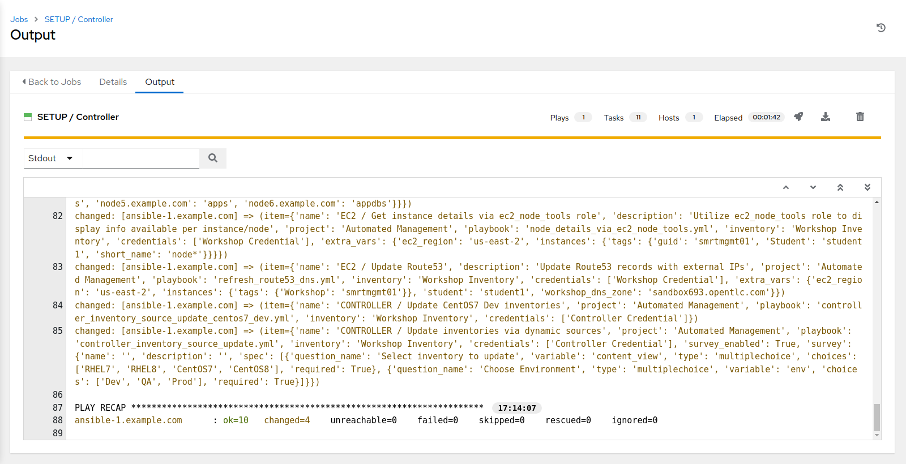
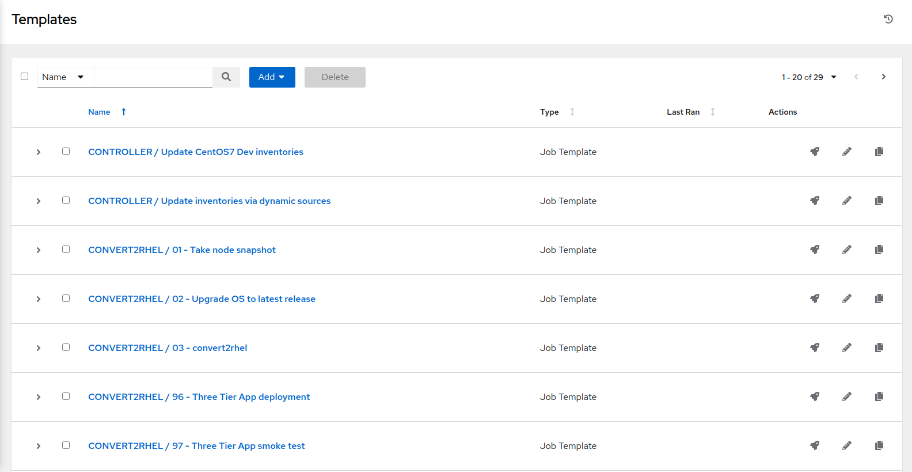
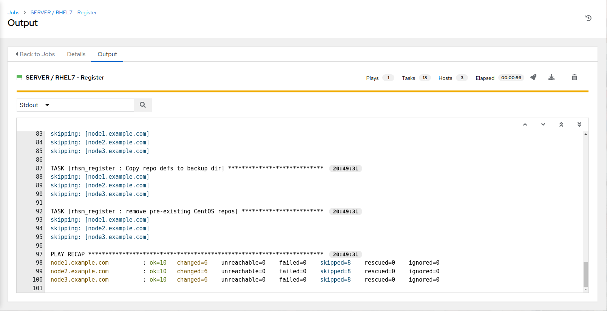
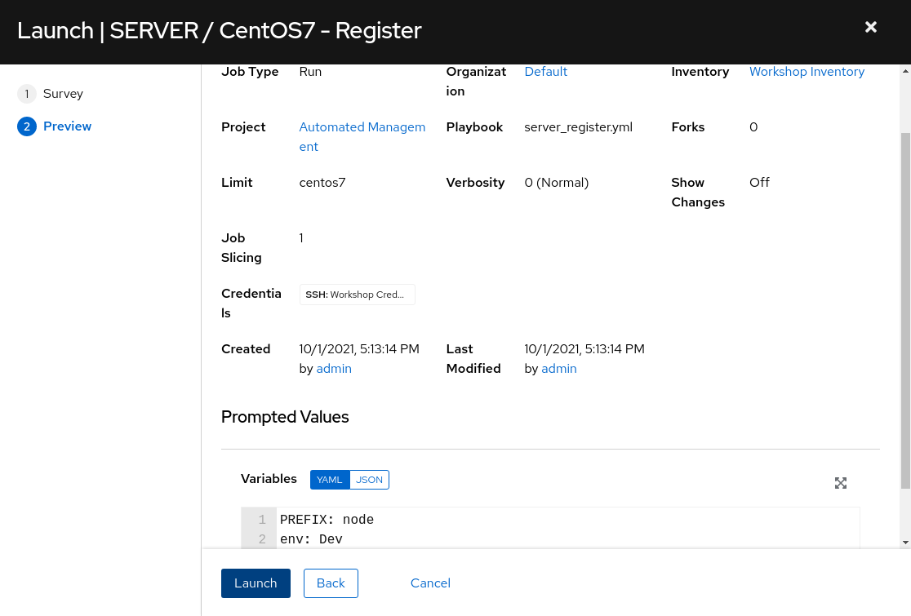
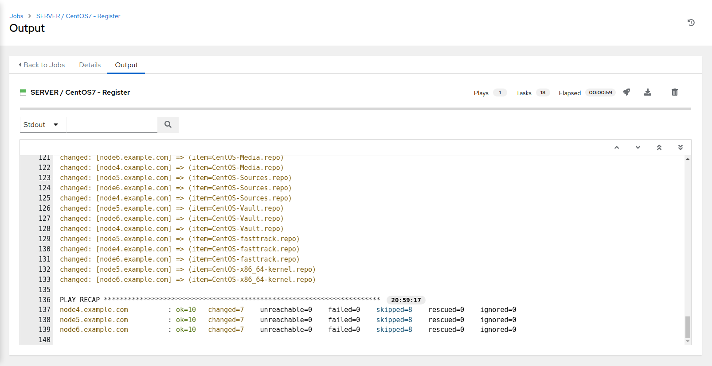
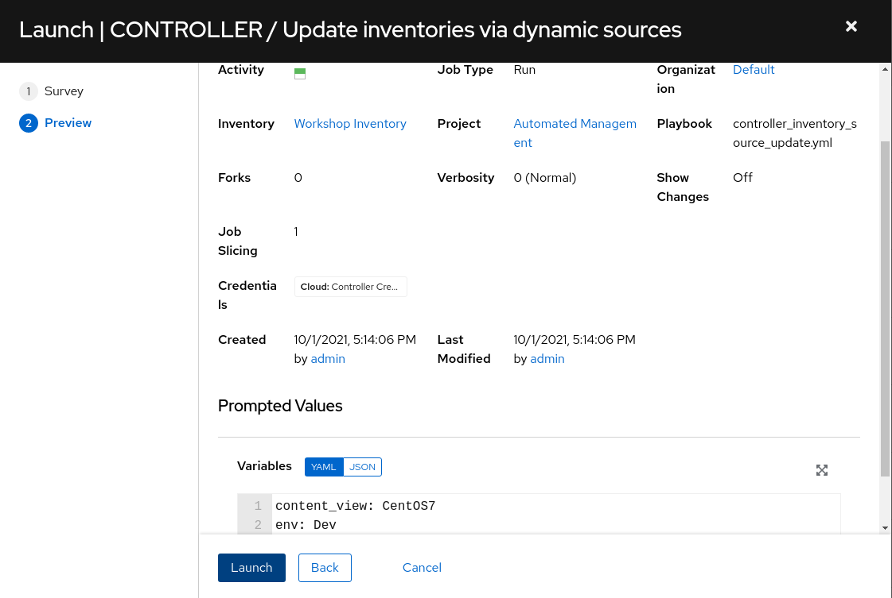
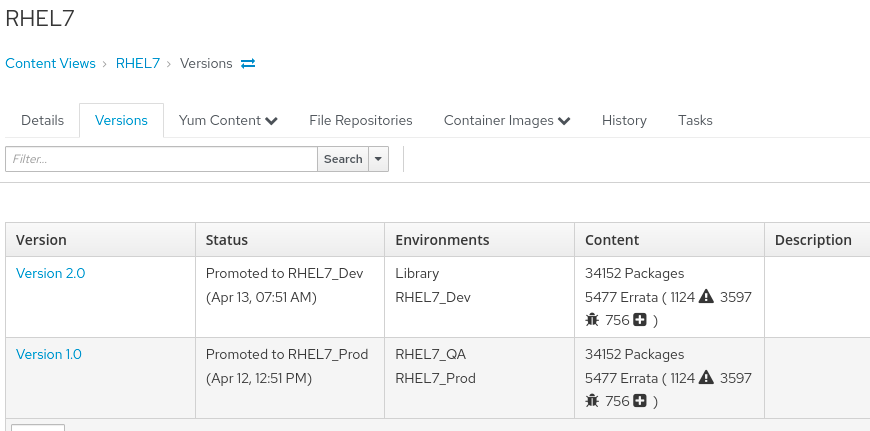

Gestion intelligente automatisée Atelier : Configurer l'environnement du laboratoire
====================================================================

Objectif
---------
L'objectif de cet exercice est de mettre en place le laboratoire environemnt après une infrastructure en tant que processus de code. Cet exercice vous obligera à lancer (9) livres de lecture. Les playbooks réalisent ce qui suit:

- Populate Ansible Controller with an inventory source, add templates, as well as an additional project.
- Publier RHEL7 dev vue de contenu dans Satellite
- Enregistrer des serveurs à l'installation satellite - RHEL7
- Enregistrer des serveurs à l'installation satellite - CentOS7
- Pétrir les inventaires dynamiques - RHEL7
- Planter les inventaires dynamiques - CentOS7

> **NOTE** Pour gagner du temps, Satellite aura déjà un travail exécuté qui configure les environnements de cycle de vie appropriés, les vues de contenu, les clés d'activation.

Environnement
---------
> **NOTE** Voici les URL *example*. Vos URLs de laboratoire étudiant et vos identifiants sont fournis depuis la page d'accueil des ateliers après votre signature avec votre adresse Nom et Email.
* Plateforme d'automatisation ansible
* **Exemple:** `https://student1.01d1.example.opentlc.com`
* Ansible Automation Platform login/password de la page d'accueil des ateliers.
* Adresse satellite
* **Exemple:** `https://student1-sat.01d1.example.opentlc.com` (Notez le -sat ajouté à l'URL)
* Connexion par satellite/mot de passe (même que ci-dessus)

> **NOTE** Il y a un certain nombre d'avertissements (comme [DEPRECATION WARNING]) dans la sortie playbook run - ceux-ci peuvent être ignorés en toute sécurité aux fins de cet atelier.

Exercice
--------

#### 1\. Se connecter à la plate-forme d'automatisation ansible (AAP)

- Utilisez un navigateur web sur votre ordinateur pour accéder à l'interface graphique AAP via le lien trouvé dans l'environnement ci-dessus. Et utilisez le nom d'utilisateur et le mot de passe fournis dans votre "Workbench Information"
sur votre "Workshops Homepage".

- Lors d'une connexion réussie, vous pourrez voir le tableau de bord de la plate-forme d'automatisation ansible.

- Utilisez le menu du volet latéral sur la gauche pour sélectionner **Projets** et examiner les deux projets nommés ** Gestion automatisée** et **Fact Scan**. Ces projets, ainsi que l'inventaire de l'atelier (**Inventoires** - Cancer **Inventaire des ateliers de travail**) ont été mis en place pour vous pendant la fourniture de l'environnement du laboratoire.

#### 2\. Lancer des modèles de travail ansibles

Cette étape montre l'exécution de modèles d'emploi. Cependant, cette étape utilise sept modèles pour initialiser la configuration de l'environnement du laboratoire.

- Utilisez le menu de la poêle latérale sur la gauche pour sélectionner **Modèles**.

- D'abord, vous devriez voir deux **Modèles** nommés **SETUP / Satellite** et **SETUP / Controller**.

> **NOTE** Remarquez que le **SETUP / Satellite** travail a déjà été terminé pour vous.

Premièrement, vous devrez exécuter le modèle de travail **SETUP / Contrôleur**.

- Cliquez sur le  à droite du modèle de travail **SETUP / Contrôleur**.

Vous serez conduit à la fenêtre de sortie **Jobs phy SETUP / Contrôleur** où vous pourrez suivre chaque tâche exécutée dans le cadre du playbook. Cela prendra environ 2 minutes pour terminer.

> **NOTE** Veuillez autoriser le **SETUP / Controller** job à exécuter avant de passer à l'exécution du prochain modèle.

Lorsque vous aurez terminé, vous verrez un statut réussi ainsi qu'une reprise de jeu en bas de l'écran.

- Retourner au **Modèles** sur la face gauche.

Le travail **SETUP / Contrôleur** créera plusieurs modèles d'emploi qui seront utiles tout au long du reste de cet atelier.

Maintenant que nous avons plusieurs autres modèles à notre disposition, nous aurons besoin d'en exécuter quatre autres afin de terminer la configuration.

Courez le **SATELLITE / RHEL - Publier le contenu Voir le modèle d'emploi** en cliquant sur le bouton !(images/0-setup-aap2-launch.png) pour lancer. Lors de l'enquête sur la vue du contenu pour publier, à partir du menu déroulant, sélectionnez **RHEL7**
- Sélectionnez **Suivant** pour examiner le réglage de la course d'emploi, puis cliquez sur **Launch** pour exécuter le modèle de travail.

Vous serez emmené à la fenêtre de sortie **Jobs SATELLITE / RHEL - Publier un contenu View** où vous pourrez suivre chaque tâche exécutée dans le cadre du playbook. Cela prendra environ 1 min pour terminer.

Ensuite, retournez à Templates et exécutez le modèle de travail **CONVERT2RHEL / 01 - Take node snapshot** en cliquant sur le  pour lancer.

Vous serez emmené à la fenêtre de sortie **CONVERT2RHEL / 01 - Take node snapshot** où vous pourrez suivre chaque tâche exécutée dans le cadre du playbook. Cela prendra environ 7 minutes pour terminer.

Ensuite, retournez à Templates et exécutez le modèle de travail **SERVER / RHEL7 - S'inscrire** en cliquant sur le  pour lancer.

- Vous serez présenté avec un sondage. Remplissez ceci comme suit:

- Sélectionnez **Suivant** pour procéder à la confirmation de la réponse.

- Sélectionnez **Lancement** pour exécuter le modèle de travail.

Vous serez emmené à la fenêtre de sortie **SERVER / RHEL7 - S'inscrire** où vous pourrez suivre chaque tâche exécutée dans le cadre du playbook. Cela prendra environ 1 min pour terminer.

Ensuite, retournez à Templates et exécutez le modèle de travail **SERVER / CentOS7 - Enregistrer** en cliquant sur le  pour lancer.

- Vous serez présenté avec un sondage. Remplissez ceci comme suit:

- Sélectionnez **Suivant** pour procéder à la confirmation de la réponse.

- Sélectionnez **Lancement** pour exécuter le modèle de travail.

Vous serez emmené à la fenêtre de sortie **SERVER / CentOS7 - Enregistrer** où vous pourrez suivre chaque tâche exécutée dans le cadre du playbook. Cela prendra environ 1 min pour terminer.

Ensuite, retournez à Templates et exécutez le modèle de travail **EC2 / Set instance tags based on Satellite(Foreman) facts** en cliquant sur le  pour lancer.

Vous serez conduit à la fenêtre de sortie **EC2 / Set instance tags based on Satellite(Foreman) facts** où vous pourrez suivre chaque tâche exécutée dans le cadre du playbook. Cela prendra environ 1 min pour terminer.

> **REMARQUE** Pour le modèle d'emploi suivant, consultez la section **Variables** du modèle, en payant une note particulière au **group_tag_map** variable. Une cartographie des nœuds aux noms de groupe est définie. Les balises EC2 pour ces noms de groupe seront assignées aux noeuds définis et cela sera utilisé plus tard par la construction d'inventaire dynamique pour construire des groupes d'inventaires ansibles contenant les noeuds définis, c'est-à-dire. "frontends", "apps", "appdbs".

Ensuite, exécutez le modèle de travail **EC2 / Set instance tag - AnsibleGroup** en cliquant sur le  pour lancer.

Vous serez emmené à la fenêtre de sortie **EC2 / Set instance tag - AnsibleGroup** où vous pourrez suivre chaque tâche exécutée dans le cadre du playbook. Cela prendra environ 1 min pour terminer.

#### 3\. Inventaires dynamiques - inventaires de compréhension peuplés par des sources dynamiques

> **NOTE** Avant d'exécuter les modèles de mise à jour dynamique des inventaires dans les prochaines étapes, naviguez d'abord à l'emplacement des inventaires dans AAP et examinez les inventaires suivants:
>
> - ALL Development = Hosts
> - CentOS7 Development = Hosts
> - Développement RHEL7 = vaccin Hosts
>
> Notez que ces inventaires doivent encore être peuplés. En outre, pendant que vous êtes dans chacun de ces inventaires, cliquez sur le bouton « Sources » et examinez comment chacun de ces inventaires de sources dynamiques sont configurés, en prenant note de la section « SOURCE VARIABLES » pour comprendre comment les hôtes et les groupes qui en résultent pour cet inventaire sont peuplés.

Ensuite, retournez à Templates et exécutez le modèle de travail **CONTROLLER / Mise à jour des inventaires via des sources dynamiques** en cliquant sur le  pour lancer.

- Vous serez présenté avec un sondage. Remplissez ceci comme suit:

- Sélectionnez **Suivant** pour procéder à la confirmation de la réponse.

- Examen des variables supplémentaires (vous devrez faire défiler le bas de l'enquête)

- puis sélectionnez **Lancement** pour exécuter le modèle de travail. Cela devrait prendre moins de 30 secondes pour courir.

Exécutez le modèle de travail **CONTROLLER / Mise à jour des inventaires via des sources dynamiques** en cliquant sur le  pour le lancer.

- Vous serez présenté avec un sondage. Remplissez ceci comme suit:

- Sélectionnez **Suivant** pour procéder à la confirmation de la réponse.

- Examen des variables supplémentaires

- puis sélectionnez **Lancement** pour exécuter le modèle de travail.

#### 4\. Inventaires dynamiques - inventaires d'examen peuplés par des sources dynamiques - Mis à jour

> **NOTE** Maintenant que les modèles de mise à jour de l'inventaire dynamique ont été exécutés, naviguez à l'emplacement des Inventories dans AAP et examinez les inventaires suivants:
>
> - ALL Development = HOSTS
> - CentOS7 Development = HOSTS
> - Développement RHEL7 = vaccin HOSTS
>
> Examiner la façon dont les hôtes et les groupes résultants sont définis à partir d'informations basées sur les balises établies à partir de requêtes antérieures de modèles d'emploi par satellite. Prenez le temps de cliquer sur un hôte et de regarder les variables qui ont été recueillies et définies dans la section "Variables".

Ensuite, connectez-vous à Satellite pour effectuer la vérification.

#### 5\. Se connecter au satellite et valider votre environnement

- Utilisez un navigateur web sur votre ordinateur pour accéder à l'interface satellite via le lien trouvé dans l'environnement ci-dessus. Et utilisez le nom d'utilisateur et le mot de passe suivant pour vous connecter : *admin / ^password_set_in_deploy_vars PHP*. Une fois connecté, vous verrez la page principale du moniteur.

- Cliquez sur **Hosts** - Cancer **Tous les hôtes** pour valider que trois nœuds de serveur RHEL7 et trois CentOS7 sont enregistrés sur Satellite.

- Cliquez sur **Content** - Cancer **Content Views** - Cancer **RHEL7** pour vérifier que tous les environnements Dev, QA et Prod sont comptabilisés.

#### 4\. Fin de l’exercice

- Vous avez terminé cet exercice
- Continuer à [Exercise 1: Compliance / Vulnerability Management](../1-compliance/README.fr.md, OU [Return to the main workshop page](../README.fr.md
