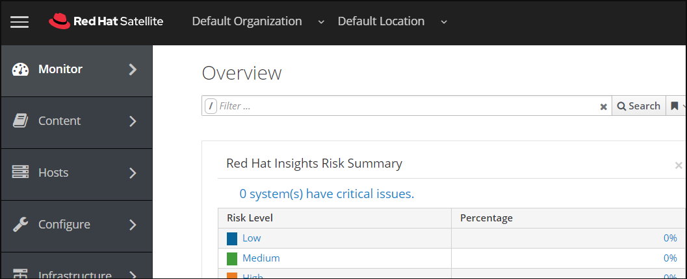
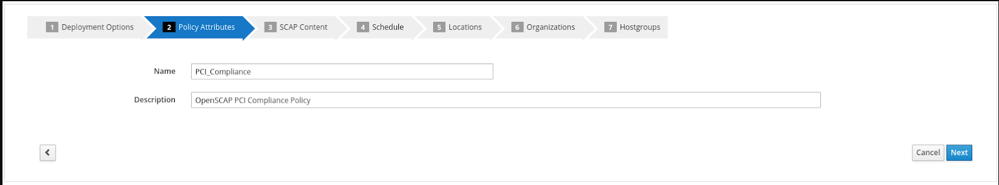
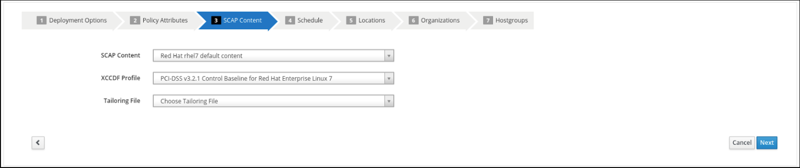
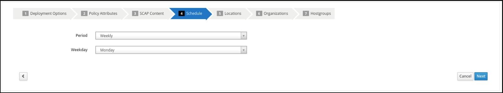
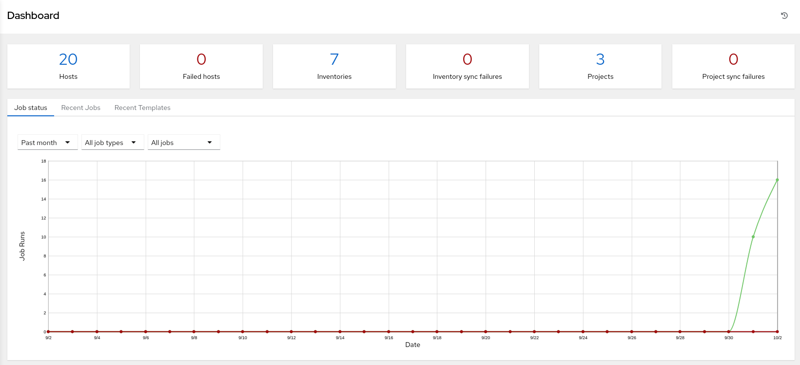
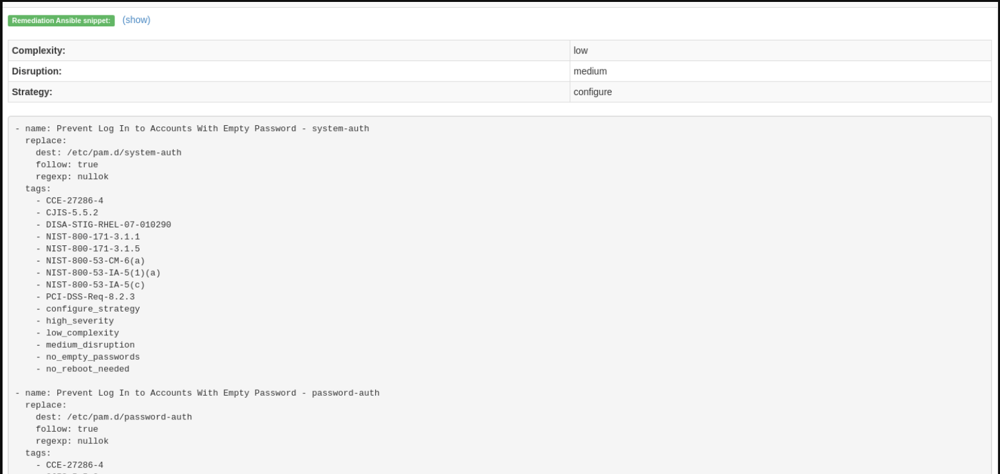
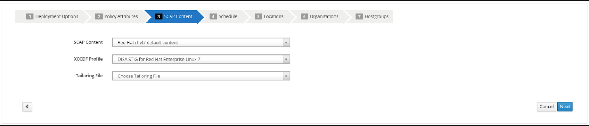
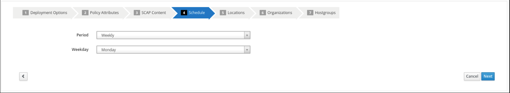
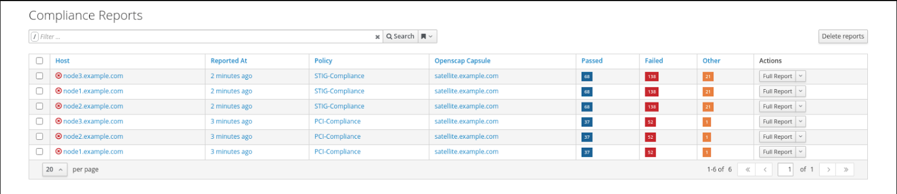

Gestion intelligente automatisée Atelier : Configurer et exécuter une analyse OpenSCAP
================================================================================

Dans cet exercice, nous apprendrons comment configurer et effectuer un scan OpenSCAP en utilisant des livres de lecture dans Ansible Automation Platform 2 avec Satellite. En exécutant plusieurs systèmes Linux Red Hat Enterprise, il est important de garder tous ces systèmes conformes à une politique de sécurité significative et d'effectuer des scans de sécurité souvent. OpenSCAP est un projet open source qui est utilisé par les organismes gouvernementaux, les sociétés, ainsi que le commerce électronique (pour ne citer que quelques exemples). OpenSCAP fournit des outils pour la vérification automatisée de la vulnérabilité. Satellite peut être chargé avec les paquets RPM pour SCAP workbench v1.2.0-8 qui fournira des capacités de numérisation. Satellite est également chargé avec le guide de sécurité SCAP v0.1.54-3 pour les appareils RHEL7 et CentOS qui fournit les repères XCCDF appropriés pour la conformité PCI et STIG aux fins de cet exercice. Cet exercice se concentrera sur les systèmes RHEL, CentOS sera hors de portée.

Environnement
-----------

- Red Hat Satellite v6.x, Ansible Automation Platform 4.x

- 3 clients Red Hat Enterprise Linux v7.9

Préalables
--------------------------------------------------------------------------------------

- Exercice 0 : Configuration Lab

- Organisation à utiliser = Organisation par défaut

- Vue du contenu = RHEL7

- Environnements de cycle de vie = Dev, QA, Prod

Exercice
--------

#### 1\. Se connecter au satellite

- Utilisez un navigateur web sur votre ordinateur pour accéder à l'interface utilisateur satellite fourni, puis connectez-vous en utilisant la nomenclature suivante: *admin /*


- Vous verrez le tableau de bord satellite lorsque vous vous connectez



#### 2\. Créer une nouvelle politique de conformité

Maintenant, nous allons commencer à configurer une politique de conformité que nous pouvons utiliser pour analyser nos noeuds RHEL.

- Dans le hover satellite sur 'Hosts' à partir du menu sur le côté gauche, puis cliquez sur 'Policies'

- Cliquez sur le bouton « Nouvelle politique » et remplissez les détails comme suit à l'étape 3.


#### 3\. Configurer une nouvelle politique de conformité

Maintenant, nous allons commencer à configurer notre serveur satellite pour pouvoir gérer une politique de conformité

- Sélectionnez "Manual" dans les options de déploiement et cliquez sur "Next"


- Créer le nom de la politique "PCI_Compliance" et fournir toute description que vous voulez. Puis cliquez sur "Suivant"



- Sélectionnez le contenu par défaut "Red Hat rhel7" et "PCI-DSS v3.2.1 Baseline de contrôle pour Red Hat Enterprise Linux 7". Il n'y a pas de fichier d'adaptation. Puis cliquez sur "Suivant"



- Il faut établir un calendrier pour créer une nouvelle politique de conformité. Vous pouvez sélectionner "Weekly" et "Monday" aux fins de cet exercice. Puis cliquez sur "Suivant"



- Les étapes 5, 6 et 7 dans le cadre de la nouvelle politique de conformité peuvent utiliser des valeurs par défaut. Cliquez sur "Suivant" par "Lieux", et "Organisations". Pour "Hostgroups" cliquez sur "Soumettre"


#### 4\. Se connecter à la plate-forme d'automatisation ansible

- Utilisez un navigateur web sur votre ordinateur pour accéder à l'interface utilisateur Ansible via le lien trouvé dans votre environnement puis connectez-vous à l'aide de la nomenclature suivante: *admin /*


- Une fois que vous vous êtes connecté à Ansible Automation Platform 2, vous serez affiché la page la plus récente visitée.



#### 5\. Configurer et lancer un modèle de plateforme d'automatisation ansible pour lancer un scan OpenSCAP.

Cette étape nous permettra de scanner un seul hôte rhel7 avec la politique ```PCI_Compliance``` que nous avons configurée sur Satellite.

- Dans Ansible Automation Platform cliquez sur 'Templates' dans le menu de la pane latérale gauche

- Cliquez sur l'icône BLUE 'Add' et sélectionnez 'Ajouter un modèle d'emploi' dans le menu déroulant. Remplir les détails comme suit:

Nom: SATELLITE / Conformité - OpenSCAP_Configure

Type de travail: Cours

Inventaire : Développement RHEL7 (Cliquez sur l'icône pour sélectionner.)

Projet: Gestion automatisée (Cliquez sur l'icône pour sélectionner.)

Environnement d'exécution : environnement d'exécution d'atelier smart_mgmt (Cliquez sur
icône de verre grossissant pour sélectionner.)

Playbook: configure_openscap.yml (Cliquez sur la liste pour sélectionner.)

Pouvoirs : Atelier Credential et Credential
(Cliquez sur l'icône pour sélectionner.)
NOTE: Dans ce nouveau menu. Sélectionnez le bouton de radio Credential de l'atelier
bouton. La catégorie choisie pour ceci est 'Machine'. Ensuite, utilisez le
menu déroulant 'Sélection de catégorie' pour sélectionner Satellite_Collection.
Vous choisirez le Credential Satellite. Cela vous fournira
deux séries de pouvoirs. Choisir 'Sélectionner' sauvera vos changements
et quitter le menu.

Variables supplémentaires (Regardez l'espacement exact fourni ci-dessous. Notez que
extra-vars que nous fournissons doivent être au format YAML):

---
HOSTS: node1.example.com
Policy_scan:
- PCI_Compliance


- Laissez le reste des champs vierges ou comme ils sont, et cliquez sur 'Save'. Vous pouvez
puis sélectionnez 'Launch' pour déployer le modèle d'emploi.


Sélectionnez le lancement vous mènera à la fenêtre de sortie **Jobs SATELLITE / Conformité - OpenSCAP_Configure** où vous pourrez suivre chaque tâche exécutée dans le cadre du playbook. Cela prendra environ 3 minutes pour terminer. Attendez que le modèle d'emploi se termine avant de passer à l'étape suivante.


#### 6\. Naviguez de nouveau sur Satellite pour examiner le fichier de déclaration d'actifs (ARF).

- Survoler 'Hosts' dans le menu de la pane latérale, puis cliquez sur 'Reports'.

- Cliquez sur le bouton 'Full Report', sous Actions, pour 'node1.example.com' pour évaluer

- Retournez à la section **Aperçu général**. Vous pouvez trier par "Pass", "Fail", "Fixed", ou tout nombre de qualificatifs ainsi que des règles de groupe par "Severity"


- Le choix d'une règle présente d'autres renseignements concernant la justification ainsi qu'une description de la règle qui comprend des références et des identifiants.
- Maintenant, décochez tout sauf la case **échouement**. Ensuite, faites défiler.
cliquez sur l'échec "Prevent Login to Accounts With Empty Password"

- Si vous défilez la page, vous remarquerez plusieurs options d'assainissement, y compris
Un snippet 'Ansible'. Cliquez sur "montrer" à côté du "Snippet d'assainissement",
qui présente ensuite des tâches que vous pouvez inclure dans un livre de lecture pour automatiser
l'assainissement dans les systèmes touchés.



#### 7\. Expanding OpenSCAP policy scans

Cette étape élargira notre analyse politique OpenSCAP pour ajouter un autre profil de conformité XCCDF appelé ```STIG_Compliance```. Nous allons également nous étendre pour inclure tous les systèmes dans l'inventaire 'RHEL7 Development' en ajustant la variable supplémentaire 'HOSTS' à 'all' au lieu de spécifier un système unique.

- Dans Satellite, passez par "Hosts" dans le menu à gauche de l'écran, puis cliquez sur "Policies".

- Cliquez sur le bouton "Nouvelle politique de conformité"

- Sélectionnez "Manual" dans les options de déploiement et cliquez sur "Next"


- Créer le nom de la politique "STIG_Compliance" et fournir toute description que vous voulez. Puis cliquez sur "Suivant"


- Sélectionnez le contenu par défaut "Red Hat rhel7" et "DISA STIG for Red Hat Enterprise Linux 7". Il n'y a pas de fichier d'adaptation. Puis cliquez sur "Suivant"



- Il faut établir un calendrier pour créer une nouvelle politique de conformité. Vous pouvez sélectionner "Weekly" et "Monday" à des fins de laboratoire. Puis cliquez sur "Suivant"



- Les étapes 5, 6 et 7 dans le cadre de la nouvelle politique de conformité peuvent utiliser des valeurs par défaut. Cliquez sur "Suivant" par "Lieux", "Organisations", et "Hostgroups"


- Maintenant, nous allons mettre à jour notre modèle d'emploi OpenSCAP_Configure dans Ansible Automation Platform et lancer un autre scanner de conformité PCI, plus le scan de conformité STIG.
- Dans Ansible Automation Platform, cliquez sur 'Templates' dans le menu de la pane latérale gauche
- Sélectionnez le modèle d'emploi OpenSCAP_Configure, et cliquez sur éditer en bas du modèle pour apporter des modifications aux « Variables Extra » :

Variables supplémentaires (Regardez l'espacement exact fourni ci-dessous.
Notez que les extravars que nous fournissons doivent être
en format YAML):

---
HOSTS : tous
Policy_scan:
- PCI_Compliance
- STIG_Compliance


- Laissez le reste des champs vierges ou comme ils sont, et cliquez sur 'Save'. Vous pouvez ensuite sélectionner 'Launch' pour déployer le modèle d'emploi.

- Sélectionnez le lancement vous conduira à la fenêtre de sortie **Jobs SATELLITE / Conformité - OpenSCAP_Configure**. Cela prendra environ 5 minutes pour terminer. Attendez que le modèle d'emploi se termine avant de passer à l'étape suivante.


#### 8\. Naviguez de nouveau sur Satellite pour examiner le fichier de déclaration d'actifs (ARF).

- Survoler "Hosts" dans le menu à gauche de l'écran, puis cliquez sur "Reports".

- Notez que nous avons maintenant facilement réduit à six scans, 2 scans de chaque noeud pour PCI_Compliance et pour STIG_Compliance.



- Chaque rapport peut être examiné indépendamment d'autres analyses de noeuds et des mesures correctives pour les constatations de règles peuvent être complétées selon les exigences de vos propres politiques internes.

#### 9\. End Lab

- Tu as fini le labo.
- Continuer à [Exercise 2: Patch Management / OS](../2-patching/README.fr.md, OU [Return to the main workshop page](../README.fr.md
