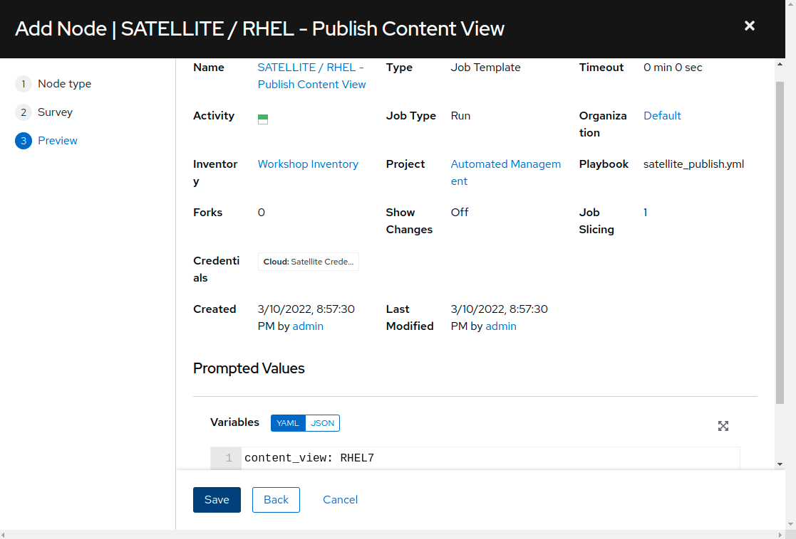
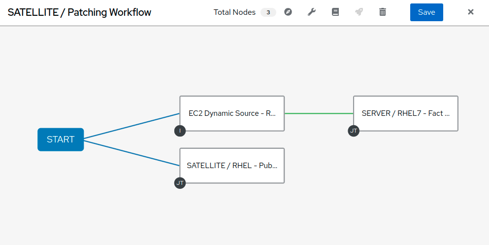
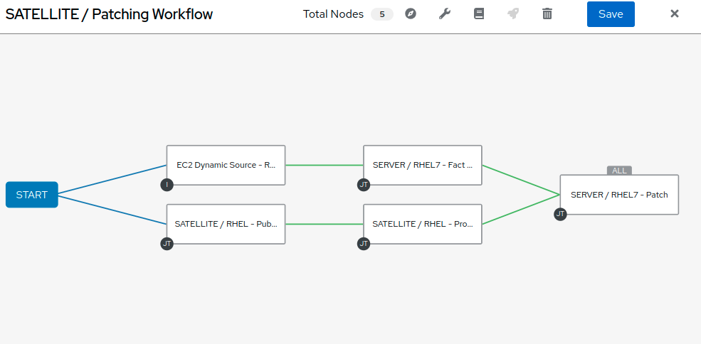
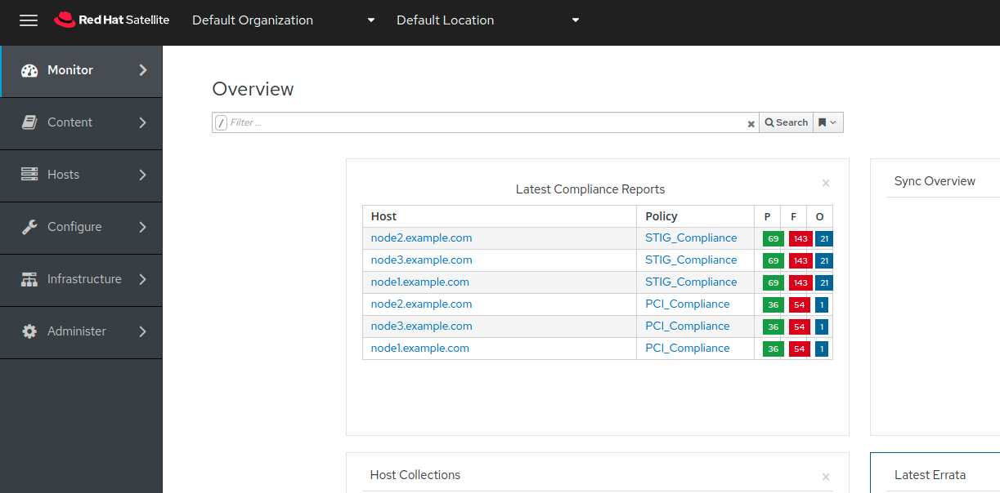
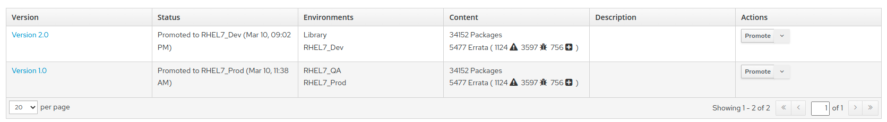
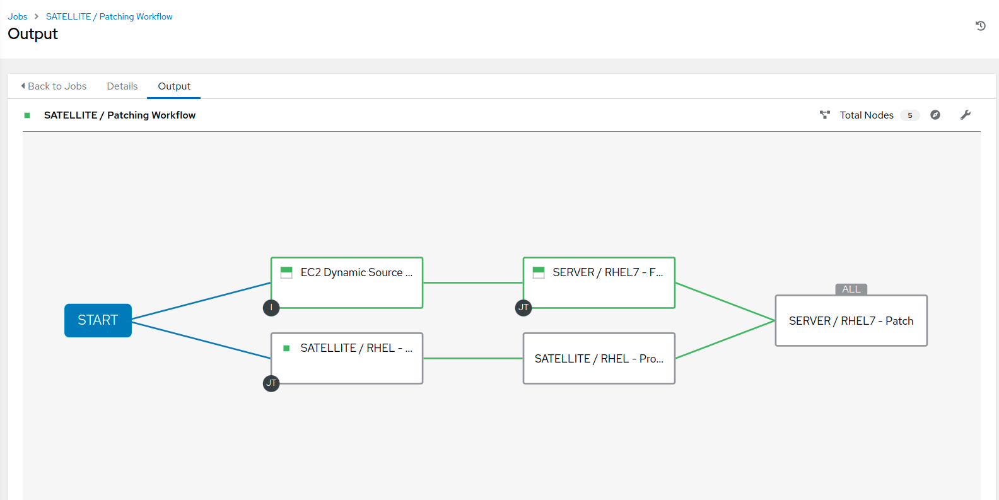
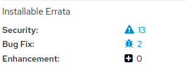

Atelier automatisé de gestion intelligente : Automatisation de la gestion du patch
================================================================

Dans cette partie de l'atelier, nous apprendrons comment utiliser des workflows dans Ansible Automation Platform pour orchestrer la gestion de patchs pour plusieurs serveurs linux. Automatiser la gestion des patchs réduit les erreurs humaines et améliore la configuration et la précision des patchs. En outre, l'automatisation fournit des capacités pour réduire l'entrée manuelle associée aux systèmes d'identification, de test et de patching. L'utilisation de la plateforme Automation permet des scénarios de patching plus compliqués.

Environnement
-----------

- Satellite 6.x, Ansible Automation Platform 4.x

- 3 clients Red Hat Enterprise Linux v7.9

Préalables
--------------

- Exercice 0 : Configuration Lab

- Organisation à utiliser = Organisation par défaut

- Lieu à utiliser = Lieu par défaut

- Une vue de contenu = RHEL7

- Environnements de cycle de vie = Dev, QA, Prod

Exercice
--------

#### 1\. Se connecter à la plate-forme d'automatisation ansible

- Utilisez un navigateur web sur votre ordinateur pour accéder à l'interface utilisateur Ansible Automation Platform via le lien trouvé dans l'environnement ci-dessus. Et utilisez le nom d'utilisateur et le mot de passe suivant pour vous connecter: admin / ^password vous avez été fourni

- Une fois dans la plateforme d'automatisation, vous pourrez voir un tableau de bord

#### 2\. Création d'un nouveau flux de travail de Patching

Maintenant, nous allons commencer à configurer un workflow qui comprend la publication d'une vue de contenu, la promotion d'une vue de contenu, une analyse de faits, ainsi qu'un patching de serveur. L'objectif est de publier une nouvelle vue de contenu et de promouvoir notre environnement rhel7_DEV à QA.

- Commencez en cliquant sur "Templates" dans le menu à gauche, puis cliquez sur le bouton "Ajouter" et choisissez "Ajouter le modèle de workflow".

- Créer le nom "SATELLITE / Patching Workflow" et cliquez sur Enregistrer (il n'y a pas d'autres options nécessaires pour sélectionner sur cette page).

- Cela devrait ouvrir un flux de travail vierge, offrant de commencer à le construire en choisissant le bouton de démarrage vert. Vous pouvez toujours revenir à ce flux de travail à partir du modèle en sélectionnant l'onglet 'Visualizer'.

- Sélectionnez Commencer à ajouter un noeud. Dans le menu déroulant "Node Type" sélectionnez "Inventory Source Sync" et cliquez sur "EC2 Dynamic Source - RHEL7 Development". Ceci établit l'inventaire que vous utiliserez dans votre flux de travail. Cliquez sur 'Save'.

- Démarrer de nouveau pour ajouter un second noeud (Cliquez sur l'affiche "+"). Dans le menu déroulant "Node Type" sélectionnez "Job Template" puis regardez en haut et cliquez sur "SATELLITE / RHEL - Publiez Content View". Laissez "Convergence" sur "Any". Cliquez sur Suivant - une enquête est jointe à ce modèle afin que vous aurez besoin de sélectionner la vue de contenu correcte pour les serveurs que nous allons patcher. Sélectionnez la vue de contenu 'RHEL7' et cliquez sur 'next'. Vous devrez alors confirmer l'aperçu de ce noeud de workflow en cliquant sur 'Save':

Cette étape dans le workflow ajoute votre premier modèle de travail qui exécute un playbook appelé 'satellite_publish.yml'.

- Ajouter le troisième noeud au flux de travail en survolant votre nœud d'inventaire 'EC2 Dynamic Source - RHEL7 Development' et sélectionnez l'icône + pour générer un autre noeud de workflow. Dans la fenêtre pop-up, sélectionnez 'On Success', puis Suivant. Dans la fenêtre de suivi, Node Type sera 'Job Template'. Sélectionnez 'SERVER / RHEL7 - Fact Scan', laissez 'Convergence' à 'Any' et sélectionnez Suivant. Cette étape dans le workflow analysera les noeuds dans notre inventaire satellite pour vérifier les mises à jour des paquets et errata. Vous n'avez pas besoin de limiter le modèle d'emploi, alors cliquez sur Suivant, puis Enregistrer pour terminer la configuration node.

À ce stade, votre flux de travail devrait ressembler à ce qui suit:

- Il y a deux autres noeuds à ajouter à ce flux de travail. Hover the 'SATELLITE / RHEL - Publier le contenu View' node et cliquez sur l'icône +. Dans la fenêtre pop-up, sélectionnez 'On Success' et ensuite Suivant. Ajoutez le modèle de travail 'SATELLITE / RHEL - Promote Content View' et laissez 'Convergence' à 'Any' à nouveau. Il y a une enquête qui nécessite des variables pour la vue du contenu, l'environnement actuel du cycle de vie et l'environnement du cycle de vie suivant. Aux fins de ce laboratoire, nous allons promouvoir Dev à QA.

- Sélectionnez RHEL7 pour 'Content View '

- Sélectionnez RHEL7_Dev pour 'Current Lifecycle Environment '

- Sélectionnez RHEL7_QA pour 'Next Lifecycle Environment '

Cliquez sur Suivant. Vous aurez alors besoin de 'Save' la prévisualisation.

- Ajouter le dernier noeud en survolant 'SATELLITE / RHEL- Promote Content View' et en sélectionnant l'icône +. Dans la fenêtre pop-up, sélectionnez 'On Success', puis Suivant. Ajoutez le modèle de travail 'SERVER / RHEL7 - Patch', laissez 'Convergence' à 'Any' à nouveau et sélectionnez Suivant. Ce modèle a également une enquête jointe. Vous devrez sélectionner dans la liste déroulante 'Sélectionner l'environnement' l'environnement que vous aimeriez patcher. Choisissez 'RHEL7_Dev'. La liste déroulante 'Check' est une sélection qui indique server_patch.yml qu'elle s'applique ou non aux mises à jour des serveurs de notre inventaire. Puisque nous voulons appliquer les correctifs, nous sélectionnerons 'Non'. Cliquez sur 'Suivant' au bas de la fenêtre et cliquez sur 'Save'.

- Avant de pouvoir terminer le workflow, nous devons relier 'SERVER / RHEL7 - Fact Scan' à 'SERVER / RHEL7 - Patch' et couverture sur le succès. Passez sur 'SERVER / RHEL7 - Fact Scan' et cliquez sur l'icône de la chaîne. Cliquez ensuite sur la droite du nœud 'SERVER / RHEL7 - Patch' pour lier. Vous serez promu sur le menu du côté droit pour exécuter 'On Success'. Cliquez sur 'Save'. Vous devrez ensuite cliquer sur le bouton 'SERVER / RHEL7 - Patch', modifier le noeud et sélectionner 'ALL' depuis le basculement CONVERGENCE. Continuer avec Next, Next et Save.

Votre workflow devrait ressembler à ce qui suit :

Vous pouvez maintenant sauvegarder et sortir le modèle de workflow.

#### 3\. Se connecter au satellite

- Utilisez un navigateur web sur votre ordinateur pour accéder à l'interface satellite via le lien trouvé dans l'environnement ci-dessus

- Une fois dans Satellite, vous pourrez voir un tableau de bord.

#### 4\. Exploring the Satellite host configuration

- Hover over 'Hosts' et sélectionnez 'Content Hosts'. Observer la sécurité multiple, correction de bugs, améliorations et mises à jour de paquets disponibles pour chaque serveur, qui variera selon la date de l'atelier. De plus, prenez note de l'environnement du cycle de vie.

- Naviguez sur 'Content' et sélectionnez 'Content Views'. Puisque les serveurs avec lesquels nous travaillons sont RHEL7 sélectionnez la vue sur le contenu RHEL7. Nous avons peut-être besoin de publier une nouvelle version de vision du contenu, cependant, nous avons installé cela dans le cadre de notre workflow! (Note : votre version de vue de contenu peut différer de cet exemple, c'est OK)

- Cliquez sur 'Content' puis 'Content Views' et sélectionnez RHEL7. Remarquez la nouvelle version de vue de contenu.

- Naviguez aux hôtes Tous les hôtes et sélectionnez node1.example.com. Sélectionnez l'onglet « contenu » sous Détails. Remarquez la errata installable; voici votre nombre d'erreurs avant de lancer votre workflow patch.

#### 5\. Naviguez à Ansible et lancez le travail de workflow

- Cliquez sur les modèles pour trouver le modèle 'SATELLITE / Patching Workflow'. Vous pouvez soit cliquer sur la fusée à droite du modèle, soit sélectionner le modèle et sélectionner LAUNCH. (ils font la même chose).

- Observez le travail en Ansible. Vous devez attendre que ce flux de travail se termine avant de passer à l'étape suivante. Ce workflow devrait prendre ~ 5 minutes pour terminer. Regarder les boîtes vertes en expansion et contracter dans chacun des nœuds de workflow. La boîte de noeuds sera verte lorsque l'étape est terminée - vous pouvez également dépasser un noeud de workflow pour voir un statut.

#### 6\. Naviguez vers Satellite pour examiner l'automatisation intelligente

- Cliquez sur 'Content' puis 'Content Views' et sélectionnez RHEL7. Remarquez la nouvelle version de vue de contenu.

- Naviguez aux hôtes Tous les hôtes et sélectionnez node1.example.com. Sélectionnez l'onglet « contenu » sous Détails. Notez que la errata installable a diminué. Cela indique que nous avons appliqué nos mises à jour.

- Vous pouvez remarquer que toutes les questions ne sont pas corrigées. Ceci est pour mettre en valeur que vous pouvez exclure les mises à jour basées sur le type. Dans ce cas, nous ne repousserons pas les mises à jour pour les modifications du noyau. Cela peut bien sûr être configurable par l'utilisation du module yum dans le patch serveur

#### 7\. End Lab

- Tu as fini le labo.
- Continuer à [Exercise 3: CentOS/RHEL migration and upgrade](../3-convert2rhel/README.fr.md, OU [Return to the main workshop page](../README.fr.md
