Atelier automatisé de gestion intelligente: migration CentOS/RHEL et mise à niveau
----------------------------------------------------------------------

**Introduction** cérébral
Cette trousse d'utilisation se concentrera sur la conversion de CentOS (bien que cela pourrait être un autre dérivé RHEL) à RHEL tout en maintenant une pile d'application de 3 niveaux (ne pas nuire). Bien que nous ne montrons ce processus que pour quelques systèmes, il peut être élargi à un plus grand nombre d'hôtes physiques, virtuelles ou nuages en utilisant des dépôts de contenu fournis par [Red Hat Satellite](https://www.redhat.com/en/technologies/management/satellite) (inclus dans [Red Hat Smart Management](https://www.redhat.com/en/technologies/management/smart-management)). Le processus de conversion sera piloté avec l'automatisation construite et exécutée avec [Ansible Automation Platform](https://www.redhat.com/en/technologies/management/ansible).

**Environnement**
- Satellite 6.x, Ansible Automation Platform 4.x
- 3x CentOS 7 instances
- 3x RHEL 7 instances

**Scénario d ' exercice**
- Exercice : Convertir des CentOS 7 en RHEL 7

Vue d ' ensemble
-----------------------------------------------------------------

**Résumé** cérébral
- Rappelez-vous, lors de la configuration initiale de l'environnement, nous avons créé une sauvegarde des données de l'instance (dans le cas où un retour ou une restauration est nécessaire. Mieux vaut en sécurité que désolé.)
- Nous utiliserons un projet supplémentaire dans Ansible Automation Platform, "Three Tier App / Dev", qui nous permettra d'installer (prendre une devination) une pile d'application de trois niveaux sur les trois noeuds CentOS. En outre, le projet fournit également un moyen de tester/vérifier la fonctionnalité des composants d'application, que nous effectuerons la conversion RHEL préalable.
- Ensuite, nous employons l'utilitaire Convert2RHEL pour convertir les noeuds CentOS en RHEL. Il y a beaucoup de sources d'information sur cet utilitaire pratique, voici plusieurs de la note:
- [How to convert from CentOS or Oracle Linux to RHEL](https://access.redhat.com/articles/2360841) (Jan 2021)
- [Converting from CentOS to RHEL with Convert2RHEL and Satellite](https://www.redhat.com/en/blog/converting-centos-rhel-convert2rhel-and-satellite) (mars 2020)
- [Convert2RHEL: How to update RHEL-like systems in place to subscribe to RHEL](https://www.redhat.com/en/blog/convert2rhel-how-update-rhel-systems-place-subscribe-rhel) (Jan 2020)
- Vérifier la fonctionnalité de l'application stack post RHEL conversion.

À considérer si cela se fait dans dev/test/stage-beta/prod:
- Support de version(s) d'application développée(s) commerciale ou interne avec l'OS hôte
- Changements de chargeur
- Connexion réseau et synchronisations temps réseau

| **Une note sur l'utilisation de Satellite vs. Ansible Automation Plateforme pour ce...** cérébral |MISUMI
-------- |MISUMI|
|MISUMI| Dans la boîte, Satellite 6 prend en charge [RHEL systems roles](https://access.redhat.com/articles/3050101) (une collection de rôles ansibles) pour un ensemble limité de tâches administratives. Le satellite peut être utilisé pour effectuer des conversions et des mises à niveau d'OS, mais une plateforme d'automatisation ansible Abonnement est nécessaire pour exécuter des conversions d'OS compliquées et des mises à niveau qui nécessitent une logique pour répondre aux exigences à temps. L'utilisation de ces deux solutions ensemble vous assure que vous avez le meilleur outil pour le travail pour : prévenir la thérapie- Gestion du contenu (Satellite) prévenir- Patching > Environnements d'exploitation normalisés (Satellite) Fourniture : OS, Infra Services et Applications/Autres (Satellite et/ou Ansible Automation Platform) cérébral- Configuration de l'Infra et des Apps (Ansible Automation Platform) Présenté : [Converting CentOS to RHEL with Red Hat Satellite 6](https://www.redhat.com/en/blog/steps-converting-centos-linux-convert2rhel-and-red-hat-satellite) et [Leapp Upgrade with Satellite 6](https://www.redhat.com/en/blog/leapp-upgrade-using-red-hat-satellite-6)|

Ok, commençons...

Préalables
--------------

- Exercice 0: Configuration de laboratoire

- Organisation à utiliser = Organisation par défaut

- Lieu à utiliser = Lieu par défaut

- Une vue de contenu = RHEL7

- Environnements de cycle de vie = Dev, QA, Prod

Exercice :
-----------------------------------------------------------------
**Connectez-vous à votre interface utilisateur Satellite & AAP**
> **NOTE** Voici les URL *example*. Vos URLs de laboratoire étudiant seront différentes.
* Plateforme d'automatisation ansible
Exemple: https://student1.{random}.example.opentlc.com *
* Adresse satellite
Exemple : https://student1-sat.{random}.example.opentlc.com (Notez le -sat ajouté à l'URL)*

Notez que dans les étapes suivantes qui sont exécutées sur AAP, à tout moment, sur la console Satellite, examiner les hôtes enregistrés en cliquant sur Hosts = Tous les hôtes. Rafraîchissez la page Hosts pour voir les changements qu'ils surviennent en raison de l'automatisation effectuée via AAP.

**Étapes:** cérébral
#### 1\. Se connecter à la plate-forme d'automatisation ansible (AAP)

- Utilisez un navigateur web sur votre ordinateur pour accéder à l'interface graphique AAP via le lien trouvé dans l'environnement ci-dessus. Et utilisez le nom d'utilisateur et le mot de passe suivant pour vous connecter : *admin / ^password_set_in_deploy_vars *

- Lors d'une connexion réussie, vous pourrez voir le tableau de bord de la plate-forme d'automatisation ansible.

#### 2\. Installer trois volets d'application

- Utilisez le menu de la poêle latérale sur la gauche pour sélectionner **Modèles**.

- Cliquez sur  à droite de **CONVERT2RHEL / 96 - Déploiement de trois applications** pour lancer le travail. Cela prendra environ 2 minutes pour terminer.

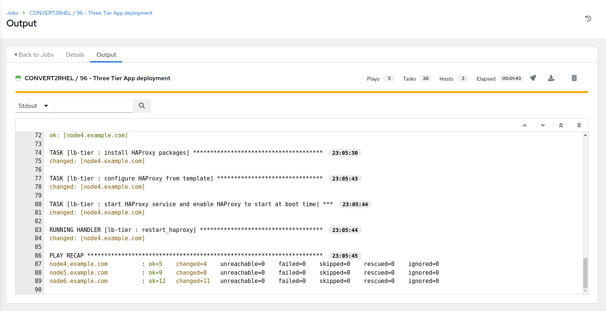

#### 3\. Take CentOS node snapshot (optionnel, cependant, recommandé pour cet exercice)

- Utilisez le menu de la poêle latérale sur la gauche pour sélectionner **Modèles**.

- Cliquez sur  à droite de **CONVERT2RHEL / 01 - Take node snapshot** pour copier le modèle.

- Cliquez sur le nouveau modèle d'emploi **CONVERT2RHEL / 01 - Take node snapshot @ some-timestamp**

- Cliquez sur **Edit** en bas à gauche.
- Modifier le nom pour **CONVERT2RHEL / 01 - Take node snapshot / CentOS7 Development**
- Dans la section **Variables**, dans *tags* supprimer:

"short_name": "node*",

...et ajouter:

"ContentView": "CentOS7",

"Environnement" : "Dev",

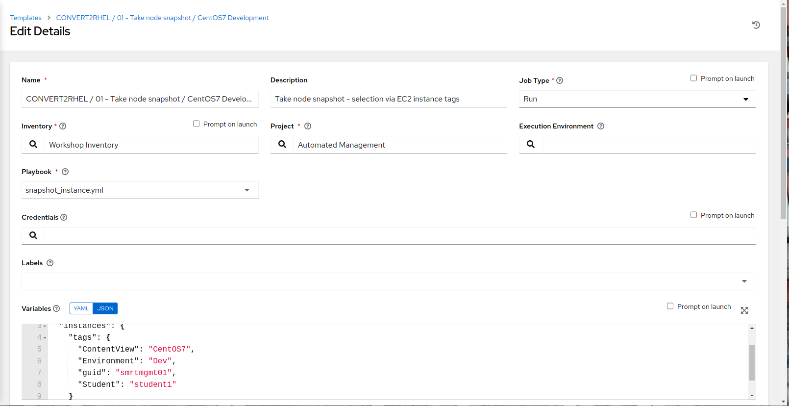

- Examiner les changements, puis en bas à gauche, cliquez sur **Save**
- Vérifier le changement de nom de modèle, ainsi que les réglages de tag dans le **Variables** section puis cliquez sur **Launch**
- Le lancement de sélection vous emmènera à la fenêtre de sortie **Jobs psy CONVERT2RHEL / 01 - Take node snapshot / CentOS7 Development** où vous pourrez suivre chaque tâche exécutée dans le cadre du playbook. Cela prendra environ 5 minutes pour terminer.

#### 4\. Vérifier trois fonctionnalités d'application de niveau sur les nœuds CentOS - pre Centos update

- Utilisez le menu de la poêle latérale sur la gauche pour sélectionner **Modèles**.

- Cliquez sur  à droite de **CONVERT2RHEL / 97 - Trois Tier Essai de fumée app** pour lancer le travail.
- Le lancement de sélection vous emmènera à la fenêtre de sortie **Jobs psy CONVERT2RHEL / 97 - Trois Tier Essai de fumée app** où vous pourrez suivre chaque tâche exécutée dans le cadre du playbook. Cela prendra environ 30 secs pour terminer.

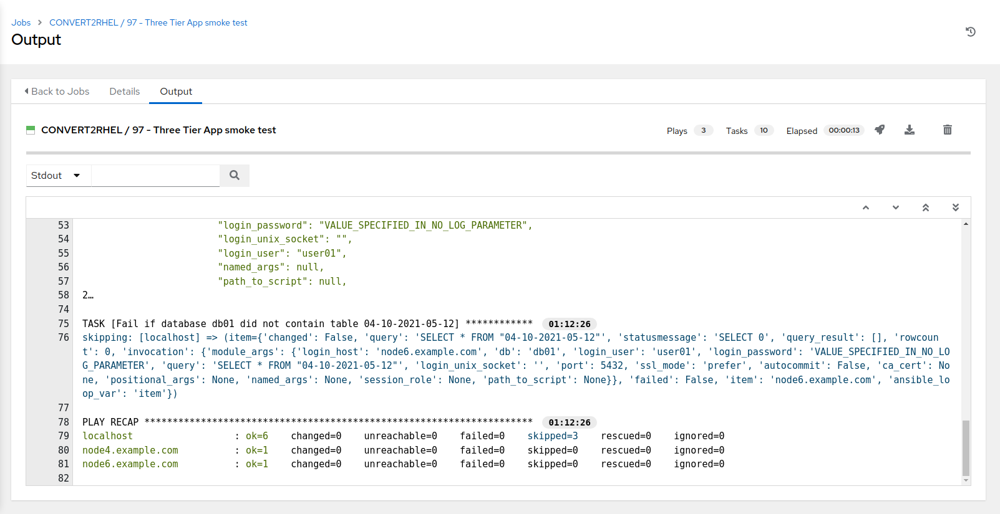

#### 5\. Mise à niveau des noeuds CentOS à la dernière version

- Utilisez le menu de la poêle latérale sur la gauche pour sélectionner **Modèles**.

- Cliquez sur  à droite de **CONVERT2RHEL / 02 - Mise à niveau OS pour la dernière version** pour lancer le travail.

- Le lancement de sélection vous emmènera à la fenêtre de sortie **Jobs psy CONVERT2RHEL / 02 - Mettre à niveau OS pour la dernière version** où vous pourrez suivre chaque tâche exécutée dans le cadre du playbook. Cela prendra environ 6 minutes pour terminer.

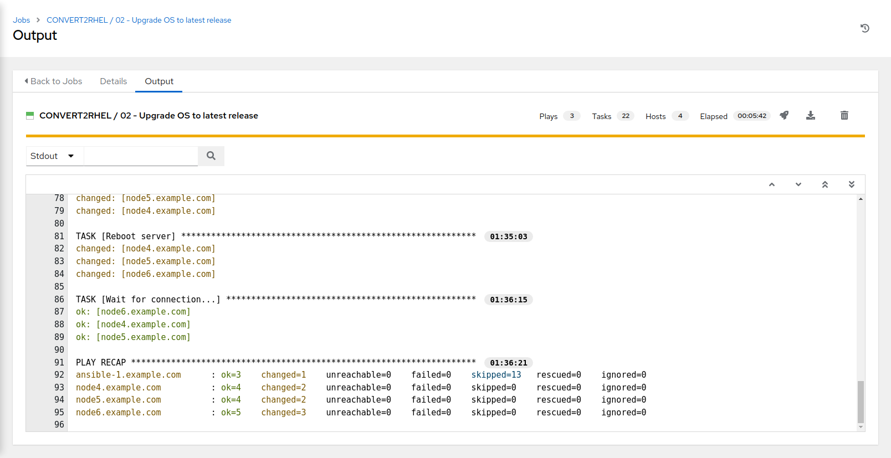

#### 6\. Vérifier trois fonctionnalités d'application de niveau sur les nœuds CentOS - post Centos update, pre Convert2RHEL

- Utilisez le menu de la poêle latérale sur la gauche pour sélectionner **Modèles**.

- Cliquez sur  à droite de **CONVERT2RHEL / 97 - Trois Tier Essai de fumée app** pour lancer le travail.

- Sélectionnez le lancement vous conduira à la fenêtre de sortie **Jobs psy CONVERT2RHEL / 97 - Trois Tier Essai de fumée app**. Cela prendra environ 30 secs pour terminer.

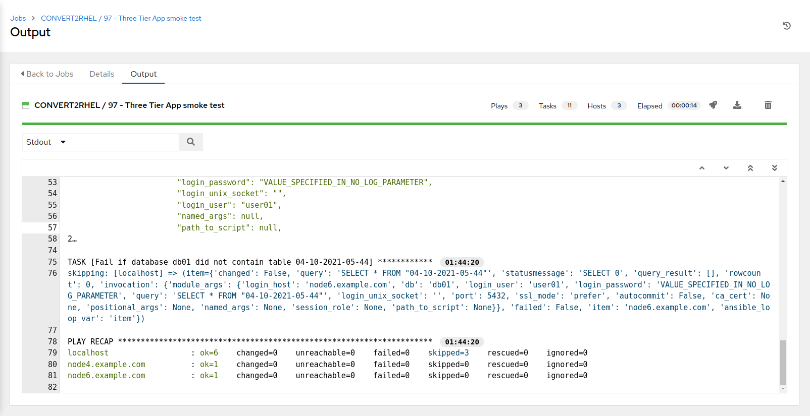

#### 7\. Convert2RHEL - CentOS7 noeuds de développement pour les noeuds de développement RHEL7

- Utilisez le menu de la poêle latérale sur la gauche pour sélectionner **Modèles**.

- Cliquez sur  à droite de **CONVERT2RHEL / 03 - convert2rhel** pour lancer le travail.

- choisissez le groupe LE pour convertir CentOS7_Dev
- choisissez la cible LE RHEL7_Dev

- Sélectionnez le lancement vous conduira à la fenêtre de sortie **Jobs psy CONVERT2RHEL / 03 - convert2rhel**. Cela prendra environ 11 minutes pour terminer.

> **NOTE** avec une pré-configuration, toute combinaison est possible

- cliquez sur **Suivant** pour continuer

- confirmer les variables CentOS et RHEL LE via les sélections de sondages et cliquez sur **Lancement**
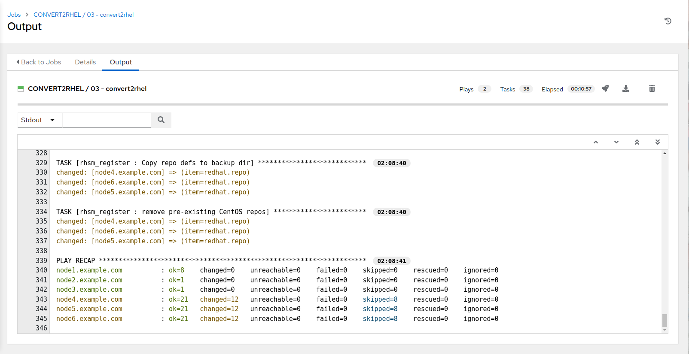

Si vous regardez dans Satellite maintenant (**Hébergeurs Tous les hôtes**), vous verrez que toutes les notes CentOS ont été converties en noeuds RHEL 7.9.

#### 8\. Query Satellite pour obtenir la conversion des informations liées au noeud, définir les balises d'instance EC2 basées sur ces détails
- Utilisez le menu de la poêle latérale sur la gauche pour sélectionner **Modèles**.

- Cliquez sur  à droite de **EC2 / Set instance tags based on Satellite(Foreman) facts** pour lancer le travail.
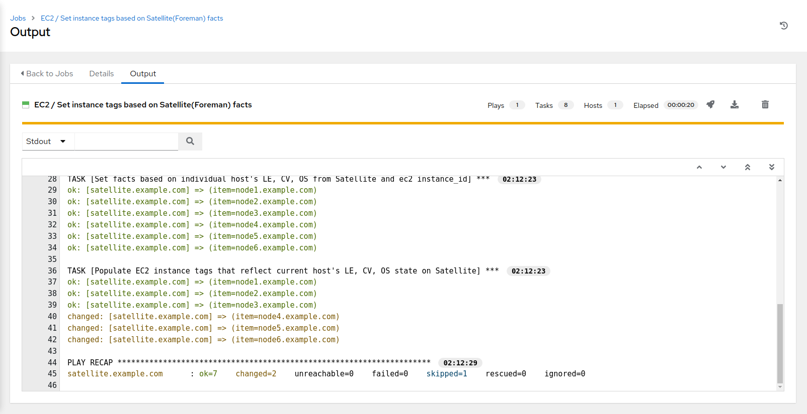

- Sélectionnez le lancement vous conduira à la fenêtre de sortie **Jobs ☰ EC2 / Set instance tags basés sur des faits satellites (Foreman)**. Cela prendra environ 30 secs pour terminer.

#### 9\. Mise à jour des inventaires via des sources dynamiques
- Utilisez le menu de la poêle latérale sur la gauche pour sélectionner **Modèles**.

- Cliquez sur  à droite de **CONTROLLER / Mise à jour des inventaires via des sources dynamiques** pour lancer le travail.
- Sélectionnez "CentOS7" pour la mise à jour de l'inventaire
- Sélectionnez "Dev" pour Choose Environment
- Cliquez sur **Suivant**, confirmer les valeurs demandées, puis cliquez sur **Launch**
- Sélectionnez le lancement vous conduira à la fenêtre de sortie **Jobs phy CONTROLLER / Mise à jour des inventaires via des sources dynamiques**. Cela prendra environ 30 secs pour terminer.

- Utilisez le menu de la poêle latérale sur la gauche pour sélectionner **Modèles**.

- Cliquez sur  à droite de **CONTROLLER / Mise à jour des inventaires via des sources dynamiques** pour lancer le travail.
- template CONTROLLER / Mise à jour des inventaires via des sources dynamiques
- Sélectionnez "RHEL7" pour l'inventaire
- sélectionnez "Dev" pour Choose Environment
- Cliquez sur **Suivant**, confirmer les valeurs demandées, puis cliquez sur **Launch**
- Sélectionnez le lancement vous conduira à la fenêtre de sortie **Jobs phy CONTROLLER / Mise à jour des inventaires via des sources dynamiques**. Cela prendra environ 30 secs pour terminer.
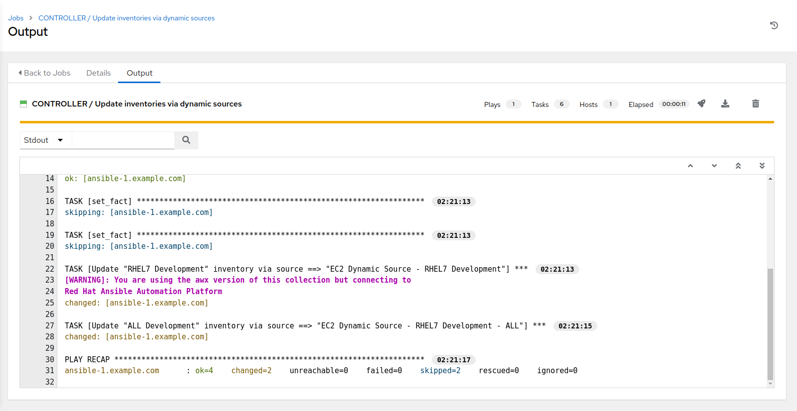

- Si vous regardez dans **Inventoires RHEL7 Development**, vous verrez maintenant que les noeuds[1-6] sont dans l'inventaire.
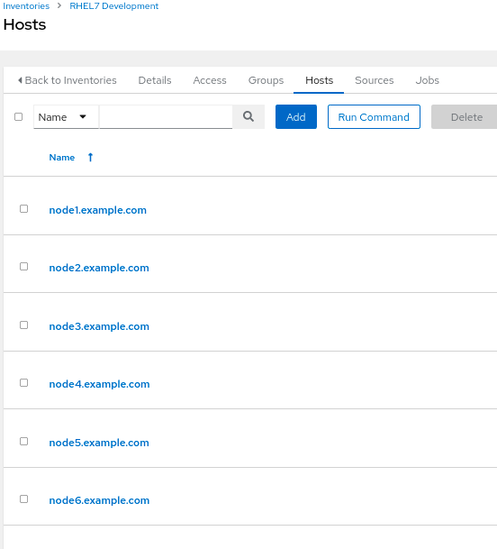

#### 10\. Créer un credential RHEL converti
- Utilisez le menu de la poêle latérale sur la gauche pour sélectionner **Pouvoirs**.
- Cliquez sur  à droite de **Atelier Credential** pour copier le justificatif.

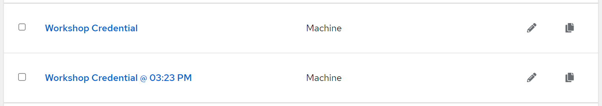

- Cliquez sur le **Workshop Credential @ some-timestamp** nouvellement créé

- Cliquez sur **Edit** en bas à gauche.
- Modifier le nom pour **Converti RHEL Credential**
- Changer le nom d'utilisateur de "ec2-user" à "centos"

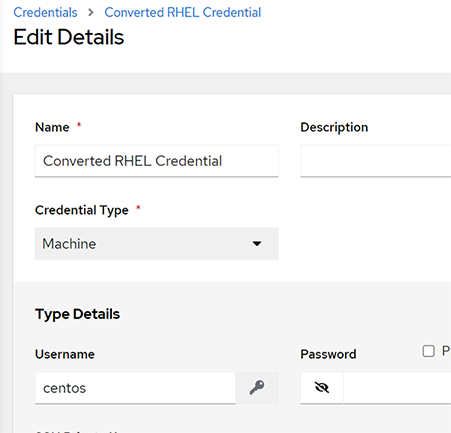

- Cliquez **Save**

#### 11\. Copy template CONVERT2RHEL / 97 - Three Tier App smoke test to template CONVERT2RHEL / 97 - Three Tier App smoke test / RHEL7 Development
- Utilisez le menu de la poêle latérale sur la gauche pour sélectionner **Modèles**.

- Cliquez sur  à droite de **CONVERT2RHEL / 97 - Trois Tier Essai de fumée app** pour copier le modèle.

- Cliquez sur le nouveau modèle d'emploi **CONVERT2RHEL / 97 - Trois Tier Test de la fumée d'application @ certains-timestamp**

- Cliquez sur **Edit** en bas à gauche.
- Modifier le nom pour **CONVERT2RHEL / 97 - Trois Tier Essai de fumée d'application / Développement RHEL7**
- Cliquez sur  dans Inventaire et sélectionnez le bouton radio pour **RHEL7 Development**, suivie par **Sélection**.
- Cliquez sur  sous Pouvoirs et sélectionnez le bouton radio pour **Converti RHEL Credential**, suivi par **Sélection**.
- Examiner les changements, puis faire défiler vers le bas à gauche, cliquez sur **Save**
- Cliquez sur **Lancement** pour exécuter le nouveau modèle d'emploi **CONVERT2RHEL / 97 - Trois test de fumée d'application / RHEL7 Development**
- Sélectionnez le lancement vous conduira à la fenêtre de sortie **Jobs psy CONVERT2RHEL / 97 - Trois Tier Essai de fumée d'application / Développement RHEL7**. Cela prendra environ 30 secs pour terminer.

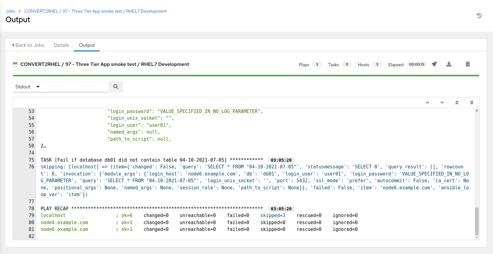

Les Trois Tier Le modèle de test de fumée d'application aurait dû être complété avec succès, ce qui montre que nous avons pu terminer la migration de CentOS 7 à RHEL 7, et lorsque ce processus a été terminé, notre application 3 paliers a encore fonctionné.

> **EXTRA CREDIT - Convertir2RHEL workflow template**
Créez un modèle de workflow intégrant les modèles autonomes ci-dessus dans un workflow complet de conversion CentOS à RHEL!

>**EXTRA CREDIT - Infrastructure-as-Code "Choose Your Own Adventure"**
- Réplique de gestion intelligente automatisée pour chaque compte GitHub
Avant de commencer, vous aurez besoin de télécharger la repo Automated Smart Management dans votre compte GitHub personnel. Si vous n'avez pas de compte GitHub individuel, vous devrez créer un pour procéder. L'utilisation d'un système de gestion de code source (SCM) est au cœur des concepts « infrastructure en tant que code » contenus dans cet exercice de laboratoire, et dans ce cas, GitHub est notre SCM.

Une fois connecté à [GitHub](https://github.com) naviguer jusqu'à la repo [Red Hat Partner Tech repo for Automated Smart Management](https://github.com/redhat-partner-tech/automated-smart-management). Ensuite, sur la page Répo de gestion intelligente automatisée, en haut, en haut à droite de la page, cliquez sur "Fork". Cela créera une repo "forked" Automated Smart Management dans votre compte GitHub personnel.

[Switch the "Automated Management" project in AAP to utilize your newly cloned repo](https://github.com/your-github-username/automated-smart-management.git). Les fichiers suivants sont quelques bons endroits pour commencer à chercher à voir où vous pouvez ajuster les balises d'instance Extra Vars pour sélectionner/filtrer les instances particulières qu'un gabarit d'emploi/joubook obtient couru contre:

`group_vars/control/inventories.yml`

`group_vars/control/job_templates.yml`

Une fois les mises à jour faites, engagez et poussez ces changements à la repo clonée, suivie par la mise en œuvre du modèle d'emploi "SETUP / Controller", qui va propager les changements à AAP lui-même.
...
.