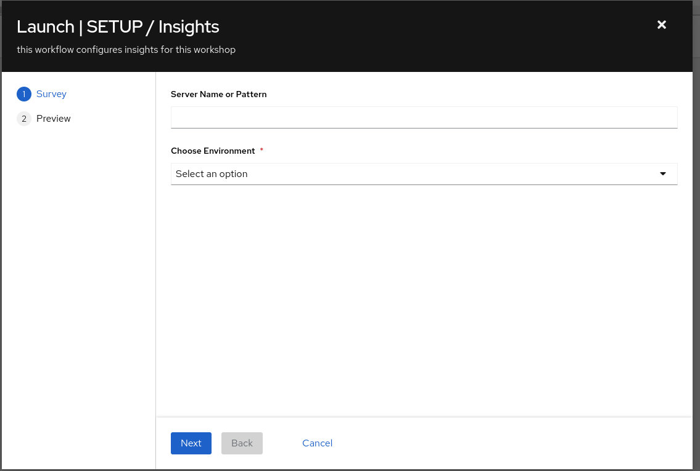

Automated Smart Management Workshop: Setup and Demo Insights
----------------------------------------------------------------------

**Read this in other languages**:
  [English](README.md),  [Français](README.fr.md).
 

**Introduction** 
This use-case will focus on connecting an individuals Red Hat Portal Account to the Automated Smart Management Workshop environment for the purposes of demostrating Insights functionality at the end of the workshop.  

This exercise is primarily targeted for a Red Hat SA to deliver a demo of the Insights services, though any individual with a Red Hat Portal Account, the appropriate account permissions and other prerequiistes could run through this exercise.

This exercise is perscriptive in its setup, yet open-ended in its implementation.

**Environment**
- Satellite 6.x 
- Ansible Automation Platform 4.x
- 3x RHEL 7  instances
- Red Hat Portal Account

**Exercise Scenario**
- Exercise: Setup Insights

Overview
-----------------------------------------------------------------

**Summary** 
- Insights is a hosted service on console.redhat.com.  In order to access this service you need a Red Hat Portal Account
- Since accounts are associated with subscriptions sharing an account widely could cause us to lose control of the account and subscription consumption
- Therefore this exercise will require the use of a personal portal account

Ok, let's get started...  

Pre-requisites
--------------

-   Exercise 0: Lab Setup

-   Information required for executing this exercise

    - Manifest created in your portal account targeted to Satellite 6.10 with appropriate subscriptions including a minimum of 2 RHEL Instance-based subscriptions with Smart Management and 1 Satellite Infrastructure subscription
        - Record the name ⇒ manifest_name 

    - Offline Token for accessing the Subscription Manager API
        - Access.redhat.com -> Subscriptions -> Manage -> RHSM API Tokens - Generate Token ⇒ offline_token

    - Your Organization ID 
        - Access.redhat.com -> Subscriptions -> Manager -> Activation Keys ⇒ rhsm_org_id OR
        - Console.redhat.com -> Settings -> Remote Host Configuration -> Activation Keys⇒ rhsm_org_id

    - Red Hat Account username and password
        - username ⇒ insights_user
        - password ⇒ insights_password

Exercise:
-----------------------------------------------------------------
**Login to your AAP UI's**
> **NOTE** The following are *example* URLs. Your student lab URLs will be different.
* Ansible Automation Platform URL 
    Example: https://student1.{random}.example.opentlc.com*

**Steps:** 
#### 1\. Logging into the Ansible Automation Platform (AAP)

-   Use a web browser on your computer to access the AAP GUI via the link found in the Environment above. And use the following username and password to login: *admin / <password_set_in_deploy_vars>*

-   Upon successful login, you will be able to see the Ansible Automation Platform dashboard.

#### 2\. Setup Insights Template

-   Use the side pane menu on the left to select **Templates**.

-   Scroll down to find **Setup / Insights**.

-   Note that it has the this template is a workflow template as indicated by the visualizer icon and type = Workflow Job Template

-   Click  and review the workflow that will configure the environment for Insights

- This workflow job template executes the following job templates

    - Insights / Replace Satellite Manifest - Replaces the Satellite manifest in the workshop with one that attaches to your account
    - Server /RHEL7 - Register - Registers the hosts to Satellite
    - Insights / Install and Register - Installs Insights and registers the 3 RHEL hosts to Insights.  It also runs the Insights Compliance role which installs the openscap packages on the host
    - Insights - Create Insights Credential - Creates the AAP Insights Credential using your portal account information
    - Insights - Create Insights Project - Creates an Insights Project in AAP that allows execution of any remediation automated created in Insights 

-   Prior to executing the workflow job template you MUST add variables to the template.  To do that:

-   Click  to the right of **Setup / Insights**.  This will open the edit details window as shown below:

-   Add the following variables captured during the pre-requisites:

    - manifest_name
    - offline_token
    - rhsm_org_id
    - insights_user
    - insights_password

-   Once the variables are entered click Save

-   Then click Launch

-   Since we are registering hosts to Satellite during this workflow you will be presented with this screen

- Enter the information as follows:
    - Server Name or Pattern - node
    - Choose Environment - Dev

-   Click Next and then Launch and watch the workflow complete (Note - you may click on each job template being executed to see the details of that job template run)

-   A successful workflow run will show the following:

#### 3\. Explore Insights

This part of the exercise is much less persciptive and is designed to provide the student with some general guidance to get started.   
