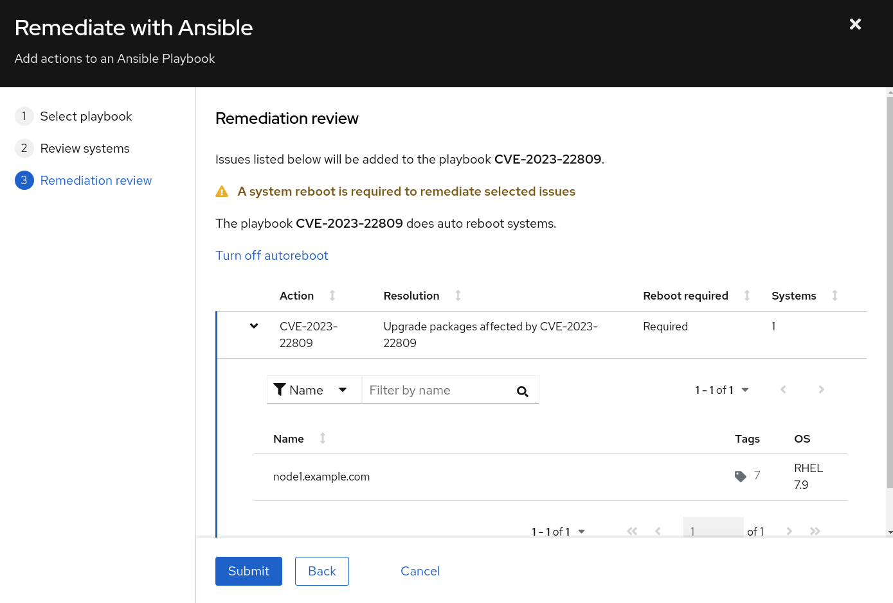

Automated Smart Management Workshop: Setup and Demo Insights
----------------------------------------------------------------------

**Read this in other languages**:
  [English](README.md),  [Français](README.fr.md).
 

**Introduction** 
This use-case will focus on connecting an individual's Red Hat Portal Account to the Automated Smart Management Workshop environment for the purposes of demonstrating Insights functionality at the end of the workshop.  

This exercise is primarily targeted for a Red Hat SA to deliver a demo of the Insights services, though any individual with a Red Hat Portal Account, the appropriate account permissions and other prerequiistes could run through this exercise.

This exercise is perscriptive in its setup, yet open-ended in its implementation.

**Environment**
- Satellite 6.x 
- Ansible Automation Platform 4.x
- 3x RHEL 7  instances
- Red Hat Portal Account with 2 availble Red Hat RHEL Instanced-based Subscriptions 
    - Please note - that this lab will consume 2 subscriptions for the duration of this workshop

**Exercise Scenario**
- Exercise: Setup Insights

Overview
-----------------------------------------------------------------

**Summary** 
- Insights is a hosted service on console.redhat.com.  In order to access this service you need a Red Hat Portal Account
- Since accounts are associated with subscriptions sharing an account widely could cause us to lose control of the account and subscription consumption
- Therefore this exercise will require the use of a personal portal account and will require 2 RHEL Subscriptions

Ok, let's get started...  

Prerequisites
--------------

-   Exercise 0: Lab Setup

-   Information required for executing this exercise

    - Manifest created in your portal account targeted to Satellite 6.10 with appropriate subscriptions including a minimum of 2 RHEL Instance-based subscriptions with Smart Management and 1 Satellite Infrastructure subscription
        - Record the name ⇒ manifest_name 

    - Offline Token for accessing the Subscription Manager API
        - Access.redhat.com -> Subscriptions -> Manage -> RHSM API Tokens - Generate Token ⇒ offline_token

    - Your Organization ID 
        - Access.redhat.com -> Subscriptions -> Manager -> Activation Keys ⇒ rhsm_org_id OR
        - Console.redhat.com -> Settings -> Remote Host Configuration -> Activation Keys⇒ rhsm_org_id

    - Red Hat Account username and password
        - username ⇒ insights_user
        - password ⇒ insights_password

Exercise:
-----------------------------------------------------------------
**Login to your AAP UI's**
> **NOTE** The following are *example* URLs. Your student lab URLs will be different.
* Ansible Automation Platform URL 
    Example: https://student1.{random}.example.opentlc.com*

**Steps:** 
#### 1\. Logging into the Ansible Automation Platform (AAP)

-   Use a web browser on your computer to access the AAP GUI via the link found in the Environment above. And use the following username and password to login: *admin / <password_set_in_deploy_vars>*

-   Upon successful login, you will be able to see the Ansible Automation Platform dashboard.

#### 2\. Setup Insights Template

-   Use the side pane menu on the left to select **Templates**.

-   Scroll down to find **Setup / Insights**.

-   Note that it has the this template is a workflow template as indicated by the visualizer icon and type = Workflow Job Template

-   Click  and review the workflow that will configure the environment for Insights

- This workflow job template executes the following job templates

    - Insights / Replace Satellite Manifest - Replaces the Satellite manifest in the workshop with one that attaches to your account
    - Server /RHEL7 - Register - Registers the hosts to Satellite
    - Insights / Install and Register - Installs Insights and registers the 3 RHEL hosts to Insights.  It also runs the Insights Compliance role which installs the openscap packages on the host
    - Insights - Create Insights Credential - Creates the AAP Insights Credential using your portal account information
    - Insights - Create Insights Project - Creates an Insights Project in AAP that allows execution of any remediation automated created in Insights 

-   Prior to executing the workflow job template you MUST add variables to the template.  To do that:

-   Click  to the right of **Setup / Insights**.  This will open the edit details window as shown below:

-   Add the following variables captured during the prerequisites:

    - manifest_name
    - offline_token
    - rhsm_org_id
    - insights_user
    - insights_password

-   Once the variables are entered click Save

-   Then click Launch

-   Since we are registering hosts to Satellite during this workflow you will be presented with this screen

- Enter the information as follows:
    - Server Name or Pattern - node
    - Choose Environment - Dev

-   Click Next and then Launch and watch the workflow complete (Note - you may click on each job template being executed to see the details of that job template run)

-   A successful workflow run will show the following:

#### 3\. Explore Insights on console.redhat.com

This part of the exercise is much less prescriptive and is designed to provide the student with some general guidance to get started.  This exercise will look at console.redhat.com

-   Login to console.redhat.com using portal account credentials

-   Select Red Hat Enterprise Linux -> Red Hat Insights

-   This will bring you to the Overview page which depicts a dashboard of the hosts that are registered to Insights

    - Explore this dashboard noting that each box addresses an Insights Service

-   Click on Inventory

    - Note that the hosts registered during the Setup / Insights Workflow Template job run are present at the top of the list

    - Click into each host to see the details of each host on the General Information tab

- Click on each of the other tabs to see the information that Insights has collected about each host.  For example click on Vulnerability.  This view will show all the vulnerabilities for that host

- Note that on the right most column labeled Remediation you will see Playbook listed on many of these vulnerabilities.  This indicates that an Ansible Playbook has been created to correct this issue.  In the next exercise we will demonstrate how to do that.

- Let's now look at all hosts associated with a Service.  In this example let's use Vulnerability service

    - On the left hand navigation pane click on Vulnerability -> CVEs.  This view will show the vulnerabilities for all systems registered to Red Hat Insights

- Navigate around the Insights services to gain more understanding of Red Hat Insights.

#### 4\. Prepare to Remediate a Vulnerability 

Now that you have some familiarity with the Insights Services let's go correct an issue.  In this example it will be a specific vulnerability

- Navigatate back to Inventory and click into node1.example.com

- Click on the Vulnerability tab.  

- Select any Vulnerability listed that has a Playbook listed in the Remediation column.  For this example we will choose "CVE-2023-22809"

- Click on the box to the left of the CVE name and notice that the Remediate button becomes active.  This indicates that a Remediation can be created for this vulnerability

- Click on the Remediate button.  This will take you into a wizard that will allow you to create a playbook to correct the identified remediation.

    - Select Create new playbook and give it a name.  In this example we chose to name the playbook after the name of the vulnerability

    

    - Click Next and you will be presented with the systems that will be included as hosts in this Ansible playbook.  You have the option at this point to remove systems if you choose

    - Select Next and you are presented with a Remediation Review screen.  Please note that in order to correct this vulnerability a reboot is required.  If you desire to reboot later, select "turn off autoreboot"

    - Click Submit and a playbook would have been created for you.  
    

    
    
At this point a playbook has been created on is available in the Remediations section of Insights.  Let's go there next

    - Click on Return to Application or close the window above

    - Select Tookkit -> Remediations.  Note here that the playbook you created in the step above is available.  

    - At this point you have several options available to you, including:

        1. Download the playbook and execute it from an Ansible node in your environment
        2. If this host is covered by a Smart Management subscription and you have either the Cloud Connector configured on Satellite or Red Hat Connector configured
        3. Execute the playbook using the Ansible Project that we created during the setup of this lab

    - In this example we will execute the Remediation through the Ansible Automation Platform

#### 5\. Execute a Remediation Using AAP

-  Navigate back to the AAP GUI via the link found in the Environment above. And use the following username and password to login: *admin / <password_set_in_deploy_vars>*

-   Upon successful login, you will be able to see the Ansible Automation Platform dashboard.

