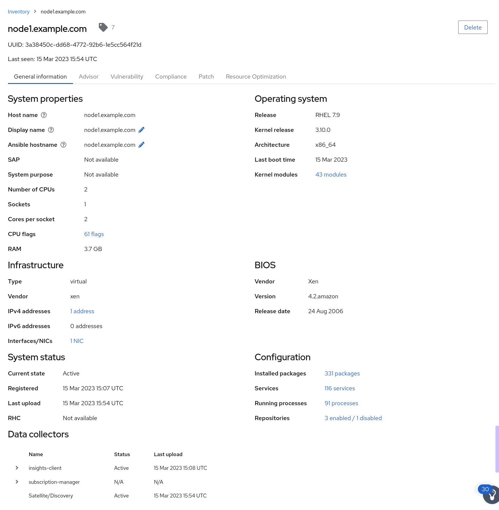
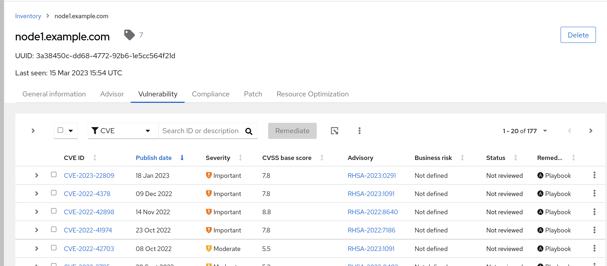

Automated Smart Management Workshop: Explore Insights
----------------------------------------------------------------------

**Introduction** 
This use-case will focus on exploring some of the services available on Red Hat Insights at console.redhat.com.  

Prerequisites
-----------------------------------------------------------------

-   Exercise 0: Lab Setup

-   Exercise 4: Insights Setup

Exercise
-----------------------------------------------------------------

#### Explore Insights on console.redhat.com

This exercise is much less prescriptive and is designed to provide the student with some general guidance to get started.  Please feel free to explore all of the available Red Hat Insights Services

-   Login to console.redhat.com using portal account credentials - https://console.redhat.com

-   Select Red Hat Enterprise Linux -> Red Hat Insights

-   This will bring you to the Overview page which depicts a dashboard of the hosts that are registered to Insights

    - Explore this dashboard noting that each box addresses an Insights Service

-   Click on Inventory

    - Note that the hosts registered during the Setup / Insights Workflow Template job run are present at the top of the list

    - Click into each host to see the details of each host on the General Information tab. An representative sample is provided using node1.example.com.

- Click on each of the other tabs to see the information that Insights has collected about each host.  For example click on Vulnerability.  This view will show all the vulnerabilities for that host

> **NOTE** The right most column labeled Remediation you will see Playbook listed on many of these vulnerabilities.  This indicates that an Ansible Playbook has been created to correct this issue.  In the next exercise we will demonstrate how to use AAP with this playbook to address the vulnerability.

- Let's now look at all hosts associated with a Service.  In this example let's use Vulnerability service

    - On the left hand navigation pane click on Vulnerability -> CVEs.  This view will show the vulnerabilities for all systems registered to Red Hat Insights

- Navigate around the Insights services to gain more understanding of Red Hat Insights.