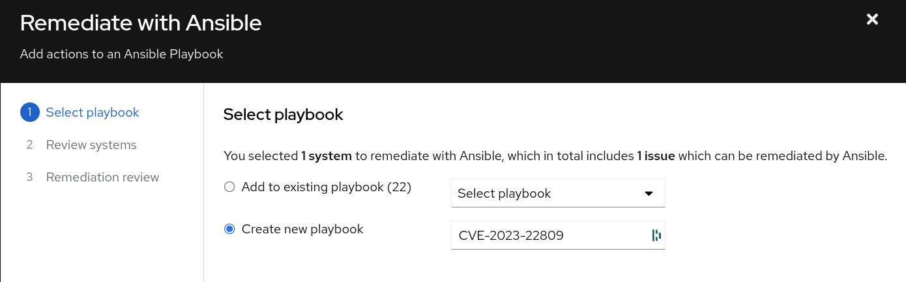
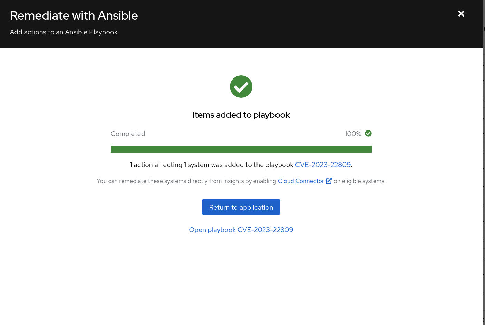
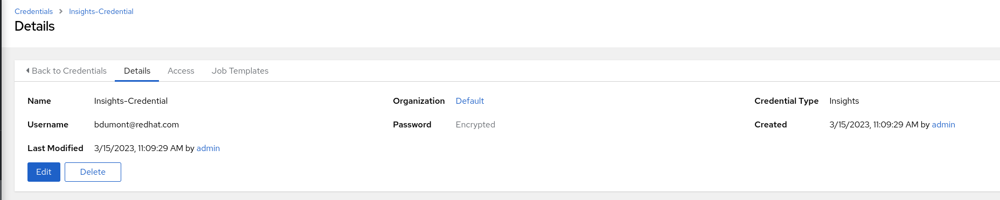
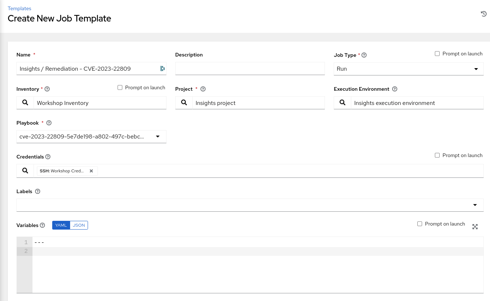
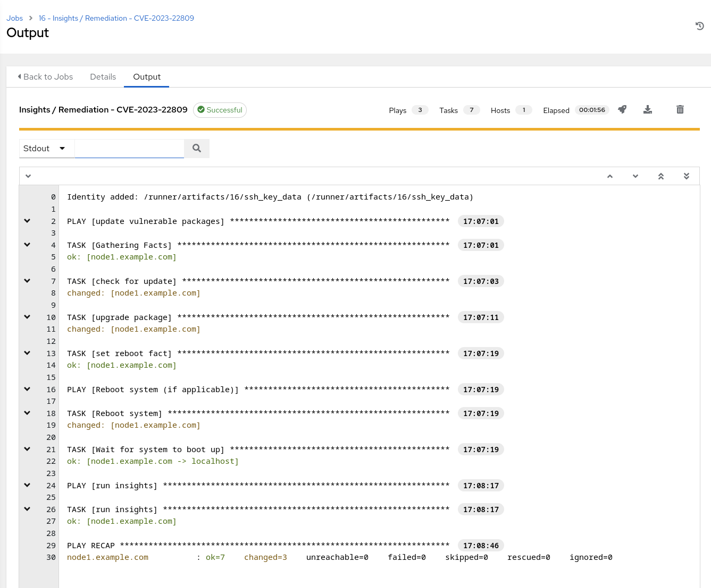
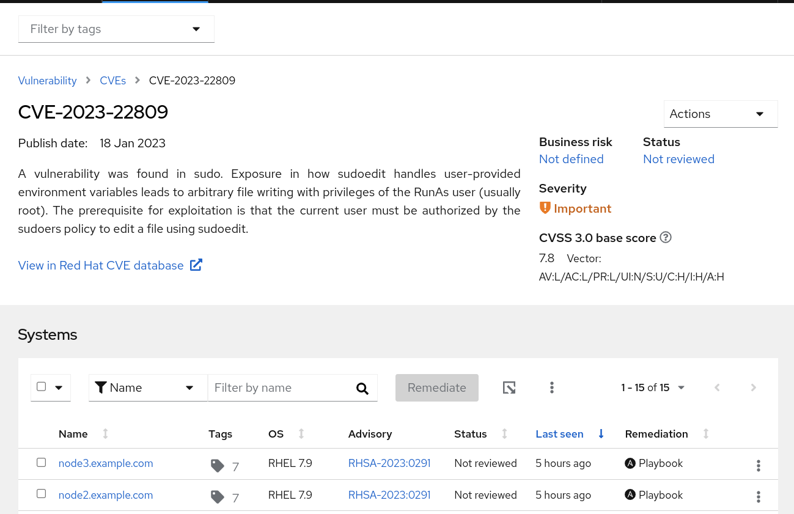

Automated Smart Management Workshop: Remediate Vulnerability
----------------------------------------------------------------------

**Introduction** 
This use-case will demonstrate how to:

-   Identify potential vulnerabilities using Red Hat Insights

-   Create a Remediation Playbook to address the vulnerability

-   Use AAP to execute the playbook to resolve the vulnerability

Prerequisites
-----------------------------------------------------------------

-   Exercise 0: Lab Setup

-   Exercise 4: Insights Setup

-   Exercise 5: Explore Insights

Exercise
-----------------------------------------------------------------

#### 1\. Prepare to Remediate a Vulnerability 

Now that you have some familiarity with the Insights Services let's go correct an issue.  In this example it will be a specific vulnerability

- Login to Red Hat Insights by going to console.redhat.com using your Red Hat Portal Account credentials

- Navigate to Red Hat Insights by going to Red Hat Enteprise Linux -> Red Hat Insights

- Navigatate to Inventory and click into node1.example.com

- Click on the Vulnerability tab.  

- Select any Vulnerability listed that has a Playbook listed in the Remediation column.  For this example we will choose "CVE-2023-22809"

- Click on the box to the left of the CVE name and notice that the Remediate button becomes active.  This indicates that a Remediation can be created for this vulnerability

-   Click on the Remediate button.  This will take you into a wizard that will allow you to create a playbook to correct the identified remediation.

-    Select Create new playbook and give it a name.  In this example we chose to name the playbook after the name of the vulnerability

    

-   Click Next and you will be presented with the systems that will be included as hosts in this Ansible playbook.  You have the option at this point to remove systems if you choose

-   Select Next and you are presented with a Remediation Review screen.  Please note that in order to correct this vulnerability a reboot is required.  If you desire to reboot later, select "turn off autoreboot"

-   Click Submit and a playbook would have been created for you.  
    

    
    
At this point a playbook has been created on is available in the Remediations section of Insights.  Let's go there next

-   Click on Return to Application or close the window above

-   Select Tookkit -> Remediations.  Note here that the playbook you created in the step above is available.  

-   At this point you have several options available to you, including:

1. Download the playbook and execute it from an Ansible node in your environment

2. If this host is covered by a Smart Management subscription and you have either the Cloud Connector configured on Satellite or Red Hat Connector configured

3. Execute the playbook using the Ansible Project that we created during the setup of this lab

-   In this example we will execute the Remediation through the Ansible Automation Platform

#### 2\. Execute a Remediation Using AAP

-   Navigate back to the AAP GUI via the link found in the Environment above. And use the following username and password to login: *admin / <password_set_in_deploy_vars>*

-   Upon successful login, you will be able to see the Ansible Automation Platform dashboard.

The Remediation playbooks from Insights are consumed by AAP through the use of a specific type of Project.  We set this project up for you during the Setup / Insights job run.  Let's sync this project with Insights to pull down the latest playbooks.

Before doing the sync let's look at the Insights Credential that was also setup during the Setup / Insights job run.

-   Navigate to Resources -> Credentials and select the Insights Credential

-   Click Edit

-   Observe that the credential type is Insights and the user name is the Portal Account user name you entered as one of the prerequisites

-   The Portal Account password you entered has been encrypted and cannot be retrieved

-   Navigate to Resources -> Projects and click on Insights Project

-   Note that the last job status says "Successful" but the project has not been sync'd since we created the Remedition Playbook in Step 4.

-   Click Sync and wait for the last job status return to "Successful".  The Remediation Playbook we created is not included in the Insights Project on AAP

-   Let's create a Job Template that uses this playbook.  Navigate to Resources -> Templates.  

-   Click the BLUE 'Add' drop-down icon and select 'Add job template' from the drop-down selection menu. Fill out the details as follows:

        Name: Insights / Remediation - CVE-2023-22809

        Job Type: Run

        Inventory: Workshop Inventory (Click the magnifying glass icon to select.)

        Project: Insights Project (Click the magnifying glass icon to select.)

        Execution Environment: insights execution environment (Click the
        magnifying glass icon to select.)

        Playbook: cve-2023-22809-(uuid).yml (Click drop-down to select.)

        Credentials: Workshop Credential (Click drop-down to select.)

-   Wait for the Job Template to return a "Successful" status

-   As you can see in the screenshot above the vulnerable package(s) was updated, system was rebooted and the insights-client was run again.  Let's go validate that the Remediation playbook eliminated the vulnerability.

 #### 3\. Verify Remediation on Red Hat Insights

Login to console.redhat.com using portal account credentials

-   Select Red Hat Enterprise Linux -> Red Hat Insights

-   This will bring you to the Overview page which depicts a dashboard of the hosts that are registered to Insights

-   First verify that the Remediation was run.  Navigate to Toolkit -> Remediations.  

-   Verify that the remediation playbook created earlier shows a green checkmark under "Complete actions"

-   Navigate to Vulnerability -> CVE's and search for the CVE you targeted in this remediation and click into it.  In this example it is CVE-2023-22809.

-   Verify that node1 no longer shows up as a vulnerable system

This completes this exercise.

