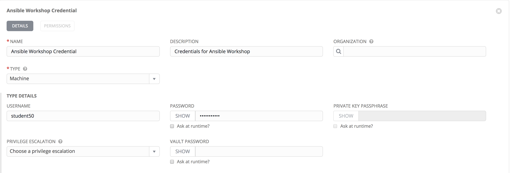
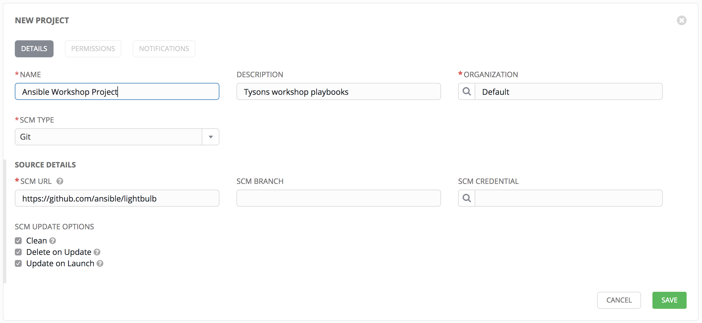
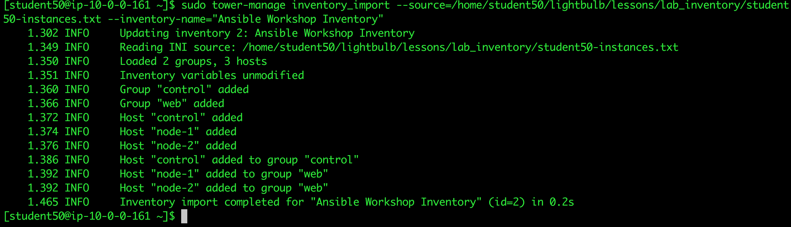
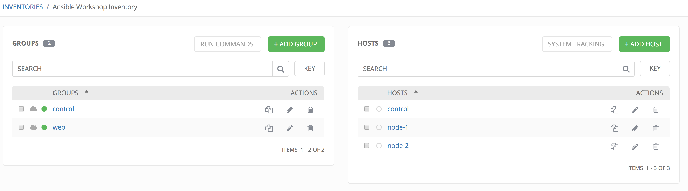

# Exercise 2 - Configuring Ansible Tower

In this exercise, we are going to configure Tower so that we can run a playbook.

## Configuring Ansible Tower

There are a number of contructs in the Ansible Tower UI that enable multi-tenancy, notifications, scheduling, etc. However, we are only going to focus on a few of the key contructs that are required for this workshop today.

* Credentials
* Projects
* Inventory
* Job Template

## Logging into Tower and Installing the License Key

### Step 1:

To log in, use the username `admin` and and the password `ansibleWS`.


As soon as you login, you will prompted to request a license or browse for an existing license file


### Step 2:

In a separate browser tab, browse to [https://www.ansible.com/workshop-license](https://www.ansible.com/workshop-license) to request a workshop license.

### Step 3:

Back in the Tower UI, choose BROWSE  and upload your recently downloaded license file into Tower.

### Step 4:

Select "_I agree to the End User License Agreement_"

### Step 5:

Click on SUBMIT 

## Creating a Credential

Credentials are utilized by Tower for authentication when launching jobs against machines,
synchronizing with inventory sources, and importing project content from a version control system.

There are many [types of credentials](http://docs.ansible.com/ansible-tower/latest/html/userguide/credentials.html#credential-types) including machine, network, and various cloud providers.  In this workshop, we are using a *machine* credential.

### Step 1:

Select the gear icon 

### Step 2:

Select CREDENTIALS

### Step 3:

Click on ADD 

### Step 4:

Complete the credential form using the following entries:

NAME |Ansible Workshop Credential
-----|---------------------------
DESCRIPTION|Credentials for Ansible Workshop
ORGANIZATION|Default
TYPE|Machine
USERNAME| Your Workshop Username - Student(x)
PASSWORD| Your Workshop Password
PRIVILEGE ESCALATION|Sudo (This is the default)




### Step 5:

Select SAVE 

## Creating a Project

A Project is a logical collection of Ansible playbooks, represented in Tower. You can manage playbooks and playbook directories by either placing them manually under the Project Base Path on your Tower server, or by placing your playbooks into a source code management (SCM) system supported by Tower, including Git, Subversion, and Mercurial.

### Step 1:

Click on PROJECTS

### Step 2:

Select ADD 

### Step 3:

Complete the form using the following entries

NAME |Ansible Workshop Project
-----|------------------------
DESCRIPTION|workshop playbooks
ORGANIZATION|Default
SCM TYPE|Git
SCM URL| https://github.com/ansible/lightbulb
SCM BRANCH|
SCM UPDATE OPTIONS| [x] Clean <br />  [x] Delete on Update<br />  [x] Update on Launch




### Step 4:

Select SAVE 

## Creating a Inventory

An inventory is a collection of hosts against which jobs may be launched. Inventories are divided into groups and these groups contain the actual hosts. Groups may be sourced manually, by entering host names into Tower, or from one of Ansible Tower’s supported cloud providers.

An Inventory can also be imported into Tower using the `tower-manage` command and this is how we are going to add an inventory for this workshop.


### Step 1:

Click on INVENTORIES

### Step 2:

Select ADD 

### Step 3:

Complete the form using the following entries

NAME |Ansible Workshop Inventory
-----|--------------------------
DESCRIPTION|Ansible Inventory
ORGANIZATION|Default


### Step 4:

Select SAVE 

### Step 5:

Look in your `.ansible.cfg` file to find the path to your inventory file (`cat ~/.ansible.cfg`) .Use the `tower-manage` command to import an existing inventory.
```
sudo tower-manage inventory_import --source=<location of you inventory> --inventory-name="Ansible Workshop Inventory"
```

You should see output similar to the following:



Feel free to browse your inventory in Tower.  You should now notice that the inventory has been populated with Groups and that each of those groups contain hosts.



### End Result

At this point, we are doing with our basic configuration of Ansible Tower.  In exercise 2.2, we will be soley focused on creating and running a job template so you can see Tower in action.

---

[Click Here to return to the Ansible Lightbulb - Ansible Tower Workshop](../README.md)
