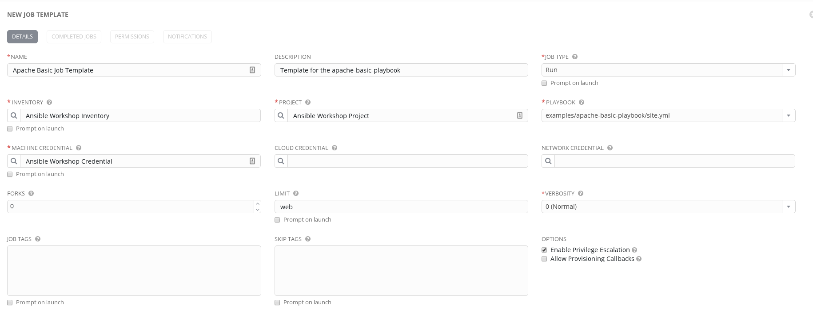
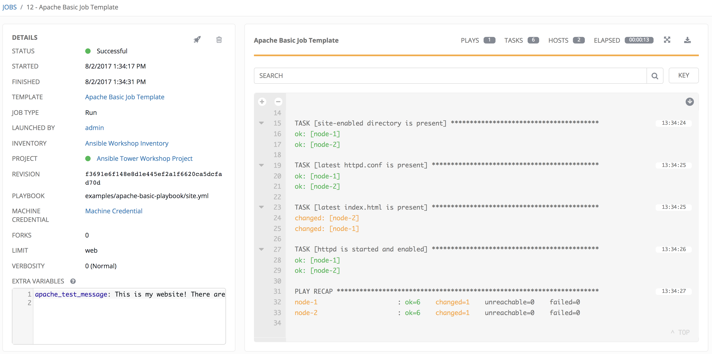
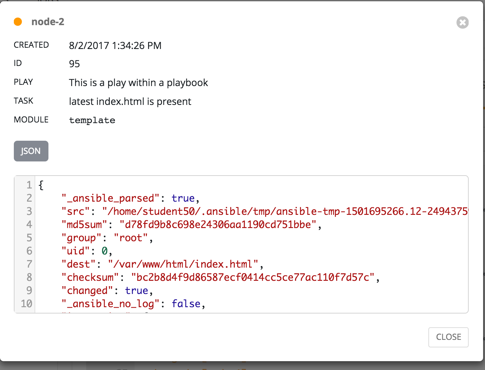
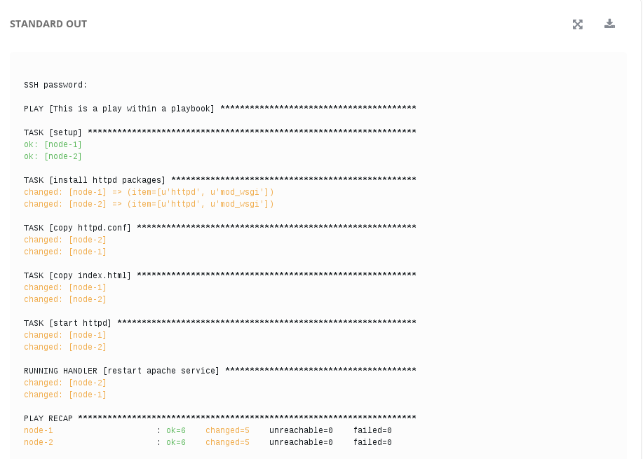

# Exercise 3 - Job Templateの作成と実行

Job Templateは、Ansibleのjobを実行するための定義と様々なパラメータのセットです。
同じjobを定義された同一の情報で何度も実行するために、非常に有効です。


## Job Template の作成とSurveyの追加

### Step 1:

TEMPLATES(テンプレート)を選択します。

### Step 2:

ADDをクリックし、   JOB TEMPLATEを選択します。

### Step 3:

下記の値でJob Templateを作成し、保存します。

項目 | 値
-----|-------------------------
NAME(名前) |Apache Basic Job Template
DESCRIPTION(説明)|Template for the apache-basic-playbook
JOB TYPE(ジョブタイプ)|Run(実行)
INVENTORY(インベントリー)|Ansible Workshop Inventory
PROJECT(プロジェクト)|Ansible Workshop Project
PLAYBOOK|examples/apache-basic-playbook/site.yml
MACHINE CREDENTIAL(認証情報)|Ansible Workshop Credential
LIMIT(制限)|web

OPTIONS(オプション)
- [x] Enable Privilege Escalation(権限昇格の有効化)



### Step 4:

保存をクリックします。  
保存が完了したら、SURVEYの追加をクリックします。 

### Step 5:

下記の値でSURVEY機能で取り込みたい値のフォームを作成します。

SURVEY機能を利用することで、Ansible TowerからJobを実行する際に任意の値をユーザが追加することができます。

項目 | 値
------|------------------------------------------------
PROMPT(プロンプト)|Please enter a test message for your new website
DESCRIPTION(説明)|Website test message prompt
ANSWER VARIABLE NAME(回答の変数名)|apache_test_message
ANSWER TYPE(回答タイプ)|Text
MINIMUM/MAXIMUM LENGTH| Use the defaults
DEFAULT ANSWER| Be creative, keep it clean, we're all professionals here


### Step 6:

ADDをクリックします。 

### Step 7:

保存をクリックします。 

### Step 8:

先ほど作成したJob Templateページに戻り、再度SAVEを選択します。  

## Job Templateの実行

ここまででJob Templateの作成が完了し、いよいよ実行できるようになりました。Job Templateを実行すると、リアルタイムでジョブのステータスを表示するジョブ・スクリーンへリダイレクトされます。

### Step 1:

TEMPLATES(テンプレート)を選択します。

---
**NOTE**
もしJob Templatesの作成ページから移動していない場合は、スクロール・ダウンして全ての既存のJob Templatesを確認することもできます。

---

### Step 2:

*Apache Basic Job Template*の横にあるロケットのアイコン  をクリックしてジョブを実行しましょう。

### Step 3:

先ほどSurveyで作成したプロンプトが出現するはずです。
適当なテストメッセージを入力します。


### Step 4:

LAUNCH  を選択します。

### Step 5:


何が起きるかを見ていきましょう。

ジョブが実行されると、左側のウィンドウには実行されているジョブのサマリーが表示されます。

ここには、このジョブが、いつ/誰によって/どのプレイブックが/どのバージョンで/どの認証情報で実行されているのか？ということが記載されています。
ここには追加の変数(EXTRA VARIABLES)としてどのような値がSurveyから追加されたのか？やジョブの実行結果(実行中、ペンディング、完了)などの情報も付与されています。



スクロールしていくと、Playbookの個別のタスク状態も確認できるはずです。




右側には、Ansible Coreをコマンドラインから走らせた場合と同じ内容の標準出力が表示されます。



### Step 6:

Jobが問題なく完了したなら、JobTemplateの実行によって作成された新しいWebサイトを見てみましょう。
実行対象となったWebサーバのIPアドレスは、AnsibleTowerの`インベントリー/Ansible Workshop Inventory/ホスト` 以下に格納された情報か、先ほどインポートしたAnsibleEngineのinventoryファイル内で確認することができます。

コントロールホストで以下を実行して、[web]グループのサーバIPを確認してみましょう。
```bash
cat ~/lightbulb/lessons/lab_inventory/"$USER"-instances.txt
```

上記のインベントリで確認ができた3台のWebサーバへHTTPでアクセスが可能なはずです。
それぞれのWebサーバはどのように表示されるでしょうか？
```bash
http://<webグループのnode1,node2のIPアドレス>
```

意図した通りにジョブが実行されていれば、Surveyへ入力したテスト・メッセージと共に以下のような画面が表示されている筈です。


## 結果
ここまででAnsible Towerの基本的な機能を体験することができました。
そしてもちろん、Ansible Towerはもっと多くのことができます！
このワークショップでこれまで見てきたことは Ansible EngineとTowerが備えた数多くの機能のほんの入り口だけです。
このガイドの資料のページを参照して、様々な機能を学び、試してみてください。

---

[Ansible Lightbulbのページへ戻ります - Ansible Tower Workshop](../README.md)
