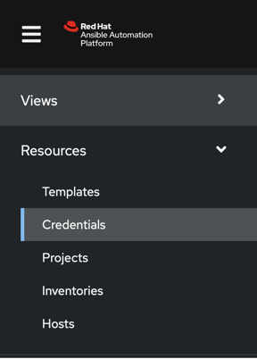
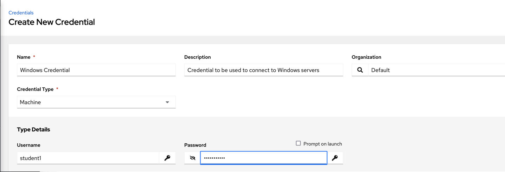
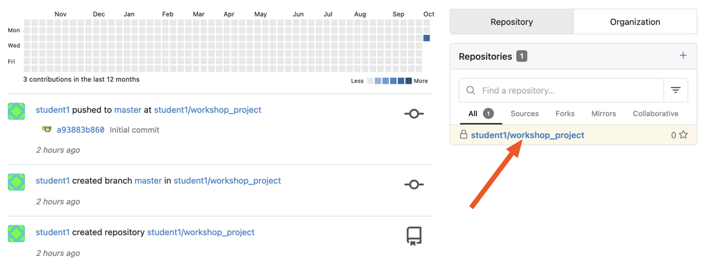
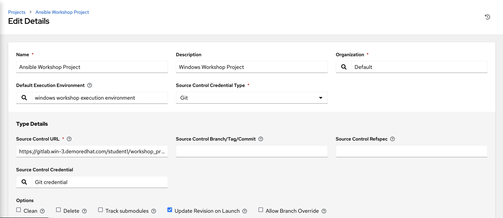
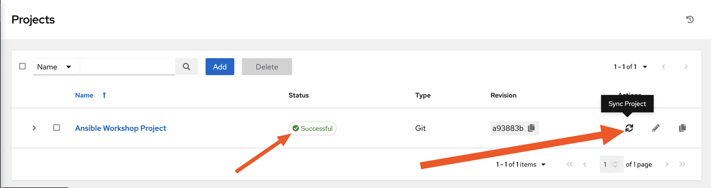
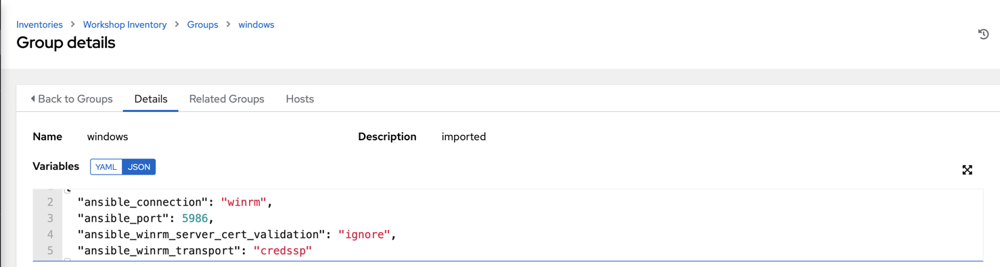
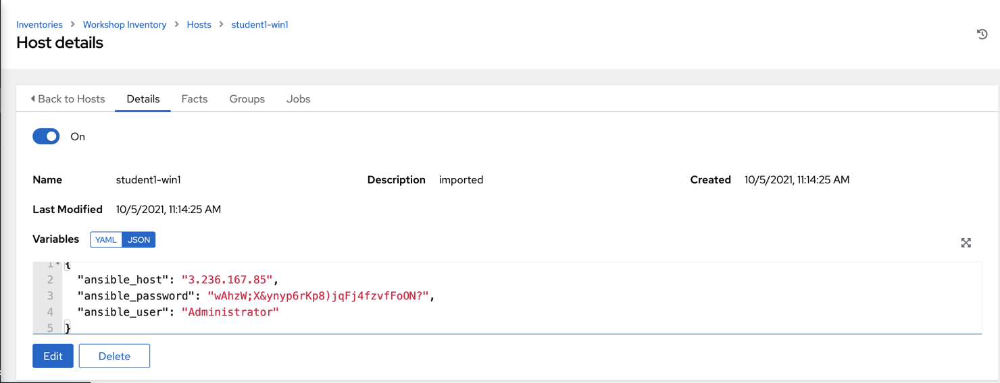

# Automation Controller の設定

**他の言語でもお読みいただけます**:
  [English](README.md),  [日本語](README.ja.md),  [Français](README.fr.md).
 

Automation Controller UI
には、マルチテナンシー、通知、スケジューリングなどを可能にする多くの構成要素があります。ただし、今日このワークショップに必要ないくつかの主要な構成要素にのみ焦点を当てます。

* 認証情報

* プロジェクト

* インベントリー

* ジョブテンプレート

## Controller へのログイン

Automation Controller インスタンスの URL と認証情報は、このワークショップ用に作成されたページで提供されました。

Automation Controller のサブスクリプションはすでに適用されていますので、ログインするとダッシュボードが表示されます。

## マシンの認証情報

認証情報は、マシンに対するジョブの起動、インベントリーソースとの同期、バージョンコントロールシステムからのプロジェクトコンテンツのインポートの際に、Controller
が認証のために使用します。

[認証情報の種類](https://docs.ansible.com/automation-controller/latest/html/userguide/credentials.html#credential-types)
には、マシン、ネットワーク、各種クラウドプロバイダーが含まれます。このワークショップでは、**マシン** および **ソースコントロール**
の認証情報を使用しています。

### ステップ 1

リソースの下の左側のパネルから CREDENTIALS を選択します

### ステップ 2

 アイコンをクリックして新しい認証情報を追加します。

### ステップ 3

次のエントリーを使用してフォームに記入します。

| Key          | Value           |                                          |
|--------------|-----------------|------------------------------------------|
| Name         | Windows Credential |                                          |
| Organization | Default         |                                          |
| Type         | Machine         |                                          |
| Username     | student#        | **Replace # with your student number**   |
| Password     | <password>      | Replace with your student password       |

### ステップ 4

SAVE  を選択

## SCM 認証情報の作成

最初のクレデンシャルは、Win RM で Windows
マシンにアクセスするためのものでした。今回は、自動化プロジェクトが置かれるソースコードリポジトリーにアクセスするために、別の認証情報が必要です。上記のプロセスを繰り返しますが、詳細は以下の通りです。

| Key          | Value                            |                                            |
|--------------|----------------------------------|--------------------------------------------|
| Name         | Git Credential                   |                                            |
| Description  | SCM credential for project sync |                                            |
| Organization | Default                          |                                            |
| Credential Type         | Source Control                   |                                            |
| Username     | student#                         | Replace # with your student number         |
| Password     | <password>                       | Replace with your student password |

SAVE  を選択

## プロジェクトの作成

**プロジェクト** とは、Controller で表現される Ansible コンテンツの論理的な集合体のことです。プロジェクトは、Git や
Subversion など、Controller がサポートするソースコード管理 (SCM) システムに Ansible
コンテンツを配置することで管理できます。

### ステップ 1

この環境では、プレイブックはワークショップの Gitea インスタンスで利用可能な git リポジトリーに保存されます。Automation
Controller で **プロジェクト** を作成する前に、リポジトリーの git URL が必要です。プロジェクトの URL
を取得するには、Gitea インスタンスにログインし、ワークショップのプロジェクトを選択し、"Copy"
ボタンをクリックした後に表示される`https`の URL をコピーします。

  

リポジトリーの URL は **ステップ 3** で使用されます

### ステップ 2

左側のパネルで **Project** をクリックします。

 アイコンをクリックして新しいプロジェクトを追加します。

### ステップ 3

次のエントリーを使用してフォームに記入します (**SCM URL の学習者番号を使用**)

| Key            | Value                                                                   |                                                   |
|----------------|-------------------------------------------------------------------------|---------------------------------------------------|
| Name           | Ansible Workshop Project                                                |                                                   |
| Description    | Windows Workshop Project                                                      |                                                   |
| Organization   | Default                                                                 |                                                   |
| Default Execution Environment    | windows workshop execution environment                                                      |                                                   |
| SCM Type       | Git                                                                     |                                                   |
| SCM URL        | https://git.**WORKSHOP**.demoredhat.com/**student#**/workshop_project.git | URL obtained from Step 1                          |
| SCM BRANCH     |                                                                         | Intentionally blank                               |
| SCM CREDENTIAL | Git Credential                                                          |                                                   |

オプション

* [ ] クリーニング
* [ ] 削除
* [ ] トラックモジュールの追跡
* [x] 起動時のリビジョン更新
* [ ] ブランチ上書きの許可

### ステップ 4

SAVE  を選択

### ステップ 5

スクロールダウンして、保存時にプロジェクトがソースコントロールリポジトリーに対して正常に同期されたことを確認します。リストビューのプロジェクト名の横に
Successful と表示された緑色のアイコンが表示されているはずです。ステータスが Successful
と表示されない場合は、プロジェクトの同期ボタンを再度押してステータスを確認してください。

## インベントリー

インベントリーとは、ジョブを起動するためのホストの集合体です。インベントリーはグループに分けられ、そのグループにはホストが含まれます。インベントリーは、ホスト名を
Controller に入力して手動で作成したり、Automation Controller がサポートしているクラウドプロバイダーや
Automation Hub の Certified Content Collections にあるインベントリープラグインから作成することができます。

静的なインベントリーがすでに作成されています。このインベントリーを見て、いくつかのプロパティーと設定パラメーターを紹介しましょう。

### ステップ 1

左側のパネルから **Inventories** をクリックします。事前設定されたインベントリが一覧表示されます。インベントリーの名前
**Workshop Inventory** または Edit ボタンをクリックします。

### ステップ 2

現在、インベントリーが表示されています。ここから、このインベントリーに固有のホスト、グループ、さらには変数を追加することができます。

ホストを表示するので、**HOSTS** ボタンをクリックします。

### ステップ 3

ホストビューでは、このインベントリーに関連付けられているすべてのホストを確認できます。また、ホストが関連付けられているグループも表示されます。ホストは複数のグループに関連付けることができます。これらのグループは、後で自動化を実行する正確なホストに絞り込むために後で使用できます。

### ステップ 4

**GROUPS** ボタンをクリックしてから **Windows**
グループを選択すると、そのグループ内のすべてのホストに適用されるグループレベルで設定された変数を検査できます。

今日、このグループのホストに接続する方法を Controller
に指示するために、いくつかの変数をすでに定義しました。ここでこれらの変数をグループ変数として定義する必要はありません。ホスト変数にすることも、テンプレートまたは
Playbook に直接存在させることもできます。ただし、これらの変数は環境内の **すべて** のWindows
ホストで同じであるため、Windows グループ全体で定義しました。

デフォルトでは、Ansible は SSH を使用して任意のホストに接続しようとするため、Windows の場合は、別の接続方法 (この場合は
[WinRM])(https://docs.ansible.com/ansible/latest/user_guide/windows_winrm.html)
を使用するように指示する必要があります。

**`ansible_connection: winrm`**

また、Ansible に WinRM SSL ポート 5986 に接続するように指示します (非 SSL ポートは 5985
で実行されますが、暗号化されていません)。

**`ansible_port: 5986`**

また、ラボには適切な証明書ストアが設定されていないため、WinRM 証明書を無視するように Ansible に指示します。

**`ansible_winrm_server_cert_validation: ignore`**

Windows には、接続に利用できるさまざまな認証方法もあります。ここでは、Ansible に **CredSSP**
トランスポートメソッドを使用して Windows ホストへの認証を行うように指示します。

**`ansible_winrm_transport: credssp`**

**HOSTS** ボタンをクリックすると、windows
グループに属するホストを表示できます。このページのホストのリンクをクリックすると、定義されているホスト固有の変数を表示できます。

**`ansible_host`**

これは、この特定のサーバーの IP アドレスです

**`ansible_password`**

これは、このサーバーに接続するために必要なパスワードです

**`ansible_user`**

これは、Ansible がこのサーバーに接続するためにパスワードとともに使用するユーザー名です

これらの変数は非常にホスト固有であるため、グループレベルではなくホストレベルで定義されています。

これらの設定やその他の設定の詳細については、[Windows
ガイド](https://docs.ansible.com/ansible/latest/user_guide/windows.html)
を参照してください。認証設定は特に重要であり、それらを確認して、ニーズに最適な方法を決定する必要があります。

  
[Click here to return to the Ansible for Windows Workshop](../README.md)
