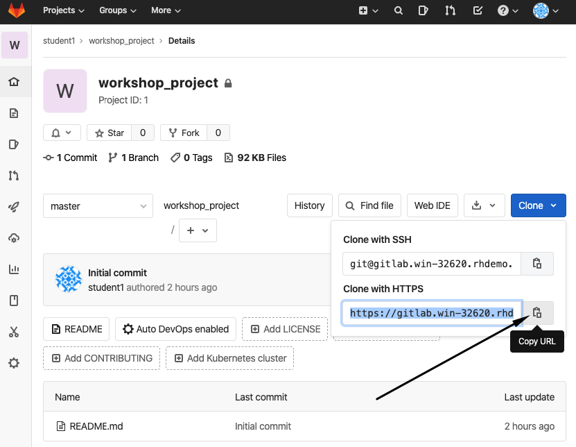
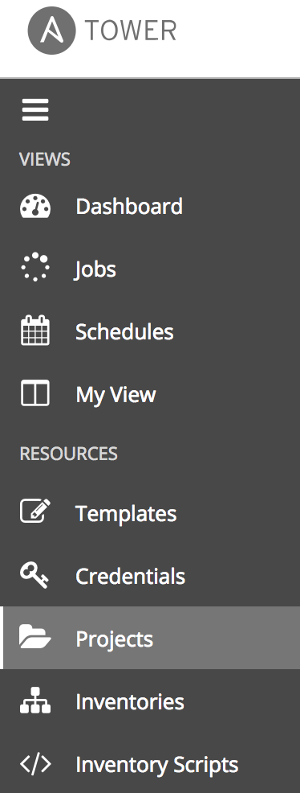
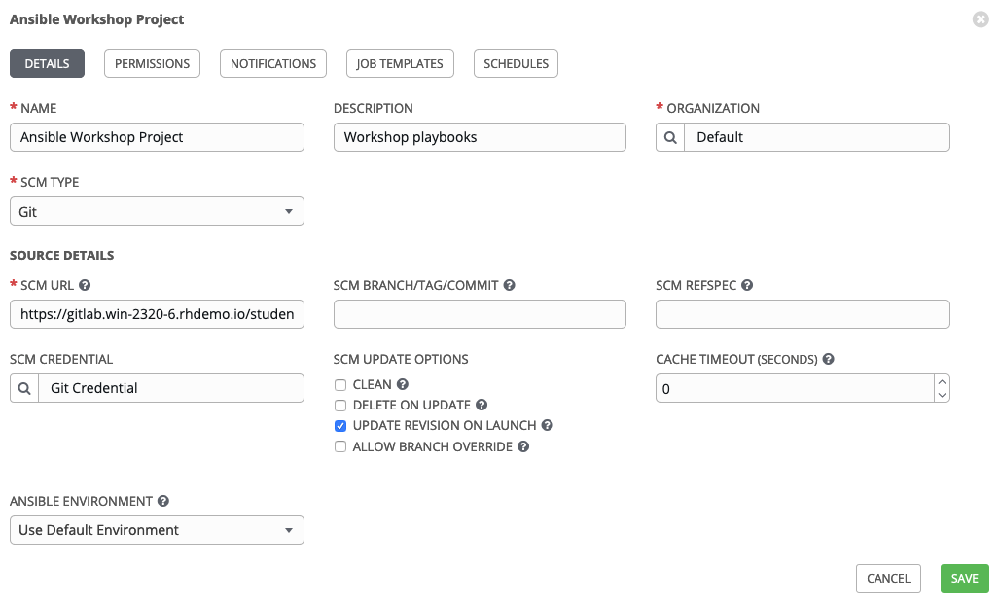
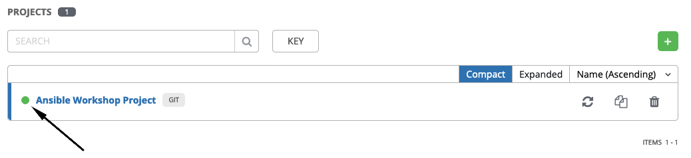
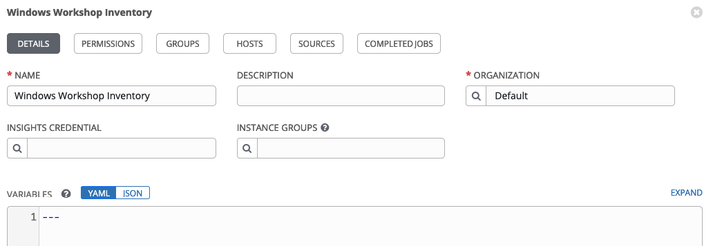
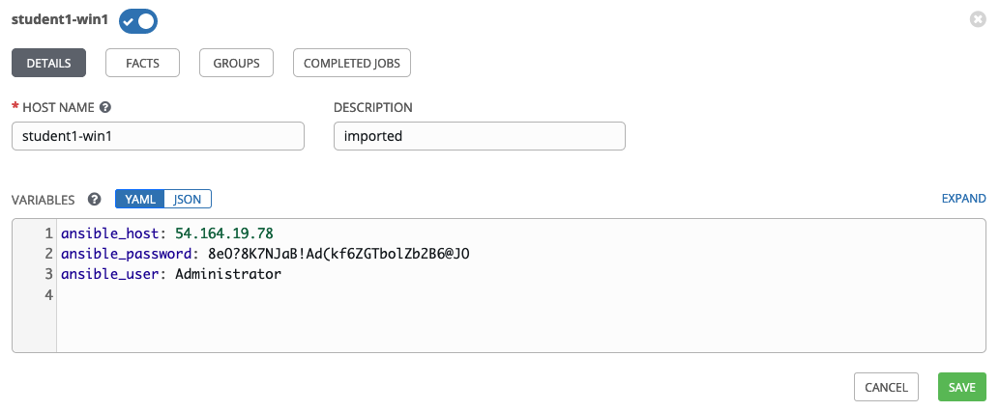

Configuring Ansible Tower
=========================

**Lisez ceci dans d'autres langues**:
  [English](README.md),  [日本語](README.ja.md),  [Française](README.fr.md).

Ansible Tower propose de nombreuses fonctionnalités tel que les organisations, les notifications, l'ordonnancement, etc. Cependant, aujourd'hui nous allons nous concentrer uniquement sur quelques-unes des fonctions clés qui sont nécessaires pour l'atelier.

- Les indetifiants

- Les projets

- Les inventaires 

- Et les modèles.

Connexion à Tower
==================

L'URL de votre instance Ansible Tower ainsi que les informations d'identification vous ont été fournies sur la page créée pour cet atelier.

Votre licence Ansible Tower a déjà été appliquée pour vous, donc après la connexion, vous devriez directement voir le tableau de bord.

Création d'identification machine
=================================

Les informations d'identification sont utilisées par Tower pour l'authentification lors du lancement d'une tache, la synchronisation avec les sources d'inventaire et l'importation du contenu d'un projet à partir d'un système de contrôle de version.

Il existe un nombre important [de type d'identification](http://docs.ansible.com/ansible-tower/latest/html/userguide/credentials.html#credential-types)
Incluant l'accès aux serveurs, réseaux, et de service infonuagique. Dans cet atelier, nous allons utilisé des identifiants **machine** .

Étape 1:
--------

Sélectionnez *INFORMATIONS D’IDENTIFICATION* dans le panneau de gauche sous *RESSOURCES*

Étape 2:
--------

Cliquez sur l'icone  pour ajouter un identififiant.

Étape 3:
--------

Remplissez les champs avec les valeurs suivantes:

| Clé          | Valeur          |                                          |
|--------------|-----------------|------------------------------------------|
| Nom          | Student Account |                                          |
| Organisation | Default         |                                          |
| Type         | Machine         |                                          |
| Username     | student#        | **Replace # with your student number**   |
| Password     | *****           | Replace with your student password       |

Étape 4:
--------

Cliquez sur   

Création d'identification de source de contrôle
===============================================

L'identifiant precedement créé permet d'accéder à nos machines Windows. Nous avons besoin d'un autre identifiant pour accéder à notre référentiel de code source. Répétez le processus comme ci-dessus, mais avec les détails suivants:

| Clé          | Valeur                           |                                            |
|--------------|----------------------------------|--------------------------------------------|
| Nom          | Git Credential                   |                                            |
| Description  | SCM credential for playbook sync |                                            |
| Organisation | Default                          |                                            |
| Type         | Source Control                   |                                            |
| Username     | student#                         | Replace # with your student number         |
| Password     | *******                          | Replace ******* with your student password |

Cliquez sur    

Création d'un projet
====================

Un projet est une collection logique de playbook Ansible. Vous pouvez gérer les playbooks Ansible en les plaçant manuellement sur votre serveur Tower, ou en plaçant vos playbooks dans un système de gestion de code source (SCM) pris en charge par Tower (Git, Subversion et Mercurial).

Étape 1:
--------

Dans cet environnement, les playbooks sont stockés dans un référentiel git disponible sur l'instance GitLab de l'atelier. Avant qu'un **Projet** puisse être créé dans Ansible Tower, l'URL git du référentiel est nécessaire. Pour obtenir l'URL de votre projet, connectez-vous à l'instance GitLab, sélectionnez votre projet d'atelier et copiez l'URL `https` présentée après avoir cliqué sur le bouton *Cloner*.

L'URL du dépôt git sera utilisé dans **Étape 3**

Étape 2:
--------

Cliquez sur **Projets** dans le panneau de gauche.

Cliquez sur l'icone  pour ajouter un nouveau projet.

Étape 3:
--------

Remplissez le formulaire en utilisant les entrées suivantes ( **en utilisant votre numéro d'étudiant dans l'URL SCM** )

| Clé            | Valeur                                                                  |                                                   |
|----------------|-------------------------------------------------------------------------|---------------------------------------------------|
| Nom            | Ansible Workshop Project                                                |                                                   |
| Description    | Workshop playbooks                                                      |                                                   |
| Organisation   | Default                                                                 |                                                   |
| SCM Type       | Git                                                                     |                                                   |
| SCM URL        | https://gitlab.**WORKSHOP**.rhdemo.io/**student#**/workshop_project.git | URL obtained from Step 1                          |
| SCM BRANCH     |                                                                         | Intentionally blank                               |
| SCM CREDENTIAL | Git Credential                                                          |                                                   |

Options de mise à jour SCM

- [ ] Nettoyer
- [ ] Supprimer lors de la mise à jour
- [x] Mettre à jour Révision au lancement
- [ ] Autoriser le remplacement de la branche

Étape 4:
-------

Cliquez sur 

Étape 5:
-------

Faites défiler la page vers le bas et validez que le projet a été correctement synchronisé avec le référentiel de contrôle de source. Vous devriez voir une icône verte à côté du nom du projet dans la liste des projets en bas de page.

Inventaire
==========

Un inventaire est un ensemble d'hôtes sur lesquels des taches peuvent être lancés. Les inventaires sont divisés en groupes et ces groupes contiennent des serveurs. Les inventaires peuvent être sourcés manuellement, en entrant les noms d'hôte dans Tower ou auprès de l'un des fournisseurs de cloud pris en charge par Ansible Tower.

Un inventaire statique a déjà été créé pour vous aujourd'hui. Nous allons maintenant jeter un œil à cet inventaire pour vous montrer les différentes fonctionnalités.

Étape 1:
--------

Cliquez sur **Inventaires** dans le panneau de gauche. Vous verrez l'inventaire préconfiguré répertorié. Cliquez sur le nom de inventaire **Workshop Inventory** ou sur le bouton Modifier.

Étape 2:
--------

Vous allez maintenant voir l'inventaire. De là, vous pouvez ajouter des hôtes, des groupes ou même ajouter des variables spécifiques à cet inventaire.

Nous allons voir les hôtes, cliquez sur le bouton **HÔTES**.

Étape 3:
--------

Dans la vue Hôtes, nous pouvons voir tous les hôtes associés à cet inventaire. Vous verrez également à quels groupes un hôte est associé. Les hôtes peuvent être associés à plusieurs groupes. Ces groupes peuvent ensuite être utilisés pour se limiter aux hôtes exacts sur lesquels nous exécuterons plus tard nos playbooks.

Étape 4:
-------

Si vous cliquez sur le bouton **GROUPES**, puis sélectionnez le groupe **Windows**, vous pouvez voir les variables définies au niveau du groupe qui s'appliqueront à tous les hôtes de ce groupe.

Aujourd'hui, nous avons déjà défini une poignée de variables pour indiquer à Ansible comment se connecter aux hôtes de ce groupe. Vous n'avez pas besoin de définir ces variables en tant que variables de groupe ici, elles peuvent également être des variables hôtes ou résider directement dans votre modèle ou votre playbook. Cependant, comme ces variables seront les mêmes pour **TOUS** les hôtes Windows de notre environnement, nous les avons définies pour l'ensemble du groupe Windows.

Par défaut, Ansible tentera d'utiliser SSH pour se connecter à n'importe quel hôte, donc pour Windows, nous devons lui dire d'utiliser une méthode de connexion différente, dans ce cas, [WinRM](https://docs.ansible.com/ansible/latest/user_guide/windows_winrm.html).

**`ansible_connection: winrm`**

Nous demandons à Ansible de se connecter au port SSL WinRM 5986 (le port non SSL fonctionne sur 5985 mais n'est pas chiffré).
**`ansible_port: 5986`**

Nous voulons également qu'Ansible ignorer le certificat WinRM, car nous sommes dans un laboratoire.

**`ansible_winrm_server_cert_validation: ignore`**

Windows propose diverses méthodes d'authentification que nous pouvons utiliser pour se connecter. Ici, nous disons à Ansible d'utiliser la méthode de transport **CredSSP** pour s'authentifier auprès de notre hôte Windows:

**`ansible_winrm_transport: credssp`**

Si vous cliquez sur le bouton **HÔTES**, vous pouvez afficher les hôtes appartenant au groupe Windows. Si vous cliquez sur le lien de l'hôte sur cette page, vous pouvez afficher les variables spécifiques à l'hôte qui ont été définies.

**`ansible_host`**

Ceci est l'adresse IP d'un serveur particulier

**`ansible_password`** 

Ceci est le mot de passe nécessaire pour se connecter à ce serveur

**`ansible_user`**

Il s'agit du nom d'utilisateur qu'Ansible utilisera avec le mot de passe pour se connecter à ce serveur

Ces variables sont très spécifiques à l'hôte et ont donc été définies au niveau de l'hôte plutôt qu'au niveau du groupe.

Vous pouvez trouver plus d'informations sur ces paramètres et d'autres dans notre [guide Windows](https://docs.ansible.com/ansible/latest/user_guide/windows.html).

Les paramètres d'authentification sont particulièrement importants et vous devrez les revoir et décider quelle méthode convient le mieux à vos besoins.

  
[Cliquez ici pour revenir à l'atelier Ansible pour Windows](../README.fr.md)
