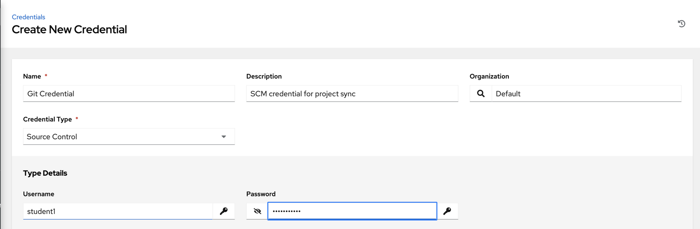
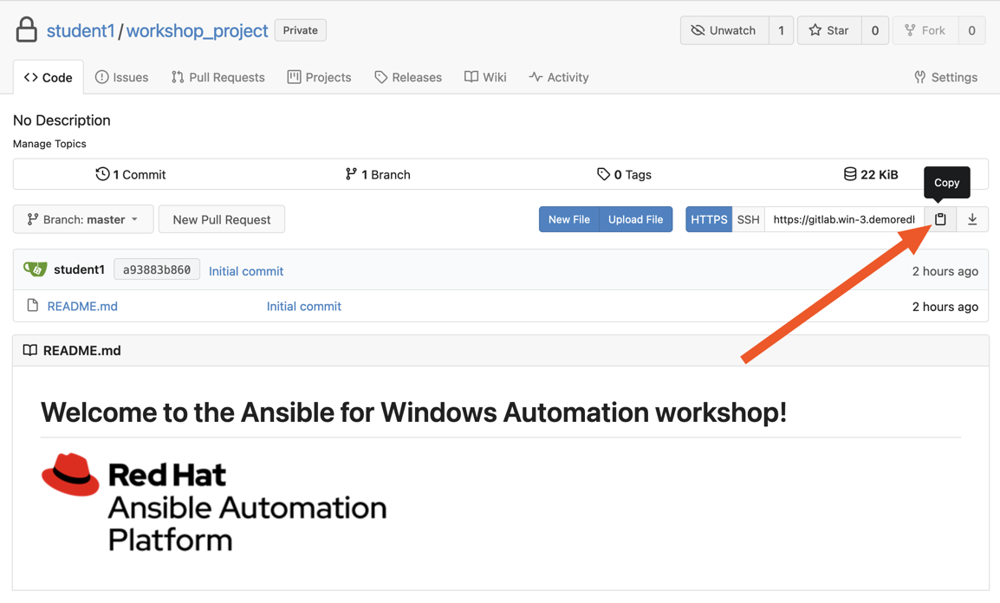
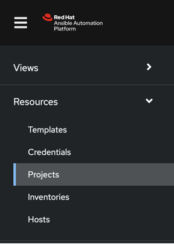
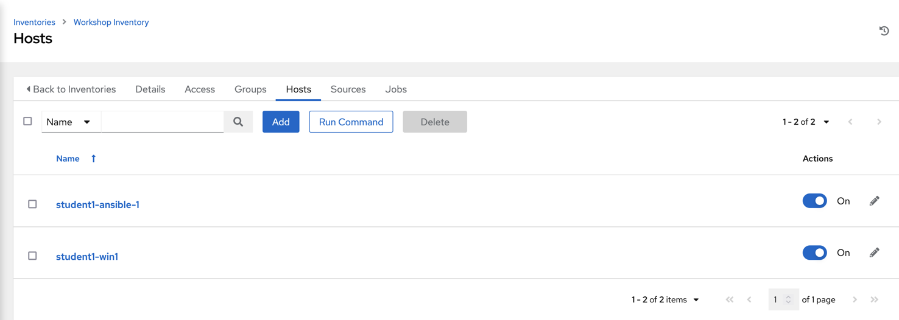

# Configuring Automation Controller

**Read this in other languages**:
  [English](README.md),  [日本語](README.ja.md),  [Français](README.fr.md).
 

There are a number of constructs in the Automation Controller UI that enable
multi-tenancy, notifications, scheduling, etc. However, we are only
going to focus on a few of the key constructs that are required for this
workshop today.

* Credentials

* Projects

* Inventory

* Job Template

## Logging into Controller

Your Automation Controller instance url and credentials were supplied to you on the page created for this workshop.

Your Automation Controller subscription has already been applied for you, so after
logging in, you should now see the Dashboard.

## Creating a Machine Credential

Credentials are utilized by Controller for authentication when launching jobs
against machines, synchronizing with inventory sources, and importing
project content from a version control system.

There are many [types of
credentials](https://docs.ansible.com/ansible-tower/latest/html/userguide/credentials.html#credential-types)
including machine, network, and various cloud providers. For this
workshop, we are using **machine** and **source control** credentials.

### Step 1

Select CREDENTIALS from the left hand panel under resources

### Step 2

Click the  icon and add new credential

### Step 3

Complete the form using the following entries:

| Key          | Value           |                                          |
|--------------|-----------------|------------------------------------------|
| Name         | Windows Credential |                                          |
| Organization | Default         |                                          |
| Type         | Machine         |                                          |
| Username     | student#        | **Replace # with your student number**   |
| Password     | <password>      | Replace with your student password       |

### Step 4

Select SAVE 

## Create an SCM Credential

Our first credential was to access our Windows machines over WinRM. We need another
to access our source code repository where our automation projects will live. Repeat the process as above, but
with the following details:

| Key          | Value                            |                                            |
|--------------|----------------------------------|--------------------------------------------|
| Name         | Git Credential                   |                                            |
| Description  | SCM credential for project sync |                                            |
| Organization | Default                          |                                            |
| Credential Type         | Source Control                   |                                            |
| Username     | student#                         | Replace # with your student number         |
| Password     | <password>                       | Replace with your student password |

Select SAVE 

## Creating a Project

A **Project** is a logical collection of Ansible content, represented in
Controller. You can manage projects by placing your ansible content into a source code management (SCM) system
supported by Controller, including Git and Subversion.

### Step 1

In this environment, playbooks are stored in a git repository available on the workshop Gitea instance. Before a **Project** can be created in Automation Controller, the git URL for the repository is needed. In order to obtain the URL of your project, login to the Gitea instance, select your workshop project and copy the `https` url presented after clicking the "Copy" button.

The repo url will be used in **Step 3**

### Step 2

Click **Projects** on the left hand panel.

Click the  icon and add new project

### Step 3

Complete the form using the following entries (**using your student
number in SCM URL**)

| Key            | Value                                                                   |                                                   |
|----------------|-------------------------------------------------------------------------|---------------------------------------------------|
| Name           | Ansible Workshop Project                                                |                                                   |
| Description    | Windows Workshop Project                                                      |                                                   |
| Organization   | Default                                                                 |                                                   |
| Default Execution Environment    | windows workshop execution environment                                                      |                                                   |
| SCM Type       | Git                                                                     |                                                   |
| SCM URL        | https://git.**WORKSHOP**.demoredhat.com/**student#**/workshop_project.git | URL obtained from Step 1                          |
| SCM BRANCH     |                                                                         | Intentionally blank                               |
| SCM CREDENTIAL | Git Credential                                                          |                                                   |

OPTIONS

* [ ] Clean
* [ ] Delete
* [ ] Track submodules
* [x] Update Revision on Launch
* [ ] Allow Branch Override

### Step 4

Select SAVE 

### Step 5

Scroll down and validate that the project has been successfully synchronized
against the source control repository upon saving. You should see a green icon displaying "Successful"
next to the project name in the list view. If the status does not show as "Successful", try pressing the "Sync Project" button again re-check the status.

## Inventories

An inventory is a collection of hosts against which jobs may be
launched. Inventories are divided into groups and these groups contain hosts. Inventories may be sourced manually, by entering host
names into Controller, or from one of Automation Controller’s supported cloud
providers or inventory plugins from Certified Content Collections on Automation Hub.

A static Inventory has already been created for you today. Let's take a look at this inventory and highlight some properties and configuration parameters.

### Step 1

Click **Inventories** from the left hand panel. You will see the
preconfigured Inventory listed. Click the Inventories' name **Workshop Inventory** or the Edit button. 

### Step 2

You are now viewing the Inventory. From here, you can add Hosts,
Groups, or even Variables specific to this Inventory.

We will be viewing the hosts, so click the **HOSTS** button.

### Step 3

In the Hosts view, we can see every host associated with this
inventory. You will also see which groups a host is associated with.
Hosts can be associated with multiple groups. These groups can later be used to narrow down the exact hosts we will later run our
automation on.

### Step 4

If you click the **GROUPS** button and then select the **Windows** group, you can inspect variables set at the group level that will apply to all hosts in that group.

Today, we have already defined a handful of variables to tell Controller how to connect to hosts in this group. You do not have to define these variables as
a Group variable here, they could also be Host variables or reside
directly in your Template or Playbook. However, because these variables will be the same for **ALL** windows hosts in our environment, we defined them for the entire windows group.

By default, Ansible will attempt to use SSH to connect to any Host, so
for Windows we need to tell it utilize a different connection method, in
this case,
[WinRM](https://docs.ansible.com/ansible/latest/user_guide/windows_winrm.html).

**`ansible_connection: winrm`**

We also instruct Ansible to connect to the WinRM SSL port 5986 (the
non-SSL port runs on 5985 but is unencrypted).

**`ansible_port: 5986`**

We also tell Ansible to ignore the WinRM cert, since our lab doesn’t
have a proper certificate store setup.

**`ansible_winrm_server_cert_validation: ignore`**

Windows also has various authentication methods that we can utilize to
connect. Here we tell Ansible to use the **CredSSP** Transport Method to
authenticate to our Windows host:

**`ansible_winrm_transport: credssp`**

If you click the **HOSTS** button, you can view the hosts belonging to the windows group. If you click the link for the host on this page, you can view the host specific variables that have been defined.

**`ansible_host`**

This is the IP address of this particular server

**`ansible_password`**

This is the password needed to connect to this server

**`ansible_user`**

This is the username that Ansible will use along with the password to connect to this server

These variables are very host specific thus have been defined at the host level instead of at the group level.

You can find more information about these and other settings in our
[Windows
Guides](https://docs.ansible.com/ansible/latest/user_guide/windows.html).
The authentication settings are particularly important and you will need
to review them and decide which method is best for your needs.

  
[Click here to return to the Ansible for Windows Workshop](../README.md)
