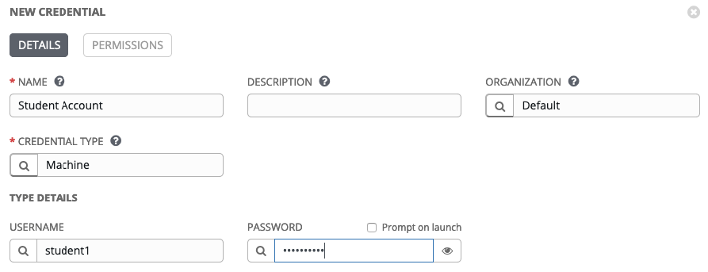
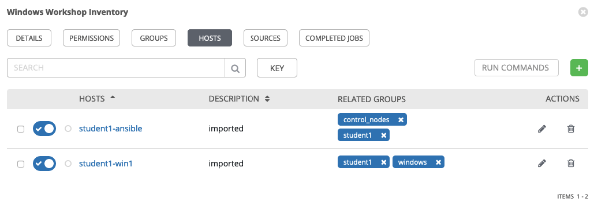

Configuring Ansible Tower
=========================

There are a number of constructs in the Ansible Tower UI that enable
multi-tenancy, notifications, scheduling, etc. However, we are only
going to focus on a few of the key constructs that are required for this
workshop today.

- Credentials

- Projects

- Inventory

- Job Template

Logging into Tower
==================

You will find a shortcut on your desktop named "Ansible Tower", click
this to open your personal Ansible Tower instance in Chrome.

Your Tower instance has already been pre-configured for LDAP Login, so
use your student credentials to login.

Your Ansible Tower license has already been applied for you, so after
logging in you should now see the Dashboard.

Creating a Machine Credential
=============================

Credentials are utilized by Tower for authentication when launching jobs
against machines, synchronizing with inventory sources, and importing
project content from a version control system.

There are many [types of
credentials](http://docs.ansible.com/ansible-tower/latest/html/userguide/credentials.html#credential-types)
including machine, network, and various cloud providers. In this
workshop, we are using a **machine** credential.

Step 1:
-------

Select CREDENTIALS from the left hand panel under resources

Step 2:
-------

Click the  icon and add new credential

Step 3:
-------

Complete the form using the following entries:

<table>
<colgroup>
<col style="width: 50%" />
<col style="width: 50%" />
</colgroup>
<tbody>
<tr class="odd">
<td>
NAME
</td>
<td>
Student Account
</td>
</tr>
<tr class="even">
<td>
DESCRIPTION
</td>
<td></td>
</tr>
<tr class="odd">
<td>
ORGANIZATION
</td>
<td>
Default
</td>
</tr>
<tr class="even">
<td>
TYPE
</td>
<td>
Machine
</td>
</tr>
<tr class="odd">
<td>
USERNAME
</td>
<td>
&lt;your USER ID - instructor provided (ie. <a href="mailto:student1@ansibleworkshop.com">student1@ansibleworkshop.com</a>)&gt;
</td>
</tr>
<tr class="even">
<td>
PASSWORD
</td>
<td>
&lt;your AD account password - instructor provided&gt;
</td>
</tr>
</tbody>
</table>

Step 4:
-------

Select SAVE   

Create an SCM Credential
========================

Our first credential was to access our Windows machines. We need another
to access our source code repository. Repeat the process as above, but
with the following details:

<table>
<colgroup>
<col style="width: 50%" />
<col style="width: 50%" />
</colgroup>
<tbody>
<tr class="odd">
<td>
NAME
</td>
<td>
Git Credential
</td>
</tr>
<tr class="even">
<td>
DESCRIPTION
</td>
<td>
SCM credential for playbook sync
</td>
</tr>
<tr class="odd">
<td>
ORGANIZATION
</td>
<td>
Default
</td>
</tr>
<tr class="even">
<td>
TYPE
</td>
<td>
Source Control
</td>
</tr>
<tr class="odd">
<td>
USERNAME
</td>
<td>
&lt;your USER ID - instructor provided (ie. <a href="mailto:student1@ansibleworkshop.com">student1@ansibleworkshop.com</a>)&gt;
</td>
</tr>
<tr class="even">
<td>
PASSWORD
</td>
<td>
&lt;your AD account password - instructor provided&gt;
</td>
</tr>
</tbody>
</table>

Select SAVE   

Creating a Project
==================

A Project is a logical collection of Ansible playbooks, represented in
Tower. You can manage playbooks and playbook directories by either
placing them manually under the Project Base Path on your Tower server,
or by placing your playbooks into a source code management (SCM) system
supported by Tower, including Git, Subversion, and Mercurial.

Step 1:
-------

Click **Projects** on the left hand panel.

Step 2:
-------

Click the  icon and add new project

Step 3:
-------

Complete the form using the following entries (**using your student
number in SCM URL**)

<table>
<colgroup>
<col style="width: 50%" />
<col style="width: 50%" />
</colgroup>
<tbody>
<tr class="odd">
<td>
NAME
</td>
<td>
Ansible Workshop Project
</td>
</tr>
<tr class="even">
<td>
DESCRIPTION
</td>
<td>
Workshop playbooks
</td>
</tr>
<tr class="odd">
<td>
ORGANIZATION
</td>
<td>
Default
</td>
</tr>
<tr class="even">
<td>
SCM TYPE
</td>
<td>
Git
</td>
</tr>
<tr class="odd">
<td>
SCM URL
</td>
<td>
<a href="https://gitlab.ansibleworkshop.com/student#/student#.git">https://gitlab.ansibleworkshop.com/student#/student#.git</a>
</td>
</tr>
<tr class="even">
<td>
SCM BRANCH
</td>
<td></td>
</tr>
<tr class="odd">
<td>
SCM CREDENTIAL
</td>
<td>
Git Credential
</td>
</tr>
<tr class="even">
<td>
SCM UPDATE OPTIONS
</td>
<td><ul>
<li>
[ ] Clean
</li>
<li>
[ ] Delete on Update
</li>
<li>
[*] Update Revision on Launch
</li>
</ul></td>
</tr>
</tbody>
</table>

Step 4:
-------

Select SAVE 

Step 5:
-------

Scroll down and validate that project has been successfully synchronized
against the source control repo upon saving. You should see a green icon
next to the project name in the list view at the bottom of the page.

Inventories
===========

An inventory is a collection of hosts against which jobs may be
launched. Inventories are divided into groups and these groups contain
the actual hosts. Inventories may be sourced manually, by entering host
names into Tower, or from one of Ansible Tower’s supported cloud
providers.

A static Inventory has already been created for you today. We will now
take a look at this inventory to show case the various features.

Step 1:
-------

Click **Inventories** from the left hand panel. You will see the
preconfigured Inventory listed. Click the Inventories' name **Ansible
Workshop Inventory** or the Edit button. 

Step 2:
-------

You will now be viewing the Inventory. From here you can add Hosts,
Groups, or even add Variables specific to this Inventory.

We will be viewing the hosts, so click the **HOSTS** button.

Step 3:
-------

In the Hosts view, we can see every host associated with with this
inventory. You will also see which groups a host is associated with.
Hosts can be associated with multiple groups. These groups can later
then be used to narrow down to the exact hosts we will later run our
playbooks on.

Step 4:
-------

If you click the Host’s name or on the Edit Button
 we will be able to look at variables
specific to this host.

Today we have already setup various variables to tell Ansible that this
host is a Windows machine. You do not have to define these variables as
a Host variable here, they could also be Group variables or reside
directly in your Template or Playbook. We will place them here for
simplicities sake.

By default Ansible will attempt to use SSH to connect to any Host, so
for Windows we need to tell it utilize a different connection method, in
this case,
[WinRM](https://docs.ansible.com/ansible/latest/user_guide/windows_winrm.html).

**`ansible_connection: winrm`**

We also instruct Ansible to connect to the WinRM SSL port 5986 (the
non-SSL port runs on 5985 but is unencrypted).

**`ansible_port: 5986`**

We also tell Ansible to ignore the WinRM cert, since our lab doesn’t
have a proper certificate store setup.

**`ansible_winrm_server_cert_validation: ignore`**

Windows also has various authentication methods that we can utilize to
connect. Here we tell Ansible to use the **CredSSP** Transport Method to
authenticate to our Windows host:

**`ansible_winrm_transport: credssp`**

You can find more information about these and other settings in our
[Windows
Guides](https://docs.ansible.com/ansible/latest/user_guide/windows.html).
The authentication settings are particularly important and you will need
to review them and decide which method is best for your needs.

End Result
----------

At this point, we are done with our basic configuration of Ansible
Tower. In exercise 2, we will now run a few Ad-Hoc commands against
these hosts.
