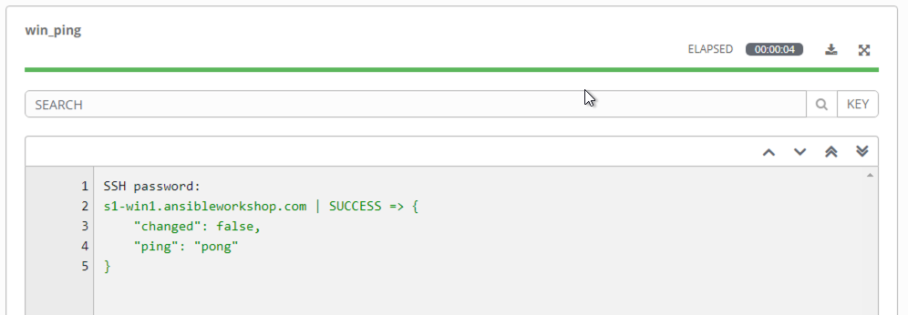
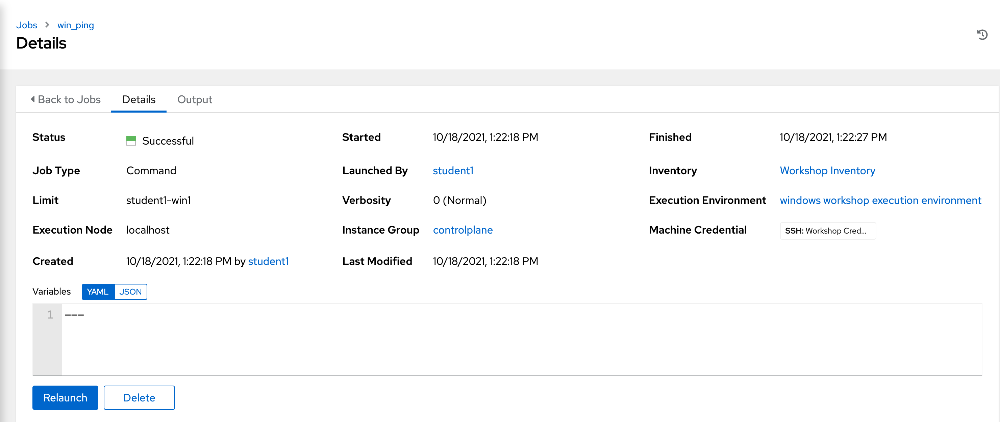
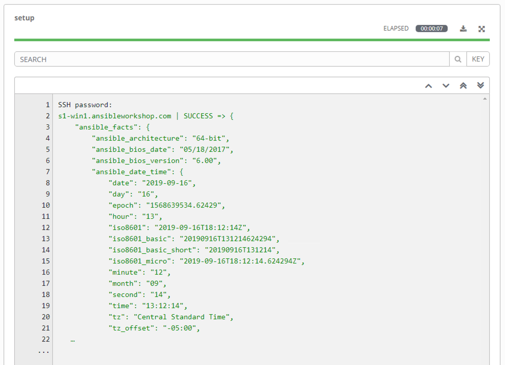
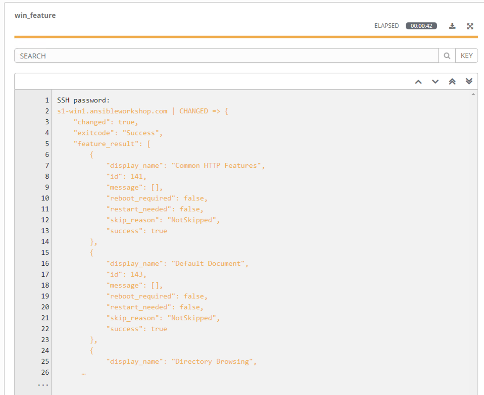

Section 1: Les commandes Ad-hoc
===============================

**Lisez ceci dans d'autres langues**:
  [English](README.md),  [日本語](README.ja.md),  [Française](README.fr.md).

Pour notre premier exercice, nous allons exécuter quelques commandes Ad-hoc pour vous aider à comprendre comment fonctionne Ansible. Les commandes Ad-Hoc Ansible vous permettent d'effectuer des tâches sur des nœuds distants sans avoir à écrire un playbook. Ils sont très utiles lorsque vous avez simplement besoin de faire une ou deux choses rapidement, vers de nombreux nœuds distants.

Étape 1:
--------

Pour commencer, nous devrons accéder à notre inventaire. Cliquez donc sur **Inventaires** dans le panneau de gauche, puis cliquez sur le nom de notre inventaire **Windows Workshop Inventory**. Maintenant que vous êtes sur la page *Détails de l'inventaire*, nous allons devoir sélectionner notre hôte. Cliquez donc sur **HÔTES**.

À côté de chaque hôte se trouve une case à cocher. Cochez la case à côté de chaque hôte sur lequel vous souhaitez exécuter une commande Ad-hoc. Vous verrez alors le bouton **Exécuter des commandes** devenir activé. Cliquez dessus maintenant.

Cela fera apparaître la fenêtre **Exécuter la commande**. De là, nous pouvons exécuter une seule tâche sur nos hôtes.

Commençons par quelque chose de vraiment basique - pinger un hôte. Le module `win_ping` s'assure que nos hôtes Windows sont accessibles. Il ne s'agit pas d'un *ping* traditionnel, mais de la vérification de la connectivité et de l'authentification auprès de l'hôte.

Remplissez le formulaire comme suit:

| Key                   | Value                                  | Note                                                           |
| --------------------- | -------------------------------------- | -------------------------------------------------------------- |
| Module                | `win_ping`                             |                                                                |
| Arguments             |                                        | Intentionally blank                                            |
| Limit                 |                                        | This should display the host you selected in the previous step |                       

Cliquez sur le bouton **Next** 

| Key                   | Value                                  | Note |
| --------------------- | -------------------------------------- | ---- |
| Execution environment | windows workshop execution environment |      |

Cliquez sur le bout **Next** 

| Key                | Value               | Note |
| ------------------ | ------------------- | ---- |
| Machine credential | Workshop Credential |      |
|                    |                     |      |

Une fois que vous avez cliqué sur **LANCEMENT**, vous serez redirigé vers le page dexécution de la tache. Chaque tâche et action dans Ansible Controller est enregistrée et stockée. Ces journaux peuvent être être exportés automatiquement vers un autre système de journalisation tel que Splunk ou ELK.

L'onglet de sortie est affiché par défaut. Toute sortie générée par la tâche est affichée ici.

L'onglet détails vous montre les détails de la tache. Cela inclut des informations telles que *qui* a lancé le travail, *sur quels hôtes* et *quand*.

Les résultats renvoyés seront différents selon le module utilisé, car ils gèrent et traitent différents ensembles de données en fonction de la tâche. Quel que soit le module utilisé, vous verrez toujours un STATUS tel que SUCCÈS, ÉCHEC, CHANGÉ ou SAUT.

Étape 2:
--------

Voyons maintenant comment exécuter une commande PowerShell et afficher la sortie à l'aide du module `win_shell`.

Remplissons à nouveau le formulaire, mais cette fois, utilisez le module `win_shell` pour exécuter la commande Powershell `Get-Service`.

| Key       | Value         | Note                                                           |
| --------- | ------------- | -------------------------------------------------------------- |
| Module    | `win_shell`   |                                                                |
| Arguments | `Get-Service` |                                                                |
| Limit     |               | This should display the host you selected in the previous step |

Cliquez sur le bouton **Next**

| Key                   | Value                                  | Note |
| --------------------- | -------------------------------------- | ---- |
| Execution environment | windows workshop execution environment |      |

Cliquez sur le button **Next**

| Key                | Value               | Note |
| ------------------ | ------------------- | ---- |
| Machine credential | Workshop Credential |      |
|                    |                     |      |

Lancez la tache et affichez les résultats. Vous verrez qu'il renvoie le résultat de la commande Powershell envoyé. Ces données peuvent être stockées dans une variable et analysées directement dans votre playbook Ansible ultérieurement.

Exécutez une nouvelle commande Ad-hoc avec la commande Powershell `Get-Process`.

| Key       | Value         | Note                                                           |
| --------- | ------------- | -------------------------------------------------------------- |
| Module    | `win_shell`   |                                                                |
| Arguments | `Get-Process` |                                                                |
| Limit     |               | This should display the host you selected in the previous step |

Cliquez sur le bouton **Next** 

| Key                   | Value                                  | Note |
| --------------------- | -------------------------------------- | ---- |
| Execution environment | windows workshop execution environment |      |

Cliquez sur le button **Next**

| Key                | Value               | Note |
| ------------------ | ------------------- | ---- |
| Machine credential | Workshop Credential |      |
|                    |                     |      |

Étape 3:
--------

Nous allons maintenant jeter un œil à la configuration de vos nœuds Windows. Le module `setup` interroge l'hôte distant et renvoie ces données en tant que faits Ansible. Ces données sont utiles pour déterminer des éléments tels que les versions du système d'exploitation, la configuration matérielle et d'autres informations importantes. Cela peut ensuite être utilisé dans votre playbook pour toutes sortes de raisons telles que déterminer si une tâche doit être exécutée, ou déterminer le nom d'un package en fonction de la version du système d'exploitation.

Le module `setup` s'exécutera automatiquement au début de chaque playbook, à moins qu'il soit désactivé, de sorte que ces données soient toujours disponibles pour votre playbook.

Allons de l'avant et exécutons le module `setup` pour regarder la sortie. Remplissez à nouveau le formulaire **Exécuter des commandes** avec ces informations.

| Key       | Value   | Note                                                           |
| --------- | ------- | -------------------------------------------------------------- |
| Module    | `setup` |                                                                |
| Arguments |         | Intentionally blank                                            |
| Limit     |         | This should display the host you selected in the previous step |

Vous verrez alors des résultats comme celui-ci

(**Remarque:** Si vous cliquez sur les trois points indiqués à la ligne 23 dans la sortie ci-dessus, vous verrez tous les faits retournés par le module `setup`.)

Étape 4:
--------

Maintenant, installons IIS en utilisant le module `win_feature`. Notre paramètre d'arguments va devenir un peu plus complexe maintenant.

| Key       | Value                           | Note                                                           |
| --------- | ------------------------------- | -------------------------------------------------------------- |
| Module    | `win_feature`                   |                                                                |
| Arguments | `name=Web-Server state=present` |                                                                |
| Limit     |                                 | This should display the host you selected in the previous step |

Cliquez sur le bouton **Next** 

| Key                   | Value                                  | Note |
| --------------------- | -------------------------------------- | ---- |
| Execution environment | windows workshop execution environment |      |

Cliquez sur le bouton **Next** 

| Key                | Value               | Note |
| ------------------ | ------------------- | ---- |
| Machine credential | Workshop Credential |      |

Vous remarquerez que le texte du journal est désormais orange. C'est pour indiquer qu'une modification a été apportée au système par rapport au vert qui montre qu'aucune modification n'a été apportée plus tôt.

Étape 5:
--------

OK, IIS est installé maintenant, alors assurez-vous qu'il est démarré à l'aide du module `service`.

| Key       | Value                      | Note                                                           |
| --------- | -------------------------- | -------------------------------------------------------------- |
| Module    | `win_service`              |                                                                |
| Arguments | `name=W3Svc state=started` |                                                                |
| Limit     |                            | This should display the host you selected in the previous step | 

Cliquez sur le bouton **Next** 

| Key                   | Value                                  | Note |
| --------------------- | -------------------------------------- | ---- |
| Execution environment | windows workshop execution environment |      |

Cliquez sur le bouton **Next**

| Key                | Value               | Note |
| ------------------ | ------------------- | ---- |
| Machine credential | Workshop Credential |      |

Étape 6:
--------

Nettoyons maintenant tout ce qui vient d'être fait. 

Tout d'abord, arrêtez le service IIS.

| Key       | Value                      | Note                                                           |
| --------- | -------------------------- | -------------------------------------------------------------- |
| Module    | `win_service`              |                                                                |
| Arguments | `name=W3Svc state=stopped` |                                                                |
| Limit     |                            | This should display the host you selected in the previous step |

Cliquez sur le bouton **Next** 

| Key                   | Value                                  | Note |
| --------------------- | -------------------------------------- | ---- |
| Execution environment | windows workshop execution environment |      |

Cliquez sur le bouton **Next** 

| Key                | Value               | Note |
| ------------------ | ------------------- | ---- |
| Machine credential | Workshop Credential |      |
|                    |                     |      |

Étape 7:
--------

Ensuite, supprimez IIS.

| Key       | Value                          | Note                                                           |
| --------- | ------------------------------ | -------------------------------------------------------------- |
| Module    | `win_feature`                  |                                                                |
| Arguments | `name=Web-Server state=absent` |                                                                |
| Limit     |                                | This should display the host you selected in the previous step |

Cliquez sur le bouton **Next** 

| Key                   | Value                                  | Note |
| --------------------- | -------------------------------------- | ---- |
| Execution environment | windows workshop execution environment |      |

Cliquez sur le bouton **Next**

| Key                | Value               | Note |
| ------------------ | ------------------- | ---- |
| Machine credential | Workshop Credential |      |
|                    |                     |      |

Et enfin, redémarrez l'hôte.

| Key       | Value        | Note                                                           |
| --------- | ------------ | -------------------------------------------------------------- |
| Module    | `win_reboot` |                                                                |
| Arguments |              | Intentionally blank                                            |
| Limit     |              | This should display the host you selected in the previous step |

Cliquez sur le bouton **Next**

| Key                   | Value                                  | Note |
| --------------------- | -------------------------------------- | ---- |
| Execution environment | windows workshop execution environment |      |

Cliquez sur le bouton **Next**

| Key                | Value               | Note |
| ------------------ | ------------------- | ---- |
| Machine credential | Workshop Credential |      |
|                    |                     |      |                    

> **Remarque**
Le module `win_reboot` provoquera le redémarrage de la machine, puis attendra qu'elle revienne complètement avant de terminer. De cette façon, si vous devez redémarrer l'hôte au milieu de votre playbook, le reste du playbook n'échouera pas car l'hôte est inaccessible.

Résultat final
--------------

Les commandes Ad-hoc peuvent être utiles à exécuter de temps en temps. L'exemple de l'installation et le demarrage IIS ci-dessus, aurait pu (aurait dû) être écrit dans un playbook au lieu d'être exécuté via une série laborieuse de commandes Ad-hoc. Cette interaction avec des commandes Ad-hoc imite finalement l'exécution de commandes individuelles à partir d'une CLI.

*De plus, avez-vous compris cela?* Lorsqu'une tâche est exécutée sur un serveur Windows, Ansible est suffisamment intelligent pour savoir si un redémarrage est nécessaire après l'exécution de cette tâche. Ce qui suit fait partie de la sortie de la commande pour supprimer IIS. La sortie de cette tâche peut être utilisée dans les tâches suivantes, comme le redémarrage ou non avant de continuer.

  
[Cliquez ici pour revenir à l'atelier Ansible pour Windows](../README.fr.md)
