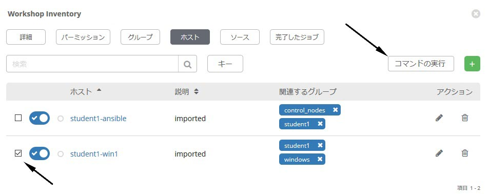
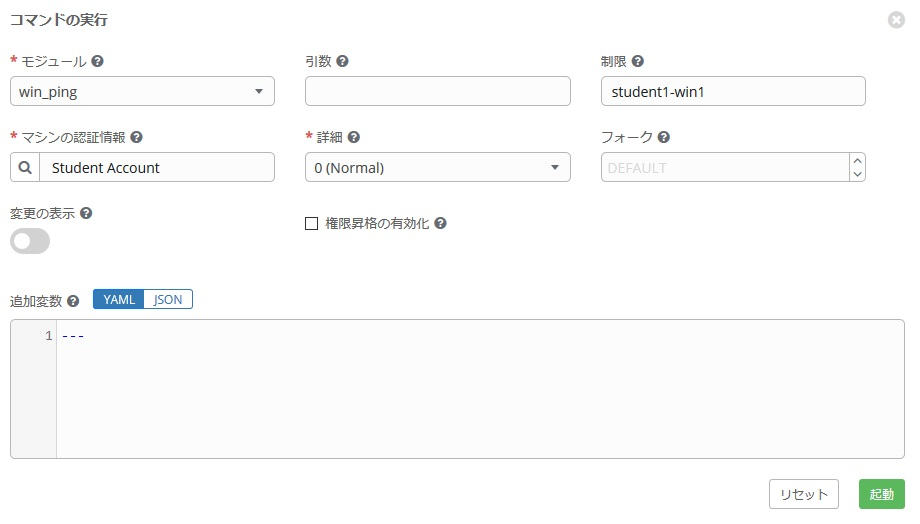
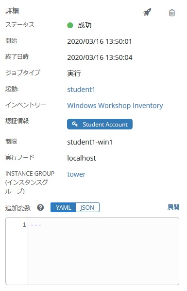
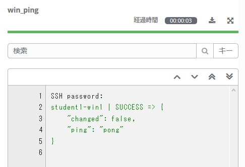
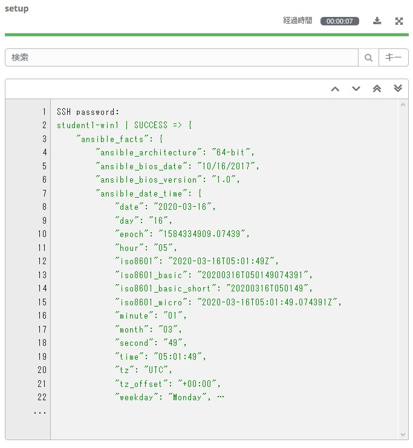
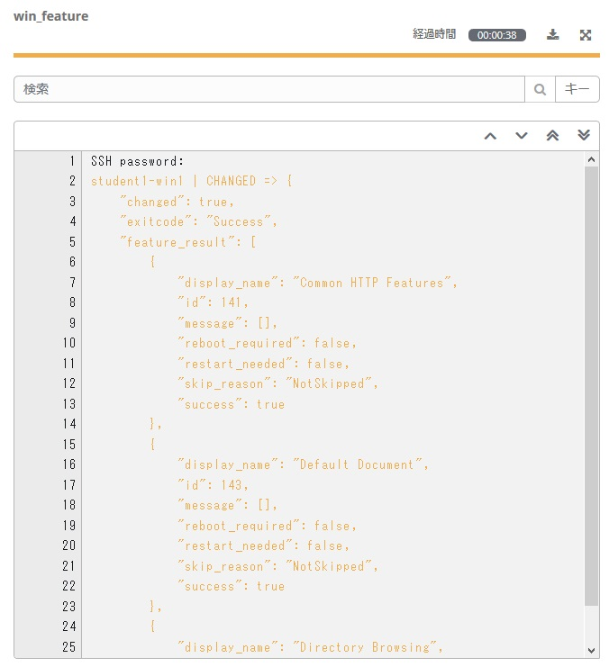
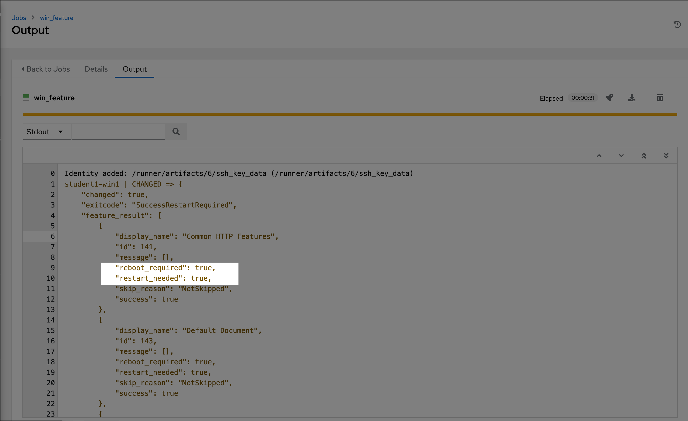

# 演習 2 - アドホックコマンド  

この演習では、いくつかのアドホックコマンドを実行して、Ansibleがどのように機能するかを理解します。 Ansible アドホックコマンドを使用すると、Playbook を作成しなくてもリモートノードでタスクを実行できます。多くのリモートノードに対して1つまたは2つのことを簡単に行う必要がある場合に非常に便利です。  

### ステップ 1:

左パネルの **インベントリー**をクリックし、インベントリ **Windows Workshop Inventory** をクリックします。  
インベントリーの詳細が表示されたら**ホスト**をクリックします。  

各ホストの横にはチェックボックスがあります。アドホックコマンドを実行する Windows グループに属するホストの横にあるチェックボックスをオンにします。**コマンドの実行** ボタンが有効になったことを確認し、クリックします。  

**コマンドの実行** ウィンドウが表示されます。ここからアドホックコマンドを実行する事が出来ます。  

まずは簡単なことから始めましょう♪  
ホストへの ping です。 `win_ping` モジュールは、Windows ホストが応答することを確認します。これは一般的に知られているネットワークの*ping*ではなく、Ansible のターゲットホストへ接続と認証の両方を検証します。

下記を入力ください。  

| キー                | 値           | 備考                                                            |
|--------------------|-----------------|-----------------------------------------------------------------|
| モジュール             | `win_ping`      |                                                                 |
| 引数         |                 | 空欄のままでOKです                                             |
| 制限              |                 | 選択したホストが自動で入力されます |
| マシンの認証情報 | Student Account |                                                                 |

**起動** をクリックするとジョブ表示に切り替わります。Ansible Towerのすべてのジョブと実行内容は保存されます。これらのログは自動でローテーションする形式をとっていますが、Splunk や ELK などの別のログシステムに自動的にエクスポートすることもできます。  

以下の通りログには、誰が、どのホストに対して、いつ、ジョブを実行したかなどの情報が含まれます。  

また、実際の出力結果が表示されます。接続が成功した場合、次のような結果が表示されます。

結果表示は、使用するモジュールによって異なります。タスクに応じて異なるデータセットを処理するためです。ただ、使用されているモジュールに関係なく、常に成功、失敗、変更、スキップのいずれかの色分けされたステータスが表示されます。これは共通です。  

### ステップ 2:

次に、`win_shell` モジュールを使用して PowerShell コマンドを実行し、出力を表示する方法を見てみましょう。

| キー                | 値           | 備考 |
|--------------------|-----------------|------|
| モジュール             | `win_shell`     |      |
| 引数          | `Get-Service`   |      |
| マシンの認証情報 | Student Account |      |

ジョブを起動し、結果を確認してみましょう。Powershell コマンドが返した内容が直接表示されていることが分かります。この表示内容を変数に保存し、Ansible Playbook 内で利用することも可能です。  

今度は引数に `Get-Process` を入力し、Powershell コマンドを実行してみましょう.

| キー                | 値           | 備考 |
|--------------------|-----------------|------|
| モジュール             | `win_shell`     |      |
| 引数          | `Get-Process`   |      |
| マシン認証情報 | Student Account |      |

### ステップ 3:

次に、Ansible の強力な機能の1つである、対象ノードのファクト情報について演習してみましょう。今回の演習では、Windows ノードの構成を確認します。利用するのは、`setup` モジュールです。このモジュールはリモートホストからさまざまなデータを取得し、そのデータを Ansible ファクトとして返します。ファクトには、OSバージョン、ハードウェア構成、その他のデータポイントなどターゲットノードに関する様々な情報が含まれてており、この情報を基にタスク実行の要否を判断したり、OSバージョンに基づいたパッケージ名の決定したりなど、Playbook 内で様々な形で再利用することが可能です。  

デフォルトで、 `setup` モジュールはすべての Playbook の先頭で自動的に実行されます。このため、このファクト情報は常に Playbook で利用可能です。

早速 `setup` モジュールを実行して出力を見てみましょう。下記情報を使用して**コマンド実行**を行います。

| キー                | 値           | 備考                |
|--------------------|-----------------|---------------------|
| モジュール             | `setup`         |                     |
| 引数          |                 | 空欄のまま |
| マシンの認証情報 | Student Account |                     |

実行すると以下のような結果が確認できます。  

(**Note:** 上記の出力の23行目に表示されている3つのドットをクリックすると、`setup`モジュールによって返されたすべてのファクトが表示されます。.)

### ステップ 4:

では、`win_feature` モジュールを使用して IIS をインストールしましょう。引数は、もう少し複雑になります。

| キー                | 値                           | 備考|
|--------------------|---------------------------------|------|
| モジュール             | `win_feature`                   |      |
| 引数          | `name=Web-Server state=present` |      |
| マシンの認証情報 | Student Account                 |      |

ログテキストがオレンジ色になっていることがわかります。これは、システムに変更が加えられたことを示しており、緑は変更が加えられていないことを示しています。

### ステップ 5:

IIS　がインストールされたので、 `service` モジュールを使用して開始されていることを確認してみます。  

| キー                | 値                      | 備考 |
|--------------------|----------------------------|------|
| モジュール             | `win_service`              |      |
| 引数         | `name=W3Svc state=started` |      |
| マシンの認証情報 | Student Account            |      |

### ステップ 6:

最後に、インストールした IIS をクリーンアップしましょう。まず、IISサービスを止めます。  

| キー                | 値                      | 備考 |
|--------------------|----------------------------|------|
| モジュール             | `win_service`              |      |
| 引数          | `name=W3Svc state=stopped` |      |
| マシンの認証情報 | Student Account            |      |

### ステップ 7:

次に、IIS をアンインストールします。  

| キー                | 値                          | 備考 |
|--------------------|--------------------------------|------|
| モジュール             | `win_feature`                  |      |
| 引数          | `name=Web-Server state=absent` |      |
| マシンの認証情報 | Student Account                |      |

そして、ホストをリブートします。And now reboot the host.

| キー                | 値           | 備考                |
|--------------------|-----------------|---------------------|
| モジュール             | `win_reboot`    |                     |
| 引数          |                 | 空欄のまま |
| マシンの認証情報 | Student Account |                     |

> **ヒント**
>
> この `win_reboot` モジュールはマシンをリブートさせ、終了する前の状態に完全に戻るのを待ちます。例えば Playbook の途中でホストを再起動する必要がある場合、ホストにアクセスできなくて Playbook の残りの部分の失敗になる事はありません。便利ですね。♬    

## まとめ

アドホックコマンドは、本当の意味でアドホックに実行する際に役に立ちます。逆に、皆さんもこの演習でちょっと感じたかもしれませんが、環境内で自動化が大きくなると、アドホックコマンドの実行は面倒になってきます。上記の IIS の例では、本来は、面倒な一連のアドホックコマンド実行ではなく、Playbook 化して実行する方が良かったと思います。アドホックコマンド利用は、CLIからの個々のコマンドの実行に似ていますよね。これは Playbook を使った演習で、より明確になります。

*こんなコメント確認しましたか？* Windowsサーバーでタスクが実行されると、Ansibleはそのタスクを実行した後の再起動の要否も同時に取得可能です。以下は、IIS 機能を削除するコマンドの出力の一部です。このタスクの出力は、続行する前に再起動するかどうかが含まれており、ここを確認の後、rebbot_required = true なら、後続のタスクでリブートを実行するようなことも可能です。  

[ワークショップ一覧に戻る](../readme.ja.md)
