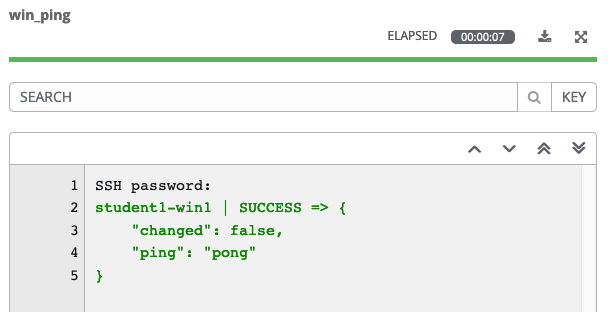
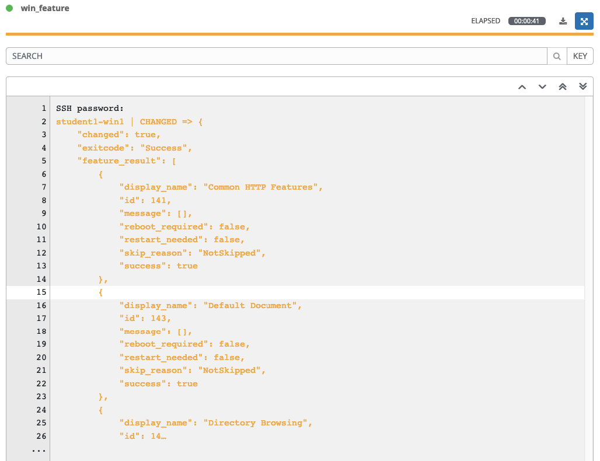
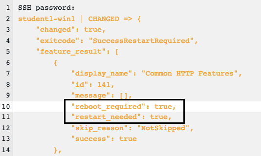

演習 2: アドホックコマンド  
==========================

最初の演習では、いくつかのアドホックコマンドを実行して、Ansibleがどのように機能するかを理解します。 Ansible アドホックコマンドを使用すると、プレイブックを作成しなくてもリモートノードでタスクを実行できます。多くのリモートノードに対して1つまたは2つのことを簡単に行う必要がある場合に非常に便利です。  

ステップ 1:
-------

左パネルの **インベントリー**をクリックし、インベントリ **Windows Workshop Inventory** をクリックします。  
インベントリーの詳細が表示されたら**ホスト**をクリックします。  

各ホストの横にはチェックボックスがあります。アドホックコマンドを実行する Windows グループに属するホストの横にあるチェックボックスをオンにします。**コマンドの実行** ボタンが有効になったことを確認し、クリックします。  

**コマンドの実行** ウィンドウが表示されます。ここからアドホックコマンドを実行する事が出来ます。  

まずは簡単なことから始めましょう♪  
ホストへの ping です。 `win_ping` モジュールは、Windows ホストが応答することを確認します。これは一般的に知られているネットワークの*ping*ではなく、Ansible のターゲットホストへ接続と認証の両方を検証します。

下記を入力ください。  

| キー                | 値           | 備考                                                            |
|--------------------|-----------------|-----------------------------------------------------------------|
| モジュール             | `win_ping`      |                                                                 |
| 引数         |                 | 空欄のままでOKです                                             |
| 制限              |                 | 選択したホストが自動で入力されます |
| マシンの認証情報 | Student Account |                                                                 |

**起動** をクリックするとジョブ表示に切り替わります。Ansible Towerのすべてのジョブとアクションは記録され保存されます。これらのログは自動でローテーションする形式をとっていますが、Splunk や ELK などの別のログシステムに自動的にエクスポートすることもできます。  

ログには、誰がジョブを開始したか、どのホストに対して、いつ実行したかなどの情報が含まれます。  

また、実際の出力結果が表示されます。接続が成功した場合、次のような結果が表示されます。

結果表示は、使用するモジュールによって異なります。タスクに応じて異なるデータセットを処理するためです。ただ、使用されているモジュールに関係なく、常に成功、失敗、変更、スキップのいずれかの色分けされたステータスが表示されます。これは共通です。  

ステップ 2:
-------

次に、`win_shell` モジュールを使用して PowerShell コマンドを実行し、出力を表示する方法を見てみましょう。

| キー                | 値           | 備考 |
|--------------------|-----------------|------|
| モジュール             | `win_shell`     |      |
| 引数          | `Get-Service`   |      |
| マシンの認証情報 | Student Account |      |

ジョブを起動し、結果を確認してみましょう。Powershell コマンドが返した内容が直接表示されていることが分かります。この表示内容を変数に保存し、後でAnsibleプレイブック内で利用することも可能です。  

今度は引数に `Get-Process` を入力し、Powershell コマンドを実行してみましょう.

| キー                | 値           | 備考 |
|--------------------|-----------------|------|
| モジュール             | `win_shell`     |      |
| 引数          | `Get-Process`   |      |
| マシン認証情報 | Student Account |      |

Step 3:
-------

ここで、Windowsノードの構成を確認します。`setup` モジュールはリモートホストにさまざまなデータを照会し、そのデータを Ansible ファクト情報として返します。ファクトには、OSバージョン、ハードウェア構成、その他のデータポイントなどターゲットノードに関する様々な情報が含まれてており、この情報を基にタスク実行の要否を判断したり、OSバージョンに基づいたパッケージ名の決定したりなど、プレイブック内で様々な形で再利用可能です。  

The `setup` module will run automatically at the beginning of every
playbook, unless configured not to, so that this data is always available to
your playbook.

Lets go ahead and run the `setup` module to look at the output. Fill out
the **EXECUTE COMMAND** form again with this info.

| Key                | Value           | Note                |
|--------------------|-----------------|---------------------|
| Module             | `setup`         |                     |
| Arguments          |                 | Intentionally blank |
| MACHINE CREDENTIAL | Student Account |                     |

You will then see results like this

(**Note:** If you click the three dots shown on line 23 in the above output, you will see all the facts returned by the `setup` module.)

Step 4:
-------

Now, let’s install IIS using the `win_feature` module. Our arguments
parameter is going to get a little more complex now.

| Key                | Value                           | Note |
|--------------------|---------------------------------|------|
| Module             | `win_feature`                   |      |
| Arguments          | `name=Web-Server state=present` |      |
| MACHINE CREDENTIAL | Student Account                 |      |

You will notice that the log text is now orange. This is to denote that
a change was made on the system versus the green that shows that no
changes were made earlier.

Step 5:
-------

OK, IIS is installed now so let’s be certain it is started using the
`service` module.

| Key                | Value                      | Note |
|--------------------|----------------------------|------|
| Module             | `win_service`              |      |
| Arguments          | `name=W3Svc state=started` |      |
| MACHINE CREDENTIAL | Student Account            |      |

Step 6:
-------

Finally, let’s clean up after ourselves. First, stop the IIS service.

| Key                | Value                      | Note |
|--------------------|----------------------------|------|
| Module             | `win_service`              |      |
| Arguments          | `name=W3Svc state=stopped` |      |
| MACHINE CREDENTIAL | Student Account            |      |

Step 7:
-------

Next, remove the IIS feature.

| Key                | Value                          | Note |
|--------------------|--------------------------------|------|
| Module             | `win_feature`                  |      |
| Arguments          | `name=Web-Server state=absent` |      |
| MACHINE CREDENTIAL | Student Account                |      |

And now reboot the host.

| Key                | Value           | Note                |
|--------------------|-----------------|---------------------|
| Module             | `win_reboot`    |                     |
| Arguments          |                 | Intentionally blank |
| MACHINE CREDENTIAL | Student Account |                     |

> **Note**
>
> The `win_reboot` module will cause the machine to reboot, and then will
> wait for it to come completely back up before finishing. This way, if
> you need to reboot the host in the middle of your playbook, the rest
> of the playbook will not fail because the host is inaccessible.

End Result
----------

Ad-hoc commands may be useful to run once in a while. However, as automation continues to grow within an environment, they are used less and less often. In the IIS example above, this could have (should have) been written out in a playbook instead of executed through a laborious series of ad-hoc commands. This interaction with ad-hoc commands seems to mimic running individual commands from a CLI. Additional exercises will really make this clear.

*Also, did you catch this?* When a task is performed on a Windows server, Ansible is smart enough to know whether a reboot is required after executing that task. The below is part of the output of the command to remove the IIS feature. The output of this task can be used in subsequent tasks, like whether or not to reboot before continuing. 

