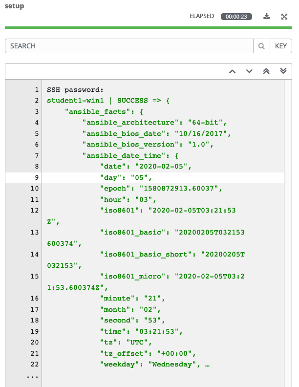

Section 1: Ad-hoc commands
==========================

For our first exercise, we are going to run some ad-hoc commands to help
you get a feel for how Ansible works. Ansible Ad-Hoc commands enable you
to perform tasks on remote nodes without having to write a playbook.
They are very useful when you simply need to do one or two things
quickly, to many remote nodes.

Step 1:
-------

To start, we will need to go to our Inventory. So click **Inventories**
on the left panel, and then click the name of our Inventory **Windows
Workshop Inventory**. Now that you are on the Inventory Details page, we
will need to go select our Host. So click **HOSTS**.

Next to each host is a checkbox. Check the box next to each host you
want to run an Ad-Hoc Command on. You will then see the **RUN COMMANDS**
button become enabled. Click it now.

This will pop up the **Execute Command** window. From here is where we
can run a single task against our hosts.

Let’s start with something really basic - pinging a host. The `win_ping`
module makes sure our windows hosts are responsive. This is not a
traditional *ping*, but actually verifying both connectivity and
authentication to the host.

Fill out this form as follows

| Key                | Value           | Note                                                            |
|--------------------|-----------------|-----------------------------------------------------------------|
| Module             | `win_ping`      |                                                                 |
| Arguments          |                 | Intentionally blank                                             |
| Limit              |                 | This will be pre-filled out for you with the hosts you selected |
| MACHINE CREDENTIAL | Student Account |                                                                 |

Once you click **LAUNCH** you will be redirected to the Job log. Every
job and action in Ansible Tower is recorded and stored. These logs can
be auto-rotated and can also be exported automatically to another
logging system such as Splunk or ELK.

The first part of the log shows you the details of the job. This
includes information such as who launched the job, against what hosts,
and when.

The second part of the job log shows you the actual output from the
command. If your connection was successful, you should see a result such
as this.

The results returned will be different depending on which module is
used, as they all handle and deal with different data sets depending on
the task. No matter which module is used, you will always see a color
coded STATUS of either SUCCESS, FAILURE, CHANGED, or SKIPPING.

Step 2:
-------

Now let’s see how we can run a PowerShell command and view the output
using the `win_shell` module.

Let’s fill out the form again, but this time use the `win_shell` module
to execute the `Get-Service` Powershell command.

| Key                | Value           | Note |
|--------------------|-----------------|------|
| Module             | `win_shell`     |      |
| Arguments          | `Get-Service`   |      |
| MACHINE CREDENTIAL | Student Account |      |

Launch the job and view the results. You will see that it returns a
direct output of what the Powershell command returned. This data can be
stored to a variable and directly parsed inside your Ansible playbook
later on.

And run it one more time with the `Get-Process` Powershell command.

| Key                | Value           | Note |
|--------------------|-----------------|------|
| Module             | `win_shell`     |      |
| Arguments          | `Get-Process`   |      |
| MACHINE CREDENTIAL | Student Account |      |

Step 3:
-------

We will now take a look at your Windows nodes configuration. The `setup`
module queries the remote host for various data and returns that data as
Ansible facts. This data is useful to determine things such as OS
Versions, Hardware Configuration, and other data points. This
can then be used in your playbook for all sorts of reasons such as
determining whether a task should even run, or determining what the name
of a package should be based upon the OS Version.

The `setup` module will run automatically at the beginning of every
playbook, unless configured not to, so that this data is always available to
your playbook.

Lets go ahead and run the `setup` module to look at the output. Fill out
the **EXECUTE COMMAND** form again with this info.

| Key                | Value           | Note                |
|--------------------|-----------------|---------------------|
| Module             | `setup`         |                     |
| Arguments          |                 | Intentionally blank |
| MACHINE CREDENTIAL | Student Account |                     |

You will then see results like this

(**Note:** If you click the three dots shown on line 23 in the above output, you will see all the facts returned by the `setup` module.)

Step 4:
-------

Now, let’s install IIS using the `win_feature` module. Our arguments
parameter is going to get a little more complex now.

| Key                | Value                           | Note |
|--------------------|---------------------------------|------|
| Module             | `win_feature`                   |      |
| Arguments          | `name=Web-Server state=present` |      |
| MACHINE CREDENTIAL | Student Account                 |      |

You will notice that the log text is now orange. This is to denote that
a change was made on the system versus the green that shows that no
changes were made earlier.

Step 5:
-------

OK, IIS is installed now so let’s be certain it is started using the
`service` module.

| Key                | Value                      | Note |
|--------------------|----------------------------|------|
| Module             | `win_service`              |      |
| Arguments          | `name=W3Svc state=started` |      |
| MACHINE CREDENTIAL | Student Account            |      |

Step 6:
-------

Finally, let’s clean up after ourselves. First, stop the IIS service.

| Key                | Value                      | Note |
|--------------------|----------------------------|------|
| Module             | `win_service`              |      |
| Arguments          | `name=W3Svc state=stopped` |      |
| MACHINE CREDENTIAL | Student Account            |      |

Step 7:
-------

Next, remove the IIS feature.

| Key                | Value                          | Note |
|--------------------|--------------------------------|------|
| Module             | `win_feature`                  |      |
| Arguments          | `name=Web-Server state=absent` |      |
| MACHINE CREDENTIAL | Student Account                |      |

And now reboot the host.

| Key                | Value           | Note                |
|--------------------|-----------------|---------------------|
| Module             | `win_reboot`    |                     |
| Arguments          |                 | Intentionally blank |
| MACHINE CREDENTIAL | Student Account |                     |

> **Note**
>
> The `win_reboot` module will cause the machine to reboot, and then will
> wait for it to come completely back up before finishing. This way, if
> you need to reboot the host in the middle of your playbook, the rest
> of the playbook will not fail because the host is inaccessible.

End Result
----------

Ad-hoc commands may be useful to run once in a while. However, as automation continues to grow within an environment, they are used less and less often. In the IIS example above, this could have (should have) been written out in a playbook instead of executed through a laborious series of ad-hoc commands. This interaction with ad-hoc commands seems to mimic running individual commands from a CLI. Additional exercises will really make this clear.

*Also, did you catch this?* When a task is performed on a Windows server, Ansible is smart enough to know whether a reboot is required after executing that task. The below is part of the output of the command to remove the IIS feature. The output of this task can be used in subsequent tasks, like whether or not to reboot before continuing. 

