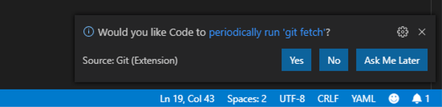

Les playbooks
=============

**Lisez ceci dans d'autres langues**:
<br> [English](README.md),  [日本語](README.ja.md),  [Française](README.fr.md).


Commençons par écrire notre premier **playbook ansible**. Le playbook est l'endroit où vous listez les étapes que vous souhaitez automatiser en un ensemble répétable de **play** et **tâches**. Pour commencer, nous allons configurer notre structure de répertoires pour stocker nos playbooks. Cette structure de répertoire se synchronisera avec un système **de gestion du contrôle des sources** (SCM) afin de recuperer nos playbooks. Nous utiliserons le SCM **git**.

Un playbook peut avoir plusieurs plays et un play peut avoir une ou plusieurs tâches. Le but d'un **play** est d'executer un ensemble de taches sur un groupe d'hôtes. Le but d'une **tâche** est d'executer une action sur l'hote via un module.

Pour notre premier playbook, nous n'écrirons qu'un play de 3 tâches.

Tous nos playbooks seront stockés dans un seul référentiel **git**.

Plusieurs utilisateurs peuvent utiliser le même référentiel et git gérera les conflits de fichiers et les versions.


Aperçu
======

À partir de maintenant, nous allons utiliser Visual Studio Code comme éditeur. Aussi, nous utiliserons GitLab pour le contrôle du code source. Cela nous permettra de minimiser le travail de développement sur la ligne de commande linux.
D'autres éditeurs ou solutions de code source pourait aussi être utilisés.


Section 1: Création d'une structure de répertoire et de fichiers pour votre Playbook
====================================================================================


Il existe les [meilleurs pratiques](http://docs.ansible.com/ansible/playbooks_best_practices.html) sur les structures de répertoires à adopter pour les playbooks. Nous vous encourageons fortement à lire et à comprendre ces pratiques au fur et à mesure que vous développez vos compétences Ansible. Cela dit, notre playbook est aujourd'hui très basique et une structure de répertoire complexe n'est pas nécessaire.

Au lieu de cela, nous allons créer une structure de répertoire très simple pour notre playbook et ajouter seulement quelques fichiers.


Étape 1:
--------

Ouvrez Visual Studio Code

Pour ce laboratoire, nous avons déjà créé un clone de votre référentiel Git pour vous.

Pour y accéder, cliquez sur le lien de VSCode Access depuis la page de l'atelier.


À ce stade, dans la barre latérale de l'Explorateur (à gauche), vous devriez avoir une section *WORKSHOP_PROJECT* contenant uniquement un fichier README.


Étape 2:
--------

Créez un répertoire appelé **iis_basic** et un fichier appelé `install_iis.yml`

Pour cela, passez la souris sur la section *WORKSHOP_PROJECT* et cliquez sur le bouton *Nouveau dossier*.
Créez un dossier appelé `iis_basic`. Cliquez ensuite sur ce dossier pour qu'il soit sélectionné. Cliquez avec le bouton droit sur le nouveau dossier que vous avez créé et créez un fichier appelé `install_iis.yml`.

Vous devriez maintenant avoir un éditeur ouvert dans le volet droit qui peut être utilisé pour créer votre playbook.


Section 2: Definir votre Play
=============================

Maintenant, nous que nous avons le fichier `install_iis.yml`, commençons par écrire le play et comprendre ce que chaque ligne accomplit

```yaml
    ---
    - name: install the iis web service
      hosts: windows
```

- `---` Définit le début du fichier YAML

- `name: install the iis web service` Cela décrit notre jeu

- `hosts: windows` Définit le groupe d'hôtes de votre inventaire sur lequel ce play se déroulera

Section 3: Ajout de tâches à votre play
=======================================

Maintenant que nous avons défini votre play, ajoutons quelques tâches pour accomplir certaines actions. Alignez (verticalement) le **t** de `task` avec le **h** de `hosts`.
Oui, cela compte vraiment. En fait, vous devez vous assurer que toutes vos déclarations de playbook sont alignées de la manière indiquée ici. Il est important également d'utiliser des espaces pour l'indentation. Les tabulations ne sont pas une syntaxe YAML valide.
Si vous souhaitez voir l'intégralité du play pour référence, passez au bas de cet exercice.


<!--  -->
```yaml
      tasks:
       - name: install iis
         win_feature:
           name: Web-Server
           state: present

       - name: start iis service
         win_service:
           name: W3Svc
           state: started

       - name: Create website index.html
         win_copy:
           content: "{{ iis_test_message }}"
           dest: C:\Inetpub\wwwroot\index.html

       - name: Show website address
         debug:
           msg: "http://{{ ansible_host }}"
```
<!--  -->

- `tasks:` Cela signifie qu'une ou plusieurs tâches sont sur le point d'être définies

- `- name:` Chaque tâche nécessite un nom qui s'affichera sur la sortie standard lorsque vous exécutez votre playbook. Par conséquent, donnez à vos tâches un nom court, simple et précis

<!-- -->

```yaml
    win_feature:
      name: Web-Server
      state: present
```

- Ces trois lignes appellent le module Ansible `win_feature` pour installer le serveur Web IIS. [Cliquez ici](http://docs.ansible.com/ansible/latest/win_feature_module.html) pour voir les options disponibles du module `win_feature`.

<!-- -->
```yaml
    win_service:
      name: W3Svc
      state: started
```

- Les lignes suivantes utilisent le module ansible `win_service` pour démarrer le service IIS. Le module `win_service` est le meilleur moyen pour contrôler les services sur les hôtes distants.[Cliquez ici](http://docs.ansible.com/ansible/latest/win_service_module.html) pour voir les options disponibles du module `win_service`.

<!--  -->
```yaml
    win_copy:
      content: "{{ iis_test_message }}"
      dest: C:\Inetpub\wwwroot\index.html
```
<!--  -->

- Dans cette tâche, nous utilisons le module `win_copy` pour créer un fichier avec un contenu spécifique. Nous ajoutons un peu de complexité ici car nous utilisons une variable comme contenu d'un fichier. Nous ne détaillerons pas l'utilisation des variables pour l'instant, car elles seront présentées dans une leçon ultérieure.

<!--  -->
```yaml
    debug:
      msg: http://{{ ansible_host }}
```
<!--  -->

- Cette tâche utilise le module `debug` pour afficher un message à la fin de l'exécution du playbook. Ce message affiche `http://` + le nom de la variable qui contient l'adresse IP de l'hôte sur lequel nous exécutons le playbook (notre serveur Windows IIS)

Section 4: Sauvegarder votre Playbook
=====================================


Maintenant que vous avez terminé la rédaction de votre playbook, il serait dommage de ne pas le conserver. Cliquez sur `Fichier > Enregistrer` dans le menu.

Vous devriez maintenant avoir le playbook prêt à être éxécuté `install_iis.yml`.

Mais attendez!!! Nous n'avons pas appliqué nos modifications **locale** à **git**. Cliquez sur l'icône du code source comme indiqué ci-dessous (c'est le milieu à l'extrême gauche de la page qui contient le cercle bleu avec \#1)


Tapez un message de validation tel que *Ajout de install_iis.yml* dans la zone de texte en haut de la barre latérale. Cochez la case ci-dessus pour valider. Ce message est destiné à décrire les modifications que vous avez apportées afin que les autres (vous y compris) comprennent mieux ce que votre modification change.


Vous devez maintenant envoyer les modifications validées à votre référentiel.

Dans la barre bleue en bas à gauche, cliquez sur la section contenant les flèches circulaires pour pousser les modifications.


Cela peut prendre jusqu'à 30 secondes pour pousser une modification. Après votre premier push, vous pouvez recevoir un message contextuel vous demandant si vous souhaitez exécuter périodiquement git fetch. Étant donné que vous êtes le seul à travailler sur le dépôt git, vous pouvez cliquer sur **Oui** ou **Non**.



Si vous souhaitez valider le code dans git, vous pouvez vous connecter à GitLab pour vérifier. Revenez à la page de l'atelier et cliquez sur le lien sous **GitLab Access** en prenant note de votre nom d'utilisateur et de votre mot de passe.


Vous êtes prêt à automatiser!

> **Remarque**
> Ansible (enfin, YAML) peut être un peu pointilleux sur le formatage, en particulier autour de l'indentation/espacement. Lorsque vous aurez du temps, lisez un peu plus cette documentation sur la [Syntaxe YAML] (http://docs.ansible.com/ansible/YAMLSyntax.html) et cela vous évitera quelques maux de tête plus tard. En attendant, votre playbook terminé devrait ressembler à ceci. Prenez note de l'espacement et de l'alignement.

<!--  -->
```yaml
    ---
    - name: install the iis web service
      hosts: windows

      tasks:
        - name: install iis
          win_feature:
            name: Web-Server
            state: present

        - name: start iis service
          win_service:
            name: W3Svc
            state: started

        - name: Create website index.html
          win_copy:
            content: "{{ iis_test_message }}"
            dest: C:\Inetpub\wwwroot\index.html

        - name: Show website address
          debug:
            msg: http://{{ ansible_host }}
```
<!--  -->
<br><br>
[Cliquez ici pour revenir à l'atelier Ansible pour Windows](../README.fr.md)
