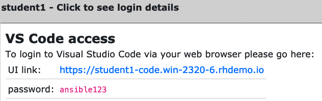
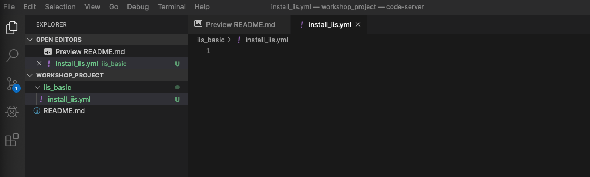
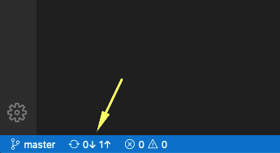

# 演習 3 - Playbook 概要

この演習では、初めての Ansible Playbook を書いてみましょう。 Playbook は、実際の作業を記述する **タスク** と、タスクの実行条件などを記述する **プレイ** のセットで構成されます。このセットは Playbook 内で繰り返すことも可能です。まず、Playbook を保存するためのディレクトリ構造をセットアップします。このディレクトリ構造は、**ソースコード管理**(SCM)システムと同期して、Playbook のバージョンや品質を管理します。 この演習では、SCM として**Git**を使用します。  

Playbook には1つ以上のプレイがあり、プレイには1つまたは複数のタスクがあります。 **プレイ**の目的の1つは、タスクを実行するホストのグループを記述することです。 **タスク**の目標は、それらのホストに対してモジュールを実行することです。  

最初の Playbook では、1つのプレイと3つのタスクを記述します。  

今回の演習では、全ての Playbook は単一のGit **リポジトリ**に保存されています。Git の様な SCM は、複数のユーザーが同じリポジトリを使用できるため、Playbook の品質とバージョンを管理に有用です。Ansible Tower では簡単に SCM と連携する事が出来ます。  

## 概要

この演習では、エディターとして Visual Studio Code を使ってみましょう。さらに、ソースコード管理に GitLab を使用します。これにより、Linuxコマンドラインを理解していなくても開発作業が楽に行えます。他のエディターまたはソースコードソリューションを使用することももちろん可能です。  

### ステップ 1: Playbook のディレクトリ構造とファイルの作成

Playbook のディレクトリ構造としては、[ベストプラクティス](http://docs.ansible.com/ansible/playbooks_best_practices.html)があります。Ansible の技術を習得する際には学習しておくことを強くお勧めします。ただこの演習で利用する Playbook は非常に基本的なものですので複雑なディレクトリ構造は必要ありません。  

この演習ではまず、シンプルなディレクトリ構造を作成し、そこに Playbook 及び、関連するいくつかのファイルを追加します。  

### ステップ 2: Visual Studio Code への接続

Visual Studio Code を開きます。  

この演習では、あらかじめ各自の Git リポジトリはクローン済みです。  
VS Code へのアクセス先と認証情報を確認し接続を完了します。  



Explorer サイドバーは、READMEファイルのみを含むWORKSHOP_PROJECT セクションとなっています。  


### ステップ 3: ディレクトリーと Playbook の作成

*WORKSHOP_PROJECT*セクションにカーソルを合わせ、*New Folder*ボタンをクリックします。  
`iis_basic`という名前のフォルダーを作成します。次に作成した新しいフォルダーを右クリックして、`install_iis.yml`というファイルを作成します。  

作成すると右ペインに編集可能なエディタが表示されます。ここに Playbook を記述していきます。♬  



### ステップ 4: プレイの定義

`install_iis.yml`を編集します。まずプレイを記述してみましょう。  
次に、各行の意味をご説明します。  

```yaml
---
- name: install the iis web service
  hosts: windows
```

- `---` YAMLであることを示しています。  

- `name: install the iis web service` プレイに対する名前です。  

- `hosts: windows` このプレイが実行されるインベントリ内のホストグループを定義します  

### ステップ 5: プレイに対するタスクの記述

次に、いくつかのタスクを追加します。（タスク）の**t**をhost`hosts`の**h**に（垂直に）位置合わせします。  
YAML ファイルではスペースはとても重要です。タブを使ってはいけません。  
Playbook 全体は一番下にありますので必要に応じてご参照ください。  

<!--  -->
```yaml
  tasks:
   - name: install iis
     win_feature:
       name: Web-Server
       state: present
       
   - name: start iis service
     win_service:
       name: W3Svc
       state: started

   - name: Create website index.html
     win_copy:
       content: "{{ iis_test_message }}"
       dest: C:\Inetpub\wwwroot\index.html

   - name: Show website address
     debug:
       msg: "http://{{ ansible_host }}"
```
<!--  -->

- `tasks:` タスクが記述されていることを示しています。  

- `- name:` Playbook の実行時に標準出力に表示される名前です。短くて分かりやすい名前が良いと思います。♬

<!-- -->

```yaml
    win_feature:
      name: Web-Server
      state: present
```

- 上記 3 行は、Ansible モジュール**`win_feature`**　を使って IIS Web サーバーをインストールしています。`win_feature` モジュールのすべてのオプションを表示します。win_feature モジュール詳細は[こちら](http://docs.ansible.com/ansible/latest/win_feature_module.html)をご参照ください。  


<!-- -->
```yaml
    win_service:
      name: W3Svc
      state: started
```

- 続くいくつかの行で、Ansible モジュール **win_service** を使って IIS サービスを起動しています。この win_service モジュールは windows ホストのサービス管理するために有用なモジュールです。win_service モジュール詳細は[こちら](http://docs.ansible.com/ansible/latest/win_service_module.html)をご参照ください。  
 

<!--  -->
```yaml
    win_copy:
      content: "{{ iis_test_message }}"
      dest: C:\Inetpub\wwwroot\index.html
```
<!--  -->

- このタスクでは、win_copy モジュールを使用して、特定のコンテンツを含むファイルを対象ノードにコピーしています。 ここでは、変数を使用してコンテンツを取得しているため、少し表現が複雑になっています。変数については、後のレッスンで説明いたします。ここでは Ansible Tower から リモートホストに ファイル名 index.html としてファイルをコピーしていることだけ理解いただければ大丈夫です！    

<!--  -->
```yaml
    debug:
      msg: http://{{ ansible_host }}
```
<!--  -->

- このタスクは `debug` モジュールを利用しています。debug は、変数など特定の内容を出力するためのモジュールです。ここでは、`http://` に続いて、IISをインストールした対象ホストのアドレスを出力するよう構成されています。Ansible 実行後にすぐ対象ホストにブラウザでアクセス出来て便利ですよね。♬  


### ステップ 6: Playbook の保存

Playbook の記述が完了しましたので、保存しましょう。  
左上から `File > Save` をクリックします。  

And that should do it. You should now have a fully written playbook
called `install_iis.yml`.

でもまだ終わってません！！！ **ローカル**コピーから**Git**への変更（コミット）が必要です。以下に示すように、[Source Code]アイコンをクリックします（ページの一番左の中央にある青い円に1が表示されていることが確認できます）


サイドバーの上部にあるテキストボックスに*Adding install _iis.yml* など変更内容を入力した上で、上部の`Commit`をクリックします。このメッセージは、バージョンを比較するときに他の人（自分を含む）が何が変更されているかをよりよく理解できるように、行った変更を説明することを目的としています。  


次に、コミットした変更をリポジトリにプッシュする必要があります。  

左下の青いバーで、円形矢印を含むセクションをクリックして、変更をプッシュします。  



プッシュするのに30秒程度かかる場合があります。 最初のプッシュの後、git fetch を定期的に実行するかどうかを尋ねるポップアップメッセージが表示される場合があります。**Yes** or **No** どちらを選択いただいてもかまいません。  


コードがgitにあることを検証したい場合は、GitLabに接続して確認してみましょう。  


これで最初の Playbook は完成です♬  

> **Note**
>
> Ansible（実際、YAML）は、特にインデント/スペースの周りの書式設定に少しこだわりがあります。YAML の書き方は、[こちら](http://docs.ansible.com/ansible/YAMLSyntax.html)をご確認ください。上記で完成した Playbook は次のようになります。スペースに特に注意してください。

<!--  -->
```yaml
    ---
    - name: install the iis web service
      hosts: windows

      tasks:
        - name: install iis
          win_feature:
            name: Web-Server
            state: present

        - name: start iis service
          win_service:
            name: W3Svc
            state: started

        - name: Create website index.html
          win_copy:
            content: "{{ iis_test_message }}"
            dest: C:\Inetpub\wwwroot\index.html

        - name: Show website address
          debug:
            msg: http://{{ ansible_host }}
```
<!--  -->

[ワークショップ一覧に戻る](../readme.ja.md)
