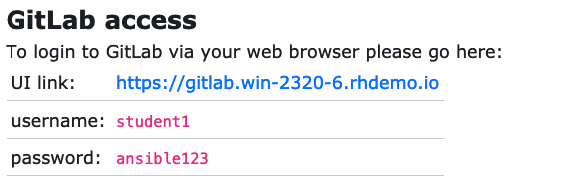

# ステップ 1 - Playbook 用のディレクトリー構造とファイルの作成

**他の言語でもお読みいただけます**:
<br> [English](README.md),  [日本語](README.ja.md),  [Français](README.fr.md).
<br>

最初の Ansible ** Playbook **を作成することから始めましょう。Playbook には、自動化するステップを **plays** と
**tasks** の繰り返し可能なセットにリストする場所です。まず、Playbook
を保存するためのディレクトリー構造を設定します。このディレクトリー構造は、**SCM** (source control management)
システムと同期して、プレイブックをバージョン管理します。SCM として **git** を使用します。

1 つの Playbook には、複数のプレイを含めることができ、単一または複数のタスクを指定できます。*play*
の目的は、ホストのグループをマッピングすることです。*task* の目的は、それらのホストにモジュールを実装することです。

最初の Playbook では、1 つの play で 3 つのタスクのみを記述します。

すべてのプレイブックは、1 つの git **repository** に保存されます。
複数のユーザーが同じリポジトリーを使用することができ、ファイルの競合やバージョンは git
が管理します。この環境では、各生徒はプライベートなリポジトリーに単独でアクセスできます。

## 概要

このタスクから始めて、エディターとして Visual StudioCode を使用します。さらに、ソースコード管理には Gitea
を使用します。これにより、Linux
コマンドラインでの開発作業を最小限に抑えることができます。他のエディターまたはソースコードソリューションを使用できますが、これは一般的なワークフローを示しています。

## ステップ 1 - Playbook 用のディレクトリー構造とファイルの作成

Playbook の望ましいディレクトリー構造については、[ベストプラクティス]
(https://docs.ansible.com/ansible/latest/user_guide/playbooks_best_practices.html)
があります。Ansible のスキルを向上させるために、これらのプラクティスを読んで理解することを強くお勧めします。とはいえ、今回の Playbook
は非常に基本的なものなので、複雑なディレクトリー構造は必要ありません。

代わりに、Playbook 用に非常に簡単なディレクトリー構造を作成し、いくつかのファイルを追加します。

**ステップ 1:**

Visual Studio Code を開きます。

このラボでは、Git リポジトリーのクローンをすでに作成しています。

アクセスするには、ワークショップページ から VS CodeAccess のリンクをクリックします。


Explorer サイドバーのこの時点で、README ファイルのみを含む* WORKSHOP_PROJECT *セクションが必要です。


**ステップ 2:** **iis_basic** というディレクトリーと
`install_iis.yml` というファイルを作成します。

*WORKSHOP_PROJECT* セクションにカーソルを合わせ、*New Folder* ボタンをクリックします。`iis_basic`
というフォルダーを作成します。次に、そのフォルダーをクリックして選択します。作成した新しいフォルダを右クリックして、`install_iis.yml`
というファイルを作成します。

これで、Playbook の作成に使用できるエディターが右側のペインで開いているはずです。


## セクション 2: プレイの定義

`install_iis.yml` を編集しているので、まずプレイを定義してから、各行が何を達成するかを理解しましょう。

```yaml
---
- name: install the iis web service
  hosts: windows
```

* `---` YAMLの始まりを定義します
* `name: install the iis web service` ここでは、プレイを説明します。
* `hosts: windows` このプレイが実行されるインベントリ内のホストグループを定義します

## セクション 3: プレイにタスクを追加する

プレイを定義したので、いくつかのタスクを追加して、いくつかのことを実行しましょう。`task` の **t**を `hosts` の **h** に
(垂直に) 揃えます。これは重要です。実際、すべての Playbook
ステートメントがここに示されている方法で整列されていることを確認する必要があります。また、インデントにはスペースを使用する必要があります。タブは有効な
YAML 構文ではありません。Playbook 全体を参照用に表示する場合は、この演習の最後にスキップしてください。

<!--  -->

```yaml
      tasks:
       - name: install iis
         win_feature:
           name: Web-Server
           state: present

       - name: start iis service
         win_service:
           name: W3Svc
           state: started

       - name: Create website index.html
         win_copy:
           content: "{{ iis_test_message }}"
           dest: C:\Inetpub\wwwroot\index.html

       - name: Show website address
         debug:
           msg: "http://{{ ansible_host }}"
```

<!--  -->

* `tasks:` これは、1 つ以上のタスクが定義されようとしていることを示します
* `- name:` 各タスクには、Playbook
  を実行したときに標準出力に出力される名前が必要です。したがって、タスクには短く、わかりやすい名前を付けてください

<!-- -->

```yaml
    win_feature:
      name: Web-Server
      state: present
```

* これらの3行は、IIS WebサーバーをインストールするためのAnsibleモジュール **`win_feature`**
  を呼び出しています。`win_feature` モジュールのすべてのオプションを見るには
  [ここをクリック](https://docs.ansible.com/ansible/latest/collections/ansible/windows/win_feature_module.html)
  します。

<!-- -->

```yaml
    win_service:
      name: W3Svc
      state: started
```

* 次の数行は、Ansible モジュール **win_service** を使用して IIS サービスを開始しています。`win_service`
  モジュールは、リモートホスト上のサービスを制御するための推奨される方法です。**`win_service`**
  モジュールの詳細は、[ここをクリック](https://docs.ansible.com/ansible/latest/collections/ansible/windows/win_service_module.html)
  してください。

<!--  -->

```yaml
    win_copy:
      content: "{{ iis_test_message }}"
      dest: C:\Inetpub\wwwroot\index.html
```

<!--  -->

* このタスクでは、win\_copy
  モジュールを使用して、特定の内容を含むファイルを作成します。変数を使用してコンテンツを取得しているため、ここではもう少し複雑になっています。変数については後のレッスンで紹介するため、まだ説明しません。

<!--  -->

```yaml
    debug:
      msg: http://{{ ansible_host }}
```

<!--  -->

* このタスクは、`debug` モジュールを使用して、Playbook
  の実行の最後にメッセージを投稿します。この特定のメッセージは、`http://` + 変数名 (Windows IIS server で
  Playbook を実行しているホストの IP アドレスを含む) を出力します。

## セクション 4: Playbook の保存

Playboook の作成が完了しても保存しなければ意味がありません
メニューから `File > Save` をクリックします。

これで OK です。これで `install_iis.yml` という完全に記述された Playbook ができました。

まだ終わりではありません。**ローカル** コピーから **git**
への変更をコミットしていません。以下に示すように、ソースコードアイコンをクリックします (ページの左端の中央に、\#1 が含まれる青い円があります)。


サイドバーの上部にあるテキストボックスに、*Adding install\_iis.yml*
などのコミットメッセージを入力します。コミットするには、上のチェックボックスをクリックしてください。このメッセージは、バージョンを比較するときに他の人
(自分を含む) が何が変更されているかをよりよく理解できるように、行った変更を説明することを目的としています。


次に、コミットされた変更をリポジトリーにプッシュする必要があります。

左下の青いバーで、円形の矢印が含まれているセクションをクリックして、変更をプッシュします。


プッシュするのに 30 秒ほどかかる場合があります。最初のプッシュ後、定期的に gitfetch
を実行するかどうかを尋ねるポップアップメッセージが表示される場合があります。git リポジトリで作業しているのはあなただけなので、**Yes** または
**No** をクリックできます。


コードが git にあることを検証することに興味がある場合は、GitLab に接続して確認できます。ワークショップページに戻り、**GitLab
Access** の下のリンクをクリックしてユーザー名とパスワードをメモします。



自動化の準備が整いました。

> **注意**
>
> Ansible (実際には YAML) はフォーマットがやや特殊と感じられるかもしれません。
> 特にインデント/間隔の周りが特殊です。オフィスに戻って
> この [YAML
構文](https://docs.ansible.com/ansible/latest/reference_appendices/YAMLSyntax.html) を少し読んだときの
> 煩わしさが軽減されます。
> 完成した Playbook は、次のようになります。スペースと
> アライメントには特に注意が必要です。

<!--  -->

```yaml
---
- name: install the iis web service
  hosts: windows

  tasks:
    - name: install iis
      win_feature:
        name: Web-Server
        state: present

    - name: start iis service
      win_service:
        name: W3Svc
        state: started

    - name: Create website index.html
      win_copy:
        content: "{{ iis_test_message }}"
        dest: C:\Inetpub\wwwroot\index.html

    - name: Show website address
      debug:
        msg: http://{{ ansible_host }}
```

<!--  -->

<br><br>
[Click here to return to the Ansible for Windows Workshop](../README.md)
