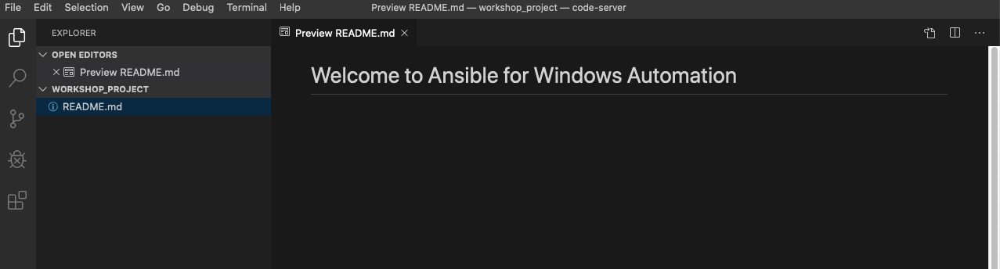

演習 3 - playbook 概要
=========================

この演習では、初めての Ansible Playbook を書いてみましょう。 Playbook は、実際の作業を記述する **タスク** と、タスクの実行条件などを記述する **プレイ** のセットで構成されます。このセットは Playbook 内で繰り返すことも可能です。まず、プレイブックを保存するためのディレクトリ構造をセットアップします。このディレクトリ構造は、**ソースコード管理**(SCM)システムと同期して、プレイブックのバージョンや品質を管理します。 この演習では、SCM として**git**を使用します。  

Playbook には複数のプレイがあり、プレイには1つまたは複数のタスクがあります。 **プレイ**の目的の1つは、タスクを実行するホストのグループを記述することです。 **タスク**の目標は、それらのホストに対してモジュールを実行することです。  

最初の Playbook では、1つのプレイと3つのタスクを記述します。  

今回の演習では、全ての Playbook は単一のgit **リポジトリ**に保存されています。複数のユーザーが同じリポジトリを使用でき、gitはファイルの競合とバージョンを管理します。

概要
========

この演習では、エディターとして Visual Studio Code を使ってみましょう。さらに、ソースコード管理に GitLab を使用します。これにより、Linuxコマンドラインを理解していなくても開発作業が楽に行えます。他のエディターまたはソースコードソリューションを使用することももちろん可能です。  

ステップ 1: プレイブックのディレクトリ構造とファイルの作成
-------

Playbook のディレクトリ構造としては、ベストプラクティスがあります。  
[ベストプラクティス]（http://docs.ansible.com/ansible/playbooks_best_practices.html）があります
Ansible の技術を習得する際には、上記を学習しておくことを強くお勧めします。とはいえ、この演習で利用する Playbook は非常に基本的なものですので複雑なディレクトリ構造は必要ありません。  

代わりに、非常にシンプルなディレクトリ構造を作成します。プレイブックを追加し、いくつかのファイルを追加します。  

ステップ 2: Visual Studio Code への接続
-------

Visual Studio Code を開きます。  

この演習では、あらかじめ各自の Git リポジトリはクローン済みです。  
VS Code へのアクセス先と認証情報を確認し接続を完了します。  


Explorer サイドバーは、READMEファイルのみを含むWORKSHOP_PROJECT セクションとなっています。  



ステップ 3: ディレクトリー**iis_basic** と　`install_iis.yml` の作成
-------

*WORKSHOP_PROJECT*セクションにカーソルを合わせ、*New Folder*ボタンをクリックします。  
`iis_basic`という名前のフォルダーを作成します。次に、そのフォルダをクリックして選択します。作成した新しいフォルダーを右クリックして、「install_iis.yml」というファイルを作成します。  

作成すると右ペインに編集可能なエディタが表示されます。ここに Playbook を記述していきます。♬  

You should now have an editor open in the right pane that can be used
for creating your playbook.


ステップ 4: プレイの定義
-------

Now that you are editing `install_iis.yml`, let’s begin by defining the
play and then understanding what each line accomplishes

```yaml
    ---
    - name: install the iis web service
      hosts: windows
```

- `---` YAMLであることを示しています。  

- `name: install the iis web service` play に対する名前です。  

- `hosts: windows` このプレイが実行されるインベントリ内のホストグループを定義します  

ステップ 5: プレイに対するタスクの記述
-------

次に、いくつかのタスクを追加します。 （タスク）の**t**をhost`hosts`の**h**に（垂直に）位置合わせします。  
はい、それは実際に重要です。 実際、プレイブックのすべてのステートメントがここに示されている方法で調整されていることを確認する必要があります。 また、インデントにはスペースを使用する必要があります。 タブは有効なYAML構文ではありません。
参照用にプレイブック全体を表示する場合は、この演習の最後までスキップしてください。

Now that we’ve defined your play, let’s add some tasks to get some
things done. Align (vertically) the **t** in `task` with the **h** in
`hosts`.
Yes, it does actually matter. In fact, you should make sure all of your
playbook statements are aligned in the way shown here. You also must use
spaces for indentation. Tabs are not valid YAML syntax.
If you want to see the entire playbook for reference, skip to the bottom
of this exercise.

<!--  -->
```yaml
      tasks:
       - name: install iis
         win_feature:
           name: Web-Server
           state: present

       - name: start iis service
         win_service:
           name: W3Svc
           state: started

       - name: Create website index.html
         win_copy:
           content: "{{ iis_test_message }}"
           dest: C:\Inetpub\wwwroot\index.html

       - name: Show website address
         debug:
           msg: "http://{{ ansible_host }}"
```
<!--  -->

- `tasks:` This denotes that one or more tasks are about to be defined

- `- name:` Each task requires a name which will print to standard
  output when you run your playbook. Therefore, give your tasks a name
  that is short, sweet, and to the point

<!-- -->

```yaml
    win_feature:
      name: Web-Server
      state: present
```

- These three lines are calling the Ansible module **`win_feature`** to
  install the IIS Web Server. [Click
  here](http://docs.ansible.com/ansible/latest/win_feature_module.html)
  to see all options for the `win_feature` module.

<!-- -->
```yaml
    win_service:
      name: W3Svc
      state: started
```

- The next few lines are using the ansible module **win\_service** to
  start the IIS service. The `win_service` module is the preferred way
  of controlling services on remote hosts. [Click
  here](http://docs.ansible.com/ansible/latest/win_service_module.html)
  to learn more about the **`win_service`** module.

<!--  -->
```yaml
    win_copy:
      content: "{{ iis_test_message }}"
      dest: C:\Inetpub\wwwroot\index.html
```
<!--  -->

- In this task, we use the win\_copy module to create a file with
  specific contents in it. We are getting a little more complex here
  as we are using a variable to source the contents. We won’t go into
  the variables just yet, since they will be showcased in a later
  lesson.

<!--  -->
```yaml
    debug:
      msg: http://{{ ansible_host }}
```
<!--  -->

- This task uses the `debug` module to post a message at the end of playbook execution. This particular message prints out `http://` + the variable name that contains the IP address of the host we're running the playbook on (our Windows IIS server)

Section 4: Saving your Playbook
===============================

Now that you’ve completed writing your playbook, it would be a shame not
to keep it. Click `File > Save` from the menu.

And that should do it. You should now have a fully written playbook
called `install_iis.yml`.

But wait!!! We haven’t committed our changes from our **local** copy to
**git**. Click the Source Code icon as shown below (It is the middle on
the far left of the page that has the blue circle with \# 1 in it)


Type in a commit message such as *Adding install\_iis.yml* in the text
box at the top of the sidebar. Click the check box above to commit. This
message is intended to describe the changes you made so that others
(including yourself) better understand what is changing when comparing
versions.


Now you need to push the committed changes to your repository.

On the bottom left blue bar, click the section that contains the
circular arrows to push the changes.


This may take as long as 30 seconds to push. After your first push, you
may get a pop-up message asking if you would like to periodically run
git fetch. Because you’re the only one working on the git repo, you can
click **Yes** or **No**.


If you’re interested in validating the code is in git, you can connect
to GitLab to verify. Go back to the workshop page, and click the link under **GitLab Access** taking note of your username and password.


You are ready to automate!

> **Note**
>
> Ansible (well, YAML really) can be a bit particular about formatting
> especially around indentation/spacing. When you get back to the
> office, read up on this [YAML
> Syntax](http://docs.ansible.com/ansible/YAMLSyntax.html) a bit more
> and it will save you some headaches later. In the meantime, your
> completed playbook should look like this. Take note of the spacing and
> alignment.

<!--  -->
```yaml
    ---
    - name: install the iis web service
      hosts: windows

      tasks:
        - name: install iis
          win_feature:
            name: Web-Server
            state: present

        - name: start iis service
          win_service:
            name: W3Svc
            state: started

        - name: Create website index.html
          win_copy:
            content: "{{ iis_test_message }}"
            dest: C:\Inetpub\wwwroot\index.html

        - name: Show website address
          debug:
            msg: http://{{ ansible_host }}
```
<!--  -->
