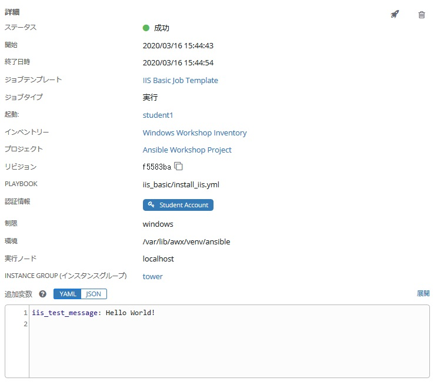
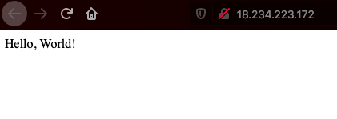

# 演習 4 - Ansible Tower プロジェクト・ジョブテンプレート

Ansible Tower 独自のオブジェクトとして、プロジェクトとジョブテンプレートがあります。  

## ジョブテンプレート

Playbook 実行に必要な以下のオブジェクトを紐づけて定義したものです。  

・管理対象ホストの一覧（インベントリ）  
・管理対象ホストの認証情報（ホスト認証情報）  
・起動するAnsible Playbook（プロジェクト / Playbook）  

ジョブテンプレートを作成・実行すると、管理対象ホストに対して Playbook が実行されます。  

## プロジェクト

利用する Playbook の保存先ディレクトリを指定したものです。プロジェクトで指定するのは Playbook のディレクトリまでで、Playbook の指定はジョブテンプレートで行います。プロジェクトは、/var/lib/awx/projects/ 配下に作成され、各プロジェクトの中に Playbook が配置されます。Playbook は Ansible Tower ホストに sshで接続して /var/lib/awx/projects/<project_name>/xxx.yml という形で作成することも可能ですし、Git 等の SCM と連携して管理することも可能ですが、Playbook の品質管理やバージョン管理の面で、SCM利用を推奨しています。この演習でも、SCMを利用します。  

## プロジェクトの同期

新しい Playbook でジョブテンプレートを作成する前に、最初にプロジェクトを同期して、Towerがそれを認識できるようにする必要があります。 これを行うには、**プロジェクト**をクリックし、プロジェクトの横にある同期アイコンをクリックします。 これが完了したら、ジョブテンプレートを作成することができます。  

## ジョブテンプレートの作成

### ステップ 1:

左側のメニューから**テンプレート**をクリックします。  

### ステップ 2:

次に、右側にある緑色の **＋** アイコンをクリックし、**ジョブテンプレート** を選択します。  

### ステップ 3:

ジョブテンプレート作成画面が立ち上がりますので、以下を参考に作成ください。  

| キー         | 値                                        | 備考 |
|-------------|----------------------------------------------|------|
| 名前        | IIS Basic Job Template                       |      |
| 説明 | Template for the iis-basic playbook          |      |
| ジョブタイプ    | 実行                                          |      |
| インベントリー   | Windows Workshop Inventory                   |      |
| プロジェクト     | Ansible Workshop Project                     |      |
| PLAYBOOK    | `iis-basic/install_iis.yml`                  |      |
| 認証情報  | 認証情報タイプ: **マシン**. 名前: **Student Account** |      |
| 制限       | windows                                      |      |
| オプション     | [*] ファクトキャッシュの有効化にチェック       |      |

### ステップ 4:

 をクリックし、 をクリックします。  

### ステップ 5:

以下の値を参考に、Surveyを完成させてください。  

| キー                    | 値                                                      | 備考             |
|------------------------|------------------------------------------------------------|------------------|
| プロンプト                 | 新しい Web サイト用のテストメッセージを入力します          |                  |
| 説明            | Webサイトのテストメッセージ入力画面                                |                  |
| 回答の変数名   | `iis_test_message`                                         |                  |
| 回答タイプ            | テキスト                                                       |                  |
| 最大長 |                                                            | デフォルトのまま |
| デフォルトの応答         | *Be creative, keep it clean, we're all professionals here* |                  |  

### ステップ 6:

 をクリックします。  

### ステップ 7:

 をクリックします。  

### ステップ 8:

先ほどのジョブテンプレート作成画面に戻りますので、保存ボタンをクリックします。  
　　
　　
## ジョブテンプレートの起動

ここまでの演習でジョブテンプレートの作成が完了しました。早速起動してみましょう。♬  
ジョブテンプレートを実行するとジョブのステータスがリアルタイムで更新されるジョブ画面にリダイレクトされます。  

### ステップ 1:

テンプレートをクリックします。  

> **ヒント**
>
> ジョブテンプレートの作成ページから移動していない場合は、下にスクロールして既存のすべてのジョブテンプレートを表示することも可能です  

### ステップ 2:

**IIS Basic Job Template**の右端にあるロケットアイコン  をクリックします。  

### ステップ 3:

Surveyで作成した入力画面が表示されるので、お好きなメッセージ(英語)を入力してください。♪  

### ステップ 4:

**次へ** をクリックします。  

### ステップ 5:

  
起動ボタンをクリックしてジョブテンプレートを起動します。  

### ステップ 6:

ジョブの画面にリダイレクトされます。ジョブのステータス（保留中、実行中、完了など）や、だれがいつ、どのインベントリーに対して実行しているかなどが確認できます。  

また、実際に動作しているジョブのステータスが表示されていることが分かります。  

### ステップ 7:

ジョブが正常に完了すると、ジョブ出力の下部にWebサイトへのURLが印刷されます。  
アドレスに接続すると、以下のようなものが表示されます。  

### 追加演習

ここまでで IISをインストールしましたので、*remove_iis.yml*という新しい Playbook を作成してIISを停止および削除します。  

**ヒント：**  

最初に `win_service` モジュールを使用して `W3Svc` サービスを停止。次に `win_feature` モジュールを使用して `Web-Server` サービスを削除します。 オプションで、`win_file` モジュールを使用してインデックスページを削除すれば完璧ですね♪  

## まとめ

演習4はこれで終了です。ここまでで、Ansible Tower のコア機能を学びました。次の演習では、高度な Playbook の演習を行います。  

[ワークショップ一覧に戻る](../readme.ja.md)
