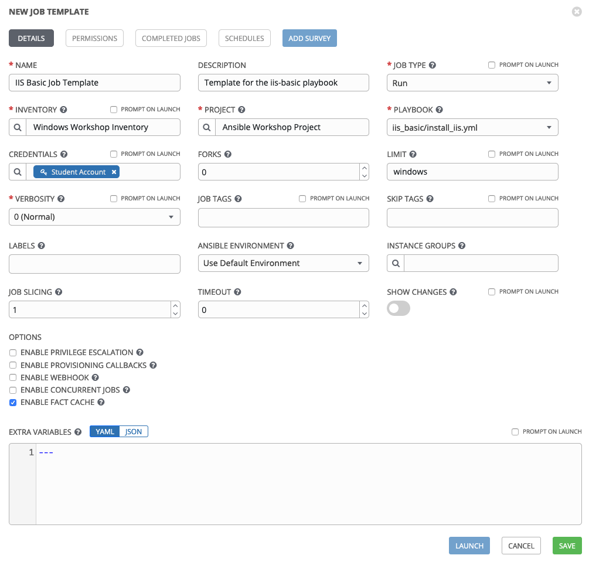
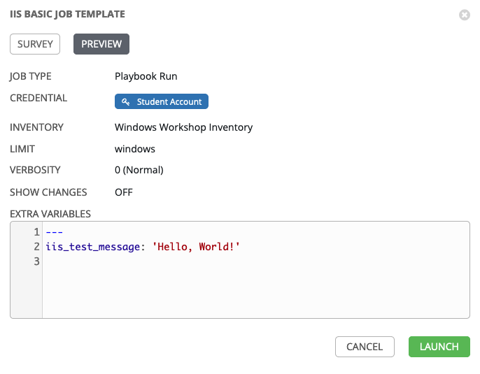
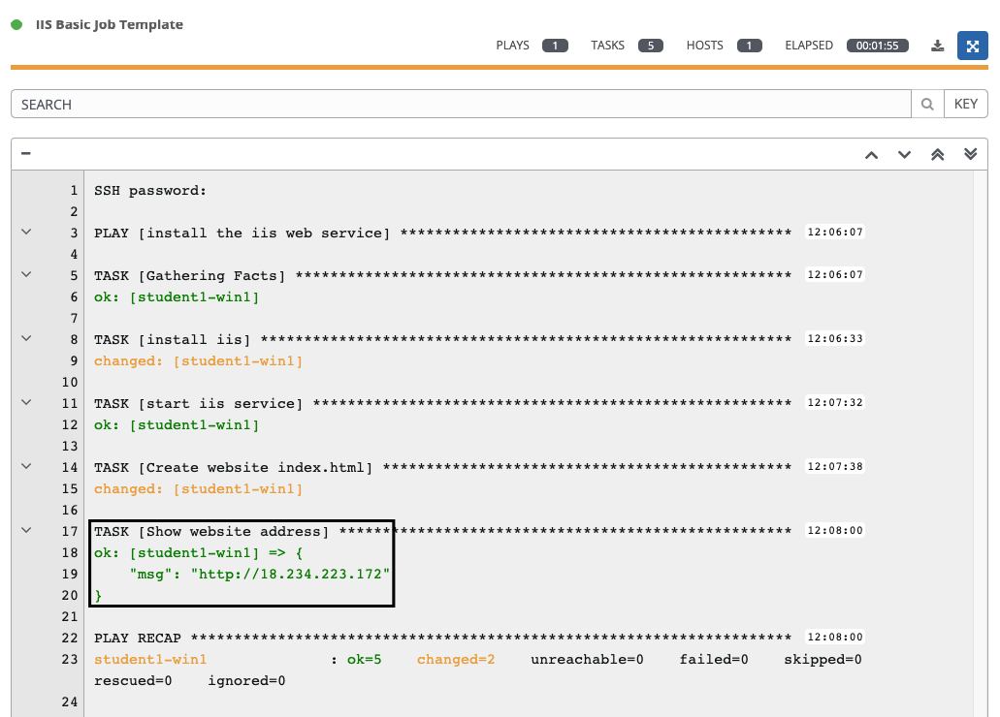

**他の言語でもお読みいただけます**:
  [English](README.md),  [日本語](README.ja.md),  [Français](README.fr.md).
 

ジョブテンプレートは、Ansible
ジョブを実行するための定義とパラメーターのセットです。ジョブテンプレートは、同じジョブを何度も実行するのに役立ちます。

プロジェクトの同期
===========================

新しいプレイブックを使用してジョブテンプレートを作成する前に、Controller
がそれを認識できるように、まずプロジェクトを同期する必要があります。これを行うには、Controller にアクセスし、**Projects**
をクリックしてから、プロジェクトの横にある同期アイコンをクリックします。これが完了したら、ジョブテンプレートを作成できます。

ジョブテンプレートの作成
====================================

ステップ 1
--------------

**Templates** を選択します

ステップ 2
--------------

 アイコンをクリックして、ジョブテンプレートを選択します。

ステップ 3
--------------

次の値を使用してフォームに記入します

| Key         | Value                                        | Note |
|-------------|----------------------------------------------|------|
| Name        | IIS Basic Job Template                       |      |
| Description | Template for the iis-basic playbook          |      |
| JOB TYPE    | Run                                          |      |
| INVENTORY   | Workshop Inventory                   |      |
| PROJECT     | Ansible Workshop Project                     |      |
| Execution Environment | windows workshop execution environment             |      |
| PLAYBOOK    | `iis-basic/install_iis.yml`                  |      |
| CREDENTIAL  | Name: **Windows Credential** |      |
| LIMIT       | windows                                      |      |
| OPTIONS     | [*] ENABLE FACT STORAGE                        |      |

ステップ 4
--------------

SAVE  をクリックします。表示されたページで、**Survey** タブを選択し、**Add**
ボタンを押します 

ステップ 5
--------------

次の値を使用して survey フォームに記入します

| Key                    | Value                                                      | Note             |
|------------------------|------------------------------------------------------------|------------------|
| PROMPT                 | Please enter a test message for your new website           |                  |
| DESCRIPTION            | Website test message prompt                                |                  |
| ANSWER VARIABLE NAME   | `iis_test_message`                                         |                  |
| ANSWER TYPE            | Text                                                       |                  |
| MINIMUM/MAXIMUM LENGTH |                                                            | Use the defaults |
| DEFAULT ANSWER         | *Be creative, keep it clean, we’re all professionals here* |                  |

Survey の設定後に、**保存** をクリックします。生成されるページで、作成した Survey を有効にします。

ジョブテンプレートの実行
====================================

ジョブテンプレートが正常に作成されたので、起動する準備が整いました。起動すると、ジョブのステータスを示す、リアルタイムで更新されるジョブ画面にリダイレクトされます。

ステップ 1
--------------

テンプレートを選択します

ステップ 2
--------------

**IIS Basic Job Template** のロケットアイコン！
をクリックします

ステップ 3
--------------

プロンプトが表示されたら、目的のテストメッセージを入力します

！[Survey プロンプト](images / 4-survey-prompt.png)

ステップ 4
--------------

**NEXT** を選択し、入力をプレビューします。

ステップ 5
--------------

LAUNCH  を選択します

ステップ 6
--------------

リラックスしながら、魔法を拝見しましょう

再度ジョブログページが表示されます。**詳細** タブを選択すると、他の詳細間で Playbook に渡した変数が表示されます。

次に、Playbook のプレイと各タスクの詳細を確認できます。

ステップ 7
--------------

ジョブが正常に完了すると、ジョブ出力の下部に Web サイトへの URL が出力されます。

すべてが問題なければ、このようなものが表示されるはずです。メッセージは当然、独自のカスタムが表示されます。

追加クレジット
=====================

IIS がインストールされたので、*remove\_iis.yml* という新しい Playbook を作成して、IIS を停止および削除します。

**ヒント:** まず、`win_service` モジュールを使って、`W3Svc` サービスを停止します。
その後、`win_feature` モジュールを使用して `Web-Server` サービスを削除します。
オプションとして、`win_file` モジュールを使用してインデックスページを削除します。

結果
======

ワークショップのこの時点で、Ansible Controller
のコア機能を体験しました。しかし、待ってください。まだまだあります。これは、Automation Controller
でできることの一部にすぎません。次のいくつかのレッスンは、基本的な Playbook からの発展に役立ちます。

  
[Click here to return to the Ansible for Windows Workshop](../README.md)
