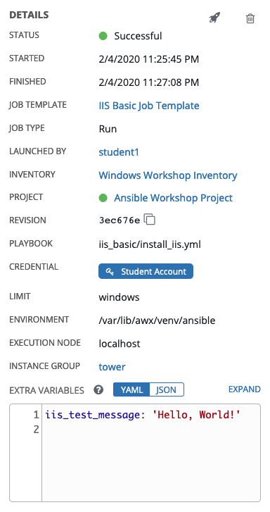

**Read this in other languages**:
  [English](README.md),  [日本語](README.ja.md),  [Français](README.fr.md).
 

A job template is a definition and set of parameters for running an
Ansible job. Job templates are useful to execute the same job many
times.

Syncing your Project
====================

Before you can create a job template with a new playbook, you must first
sync your Project so that Controller knows about it. To do this, visit Controller, click
**Projects** and then click the sync icon next to your project. Once
this is complete, you can create the job template.

Creating a Job Template
=======================

Step 1
------

Select **Templates**

Step 2
------

Click the  icon, and select Job Template

Step 3
------

Complete the form using the following values

| Key         | Value                                        | Note |
|-------------|----------------------------------------------|------|
| Name        | IIS Basic Job Template                       |      |
| Description | Template for the iis-basic playbook          |      |
| JOB TYPE    | Run                                          |      |
| INVENTORY   | Workshop Inventory                   |      |
| PROJECT     | Ansible Workshop Project                     |      |
| Execution Environment | windows workshop execution environment             |      |
| PLAYBOOK    | `iis_basic/install_iis.yml`                  |      |
| CREDENTIAL  | Name: **Windows Credential** |      |
| LIMIT       | windows                                      |      |
| OPTIONS     | [*] ENABLE FACT STORAGE                        |      |

Step 4
------

Click SAVE . On the resulting page, select the **Survey** tab and press the **Add** button

Step 5
------

Complete the survey form with following values

| Key                    | Value                                                      | Note             |
|------------------------|------------------------------------------------------------|------------------|
| PROMPT                 | Please enter a test message for your new website           |                  |
| DESCRIPTION            | Website test message prompt                                |                  |
| ANSWER VARIABLE NAME   | `iis_test_message`                                         |                  |
| ANSWER TYPE            | Text                                                       |                  |
| MINIMUM/MAXIMUM LENGTH |                                                            | Use the defaults |
| DEFAULT ANSWER         | *Be creative, keep it clean, we’re all professionals here* |                  |

After configuring your survey, click **Save**. On the resulting page, turn on the survey you just created.

Running a Job Template
======================

Now that you’ve successfully created your Job Template, you are ready to
launch it. Once you do, you will be redirected to a job screen which is
refreshing in real time showing you the status of the job.

Step 1
------

Select TEMPLATES

Step 2
------

Click the rocketship icon  for the
**IIS Basic Job Template**

Step 3
------

When prompted, enter your desired test message

Step 4
------

Select **NEXT** and preview the inputs.

Step 5
------

Select LAUNCH 

Step 6
------

Sit back, watch the magic happen

Once again you should be presented with a Job log page. Selecting the **Details** tab should show you the variable you passed into the playbook among other details.

Next you will be able to see details on the play and each task in the
playbook.

Step 7
------

When the job has successfully completed, you should see a URL to your website printed at the bottom of the job output.

If all went well, you should see something like this, but with your own
custom message of course.

Extra Credit
============

Now that you have IIS Installed, create a new playbook called
*remove\_iis.yml* to stop and remove IIS.

**Hint:** First stop the `W3Svc` service using the `win_service` module,
then delete the `Web-Server` service using the `win_feature` module.
Optionally, use the `win_file` module to delete the index page.

End Result
==========

At this point in the workshop, you’ve experienced the core functionality
of Automation Controller. But wait… there’s more! You’ve just begun to explore
the possibilities of Automation Controller. The next few lessons will help you
move beyond a basic playbook.

  
[Click here to return to the Ansible for Windows Workshop](../README.md)
