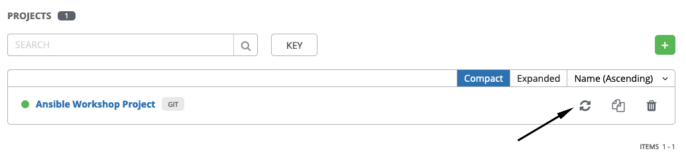
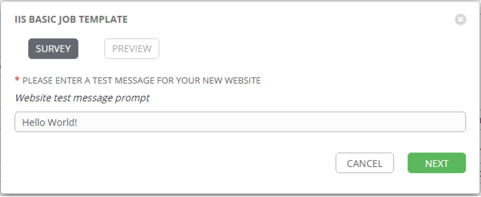

演習 4 - Ansible Tower プロジェクト・ジョブテンプレート
=========================

Ansible Tower 独自のオブジェクトとして、プロジェクトとジョブテンプレートがあります。  

ジョブテンプレート
-------
Playbook 実行に必要な以下のオブジェクトを紐づけて定義したものです。  

・接続先ホスト一覧（インベントリ）  
・接続先ホストの認証情報（ホスト認証情報）  
・起動するAnsible Playbook（プロジェクト / Playbook）  

ジョブテンプレートを作成・実行すると、管理対象ホストに対して Playbook が実行されます。  

プロジェクト
-------

利用する Playbook の保存先ディレクトリを指定したものです。指定するのは Playbook のディレクトリまでで、実際稼働させるPlaybook はこのプロジェクト内に存在する Playbook の中からジョブテンプレートで指定します。プロジェクトは、/var/lib/awx/projects/ の下に作成され、各プロジェクトの中に Playbook が配置されます。Playbook は Ansible Tower ホストに sshで接続して /var/lib/awx/projects/<project_name>/xxx.yml という形で作成することも可能ですし、Git 等の SCM と連携して管理することも可能です。Playbook のバージョン管理や品質管理の面で、SCM利用を推奨しています。  
この演習でも、SCMを利用します。

プロジェクトの同期
-------

新しい Playbook でジョブテンプレートを作成する前に、最初にProjectを同期して、Towerがそれを認識できるようにする必要があります。 これを行うには、**プロジェクト**をクリックし、プロジェクトの横にある同期アイコンをクリックします。 これが完了したら、ジョブテンプレートを作成できます。実はこの作業は演習1でプロジェクトを作成した時点で完了しています。一応同期プロセスに対する理解のために確認頂きました。  

ジョブテンプレートの作成
-------

ステップ 1:
-------

左側のメニューから**テンプレート**をクリックします。  

ステップ 2:
-------

次に、右側の  アイコンをクリックし、**ジョブテンプレート** を選択します。  

ステップ 3:
-------

ジョブテンプレート作成画面が立ち上がりますので、以下を参考に作成ください。  

| キー         | 値                                        | 備考 |
|-------------|----------------------------------------------|------|
| 名前        | IIS Basic Job Template                       |      |
| 説明 | Template for the iis-basic playbook          |      |
| ジョブタイプ    | 実行                                          |      |
| インベントリー   | Windows Workshop Inventory                   |      |
| プロジェクト     | Ansible Workshop Project                     |      |
| PLAYBOOK    | `iis-basic/install_iis.yml`                  |      |
| 認証情報  | 認証情報タイプ: **マシン**. 名前: **Student Account** |      |
| 制限       | windows                                      |      |
| オプション     | [*] ファクトキャッシュの有効化にチェック       |      |

ステップ 4:
-------

保存 をクリックし、SURVEY の追加をクリックします。  

ステップ 5:
-------

以下の値を参考に、Surveyを完成させてください。  

| キー                    | 値                                                      | 備考             |
|------------------------|------------------------------------------------------------|------------------|
| プロンプト                 | 新しい Web サイト用のテストメッセージを入力します          |                  |
| 説明            | Webサイトのテストメッセージ入力画面                                |                  |
| 回答の変数名   | `iis_test_message`                                         |                  |
| 回答タイプ            | テキスト                                                       |                  |
| 最大長 |                                                            | デフォルトのまま |
| デフォルトの応答         | *Be creative, keep it clean, we’re all professionals here* |                  |

ステップ 6:
-------

　+Add ボタンをクリックします。  

ステップ 7:
-------

 保存ボタンをクリックします。  

ステップ 8:
-------

先ほどのジョブテンプレート作成画面に戻りますので、保存ボタンをクリックします。  
 again.

ジョブテンプレートの起動
======================

ここまでの演習で、ジョブテンプレートの作成が完了しました。♬  
早速起動してみましょう。ジョブテンプレートを実行すると、ジョブのステータスがリアルタイムで更新されるジョブ画面にリダイレクトされます。  

ステップ 1:
-------

テンプレートをクリックします。  

> **ヒント**
>
> ジョブテンプレートの作成ページから移動していない場合は、下にスクロールして既存のすべてのジョブテンプレートを表示することも可能です  

ステップ 2:
-------

**IIS Basic Job Template**の右端にあるロケットアイコン  をクリックします。  

ステップ 3:
-------

Surveyで作成した入力画面が表示されるので、お好きなメッセージを入力してください。♪  

ステップ 4:
-------

**次へ** をクリックします。  

ステップ 5:
-------

起動ボタンをクリックしてジョブテンプレートを起動します。  

ステップ 6:
-------

Sit back, watch the magic happen

One of the first things you will notice is the summary section. This
gives you details about your job such as who launched it, what playbook
it’s running, what the status is, i.e. pending, running, or complete.

Next you will be able to see details on the play and each task in the
playbook.

Step 7:
-------

When the job has successfully completed, you should see a URL to your website printed at the bottom of the job output.

If all went well, you should see something like this, but with your own
custom message of course.

Extra Credit
============

Now that you have IIS Installed, create a new playbook called
*remove\_iis.yml* to stop and remove IIS.

**Hint:** First stop the `W3Svc` service using the `win_service` module,
then delete the `Web-Server` service using the `win_feature` module.
Optionally, use the `win_file` module to delete the index page.

End Result
==========

At this point in the workshop, you’ve experienced the core functionality
of Ansible Tower. But wait… there’s more! You’ve just begun to explore
the possibilities of Ansible Tower. The next few lessons will help you
move beyond a basic playbook.

