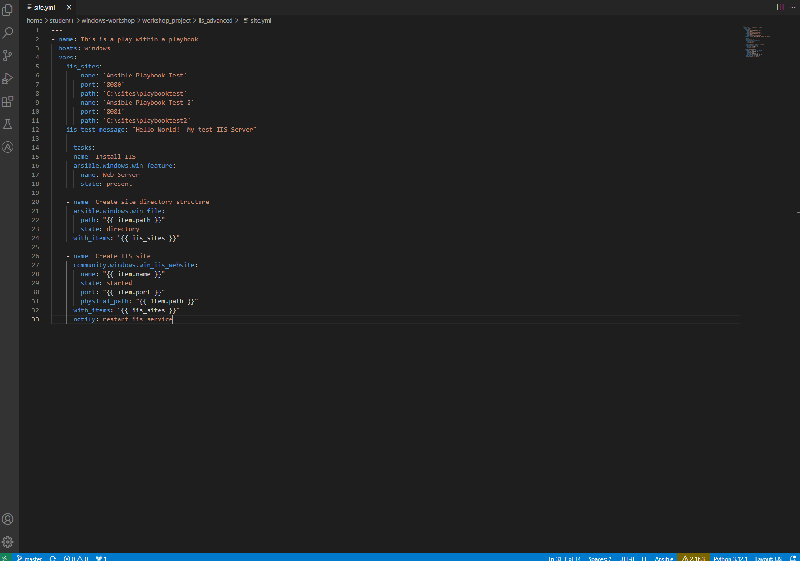
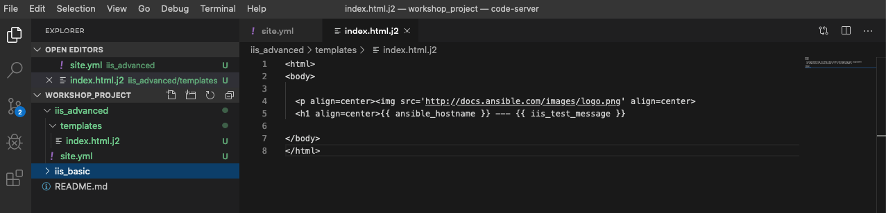
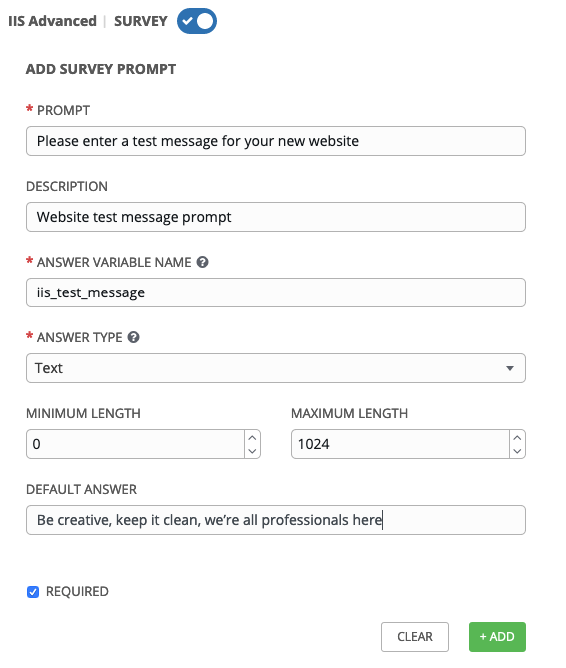
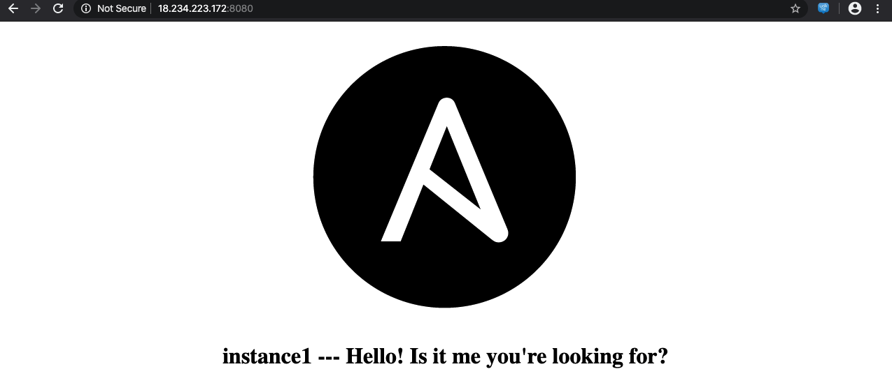

# 高度な Playbook 

以前の演習で、Ansible Playbook の基本を学びました。この演習では、以下の様な柔軟性に富んだパワフルな Playbook について学びます。  

Ansible を利用することにより、タスクをシンプルかつ簡単に繰り返すことが可能になります。ただ、全てのシステムが同じ設定というわけではなく、Ansible Playbook の実行に若干の柔軟性が必要になることもよくあります。この様な場合には変数が利用可能です。  

変数は、システム間の違いを吸収する手段を提供します。例えば、ポート、IPアドレス、またはディレクトリなどをシステムに毎に柔軟に変更することができます。  

ループを使用すると同じタスクを何度も繰り返すことができます。たとえば、複数のサービスを開始したり、複数の機能をインストールしたり、複数のディレクトリを作成したりする事が出来ます。ansible ループを使用すると、1つのタスクでそれを実行できます。  

ハンドラーについても学びます。ハンドラーとは、特定のタスクが実行されたときにのみに追加で呼び出されるタスクです。例えば、httpd サービスの設定ファイルを変更した場合にのみ httpd サービスを再起動するというようなことが簡単に実現可能です。通常だと if 文で書いたり、複雑になりがちですよね。Ansible だと極めて簡単に記述する事が出来ます。  

変数、ループ、およびハンドラーを完全に理解するには、 これらのテーマに関する以下の Ansible ドキュメントをご覧ください。  
[Ansible Variables](http://docs.ansible.com/ansible/latest/playbooks_variables.html)  
[Ansible Loops](http://docs.ansible.com/ansible/latest/playbooks_loops.html)  
[Ansible Handlers](http://docs.ansible.com/ansible/latest/playbooks_intro.html#handlers-running-operations-on-change)  
  
## Playbook の作成

まず最初に新しい Playbook を作成しますが、演習3で作成したものに近いので問題なく理解できると思います。  

### ステップ 1:

Visual Studio Code 内で、gitリポジトリに新しいディレクトリを作成し、`site.yml` ファイルを作成します。  
以前に「iis_basic」ディレクトリを作成した*WORKSHOP_PROJECT*が存在していると思います。  


### ステップ 2: フォルダーとファイルの作成

*WORKSHOP_PROJECT*セクションにカーソルを合わせ、*New Folder*ボタンをクリックします。  

「iis_advanced」と入力してEnterキーを押します。  

`iis_advanced`フォルダーを右クリックし、*New_File*を選択します。  

`site.yml` と入力します。  

プレイブック用のエディターが右ペインに開きます。  


### ステップ 3:

Playbook のプレイの中にいくつかの変数を定義します。これには後程タスクの中で利用する Web サーバーに対する固有の構成情報が含まれています。  

```yaml
---
- hosts: windows
  name: This is a play within a playbook
  vars:
    iis_sites:
      - name: 'Ansible Playbook Test'
        port: '8080'
        path: 'C:\sites\playbooktest'
      - name: 'Ansible Playbook Test 2'
        port: '8081'
        path: 'C:\sites\playbooktest2'
    iis_test_message: "Hello World!  My test IIS Server"
```

### ステップ 4:

**install IIS**という新しいタスクを追加します。プレイブックを書いた後、`ファイル` &gt; `保存`をクリックして変更を保存します。  

<!--  -->
```yaml
      tasks:
        - name: Install IIS
          win_feature:
            name: Web-Server
            state: present

        - name: Create site directory structure
          win_file:
            path: "{{ item.path }}"
            state: directory
          with_items: "{{ iis_sites }}"

        - name: Create IIS site
          win_iis_website:
            name: "{{ item.name }}"
            state: started
            port: "{{ item.port }}"
            physical_path: "{{ item.path }}"
          with_items: "{{ iis_sites }}"
          notify: restart iis service
```
<!--  -->



> **ヒント**
>
> - `vars:` 変数名と値に関する定義を行うための宣言です    
>
> - `iis_sites` iis_sitesという名前のリスト型変数を定義しています。その下の、`name` `port` `path` は iis_sites の下位の階層の変数を定義しています。  
>
> - `win_file:` ファイル、ディレクトリ、およびシンボリックリンクを作成、変更、削除するために使用されるモジュールです。  
>
> - `{{ item }}` 変数 iis_sites に対して変数の値を変化させながらタスクがループされます。ここでは、プレイで定義した `name`, `port`, `path` にそれぞれ2つの値が入りながらループが実行されます。
>
> - `with_items: "{{ iis_sites }}` Ansible によるループの書き方の1つです。変数 iis_sites が持つ値を入力しながらループを実行するという意味です。ループ内での変数は、`{{ item }}` で、この中に定義された値が入ります。  
>
> - `notify: restart iis service` これはハンドラーに関する内容ですので、後述します。  

## Firewall の開放とファイルの送付

その後、IISサービスを開始するタスクを定義します。

ステップ 1:
-------

Create a `templates` directory in your project directory and create a
template as follows:

Ensure your **iis_advanced folder** is highlighted and then hover over
the *WORKSHOP_PROJECT* section and click the *New Folder* button

Type `templates` and hit enter. The right-click the *templates* folder and click the *New File* button.

Type `index.html.j2` and hit enter.

You should now have an editor open in the right pane that can be used
for creating your template. Enter the following details:

<!--  -->
```html
    <html>
    <body>

      <p align=center>
      <h1 align=center>{{ ansible_hostname }} --- {{ iis_test_message }}

    </body>
    </html>
```
<!--  -->



Step 2:
-------

Edit back your playbook, `site.yml`, by opening your firewall ports and
writing the template. Use single quotes for `win_template` in order to
not escape the forward slash.

<!--  -->
```yaml
        - name: Open port for site on the firewall
          win_firewall_rule:
            name: "iisport{{ item.port }}"
            enable: yes
            state: present
            localport: "{{ item.port }}"
            action: Allow
            direction: In
            protocol: Tcp
          with_items: "{{ iis_sites }}"

        - name: Template simple web site to iis_site_path as index.html
          win_template:
            src: 'index.html.j2'
            dest: '{{ item.path }}\index.html'
          with_items: "{{ iis_sites }}"

        - name: Show website addresses
          debug:
            msg: "{{ item }}"
          loop:
            - http://{{ ansible_host }}:8080
            - http://{{ ansible_host }}:8081
```
<!--  -->

> **Note**
>
> **So… what did I just write?**
>
> - `win_firewall_rule:` This module is used to create, modify, and
>   update firewall rules. Note in the case of AWS there are also
>   security group rules which may impact communication. We’ve opened
>   these for the ports in this example.
>
> - `win_template:` This module specifies that a jinja2 template is
>   being used and deployed.
>
> - used in Ansible to transform data inside a template expression,
>   i.e. filters.
>
> - `debug:` Again, like in the `iis_basic` playbook, this task displays the URLs to access the sites we are creating for this exercise


Section 3: Defining and Using Handlers
======================================

There are any number of reasons we often need to restart a
service/process including the deployment of a configuration file,
installing a new package, etc. There are really two parts to this
Section; adding a handler to the playbook and calling the handler after
the a task. We will start with the former.

The `handlers` block should start after a one-level indentation, that
is, two spaces. It should align with the `tasks` block.

Step 1:
-------

Define a handler.

```yaml
      handlers:
        - name: restart iis service
          win_service:
            name: W3Svc
            state: restarted
            start_mode: auto
```

> **Note**
>
> **You can’t have a former if you don’t mention the latter**
>
> - `handler:` This is telling the **play** that the `tasks:` are
>   over, and now we are defining `handlers:`. Everything below that
>   looks the same as any other task, i.e. you give it a name, a
>   module, and the options for that module. This is the definition of
>   a handler.
>
> - `notify: restart iis service` …and here is your latter. Finally!
>   The `notify` statement is the invocation of a handler by name.
>   Quite the reveal, we know. You already noticed that you’ve added a
>   `notify` statement to the `win_iis_website` task, now you know
>   why.

Section 4: Commit and Review
============================

Your new, improved playbook is done! But remember we still need to
commit the changes to source code control.

Click `File` → `Save All` to save the files you’ve written


Click the Source Code icon (1), type in a commit message such as *Adding
advanced playbook* (2), and click the check box above (3).


Sync to gitlab by clicking the arrows on the lower left blue bar. When
prompted, click `OK` to push and pull commits.


It should take 5-30 seconds to finish the commit. The blue bar should
stop rotating and indicate 0 problems…

Now let’s take a second look to make sure everything looks the way you
intended. If not, now is the time for us to fix it up. The figure below
shows line counts and spacing.

<!--  -->
```yaml
    ---
    - hosts: windows
      name: This is a play within a playbook
      vars:
        iis_sites:
          - name: 'Ansible Playbook Test'
            port: '8080'
            path: 'C:\sites\playbooktest'
          - name: 'Ansible Playbook Test 2'
            port: '8081'
            path: 'C:\sites\playbooktest2'
        iis_test_message: "Hello World!  My test IIS Server"

      tasks:
        - name: Install IIS
          win_feature:
            name: Web-Server
            state: present

        - name: Create site directory structure
          win_file:
            path: "{{ item.path }}"
            state: directory
          with_items: "{{ iis_sites }}"

        - name: Create IIS site
          win_iis_website:
            name: "{{ item.name }}"
            state: started
            port: "{{ item.port }}"
            physical_path: "{{ item.path }}"
          with_items: "{{ iis_sites }}"
          notify: restart iis service

        - name: Open port for site on the firewall
          win_firewall_rule:
            name: "iisport{{ item.port }}"
            enable: yes
            state: present
            localport: "{{ item.port }}"
            action: Allow
            direction: In
            protocol: Tcp
          with_items: "{{ iis_sites }}"

        - name: Template simple web site to iis_site_path as index.html
          win_template:
            src: 'index.html.j2'
            dest: '{{ item.path }}\index.html'
          with_items: "{{ iis_sites }}"

        - name: Show website addresses
          debug:
            msg: "{{ item }}"
          loop:
            - http://{{ ansible_host }}:8080
            - http://{{ ansible_host }}:8081

      handlers:
        - name: restart iis service
          win_service:
            name: W3Svc
            state: restarted
            start_mode: auto
```
<!--  -->

Section 5: Create your Job Template
===================================

Step 1:
-------

Before we can create our Job Template, you must first go resync your
Project again. So do that now.

> **Note**
>
> You must do this anytime you create a new *base* playbook file that
> you will be selecting via a Job Template. The new file must be synced
> to Tower before it will become available in the Job Template playbook
> dropdown.

Step 2:
-------

To test this playbook, we need to create a new Job Template to run this
playbook. So go to *Template* and click *Add* and select `Job Template`
to create a second job template.

Complete the form using the following values

| Key         | Value                      | Note |
|-------------|----------------------------|------|
| Name        | IIS Advanced               |      |
| Description | Template for iis_advanced  |      |
| JOB TYPE    | Run                        |      |
| INVENTORY   | Windows Workshop Inventory |      |
| PROJECT     | Ansible Workshop Project   |      |
| PLAYBOOK    | `iis_advanced/site.yml`    |      |
| CREDENTIAL  | Student Account            |      |
| LIMIT       | windows                    |      |
| OPTIONS     | [*] USE FACT CACHE         |      |


Step 3:
-------

Click SAVE  and then select ADD SURVEY


Step 4:
-------

Complete the survey form with following values

| Key                    | Value                                                    | Note |
|------------------------|----------------------------------------------------------|------|
| PROMPT                 | Please enter a test message for your new website         |      |
| DESCRIPTION            | Website test message prompt                              |      |
| ANSWER VARIABLE NAME   | `iis_test_message`                                       |      |
| ANSWER TYPE            | Text                                                     |      |
| MINIMUM/MAXIMUM LENGTH | Use the defaults                                         |      |
| DEFAULT ANSWER         | Be creative, keep it clean, we’re all professionals here |      |



Step 5:
-------

Select ADD 

Step 6:
-------

Select SAVE 

Step 7:
-------

Back on the main Job Template page, select SAVE
 again.

Section 6: Running your new playbook
====================================

Now let’s run it and see how it works.

Step 1:
-------

Select TEMPLATES

> **Note**
>
> Alternatively, if you haven’t navigated away from the job templates
> creation page, you can scroll down to see all existing job templates

Step 2:
-------

Click the rocketship icon  for the
**IIS Advanced** Job Template.

Step 3:
-------

When prompted, enter your desired test message

After it launches, you should be redirected and can watch the output of
the job in real time.

When the job has successfully completed, you should see two URLs to your websites printed at the bottom of the job output.




